# 2. Creating Spring DATA JPA Repo

- rebuild our database

```sql
CREATE DATABASE  IF NOT EXISTS `employee_directory`;
USE `employee_directory`;

--
-- Table structure for table `employee`
--

DROP TABLE IF EXISTS `employee`;

CREATE TABLE `employee` (
  `id` int(11) NOT NULL AUTO_INCREMENT,
  `first_name` varchar(45) DEFAULT NULL,
  `last_name` varchar(45) DEFAULT NULL,
  `email` varchar(45) DEFAULT NULL,
  PRIMARY KEY (`id`)
) ENGINE=InnoDB AUTO_INCREMENT=1 DEFAULT CHARSET=latin1;

--
-- Data for table `employee`
--

INSERT INTO `employee` VALUES 
	(1,'Leslie','Andrews','leslie@gmail.com'),
	(2,'Emma','Baumgarten','emma@gmail.com'),
	(3,'Avani','Gupta','avani@gmail.com'),
	(4,'Yuri','Petrov','yuri@gmail.com'),
	(5,'Juan','Vega','juan@gmail.com');
```

- copy 22 folder, paste it, and chanage name to 23

- import project 23 for intellij

- delete 3 files from folder `dao`

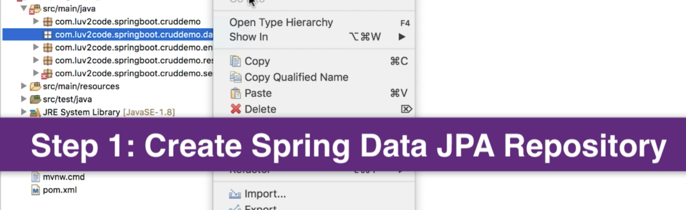

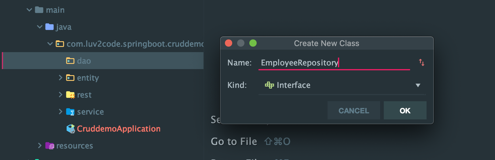

- extends JpaRepository

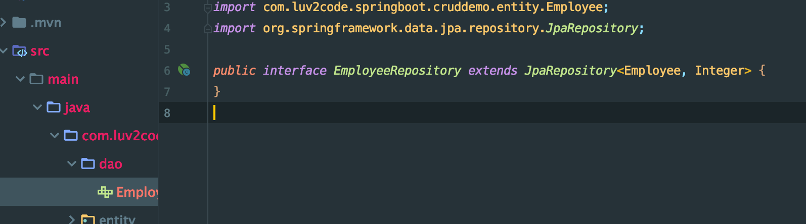

- no need to write any codes

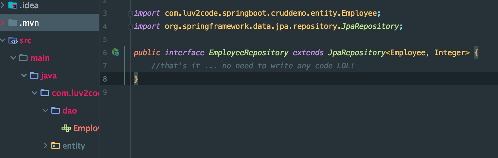

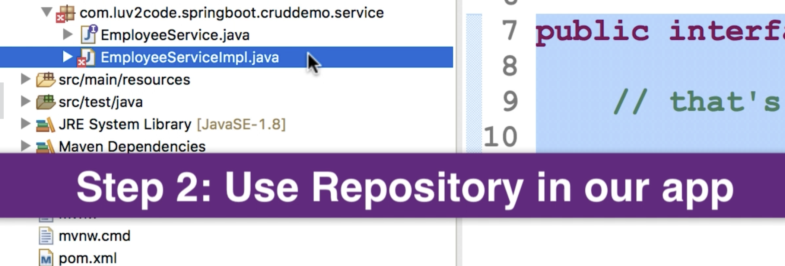

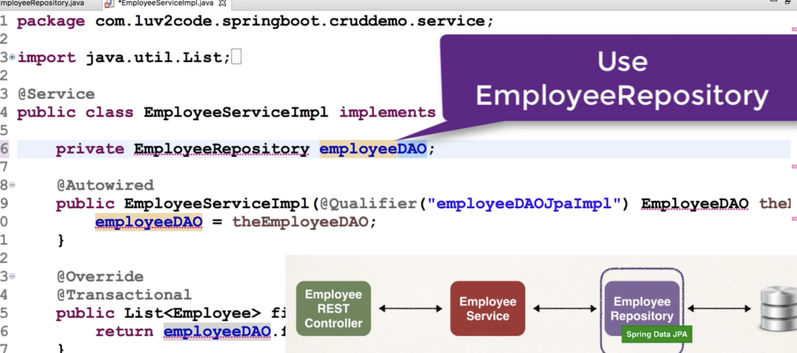

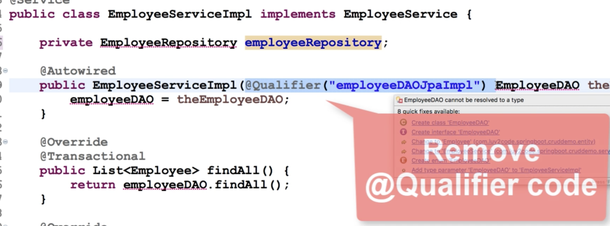

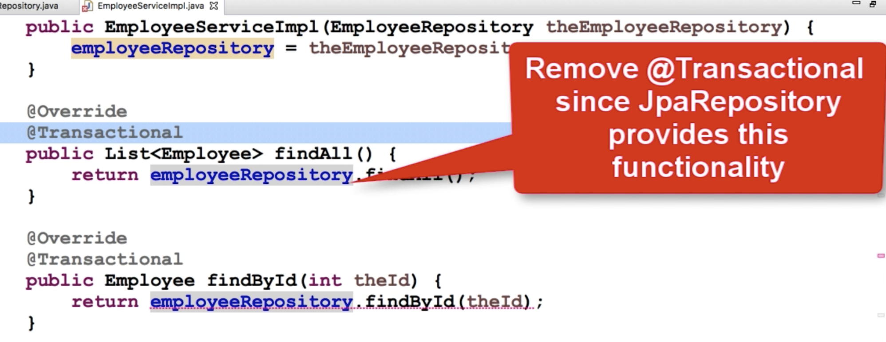
---

- update EmployeeServiceImplementation

```java
package com.luv2code.springboot.cruddemo.service;
import com.luv2code.springboot.cruddemo.dao.EmployeeRepository;
import com.luv2code.springboot.cruddemo.entity.Employee;
import org.springframework.beans.factory.annotation.Autowired;
import org.springframework.stereotype.Service;

import java.util.List;
import java.util.Optional;

@Service
public class EmployeeServiceImplementation implements EmployeeService {

    private EmployeeRepository employeeRepository;

    @Autowired
    public EmployeeServiceImplementation(EmployeeRepository theEmployeeRepository) {
        this.employeeRepository = theEmployeeRepository;
    }

    @Override
    public List<Employee> findAll() {
        return employeeRepository.findAll();
    }

    @Override
    public Employee findById(int theId) {
        Optional<Employee> result = this.employeeRepository.findById(theId);
        Employee theEmployee = null;
        if (result.isPresent()) {
            theEmployee = result.get();
        }else{
            //we didn't find the employee
            throw new RuntimeException("Didn't find employee id - " + theId);
        }
        return theEmployee;
    }

    @Override
    public void save(Employee theEmployee) {
        employeeRepository.save(theEmployee);
    }

    @Override
    public void deleteById(int theId) {
        employeeRepository.deleteById(theId);
    }
}
```

## Testing the REST API with Spring DATA JPA Repository

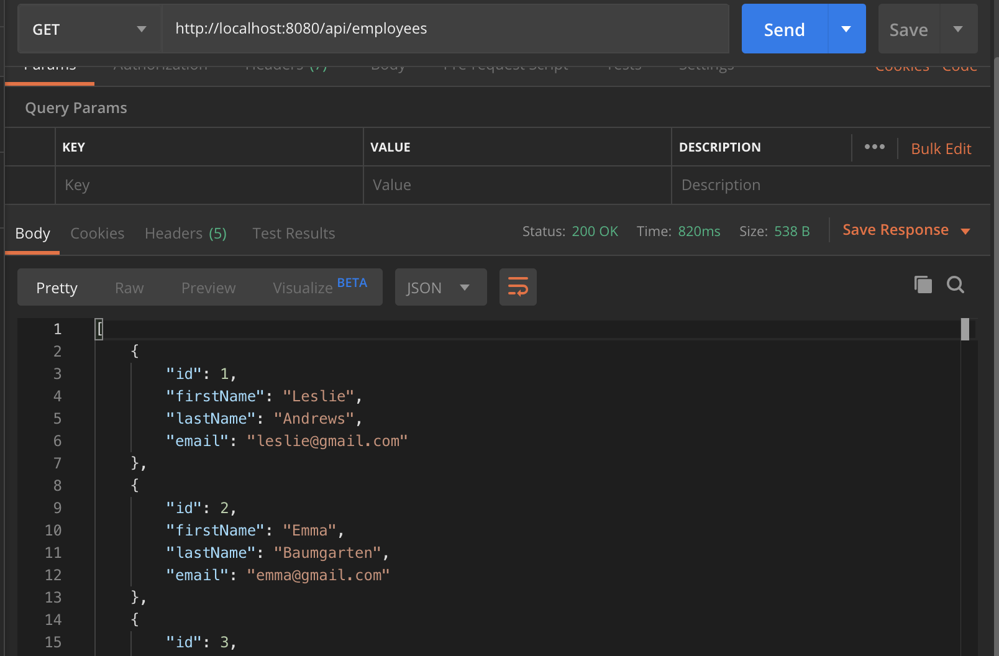

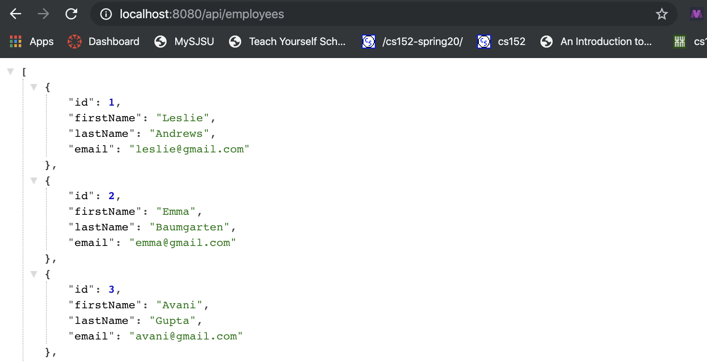

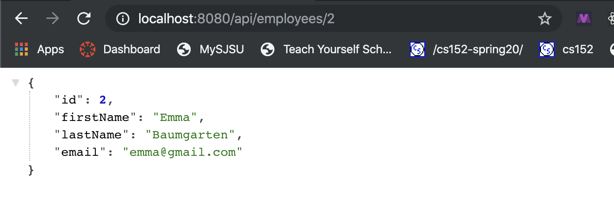

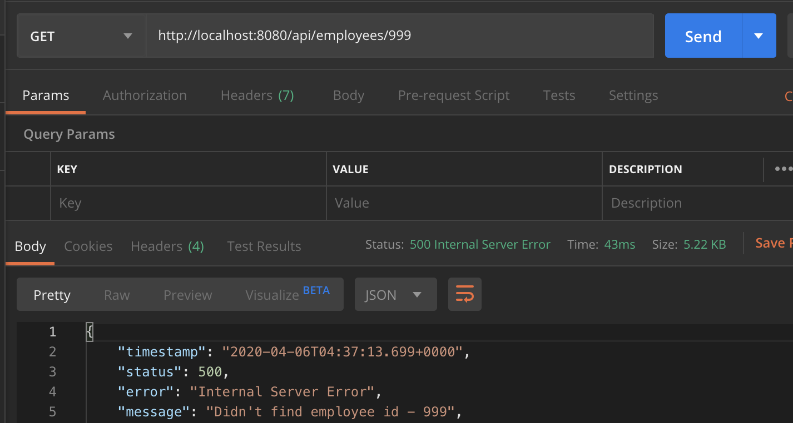

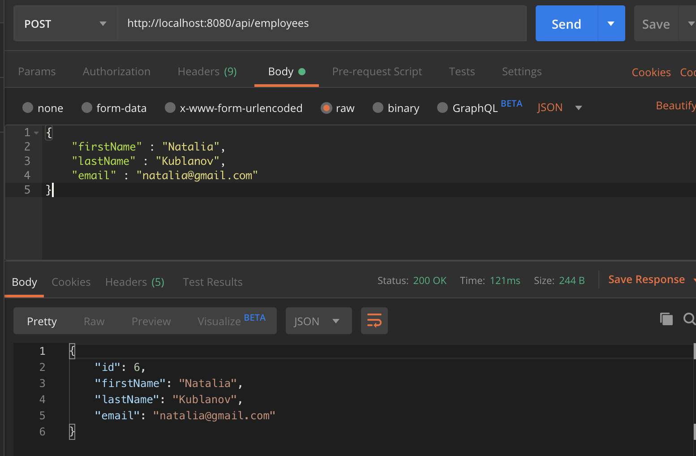

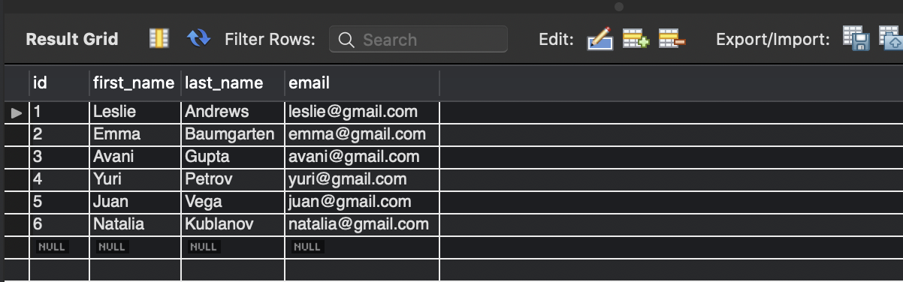

- update

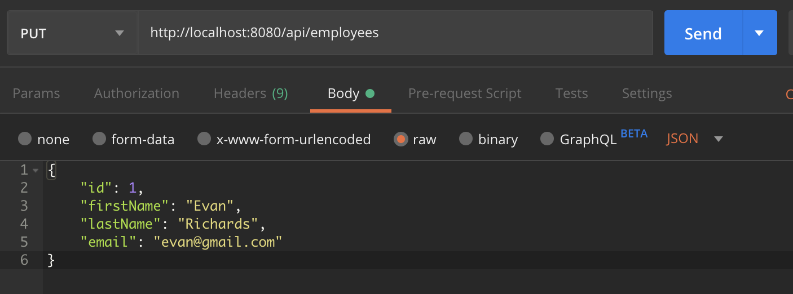

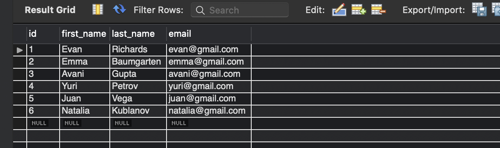

- delete

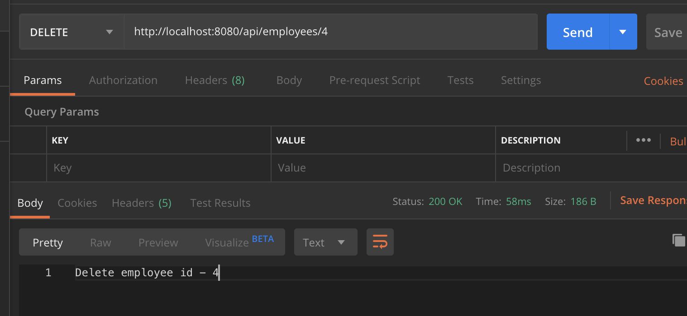

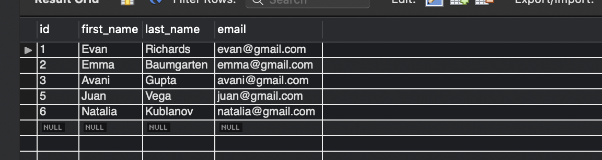

- Recall :

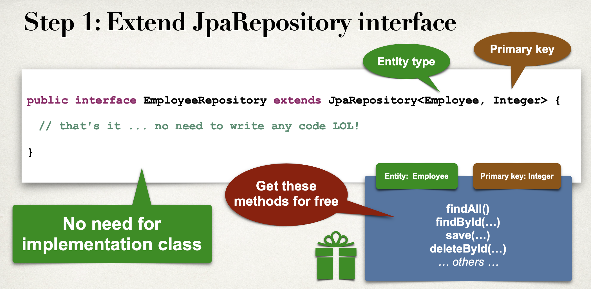

- Spring Data JPA Magic!

