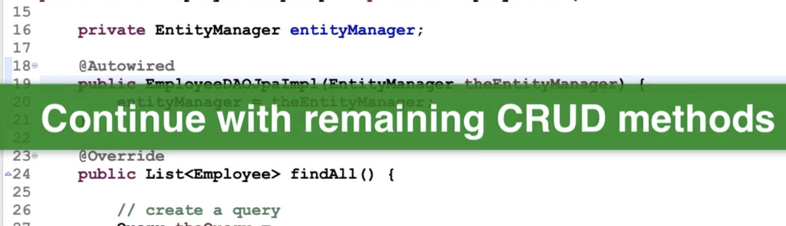
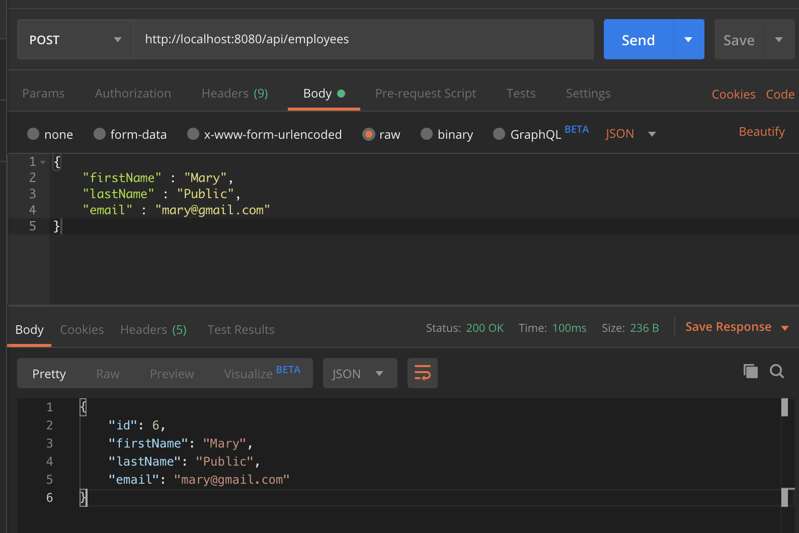
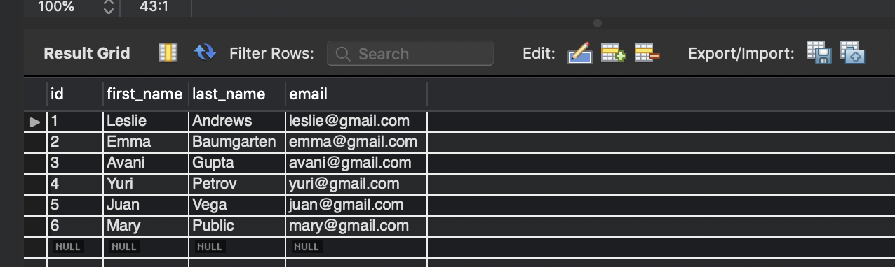
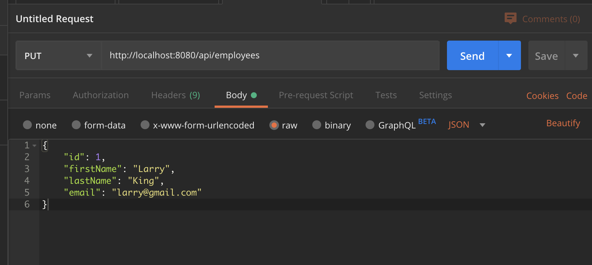
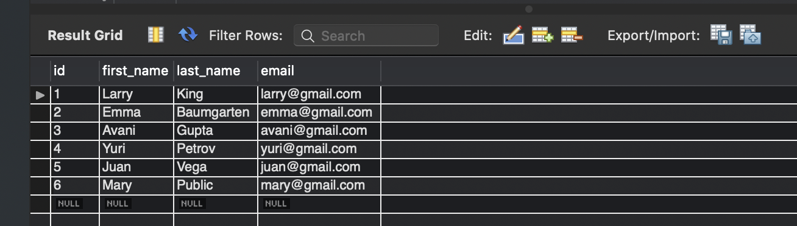
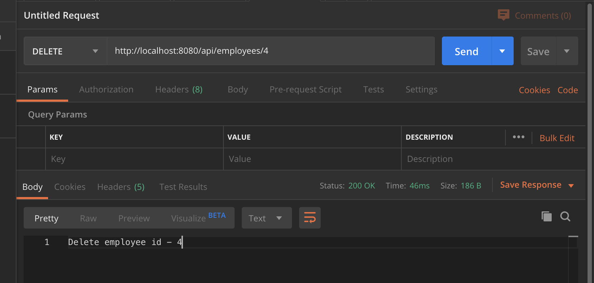
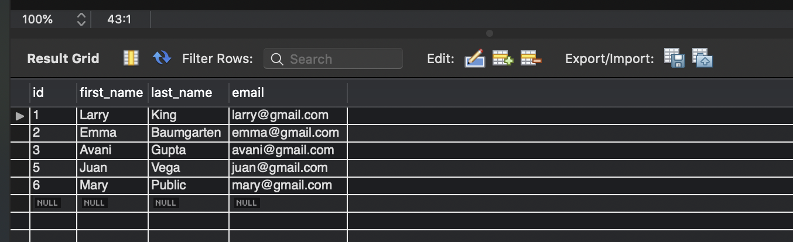

# 3. Testing REST API DAO



- update EmployeeDAOJpaImpl

```java
package com.luv2code.springboot.cruddemo.dao;

import com.luv2code.springboot.cruddemo.entity.Employee;
import org.springframework.beans.factory.annotation.Autowired;
import org.springframework.stereotype.Repository;

import javax.persistence.EntityManager;
import javax.persistence.Query;
import java.util.List;

@Repository
public class EmployeeDAOJpaImpl implements EmployeeDAO{
    private EntityManager entityManager;

    @Autowired
    public EmployeeDAOJpaImpl(EntityManager entityManager) {
        this.entityManager = entityManager;
    }

    @Override
    public List<Employee> findAll() {
        //create a query
        Query theQuery = entityManager.createQuery("from Employee");

        //execute query
        List<Employee> employees = theQuery.getResultList();

        //return the results
        return employees;
    }

    @Override
    public Employee findById(int theId) {
        //get employee
        Employee theEmployee = entityManager.find(Employee.class, theId);
        //return employee
        return theEmployee;
    }

    @Override
    public void save(Employee theEmployee) {
        //save or update the employee
        Employee dbEmployee = entityManager.merge(theEmployee);

        //update with id from db ... so we can get generate id for save/insert
        theEmployee.setId(dbEmployee.getId());
    }

    @Override
    public void deleteById(int theId) {
        //delete object with primary key
        Query theQuery = entityManager.createQuery(
                "delete from Employee where id=:employeeId");
        theQuery.setParameter("employeeId", theId);
        theQuery.executeUpdate();
    }
}
```

- test post method:





- test update `Put` method





- test delete method






