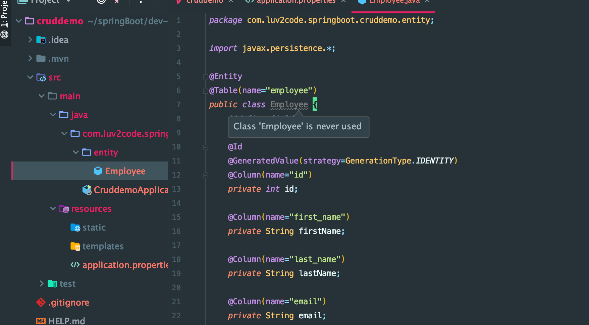
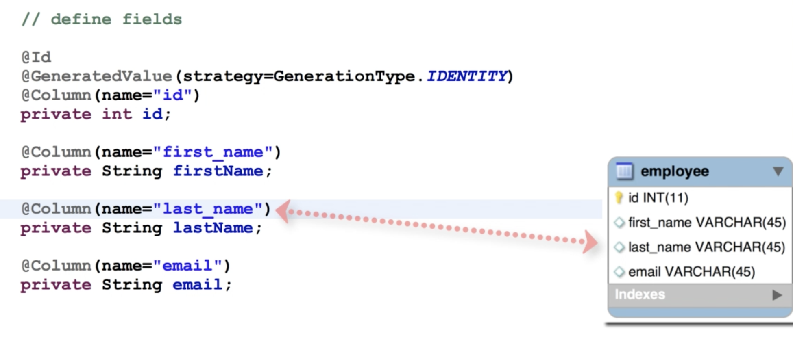

# 4. Configuring SB Data Source

- update `resources/application.properties`

```json
#
# JDBC properties
#
spring.datasource.url=jdbc:mysql://localhost:3306/employee_directory?useSSL=false&serverTimezone=UTC
spring.datasource.username=root
spring.datasource.password=        
```

- create Employee.java




- note, need to create a no-arg constructor required by Hibernate

```java
package com.luv2code.springboot.cruddemo.entity;
import javax.persistence.*;

@Entity
@Table(name="employee")
public class Employee {
    //define fields

    @Id
    @GeneratedValue(strategy=GenerationType.IDENTITY)
    @Column(name="id")
    private int id;

    @Column(name="first_name")
    private String firstName;

    @Column(name="last_name")
    private String lastName;

    @Column(name="email")
    private String email;

    //define constructors
    public Employee(){

    }
    public Employee(String firstName, String lastName, String email) {
        this.firstName = firstName;
        this.lastName = lastName;
        this.email = email;
    }

    //define getter/setter

    public int getId() {
        return id;
    }

    public void setId(int id) {
        this.id = id;
    }

    public String getFirstName() {
        return firstName;
    }

    public void setFirstName(String firstName) {
        this.firstName = firstName;
    }

    public String getLastName() {
        return lastName;
    }

    public void setLastName(String lastName) {
        this.lastName = lastName;
    }

    public String getEmail() {
        return email;
    }

    public void setEmail(String email) {
        this.email = email;
    }

    //define toString
    @Override
    public String toString() {
        return "Employee{" +
                "id=" + id +
                ", firstName='" + firstName + '\'' +
                ", lastName='" + lastName + '\'' +
                ", email='" + email + '\'' +
                '}';
    }
}
```
