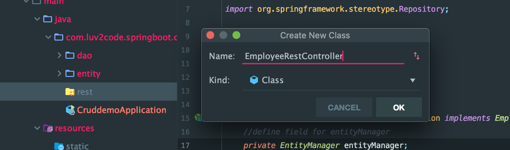

# 6. Create REST Controller Method

- create a new package, and class



```java
package com.luv2code.springboot.cruddemo.rest;

import com.luv2code.springboot.cruddemo.dao.EmployeeDAO;
import com.luv2code.springboot.cruddemo.entity.Employee;
import org.springframework.beans.factory.annotation.Autowired;
import org.springframework.web.bind.annotation.GetMapping;
import org.springframework.web.bind.annotation.RequestMapping;
import org.springframework.web.bind.annotation.RestController;

import java.util.List;

@RestController
@RequestMapping("/api")
public class EmployeeRestController {

    private EmployeeDAO employeeDAO;

    //quick and dirty: inject employee dao
    @Autowired
    public EmployeeRestController(EmployeeDAO employeeDAO) {
        this.employeeDAO = employeeDAO;
    }

    //expose "/employees" and return list of employee
    @GetMapping("/employees")
    public List<Employee> findAll() {
        return employeeDAO.findAll();
    }
}
```

- run App

- http://localhost:8080/api/employees


