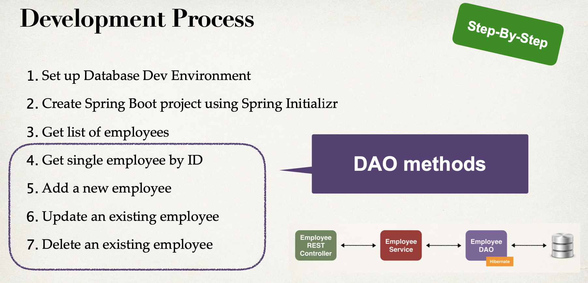
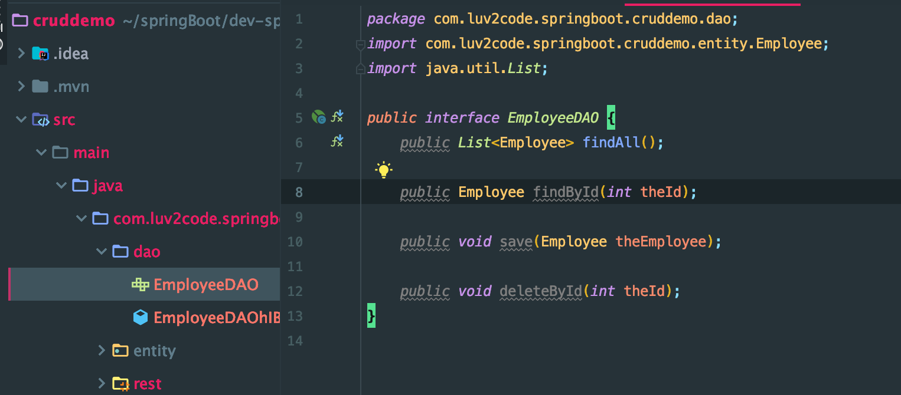
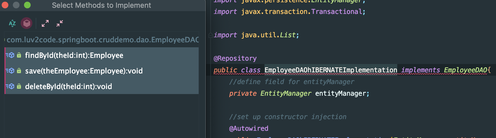
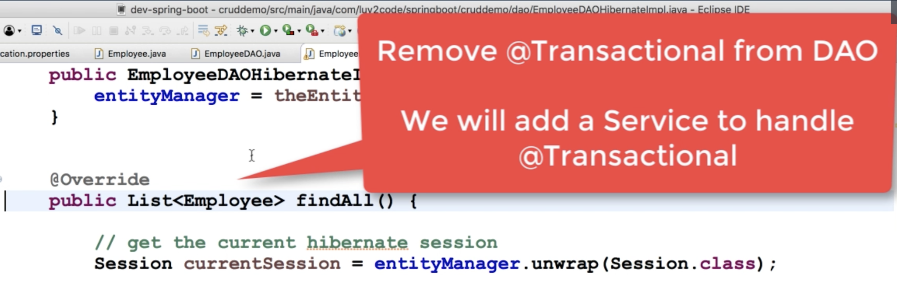

# 7. Additional CRUD for DAO



- add new methods into interface



- implement methods 





```java
package com.luv2code.springboot.cruddemo.dao;

import com.luv2code.springboot.cruddemo.entity.Employee;
import org.hibernate.Session;
import org.hibernate.query.Query;
import org.springframework.beans.factory.annotation.Autowired;
import org.springframework.stereotype.Repository;

import javax.persistence.EntityManager;

import java.util.List;

@Repository
public class EmployeeDAOhIBERNATEImplementation implements EmployeeDAO{
    //define field for entityManager
    private EntityManager entityManager;

    //set up constructor injection
    @Autowired
    public EmployeeDAOhIBERNATEImplementation(EntityManager entityManager){
        this.entityManager = entityManager;
    }

    @Override
    public List<Employee> findAll() {
        //get the current hibernate session
        Session currentSession = entityManager.unwrap(Session.class);

        //create a query
        Query<Employee> theQuery =
                currentSession.createQuery("from Employee", Employee.class);

        //execute query and get result list
        List<Employee> employees = theQuery.getResultList();

        //return the results
        return employees;
    }

    @Override
    public Employee findById(int theId) {
        //get the current hibernate session
        Session currentSession = entityManager.unwrap(Session.class);

        //get the employee
        Employee theEmployee =
                currentSession.get(Employee.class, theId);

        //return the employee
        return theEmployee;
    }

    @Override
    public void save(Employee theEmployee) {
        //get the current hibernate session
        Session currentSession = entityManager.unwrap(Session.class);

        //save employee
        currentSession.saveOrUpdate(theEmployee);
    }

    @Override
    public void deleteById(int theId) {
        //get the current hibernate session
        Session currentSession = entityManager.unwrap(Session.class);

        //delete object with primary key
        Query theQuery = currentSession.createQuery(
                "delete from Employee whre id=:employeeId");
        theQuery.setParameter("EmployeeId", theId);
        theQuery.executeUpdate();
    }
}
```