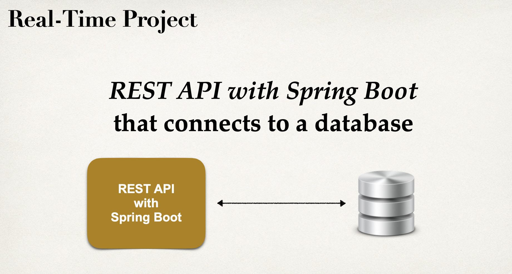
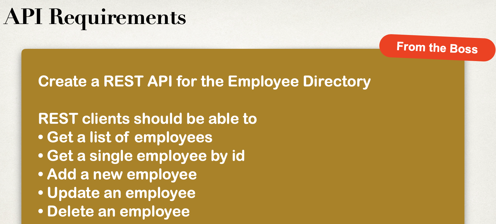
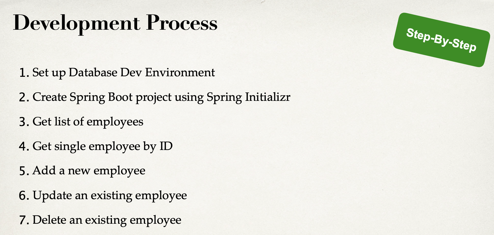
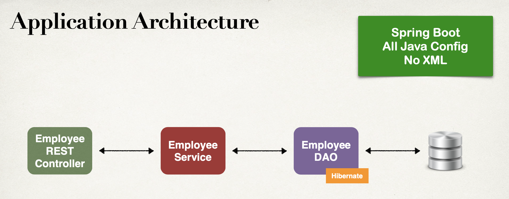
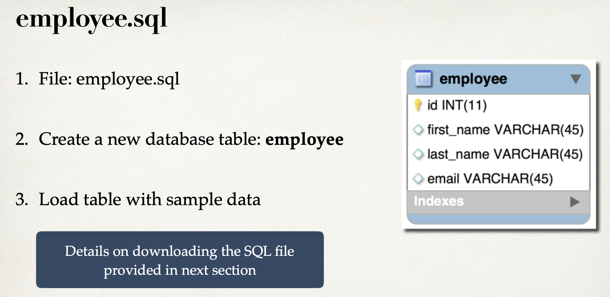

# 1. Create Project with Spring Initializr












- download `employee-sql-script`

[employee-sql-script download](http://www.luv2code.com/spring-boot-employee-sql-script)

```sql
CREATE DATABASE  IF NOT EXISTS `employee_directory`;
USE `employee_directory`;

--
-- Table structure for table `employee`
--

DROP TABLE IF EXISTS `employee`;

CREATE TABLE `employee` (
  `id` int(11) NOT NULL AUTO_INCREMENT,
  `first_name` varchar(45) DEFAULT NULL,
  `last_name` varchar(45) DEFAULT NULL,
  `email` varchar(45) DEFAULT NULL,
  PRIMARY KEY (`id`)
) ENGINE=InnoDB AUTO_INCREMENT=1 DEFAULT CHARSET=latin1;

--
-- Data for table `employee`
--

INSERT INTO `employee` VALUES 
	(1,'Leslie','Andrews','leslie@gmail.com'),
	(2,'Emma','Baumgarten','emma@gmail.com'),
	(3,'Avani','Gupta','avani@gmail.com'),
	(4,'Yuri','Petrov','yuri@gmail.com'),
	(5,'Juan','Vega','juan@gmail.com');
```

- insert these data into database by using workbench


