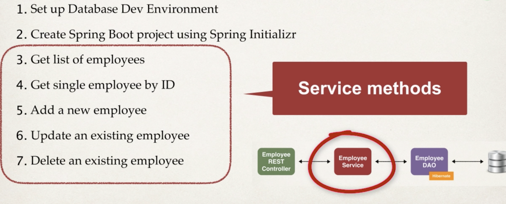
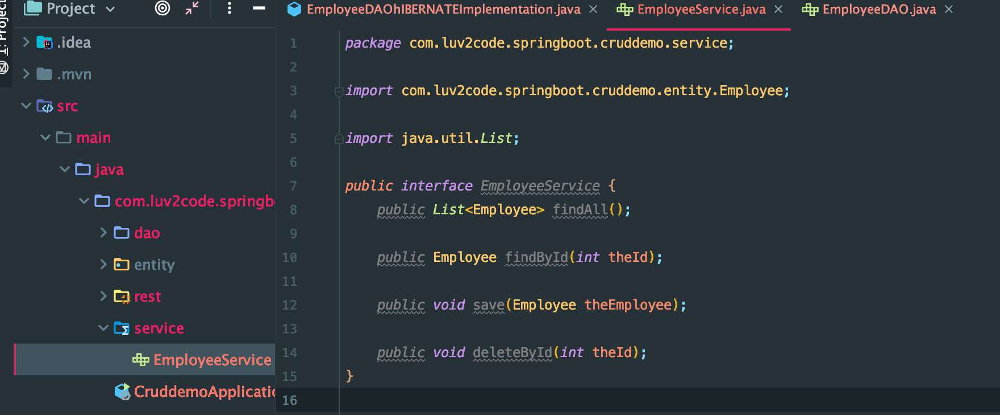
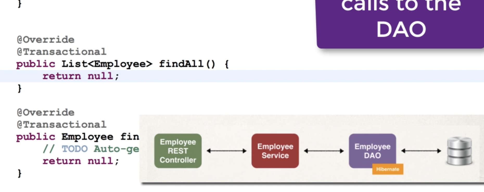
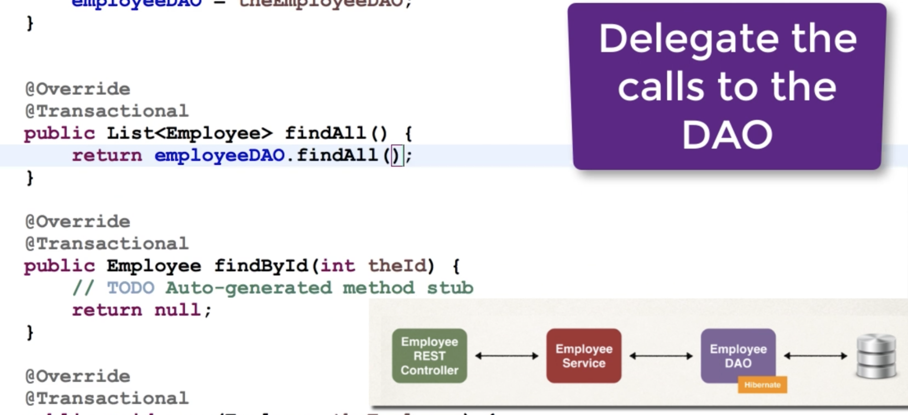
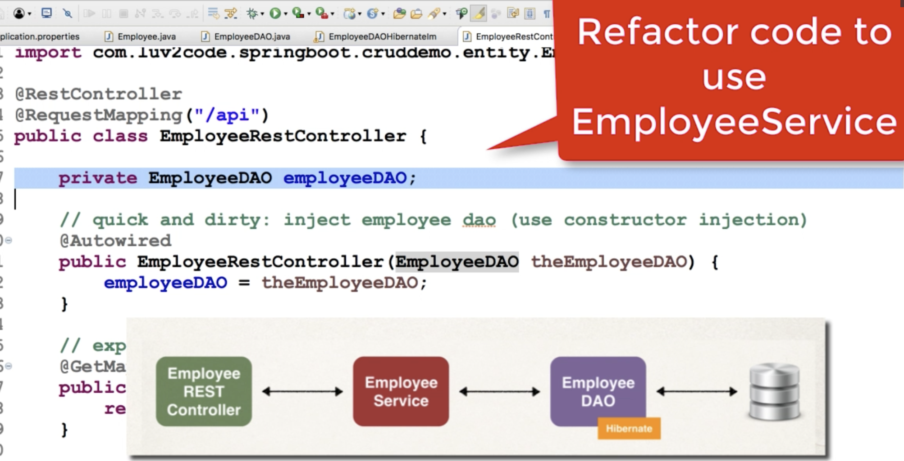
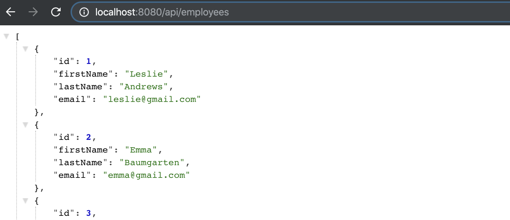

# 8. Refactoring code to Service layer



- create a new package for service



- create a new class to implement this interface





```java
package com.luv2code.springboot.cruddemo.service;

import com.luv2code.springboot.cruddemo.dao.EmployeeDAO;
import com.luv2code.springboot.cruddemo.entity.Employee;
import org.springframework.beans.factory.annotation.Autowired;
import org.springframework.stereotype.Service;
import org.springframework.transaction.annotation.Transactional;

import java.util.List;

@Service
public class EmployeeServiceImplementation implements EmployeeService {

    private EmployeeDAO employeeDAO;

    @Autowired
    public EmployeeServiceImplementation(EmployeeDAO employeeDAO) {
        this.employeeDAO = employeeDAO;
    }

    @Override
    @Transactional
    public List<Employee> findAll() {
        return employeeDAO.findAll();
    }

    @Override
    @Transactional
    public Employee findById(int theId) {
        return employeeDAO.findById(theId);
    }

    @Override
    @Transactional
    public void save(Employee theEmployee) {
        employeeDAO.save(theEmployee);
    }

    @Override
    @Transactional
    public void deleteById(int theId) {
        employeeDAO.deleteById(theId);
    }
}

```
---


## move into EmployeeRestController



```java
package com.luv2code.springboot.cruddemo.rest;
import com.luv2code.springboot.cruddemo.entity.Employee;
import com.luv2code.springboot.cruddemo.service.EmployeeService;
import org.springframework.beans.factory.annotation.Autowired;
import org.springframework.web.bind.annotation.GetMapping;
import org.springframework.web.bind.annotation.RequestMapping;
import org.springframework.web.bind.annotation.RestController;
import java.util.List;

@RestController
@RequestMapping("/api")
public class EmployeeRestController {

    private EmployeeService employeeService;

    //quick and dirty: inject employee dao
    @Autowired
    public EmployeeRestController(EmployeeService employeeService) {
        this.employeeService = employeeService;
    }

    //expose "/employees" and return list of employee
    @GetMapping("/employees")
    public List<Employee> findAll() {
        return employeeService.findAll();
    }
}
```

- now reload the page



