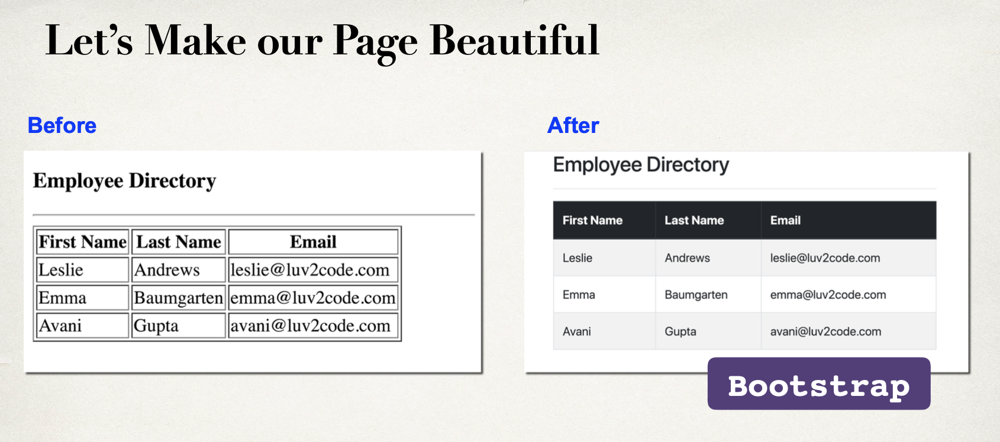
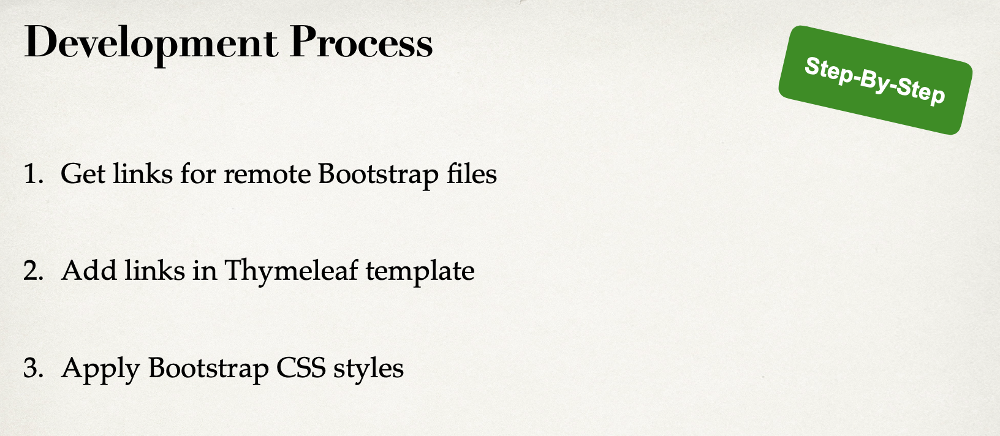
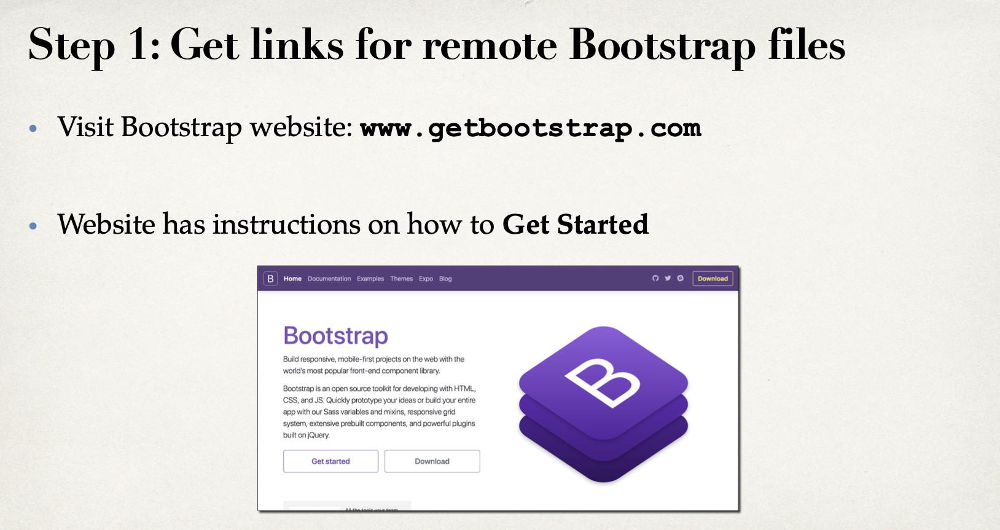
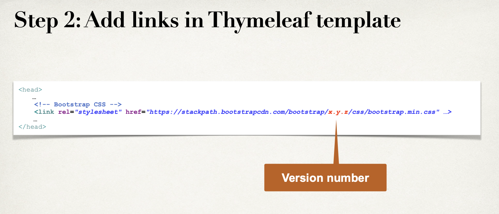
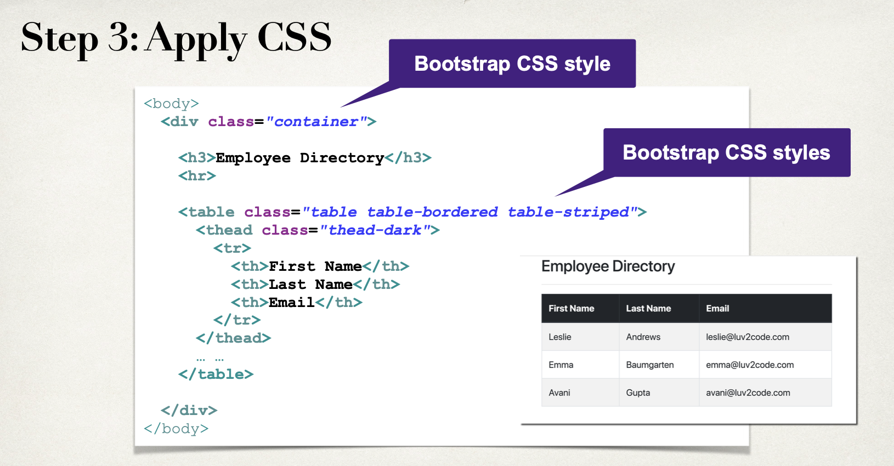
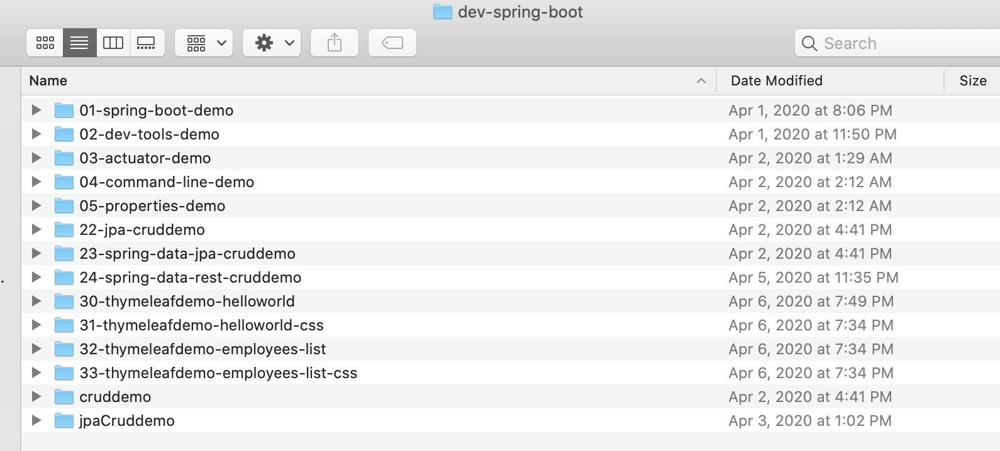
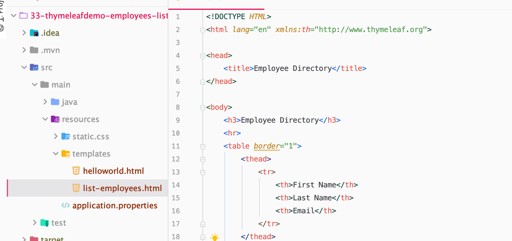
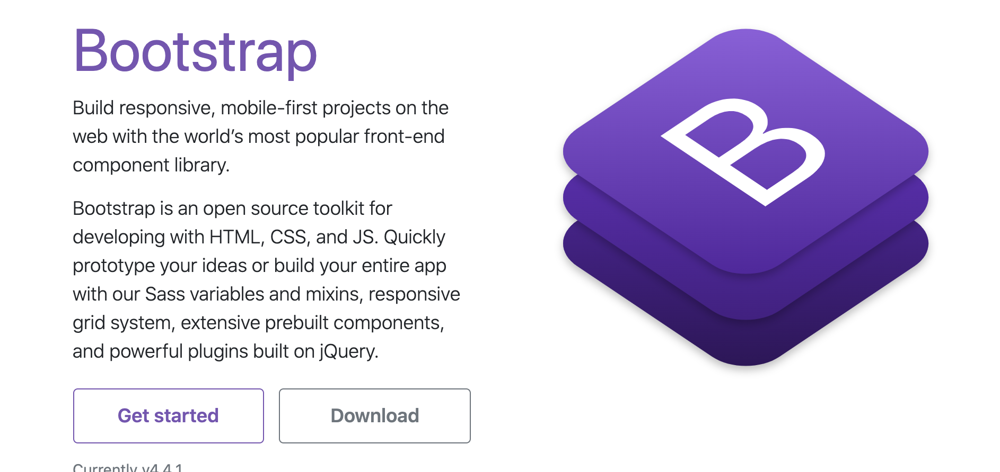
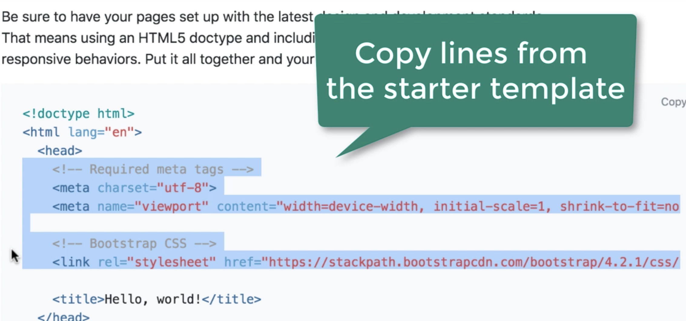
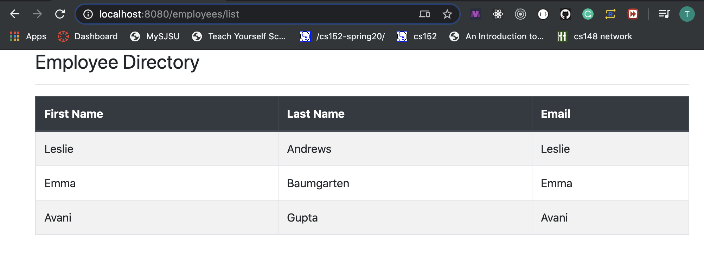

# 5. Thymeleaf-add Bootstrap CSS











---

- COPY 32-project, paste 33-project



- intellij open `33-project`

- open `33-project`



- import Bootstrap css

- input `getbootstrap` on google chrome



- click `get start`



- paste on our `list-employees.html`

```html
<!DOCTYPE HTML>
<html lang="en" xmlns:th="http://www.thymeleaf.org">

<head>
    <!-- Required meta tags -->
    <meta charset="utf-8">
    <meta name="viewport" content="width=device-width, initial-scale=1, shrink-to-fit=no">

    <!-- Bootstrap CSS -->
    <link rel="stylesheet" href="https://stackpath.bootstrapcdn.com/bootstrap/4.4.1/css/bootstrap.min.css" integrity="sha384-Vkoo8x4CGsO3+Hhxv8T/Q5PaXtkKtu6ug5TOeNV6gBiFeWPGFN9MuhOf23Q9Ifjh" crossorigin="anonymous">

    <title>Employee Directory</title>
</head>
```

## Step 3: Apply Bootstrap CSS styles

- update `list-employees.html`

```html
<!DOCTYPE HTML>
<html lang="en" xmlns:th="http://www.thymeleaf.org">

<head>
    <!-- Required meta tags -->
    <meta charset="utf-8">
    <meta name="viewport" content="width=device-width, initial-scale=1, shrink-to-fit=no">

    <!-- Bootstrap CSS -->
    <link rel="stylesheet" href="https://stackpath.bootstrapcdn.com/bootstrap/4.4.1/css/bootstrap.min.css" integrity="sha384-Vkoo8x4CGsO3+Hhxv8T/Q5PaXtkKtu6ug5TOeNV6gBiFeWPGFN9MuhOf23Q9Ifjh" crossorigin="anonymous">

    <title>Employee Directory</title>
</head>

<body>

<div class="container">
    <h3>Employee Directory</h3>
    <hr>
    <table class="table table-bordered table-striped">
        <thead class="thead-dark">
            <tr>
                <th>First Name</th>
                <th>Last Name</th>
                <th>Email</th>
            </tr>
        </thead>

        <tbody>
            <tr th:each="tempEmployee : ${employees}">
                <td th:text="${tempEmployee.firstName}">
                <td th:text="${tempEmployee.lastName}">
                <td th:text="${tempEmployee.firstName}">
            </tr>
        </tbody>
    </table>
</div>

</body>

</html>
```

- now let's testing Bootstrap CSS

- rerun `ThymeleafdemoApplication`

- OK, done!




