# 4. create html table

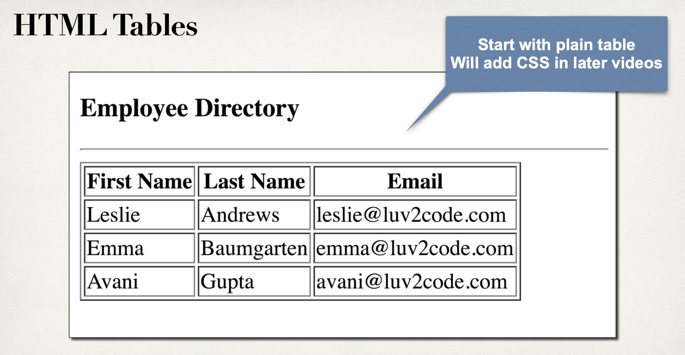

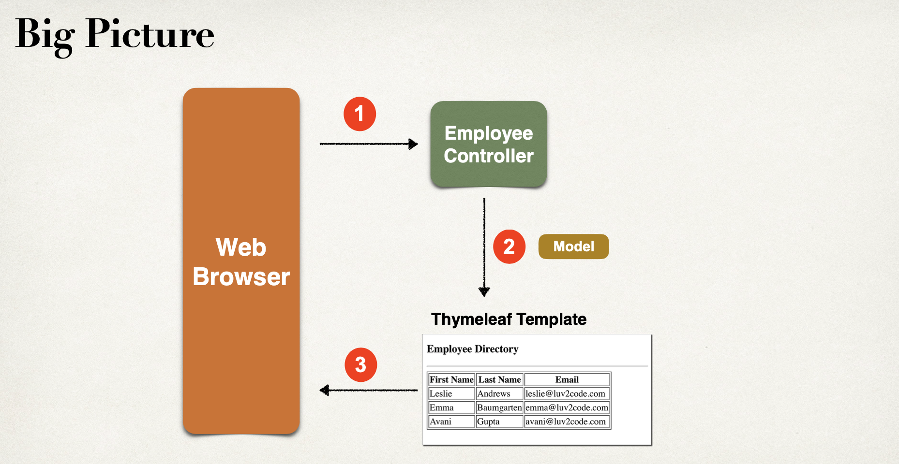

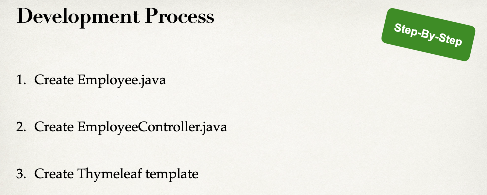

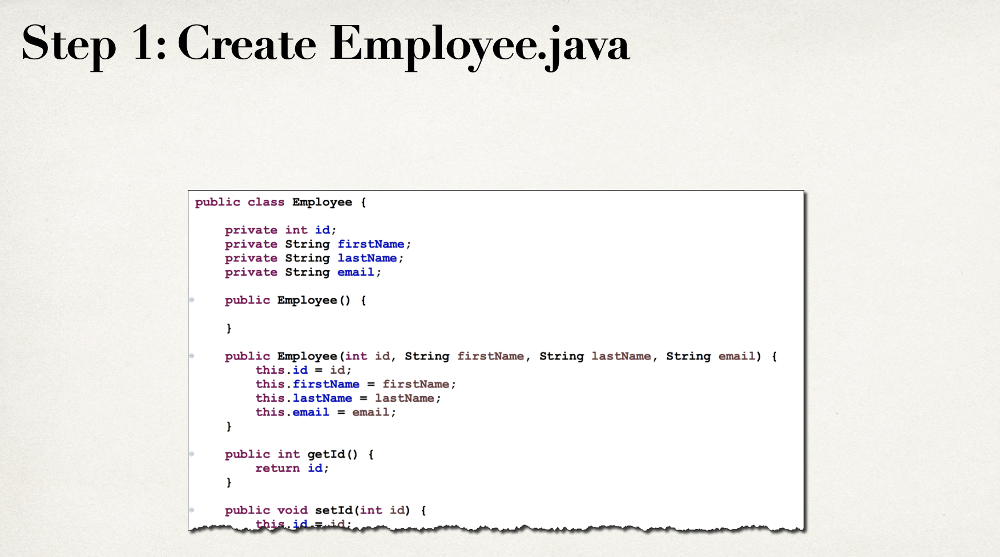

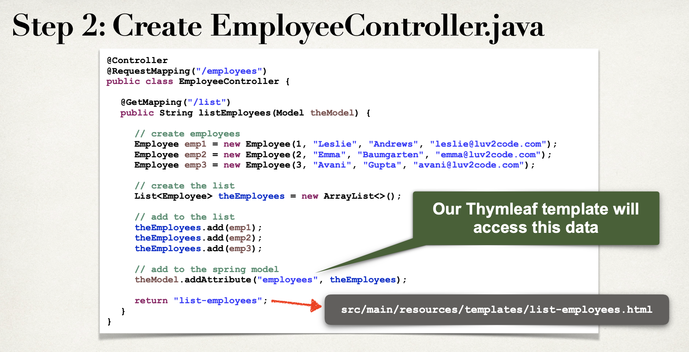

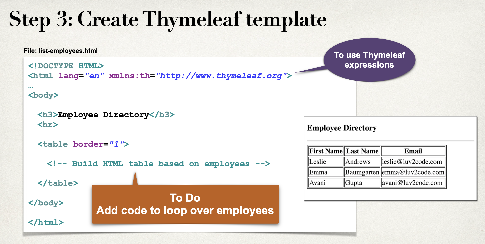

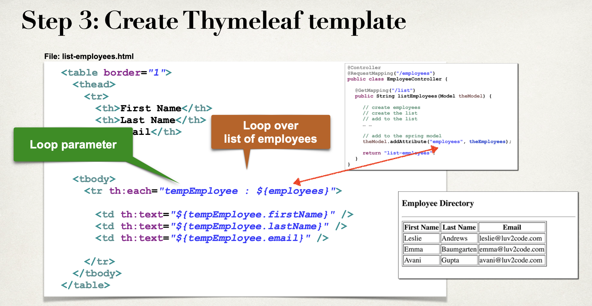

- create a new project

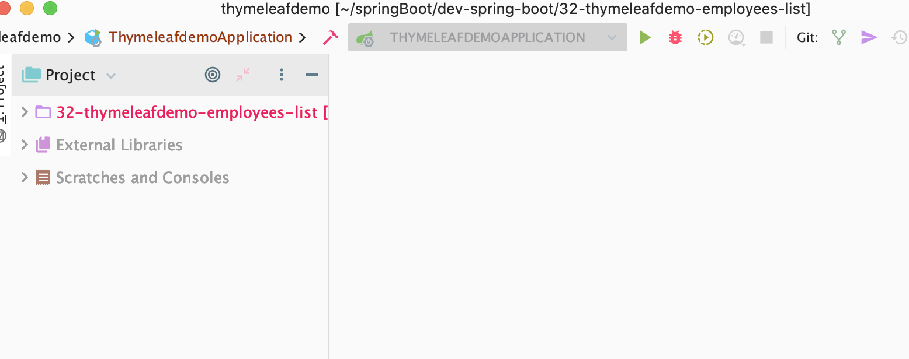

- create a new package


- create a new class

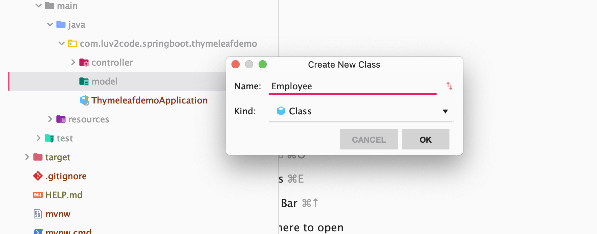

```java
package com.luv2code.springboot.thymeleafdemo.model;

public class Employee {
    private int id;
    private String firstName;
    private String lastName;
    private String email;

    public Employee(int id, String firstName, String lastName, String email) {
        this.id = id;
        this.firstName = firstName;
        this.lastName = lastName;
        this.email = email;
    }

    public int getId() {
        return id;
    }

    public void setId(int id) {
        this.id = id;
    }

    public String getFirstName() {
        return firstName;
    }

    public void setFirstName(String firstName) {
        this.firstName = firstName;
    }

    public String getLastName() {
        return lastName;
    }

    public void setLastName(String lastName) {
        this.lastName = lastName;
    }

    public String getEmail() {
        return email;
    }

    public void setEmail(String email) {
        this.email = email;
    }

    @Override
    public String toString() {
        return "Employee{" +
                "id=" + id +
                ", firstName='" + firstName + '\'' +
                ", lastName='" + lastName + '\'' +
                ", email='" + email + '\'' +
                '}';
    }
}
```

---

## next step create Employee Controller

- create `com.luv2code.springboot.thymeleafdemo.controller/EmployeeController.java`

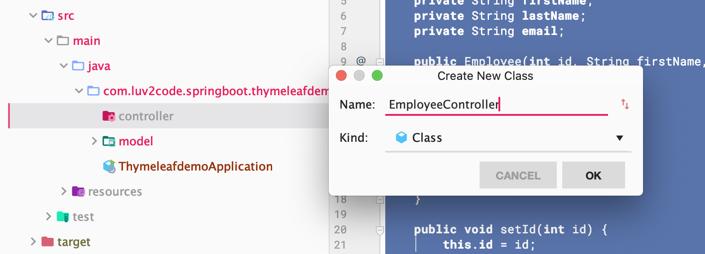

```java
package com.luv2code.springboot.thymeleafdemo.controller;
import com.luv2code.springboot.thymeleafdemo.model.Employee;
import org.springframework.stereotype.Controller;
import org.springframework.ui.Model;
import org.springframework.web.bind.annotation.GetMapping;
import org.springframework.web.bind.annotation.RequestMapping;

import javax.annotation.PostConstruct;
import java.util.ArrayList;
import java.util.List;

@Controller
@RequestMapping("/employees")
public class EmployeeController {

    //load employee data
    private List<Employee> theEmployees;

    @PostConstruct
    private void loadData(){
        //create employees
        Employee emp1 = new Employee(1, "Leslie", "Andrews", "leslie@gmail.com");
        Employee emp2 = new Employee(2, "Emma", "Baumgarten", "emma@gmail.com");
        Employee emp3 = new Employee(3, "Avani", "Gupta", "avani@gmail.com");

        //create the list
        theEmployees = new ArrayList<>();

        //add to the list
        theEmployees.add(emp1);
        theEmployees.add(emp2);
        theEmployees.add(emp3);

    }


    //add mapping for "/list"
    @GetMapping("/list")
    public String listEmployees(Model theModel) {
        //add to the spring model
        theModel.addAttribute("employees", theEmployees);

        return "list-employees";
    }
}

```

---


## step3: Create Thymeleaf template

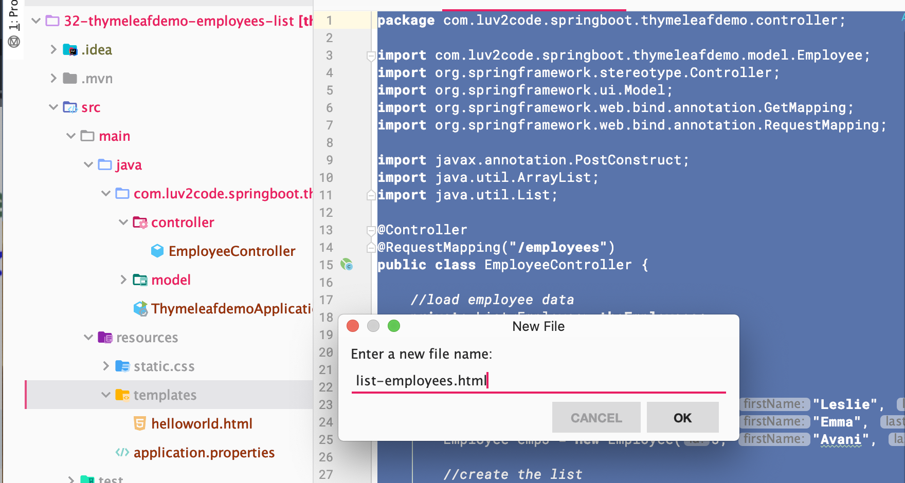

```html
<!DOCTYPE HTML>
<html lang="en" xmlns:th="http://www.thymeleaf.org">

<head>
    <title>Employee Directory</title>
</head>

<body>
    <h3>Employee Directory</h3>
    <hr>
    <table border="1">
        <thead>
            <tr>
                <th>First Name</th>
                <th>Last Name</th>
                <th>Email</th>
            </tr>
        </thead>

        <tbody>
            <tr th:each="tempEmployee : ${employees}">
                <td th:text="${tempEmployee.firstName}">
                <td th:text="${tempEmployee.lastName}">
                <td th:text="${tempEmployee.firstName}">
            </tr>
        </tbody>
    </table>
</body>

</html>
```

- run `com.luv2code.springboot.thymeleafdemo/ThymeleafdemoApplication`

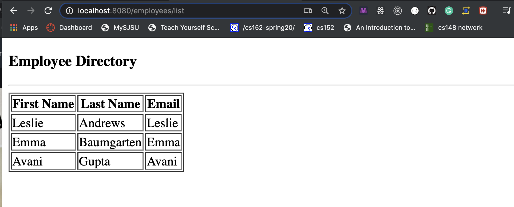


