# 6. Thymeleaf CRUD DB Delete Employees

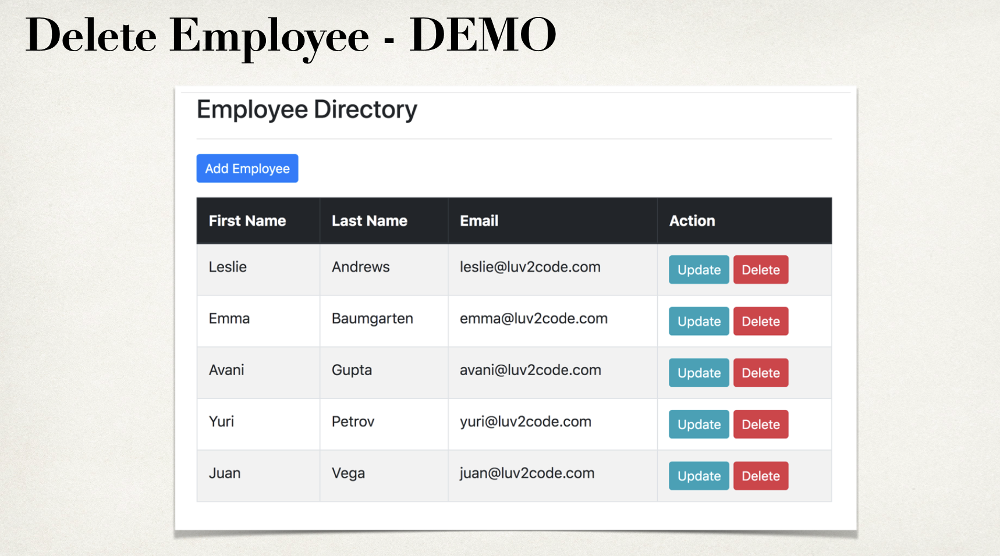

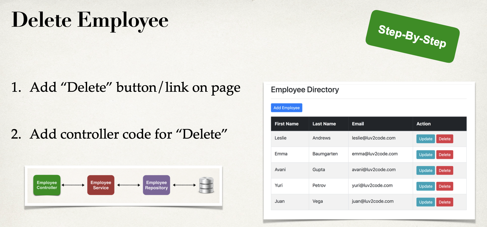

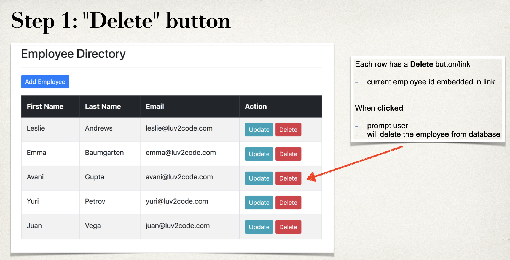

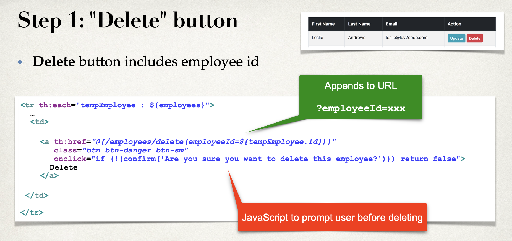

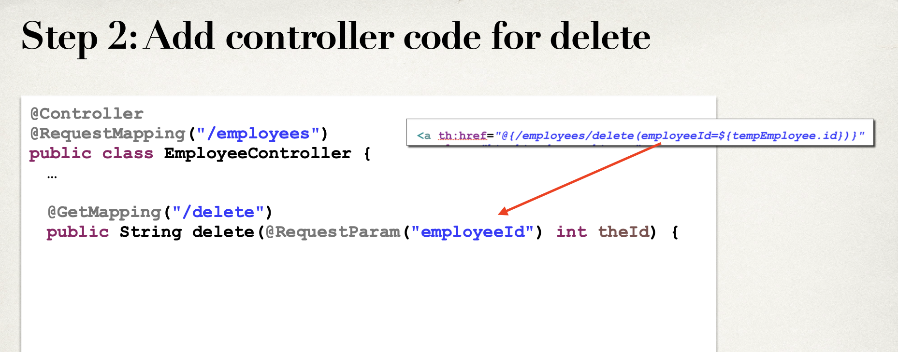

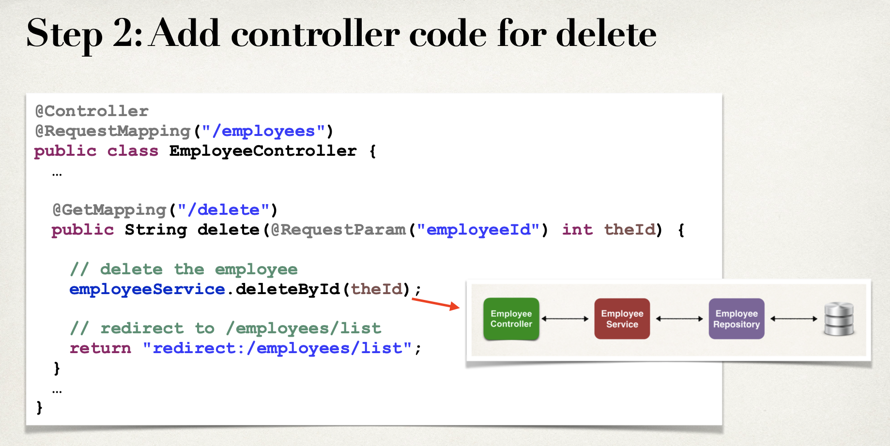

---

## copy `36-project` to `37-project`

- add a `delete` button

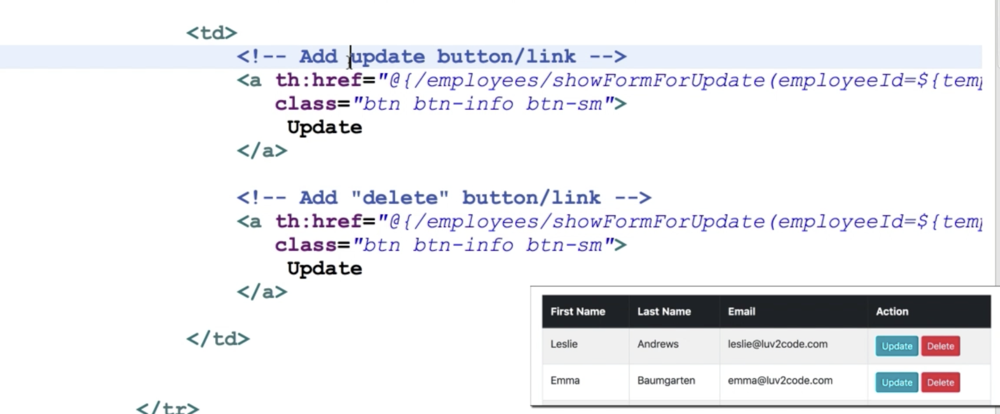

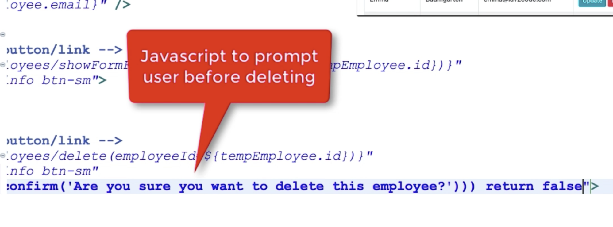

- update list-employee.html

```html
<!DOCTYPE HTML>
<html lang="en" xmlns:th="http://www.thymeleaf.org">

<head>
    <!-- Required meta tags -->
    <meta charset="utf-8">
    <meta name="viewport" content="width=device-width, initial-scale=1, shrink-to-fit=no">

    <!-- Bootstrap CSS -->
    <link rel="stylesheet" href="https://stackpath.bootstrapcdn.com/bootstrap/4.4.1/css/bootstrap.min.css" integrity="sha384-Vkoo8x4CGsO3+Hhxv8T/Q5PaXtkKtu6ug5TOeNV6gBiFeWPGFN9MuhOf23Q9Ifjh" crossorigin="anonymous">

    <title>Employee Directory</title>
</head>

<body>

<div class="container">
    <h3>Employee Directory</h3>
    <hr>

    <!-- Add a button   -->
    <a th:href="@{/employees/showFormForAdd}"
        class="btn btn-primary btn-sm mb-3">
        Add Employee
    </a>

    <table class="table table-bordered table-striped">
        <thead class="thead-dark">
            <tr>
                <th>First Name</th>
                <th>Last Name</th>
                <th>Email</th>
                <th>Action</th>
            </tr>
        </thead>

        <tbody>
            <tr th:each="tempEmployee : ${employees}">
                <td th:text="${tempEmployee.firstName}">
                <td th:text="${tempEmployee.lastName}">
                <td th:text="${tempEmployee.email}">


                <td>
                    <!-- Add update button/link -->
                    <a th:href="@{/employees/showFormForUpdate(employeeId=${tempEmployee.id})}"
                        class="btn btn-info btn-sm">
                        Update
                    </a>


                    <a th:href="@{/employees/delete(employeeId=${tempEmployee.id})}"
                       class="btn btn-danger btn-sm"
                       onclick="if (!(confirm('Are you sure you want to delete this employee?'))) return false" >
                        Delete
                    </a>
                </td>
            </tr>
        </tbody>
    </table>
</div>

</body>

</html>
```


- update `EmployeeController.java`

```java
package com.luv2code.springboot.thymeleafdemo.controller;

@Controller
@RequestMapping("/employees")
public class EmployeeController {

    private EmployeeService employeeService;

    public EmployeeController(EmployeeService theEmployeeService){
        employeeService = theEmployeeService;
    }

    //add mapping for "/list"
    @GetMapping("/list")
    public String listEmployees(Model theModel) {
        //get employees from db
        List<Employee> theEmployees = employeeService.findAll();

        //add to the spring model
        theModel.addAttribute("employees", theEmployees);

        return "employees/list-employees";
    }

    @GetMapping("/showFormForAdd")
    public String showFormForAdd(Model theModel) {
        //create model attribute to bind form data
        Employee theEmployee = new Employee();

        theModel.addAttribute("employee", theEmployee);

        return "employees/employee-form";
    }

    @GetMapping("/showFormForUpdate")
    public String showFormForUpdate(@RequestParam("employeeId") int theId,
                 Model theModel){
        //get the employee from the service
        Employee theEmployee = employeeService.findById(theId);

        //set employee as a model attribute to pre-populate the form
        theModel.addAttribute("employee", theEmployee);

        //send over to our form
        return "employees/employee-form";
    }


    @PostMapping("/save")
    public String saveEmployee(@ModelAttribute("employee") Employee theEmployee) {
        //save the employee
        employeeService.save(theEmployee);

        //use a redirect to prevent duplicate submissions
        return "redirect:/employees/list";
    }

    @GetMapping("/delete")
    public String delete(@RequestParam("employeeId") int theId) {
        //delete the employee
        employeeService.deleteById(theId);

        //redirect to /employees/list
        return "redirect:/employees/list";
    }
}

```

- run app!

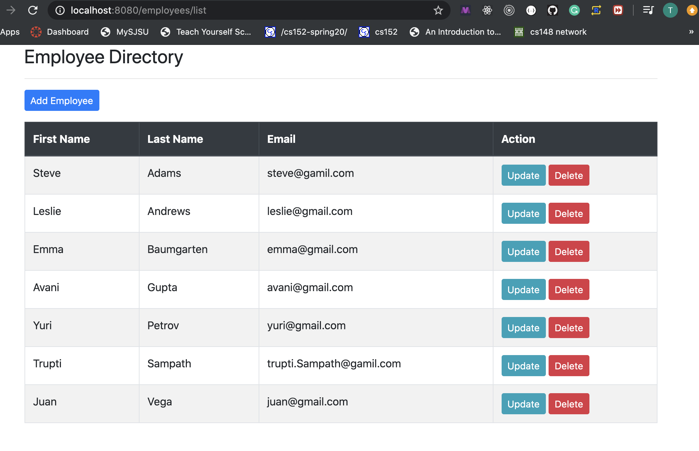
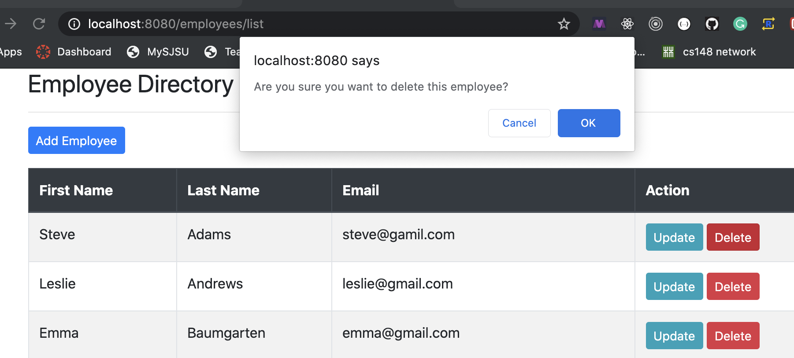

- click ok

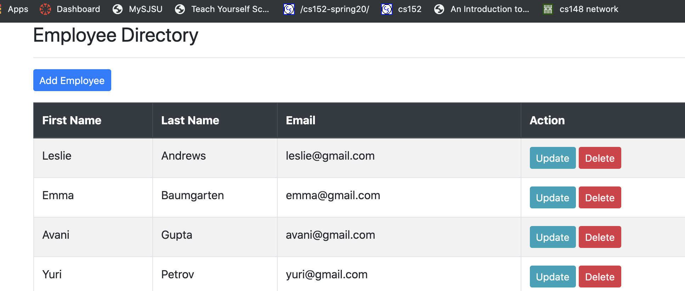


