# 2. Create a REST API

- insert new data to my database

```sql
CREATE DATABASE  IF NOT EXISTS `employee_directory`;
USE `employee_directory`;
--
-- Table structure for table `employee`
--
DROP TABLE IF EXISTS `employee`;

CREATE TABLE `employee` (
  `id` int(11) NOT NULL AUTO_INCREMENT,
  `first_name` varchar(45) DEFAULT NULL,
  `last_name` varchar(45) DEFAULT NULL,
  `email` varchar(45) DEFAULT NULL,
  PRIMARY KEY (`id`)
) ENGINE=InnoDB AUTO_INCREMENT=1 DEFAULT CHARSET=latin1;
--
-- Data for table `employee`
--
INSERT INTO `employee` VALUES 
	(1,'Leslie','Andrews','leslie@gmail.com'),
	(2,'Emma','Baumgarten','emma@gmail.com'),
	(3,'Avani','Gupta','avani@gmail.com'),
	(4,'Yuri','Petrov','yuri@gmail.com'),
	(5,'Juan','Vega','juan@gmail.com');
```

- renew employee my database

- copy 23 project, paste and named project 24

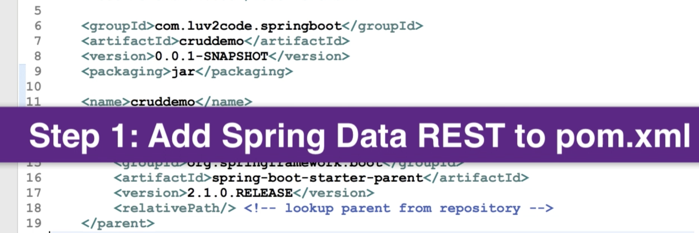

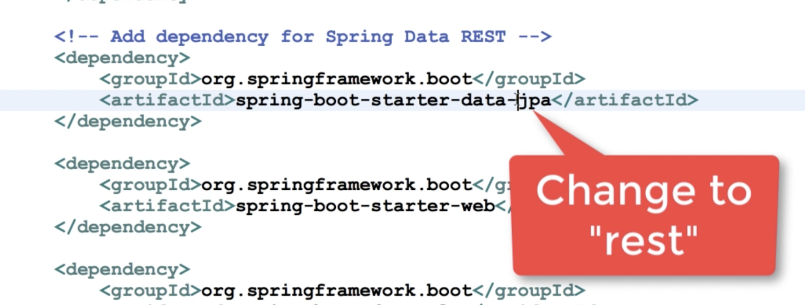

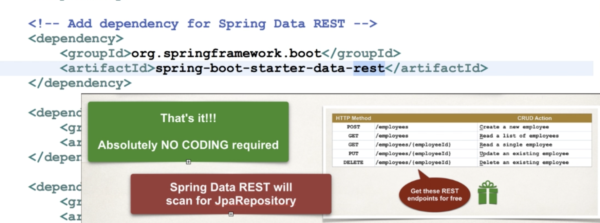

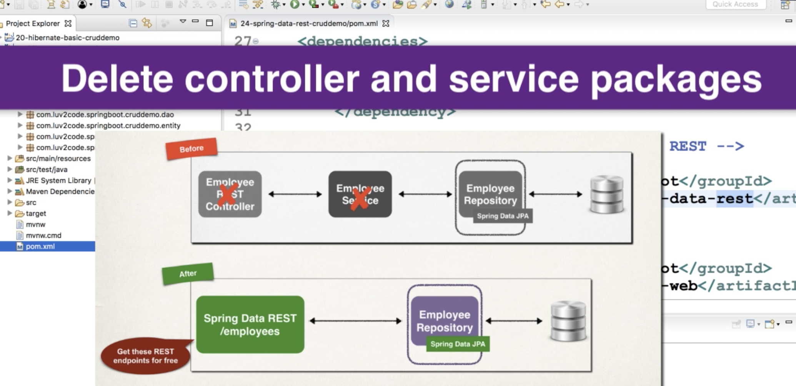

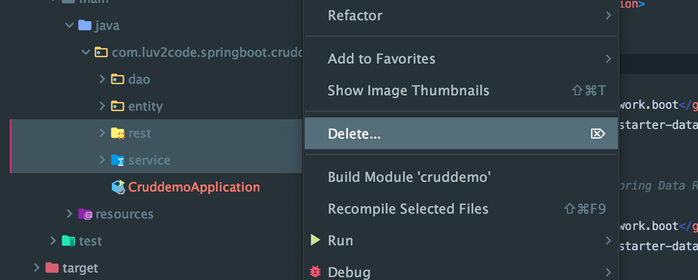

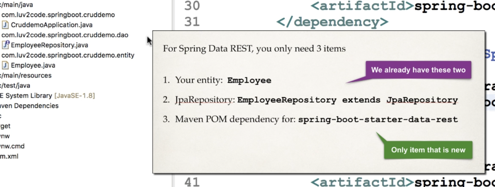

- now run our app, but Note: refresh my pom.xml first

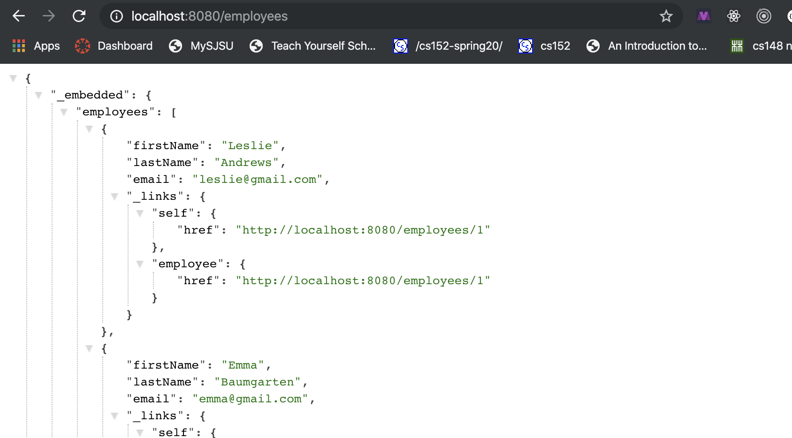

- so we can click `http://localhost:8080/employees/1`

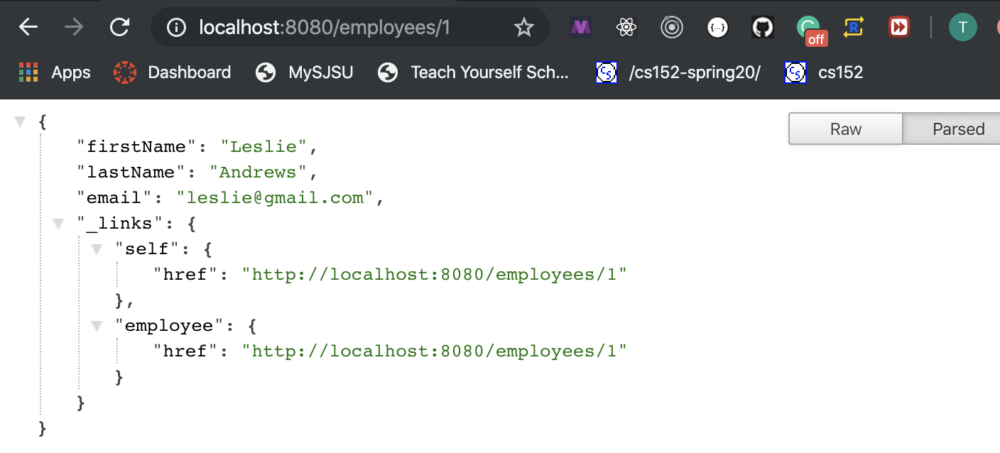

- test postman

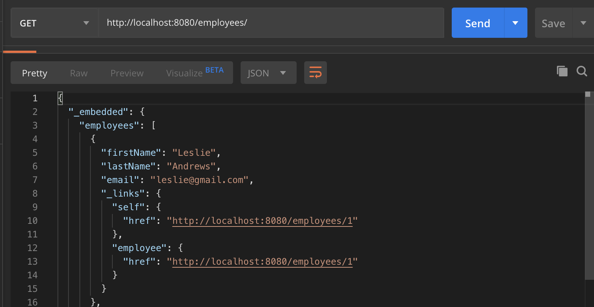

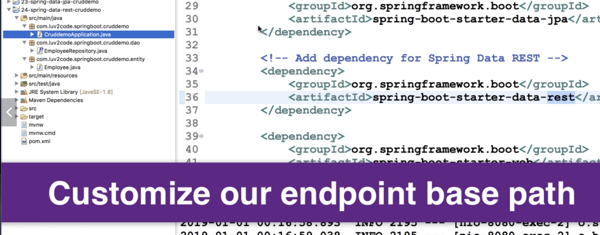

- deploy my `application.properites`

```json
#
# JDBC properties
#
spring.datasource.url=jdbc:mysql://localhost:3306/employee_directory?useSSL=false&serverTimezone=UTC
spring.datasource.username=root
spring.datasource.password=

#
# Spring Data REST properties
#
spring.data.rest.base-path=/magic-api
```

- rerun app

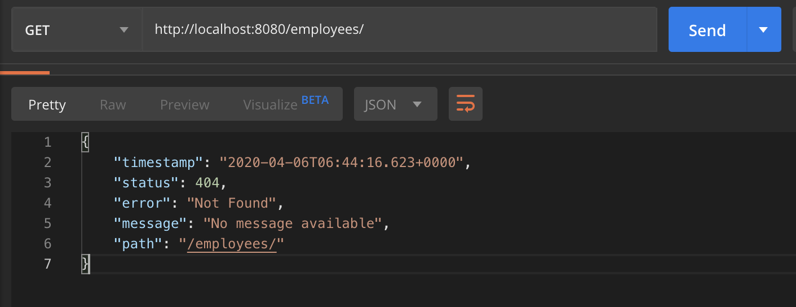

- 404 error

- since we set path to be `spring.data.rest.base-path=/magic-api`

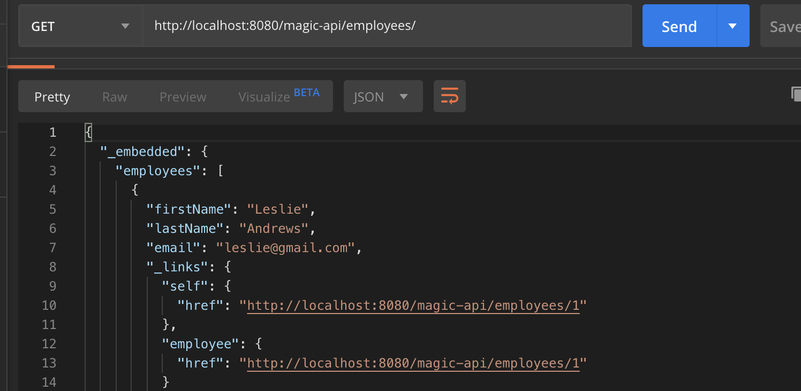

- add new


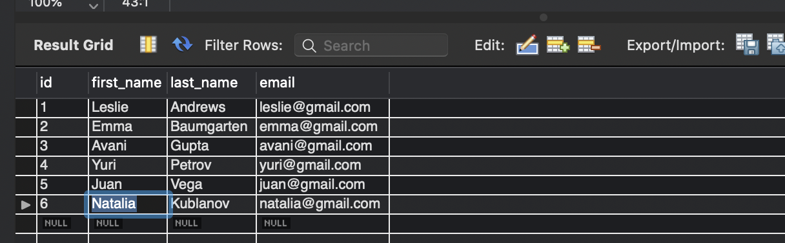

- update

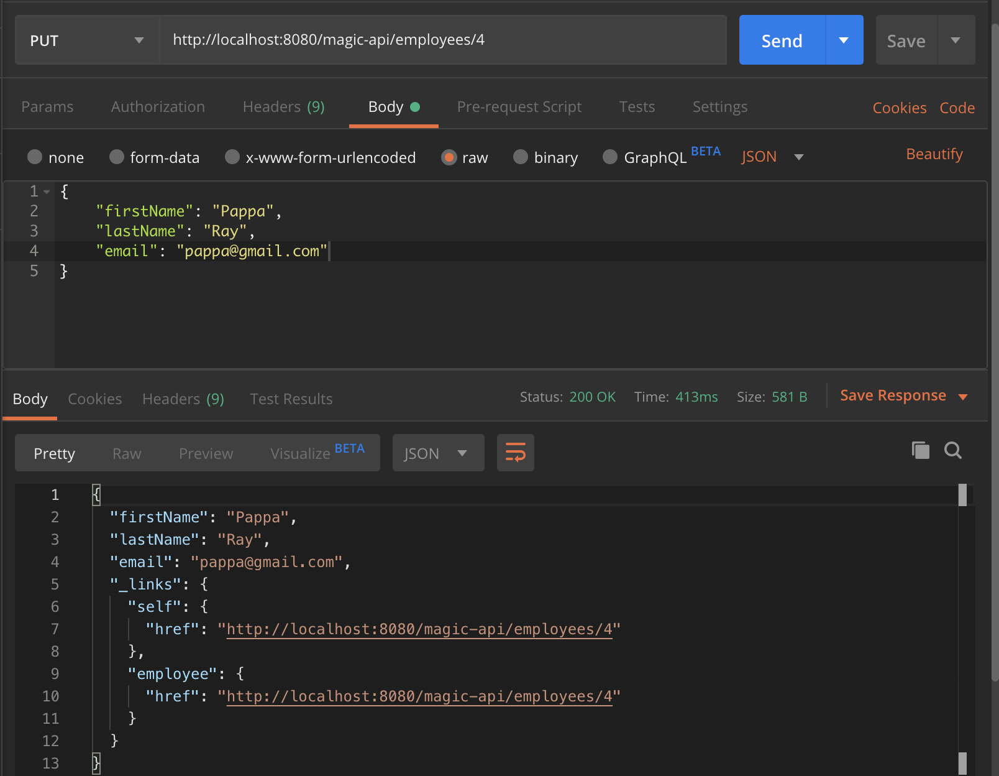

- delete

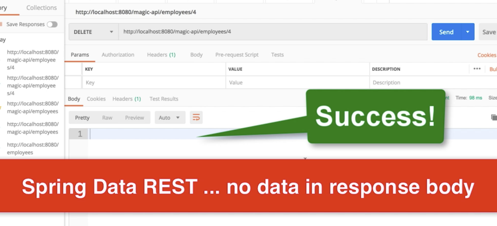

- but we can see status: 204 , that meas success

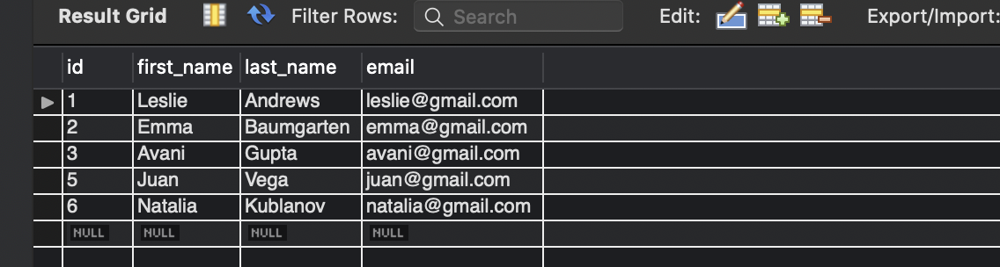


