# 3. Configuration Pagination Sort

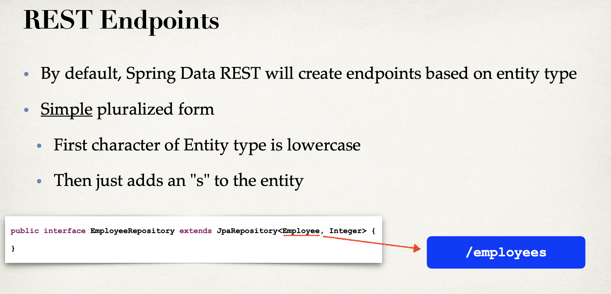

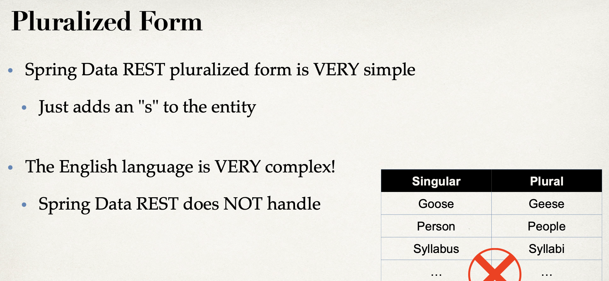

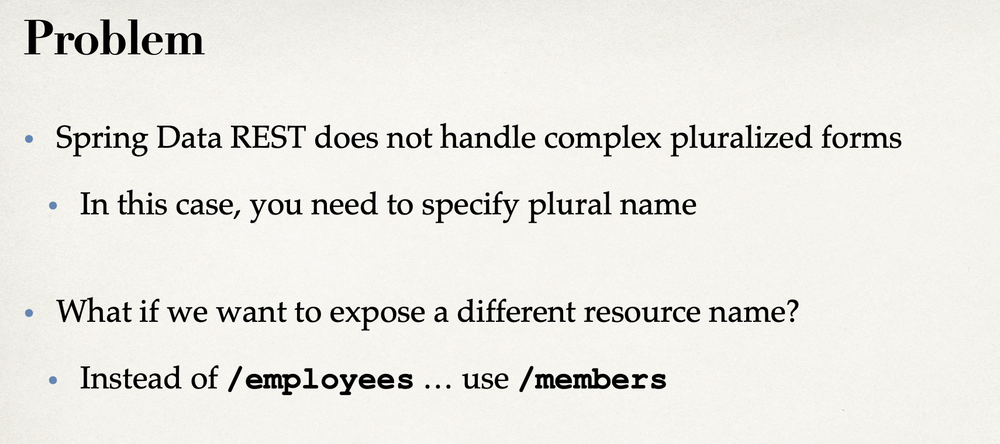

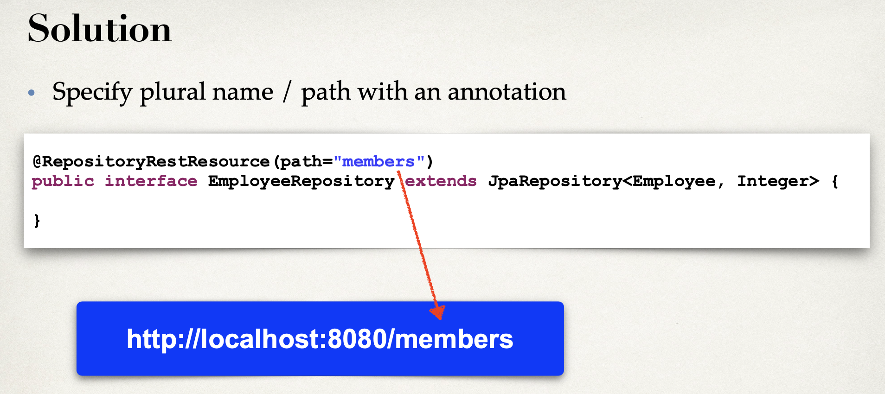

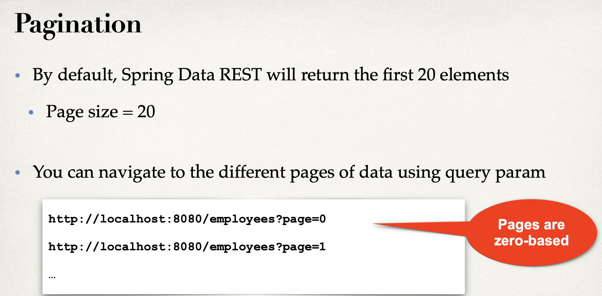

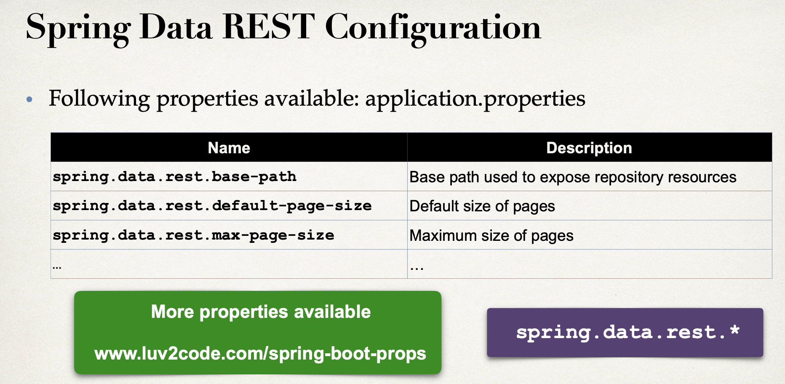

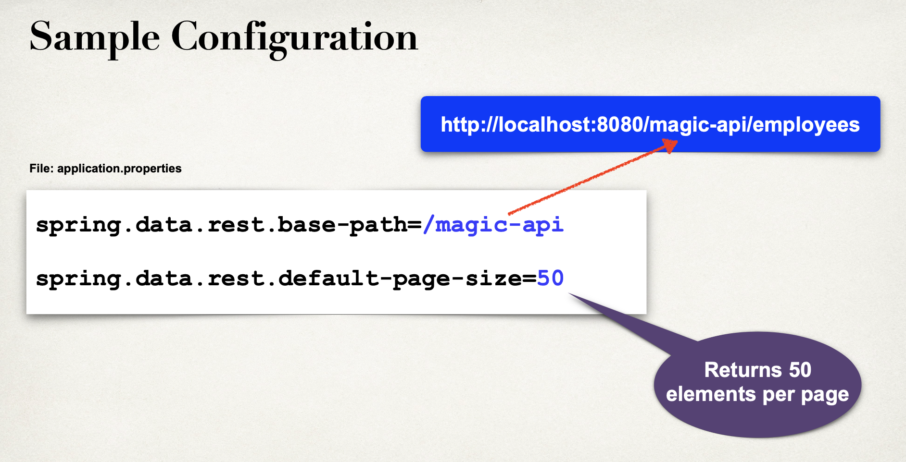


```java
package com.luv2code.springboot.cruddemo.dao;

import com.luv2code.springboot.cruddemo.entity.Employee;
import org.springframework.data.jpa.repository.JpaRepository;
import org.springframework.data.rest.core.annotation.RepositoryRestResource;

@RepositoryRestResource(path="members")
public interface EmployeeRepository extends JpaRepository<Employee, Integer> {
    //that's it ... no need to write any code LOL!
}
```

- insert `@RepositoryRestResource(path="members")` to `EmployeeRepsitory`

- rerun app

- since we change path(employees to memebers), it will generate 404 error

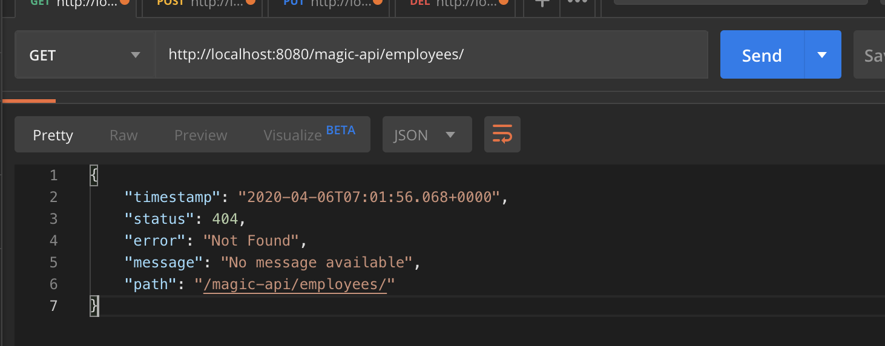

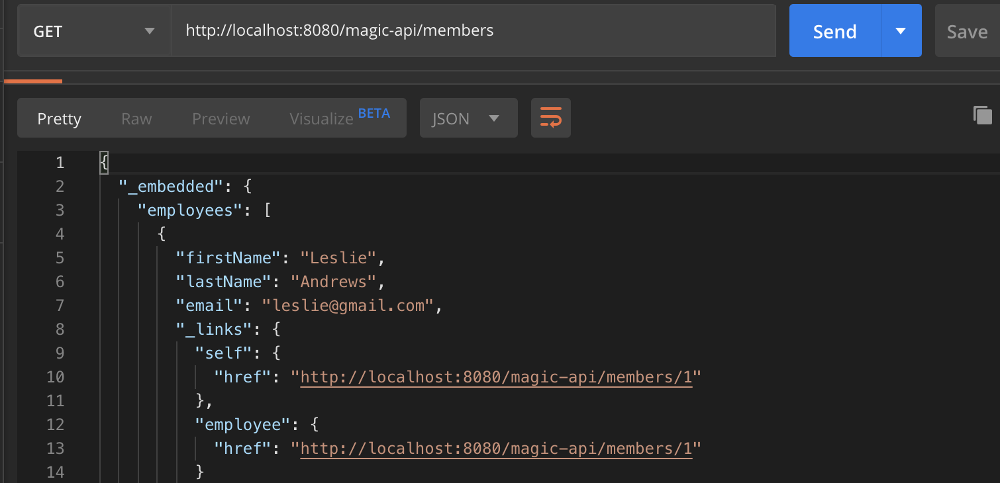

- let's change it back, just comment this line 

```java
//@RepositoryRestResource(path="members")
public interface EmployeeRepository extends JpaRepository<Employee, Integer> {
    //that's it ... no need to write any code LOL!
}
```

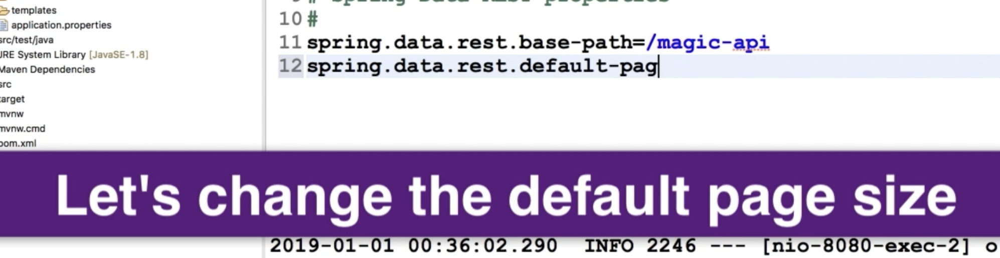

- update application.properties

```json
#
# Spring Data REST properties
#
spring.data.rest.base-path=/magic-api
spring.data.rest.default-page-size=3
```

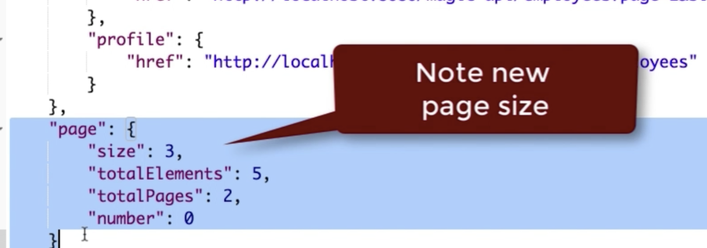

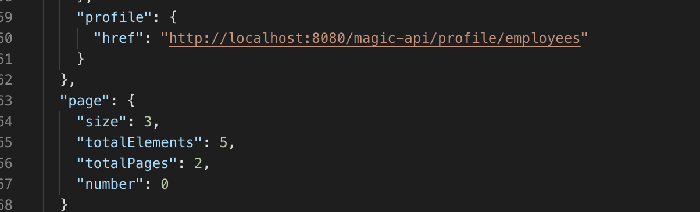

- now click next page

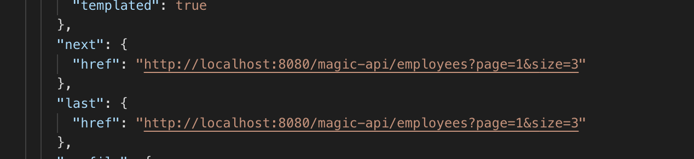

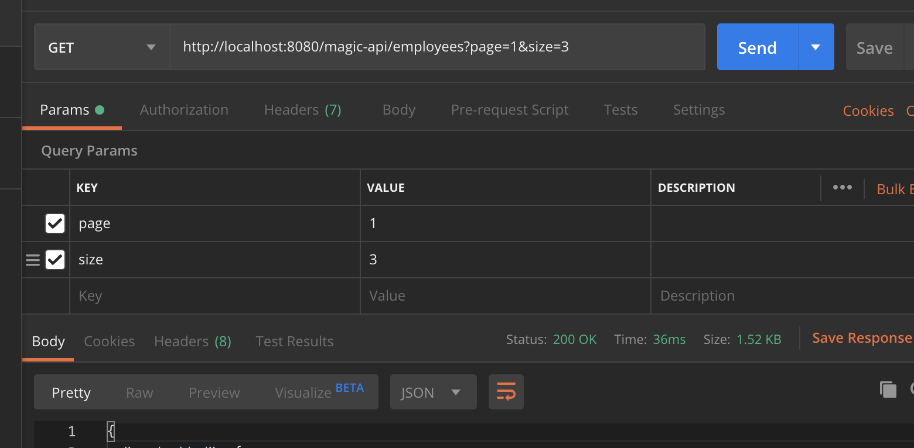

- let's change page size = 20

---

### Let's sort by last name

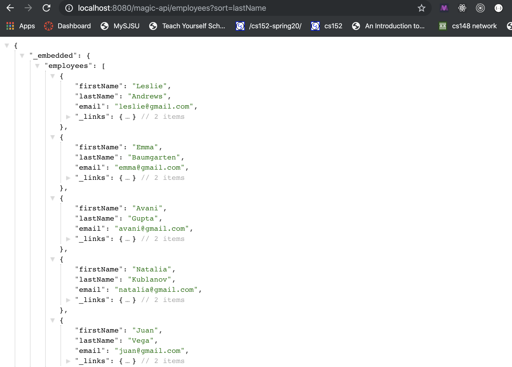

### Let's sort by last name, descending

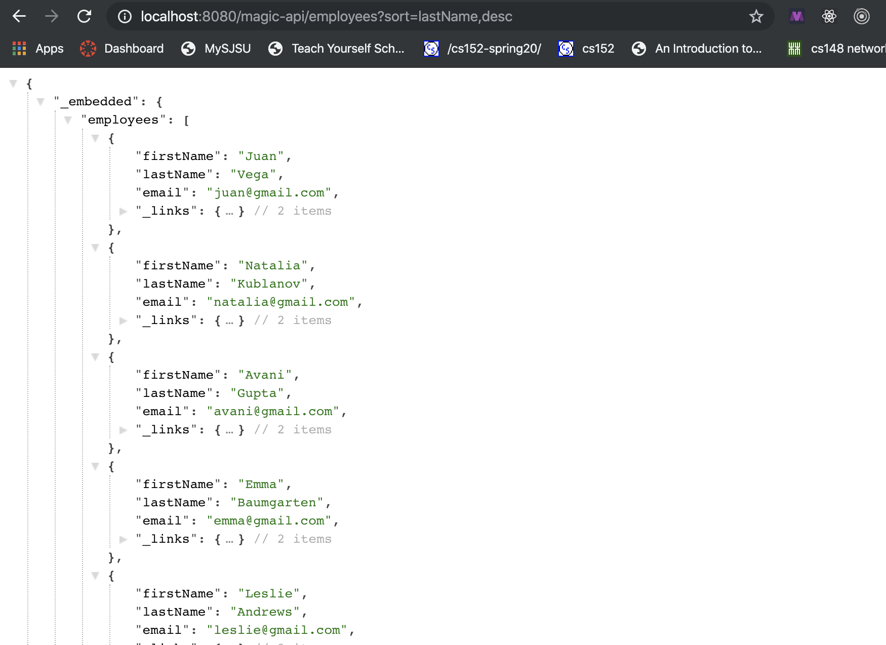


