### `JSP Expression`

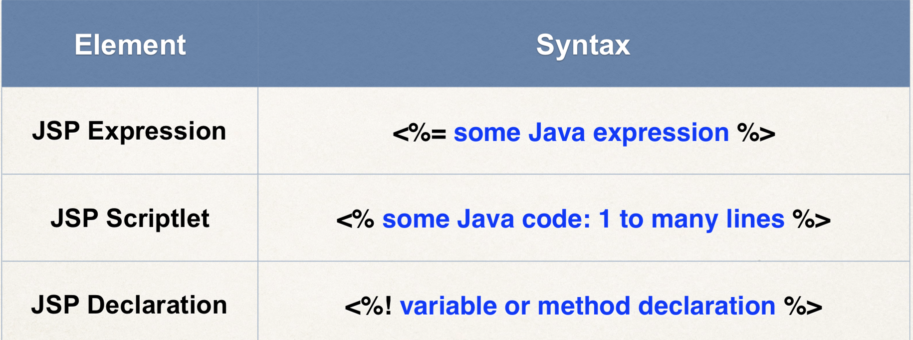
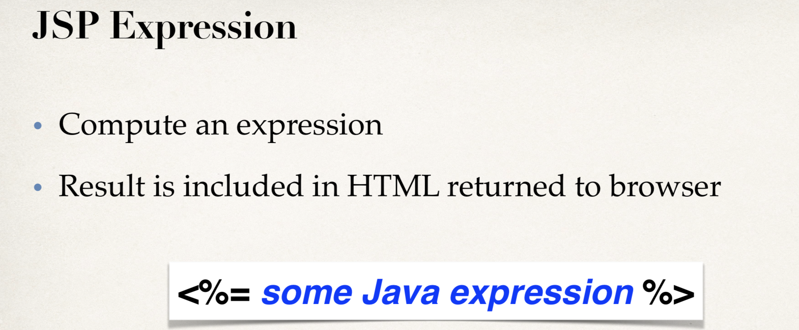

- here is an example
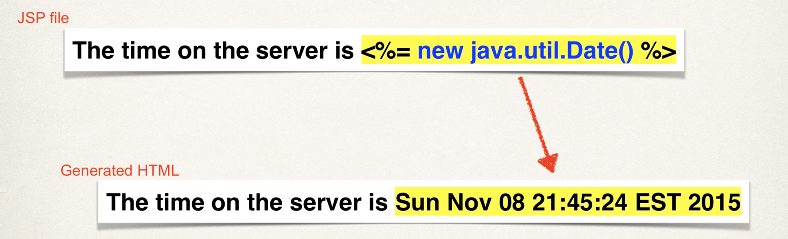


```java
<%@ page contentType="text/html;charset=UTF-8" language="java" %>
<html>
  <head>
    <title>$Title$</title>
  </head>
  <body>
  <h3>Hello World of Java!</h3>
  The time on the server is <%= new java.util.Date() %>
  <br>
  Converting a string to uppercase: <%= new String("Hello World").toUpperCase() %>
  <br><br>
  25 multiplied by 4 equals <%= 25 * 4 %>
  <br><br>
  Is 75 less than 69? <%= 75 < 69 %>
  </body>
</html>
```
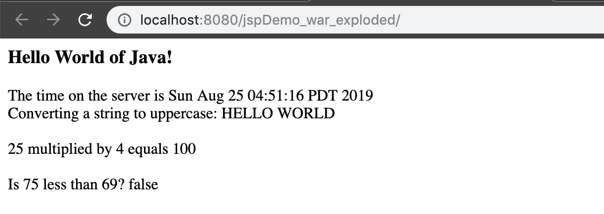


### `JSP Scriptlets` (脚本小程序)
- now create a new `scriptlet.jsp`

```java
<body>
    <h3>Hello World of Java</h3>
    <%
    for(int i=1; i<=5; i++){
        out.println("<br/> I really enjoy JSP code: " + i);
    }    
    %>
</body>
```
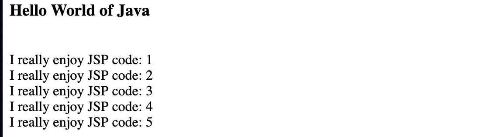


### `JSP Declarations`
- add a new file `declaration.jsp`

- Declare a method in the JSP page
- Call the method in the same JSP page
```java
<body>
<%!
    String makeItLower(String data) {
        return data.toLowerCase();
    }
%>
Lower case "Hello World": <%= makeItLower("Hello World")%>
</body>
```
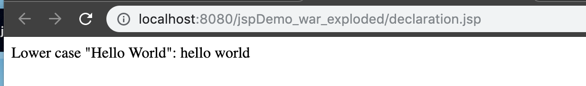

### `Calling a java class from JSP`
- Minimize the `scriptlets` and `declarations` in a JSP

1. Create Java class
2. Call Java class from JSP

:star: create a package named `com.luv2code.jsp`
- create a class named `FunUtils.java` in package `com.luv2code.jsp` 
```java
package com.luv2code.jsp;
public class FunUtils {
    public static String makeItLower(String data) {
        return data.toLowerCase();
    }
}
```
- create a class named `fun-test.jsp` in `web` folder
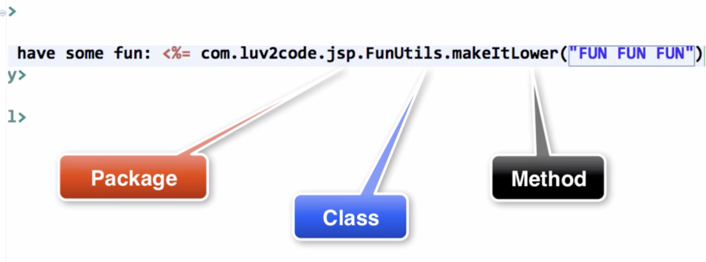
```jsp
<%@ page import="com.luv2code.jsp.*" %>
<html>
<body>
Let's have some fun: <%=FunUtils.makeItLower("FUN FUN FUN")%>
</body>
</html>
```
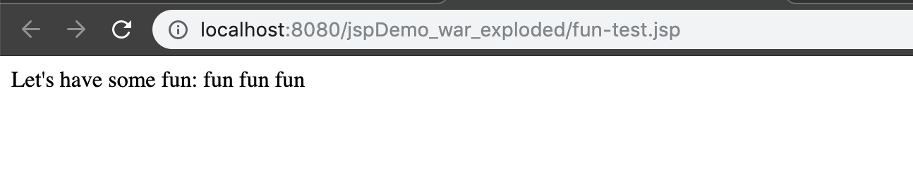


### `Built-In Server Objects`
- List of commonly used JSP objects
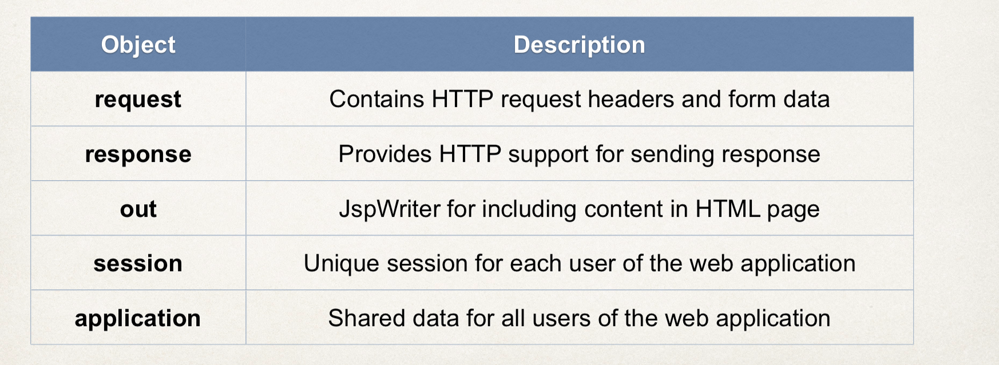
---
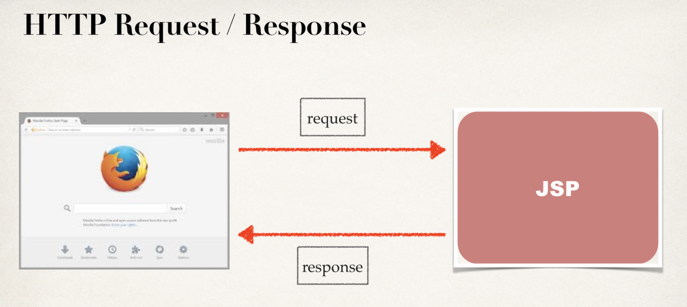


- create a `builtin-test.jsp`
```jsp
<body>
<h3>JSP Built-In Objects</h3>
Request user agent: <%=request.getHeader("User-Agent")%>
<br><br>
Request language: <%=request.getLocale()%>
</body>
```
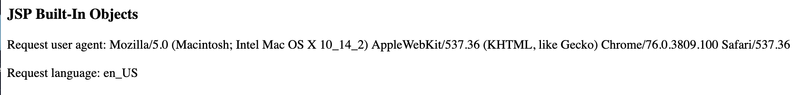


### `Including Files in JSP`

:star: how to use JSP for including other files 
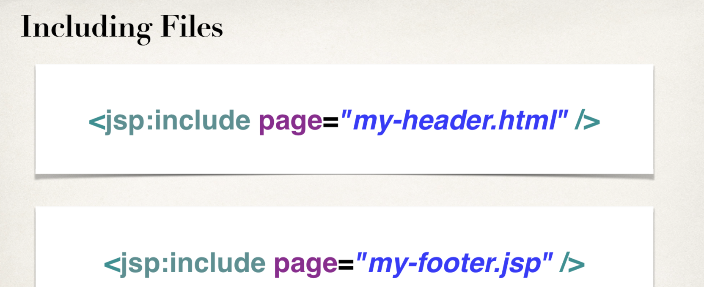

- create a `my-header.html` in `web` folder
```html
<h1 align="center">JSP Tutorial</h1>
```

- create a `my-footer.jsp` in `web` folder
```jsp
<p align="center">
    Last updated: <%=new java.util.Date()%>
</p>
```

- create a `homepage.jsp` in `web` folder
```html
<html>
<body>
<jsp:include page="my-header.html"/>
Blah blah blah ... <br><br>
Blah blah blah ... <br><br>
Blah blah blah ... <br><br>
<jsp:include page="my-footer.jsp"/>

</body>
</html>
```

- so far so good!
- Great!

