### `HTML Form Overview`

:star: Built-In Server Objects
- Review HTML Forms
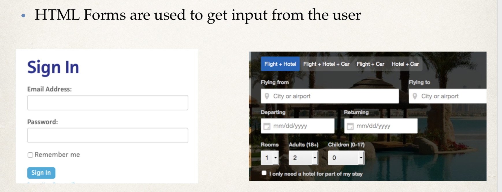
---
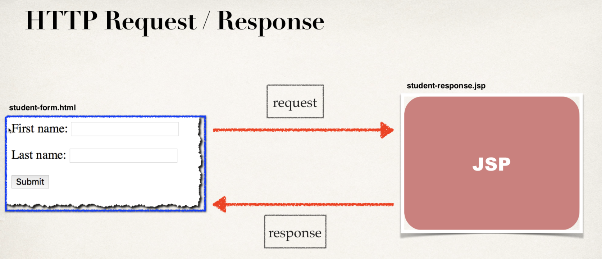

- Building HTML Forms
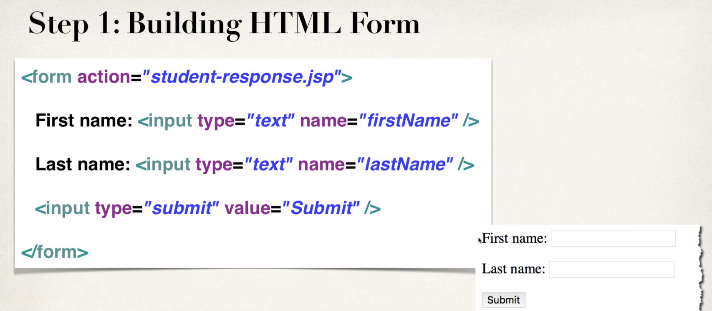
---
- Reading Form Data with JSP
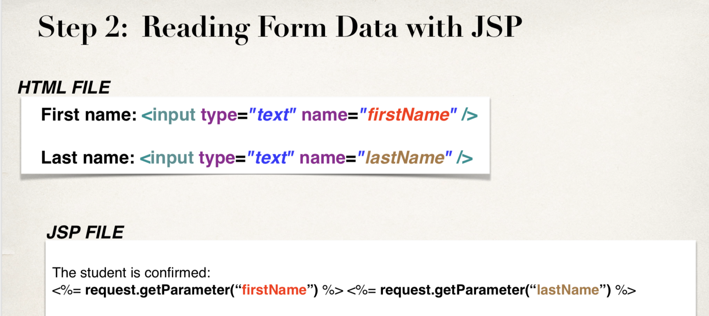
---
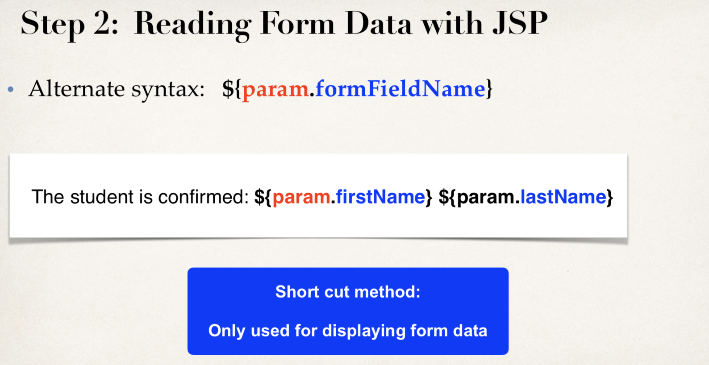

- create a `student-form.html` in `web` folder
```html
<!DOCTYPE html>
<html lang="en">
<head>
    <title>Student Registration Form</title>
</head>
<body>
<form action="student-response.jsp">
    First name:<input type="text" name="firstName"/>
    <br><br>
    Last name:<input type="text" name="lastName"/>
    <br><br>
    <input type="submit" value="Submit"/>
</form>
</body>
</html>
```
- create a `student-response.jsp` in `web`
```jsp
<!DOCTYPE html>
<html lang="en">
<head>
    <title>Student Registration Form</title>
</head>
<body>
<form action="student-response.jsp">
    First name:<input type="text" name="firstName"/>
    <br><br>
    Last name:<input type="text" name="lastName"/>
    <br><br>
    <input type="submit" value="Submit"/>
</form>
</body>
</html>
```
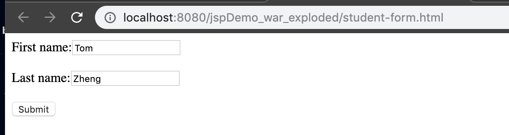
- after click `Submit`
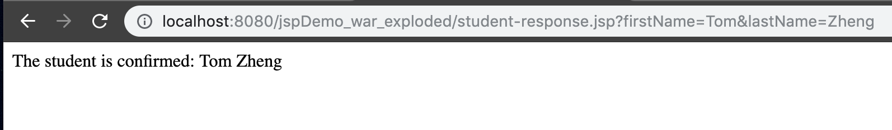


### `Drop-Down Lists`
- Drop-Down List in Action
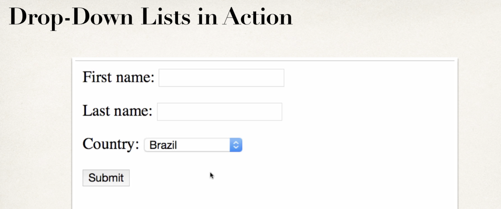

---

- Drop-Down List - HTML `<select>` tag
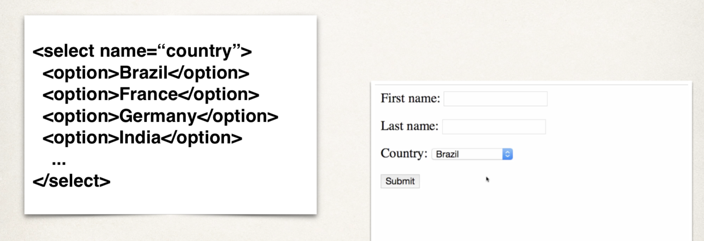
---
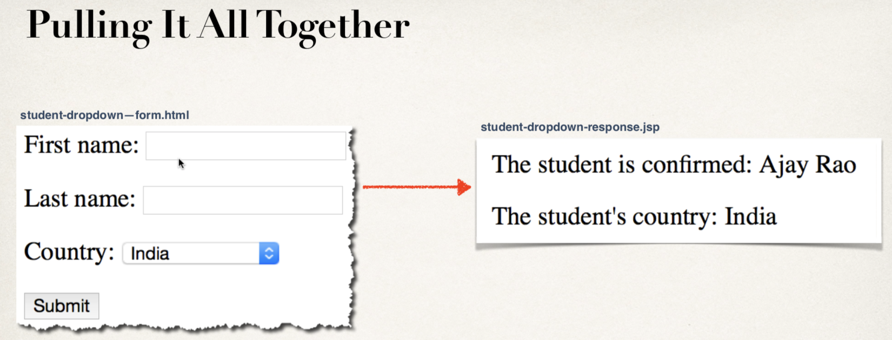

---
1. Create HTML Form
2. Create JSP confirmation page

- copy `student-form.html`'s content, paste in a new `student-dropdown-from.html`

---

```html
<body>
<form action="student-dropdown-response.jsp">
    First name:<input type="text" name="firstName"/>
    <br><br>
    Last name:<input type="text" name="lastName"/>
    <br><br>
    <select name="country">
        <option>Brazil</option>
        <option>France</option>
        <option>Germany</option>
        <option>India</option>
        <option>Turkey</option>
        <option>United Kingdom</option>
        <option>United States of America</option>
    </select>
    <br><br>
    <input type="submit" value="Submit"/>
</form>
</body>
```

- copy `student-response.jsp`'s content, paste in a new `student-dropdown-response.jsp`

```jsp
<html>
<head>
    <title>Student Confirmation Title</title>
</head>
<body>
    The student is confirmed: ${param.firstName} ${param.lastName}
    <br><br>

    The student's country: ${param.country}
</body>
</html>
```
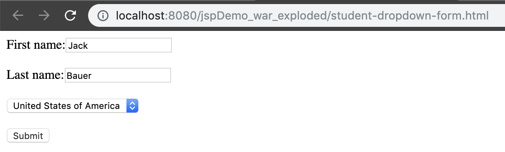
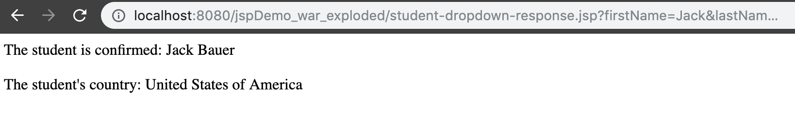

- Ok , Cool !


### `Radio Button`
- Radio Button Demo
- HTML for Radio Button
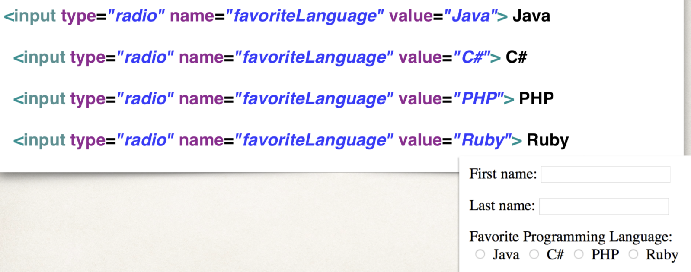
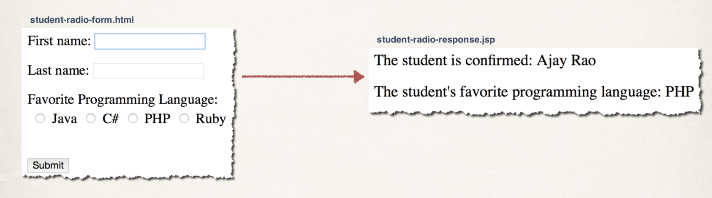

1. Create HTML Form
2. Create JSP confirmation page

- copy `student-form.html`'s content, paste in a new `student-radio-from.html`
```html
<body>
<form action="student-radio-response.jsp">
    First name:<input type="text" name="firstName"/>
    <br><br>
    Last name:<input type="text" name="lastName"/>
    <br><br>
    Favorite Programming Language: <br>
    <input type="radio" name="favoriteLanguage" value="Java"/> Java
    <input type="radio" name="favoriteLanguage" value="C++"/> C++
    <input type="radio" name="favoriteLanguage" value="JavaScript"/> JavaScript
    <input type="radio" name="favoriteLanguage" value="PHP"/> PHP
    <br><br>
    <input type="submit" value="Submit"/>
</form>
</body>
```

- copy `student-response.jsp`'s content, paste in a new `student-radio-response.jsp`
```jsp
<html>
<head>
    <title>Student Confirmation Title</title>
</head>
<body>
    The student is confirmed: ${param.firstName} ${param.lastName}

    <br><br>
    The student's favorite programming language: ${param.favoriteLanguage} 
</body>
</html>
```

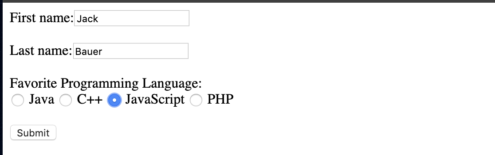
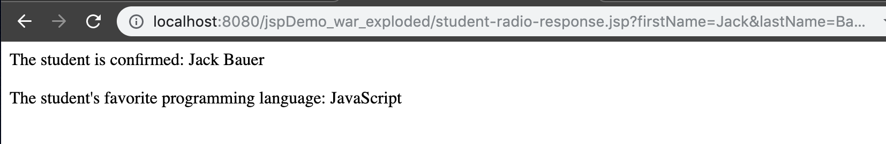


### `Checkboxes-Overview`
- Check Box Demo
- HTML for CHeck Box
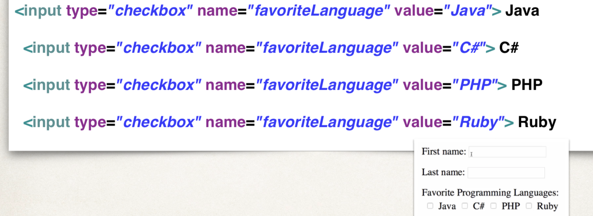
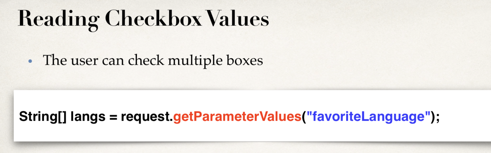
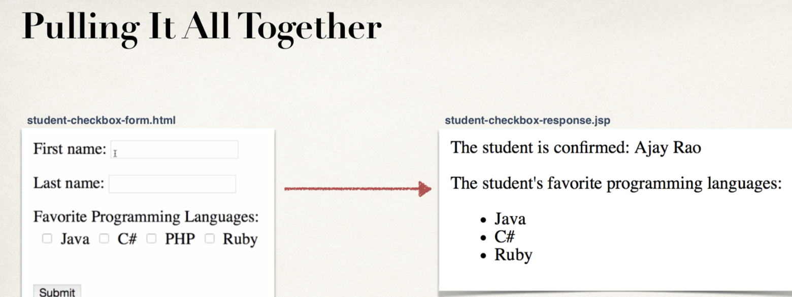

1. Create HTML Form
2. Create JSP confirmation page

- copy `student-form.html`'s content, paste in a new `student-checkbox-from.html`
```html
<body>
<form action="student-checkbox-response.jsp">
    First name:<input type="text" name="firstName"/>
    <br><br>
    Last name:<input type="text" name="lastName"/>
    <br><br>
    <input type="checkbox" name="favoriteLanguage" value="Java"> Java
    <input type="checkbox" name="favoriteLanguage" value="C++"/> C++
    <input type="checkbox" name="favoriteLanguage" value="JavaScript"/> JavaScript
    <input type="checkbox" name="favoriteLanguage" value="PHP"/> PHP
    <br><br>
    <input type="submit" value="Submit"/>
</form>
</body>
</html>
```

- copy `student-response.jsp`'s content, paste in a new `student-checkbox-response.jsp`
```jsp
<body>
    The student is confirmed: ${param.firstName} ${param.lastName}
    <br><br>
    Favorite Programming Language: <br>
<%--  dispaly list of "favoriteLanguage"  --%>
    <ul>
        <%
            String[] langs = request.getParameterValues("favoriteLanguage");
            for (String tempLang : langs) {
                out.print("<li>" + tempLang + "</li>");
            }
        %>
    </ul>
</body>
</html>
```
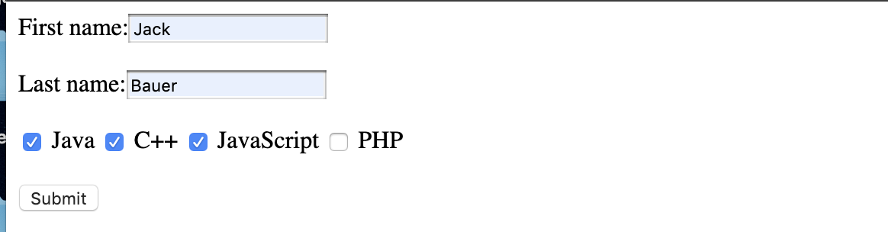
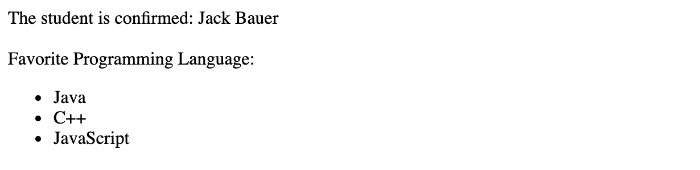

:star: `How to handle when user doesn't select a checkbox?`
```java
        <%
            String[] langs = request.getParameterValues("favoriteLanguage");
        
            if (langs != null) {
                for (String tempLang : langs) {
                    out.println("<li>" + tempLang + "</li>");
                }
            }
        %>
```


