### `Tracking user actions with Sessions - Overview`

- Session Tracking Demo
- Session - Coding Steps

- JSP session object


:star: JSP session is created once for user's browser session. Unique for this user

- Commonly used when you need to keep track of the user's actions

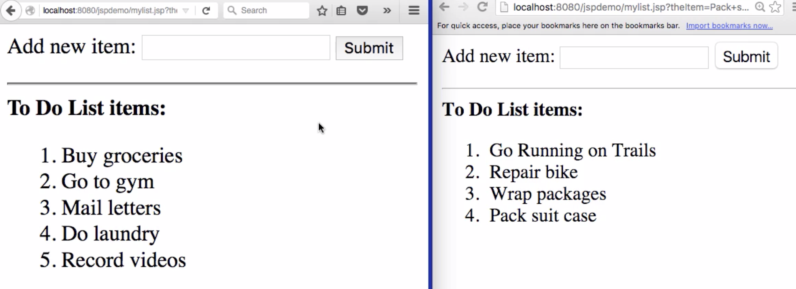
- The basic idea is that each browser has an unique session object on the Tomcat server in memory and you can keep track of each user's individual actions
---

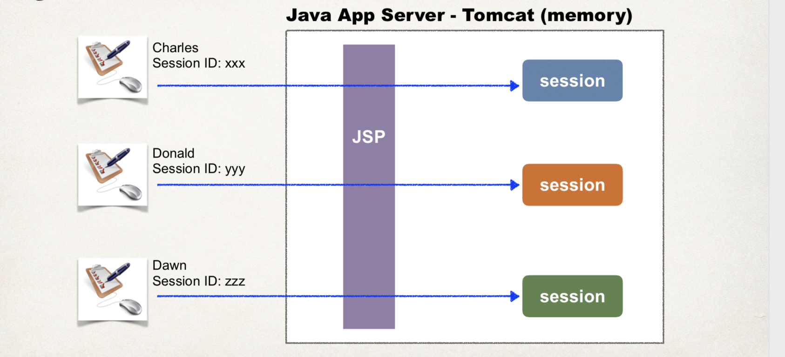
- so, you can have multiple users of your application. They're all accessing maybe one JSP or whatever, that `JSP` can make use of a session object, so each user of the system will have their own session object. 
- The session object is kept in memory, so it's not stored on a database or it's not stored on the file system, it's only in your server's memory like in the Tomcat server memory and each user has their own session ID. So, the Tomcat server will actually assign a session ID to the user and Tomcat has its own algorithm for assigning. 
- But the key thing is that the developer(you) don't have to worry about session ID generation, you also don't have to worry about passing a session ID back and forth, the Tomcat server and the browser will handle that for you automatically

:star: Add data to session object:
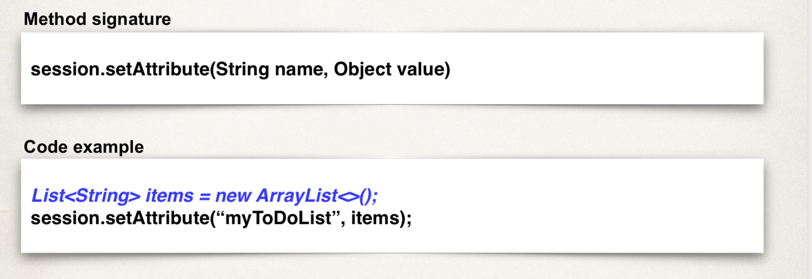
- so the name is basically just a `label`
- and the `value` is any object that you want to place in the session

:star: Retrieve data from session object
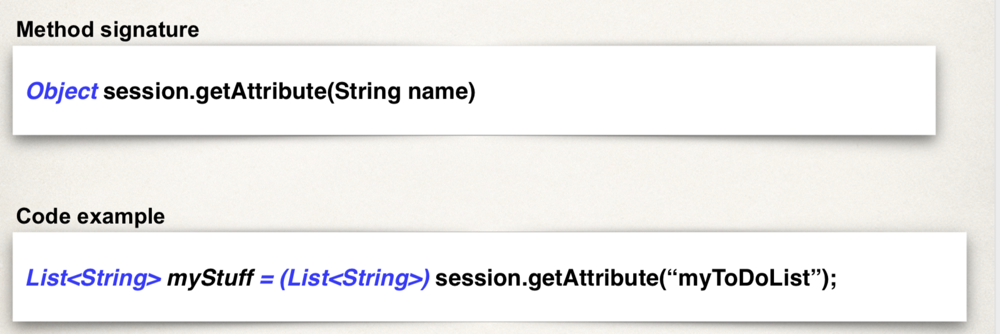

:star: `JSP Session - Other useful methods`:


### `Tracking user actions with Sessions - Write some code!`
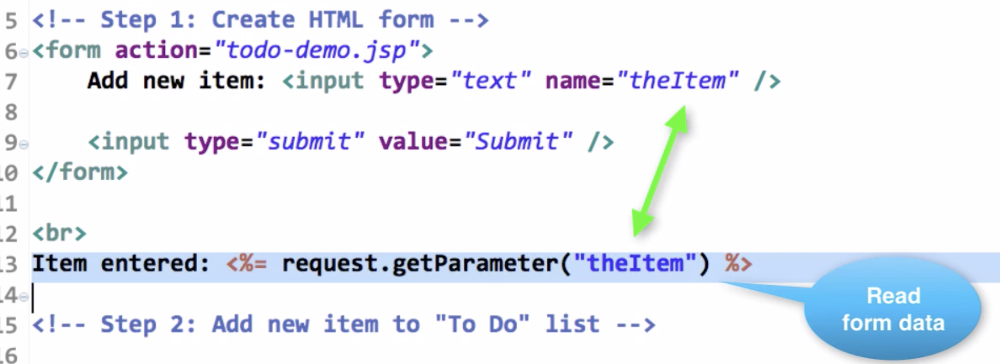
---

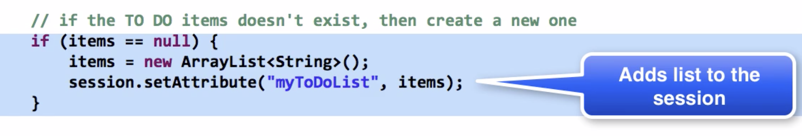

```html
<%@ page import="java.util.*" %>
<html>
<head>
    <title>Title</title>
</head>
<body>
<%--Step 1: Create HTML form--%>
<form action="todo-demo.jsp">
    Add new item:<input type="text" name="theItem"/>

    <input type="submit" value="Submit"/>
</form>

<br>
Item entered:<%= request.getParameter("theItem")%>

<%--Step 2: Add new item to "To Do" list--%>
<%
    //get the TO DO items from the session
    List<String> items = (List<String>) session.getAttribute("myToDoList");
    
    //if the TO DO items doesn't exist, then create a new one
    if (items == null) {
        items = new ArrayList<String>();
        session.setAttribute("myToDoList", items);
    }
    
    //see if there is form data to add
    String theItem = request.getParameter("theItem");
    if (theItem != null) {
        items.add(theItem);
    }
%>

<%--Step 3: Display all "To Do" item from session --%>
<hr>
<b>To List Items:</b><br>

<ol>
    <%
        for (String temp : items) {
            out.println("<li>" + temp + "</li>");
        }
    %>
</ol>
</body>
</html>
```
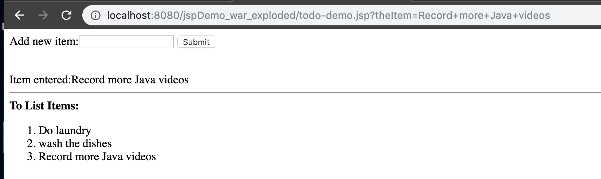


### `Personalize Content with Cookies - Overview`

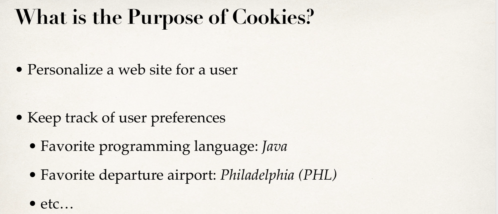

- What is a Cookie?
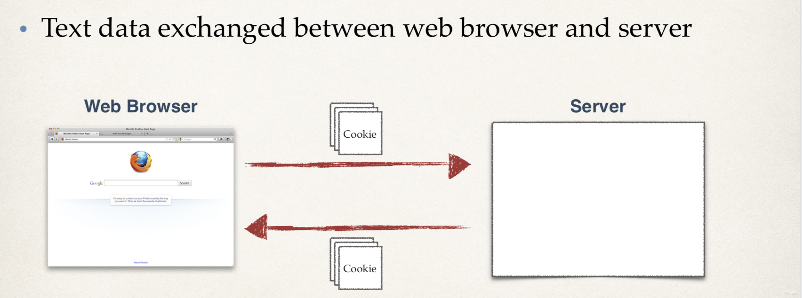

- Cookies - Contents
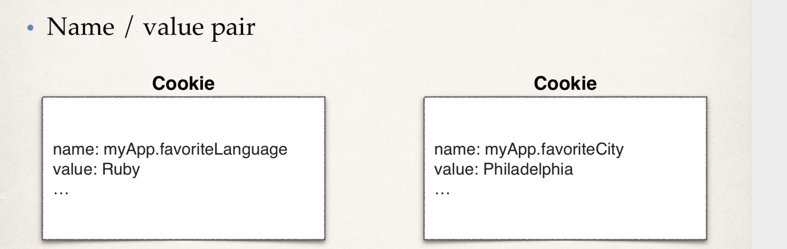

- How Are Cookies Passed?
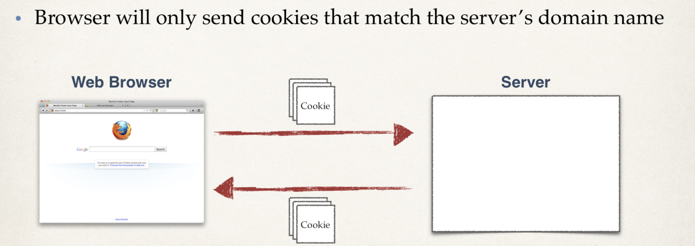

- Cookie API - Package
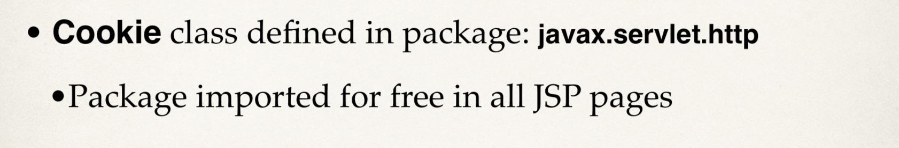

- Cookie API - Constructor
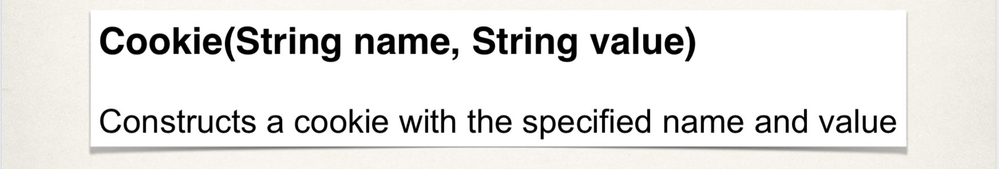

- Cookie API - Sending Cookies to Browser
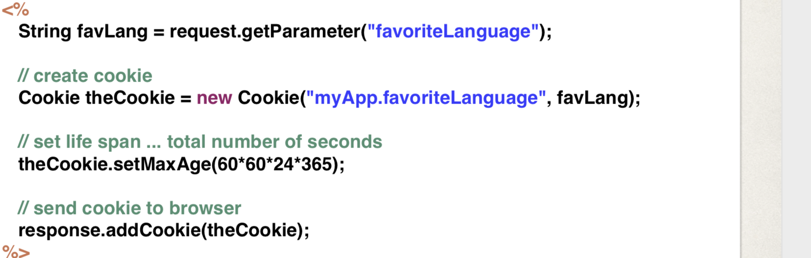

- Cookie API - Reading Cookies from the Browser
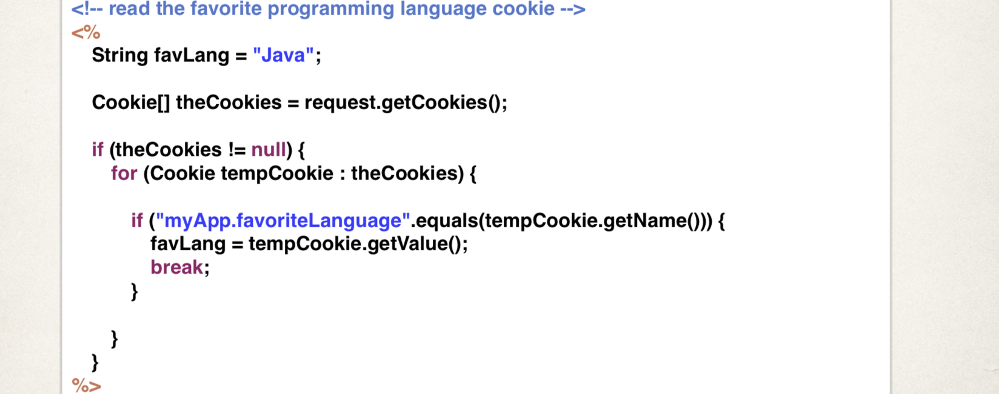


### `Personalize Content with Cookies - Write some Code!`

- To Do List
1. Create HTML Form to personalize site
2. Create JSP to read form data and set Cookies
3. Create home page to read cookies and display personalized content

- create `cookies-personalize-form.html` in `web` folder


```html
<!DOCTYPE html>
<html lang="en">
<head>
    <meta charset="UTF-8">
    <title>Personalize The Site</title>
</head>
<body>
<form action="cookies-personalize-response.jsp">
    Select your Favorite Programming Language
    <select name="favoriteLanguage">
        <option>Java</option>
        <option>C++</option>
        <option>PHP</option>
        <option>Ruby</option>
    </select>

    <br><br>
    <input type="submit" value="Submit"/>
</form>
</body>
</html>
```

---
- create `cookies-personalize-response.jsp` in web folder


```html
<html>
<head>
    <title>Confirmation</title>
</head>

<%
    //read form data
    String favLang = request.getParameter("favoriteLanguage");
    
    //create the cookie
    Cookie theCookie = new Cookie("myApp.favoriteLanguage", favLang);
    
    //set the life span ... total number of seconds(yuk!)
    theCookie.setMaxAge(60 * 60 * 24 * 365); //<-- for one year
    
    //send cookie to browser
    response.addCookie(theCookie);
%>
<body>
    Thanks! We set your favorite language to: ${param.favoriteLanguage}
    <br><br>

    <a href="cookies-homepage.jsp">Return to homepage.</a>
</body>
</html>
```

---

- since return to `cookies-homepage.jsp`
- we create a `cookies-homepage.jsp` in web folder


```html
<%@ page contentType="text/html;charset=UTF-8" language="java" %>
<html>
<body>
    <h3>Training Portal</h3>
<%--read the favorite programming language cookies--%>
<%
    //the default ... if there are no cookies
    String favLang = "Java";
    
    //get the cookies from the browser request
    Cookie[] theCookies = request.getCookies();
    
    //find our favorite language cookie
    if (theCookies != null) {
        for (Cookie tempCookie : theCookies) {
            if ("myApp.favoriteLanguage".equals(tempCookie.getName())) {
                favLang = tempCookie.getValue();
                break;
            }
        }
    }
%>

<%--now show a personalized page ... use the "favLang" variable--%>

<%--show new book for this lang--%>
<h4>New Books for<%=favLang%></h4>
<ul>
    <li>blah blah blah</li>
    <li>blah blah blah</li>
</ul>
<h4>Latest News reports for<%=favLang%></h4>
<ul>
    <li>blah blah blah</li>
    <li>blah blah blah</li>
</ul>
<h4>Hot Jobs for<%=favLang%></h4>
<ul>
    <li>blah blah blah</li>
    <li>blah blah blah</li>
</ul>

<hr>
<a href="cookies-personalize-form.html">Personalize this page</a>
</body>
</html>

```

---

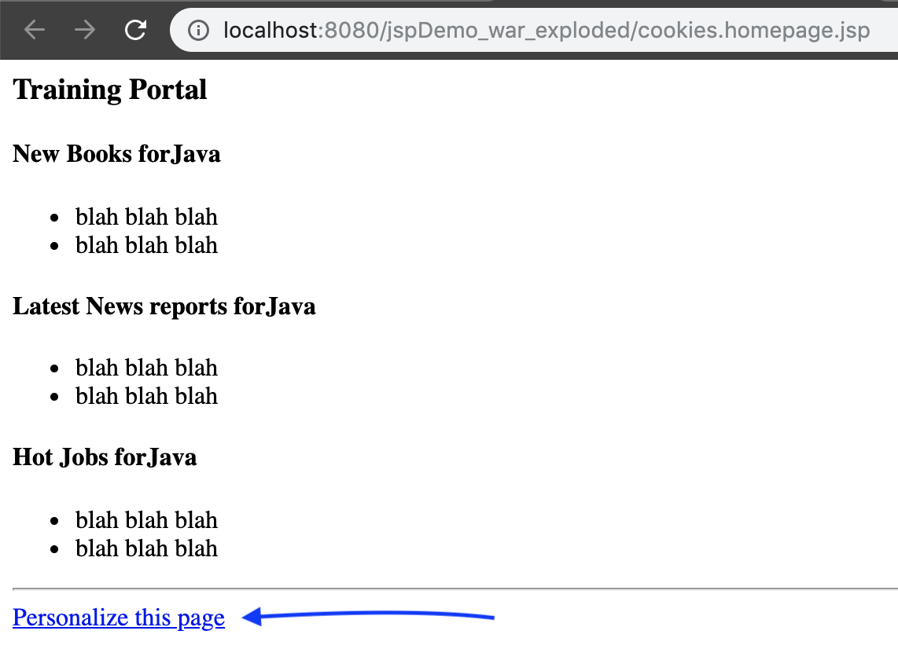

---
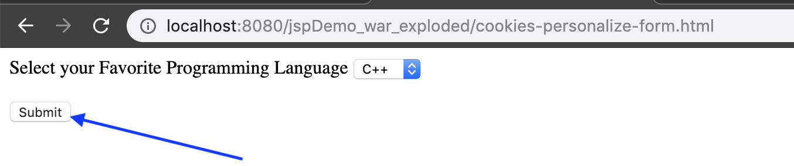

---


---
