### `JSP Tags Overview`

:star: What are JSP Tags?

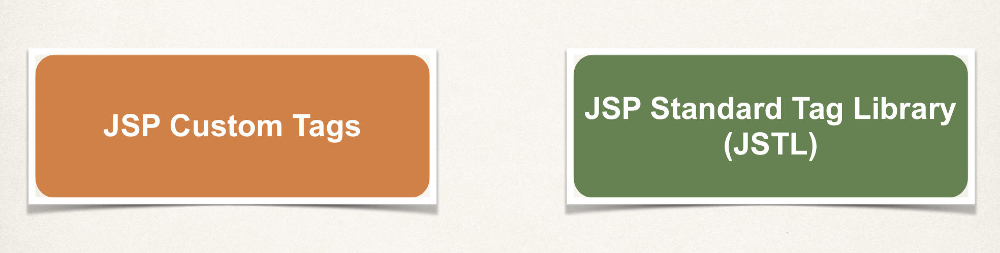
---

- Sample Use Case

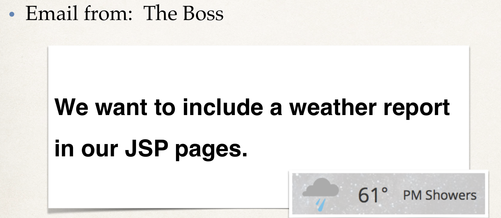
---

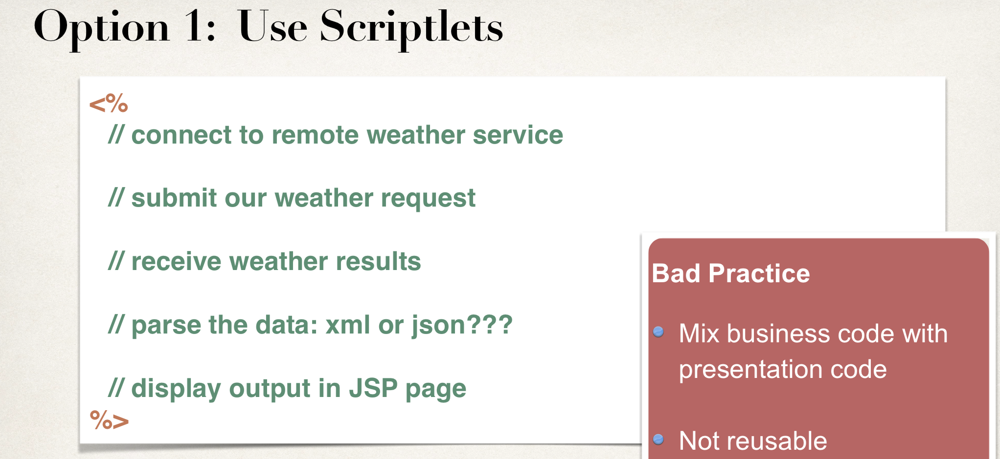
---

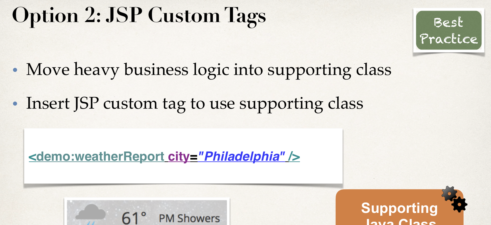

- Benefits of JSP Custom Tags

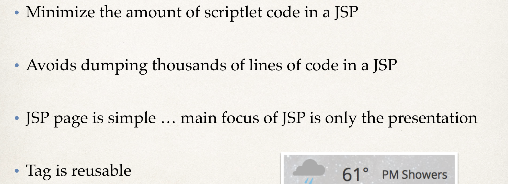
---


:star: JSP Standard Tag Library (JSTL)

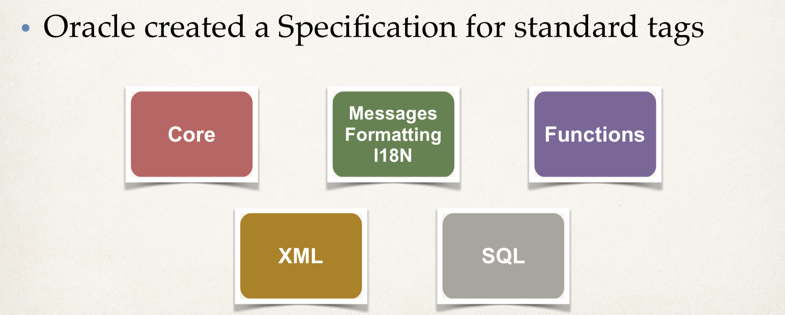
---


### `Install JSTL JAR files`

- create a `Java Enterprise` with `Web Application`, named `tagdemo`
  
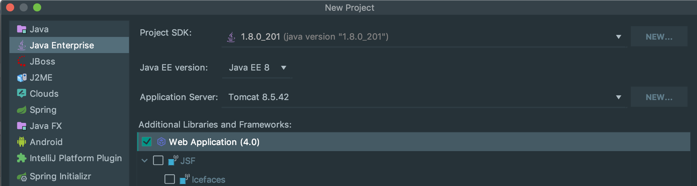
---

- import JSTL library

- click `cmd + ;`

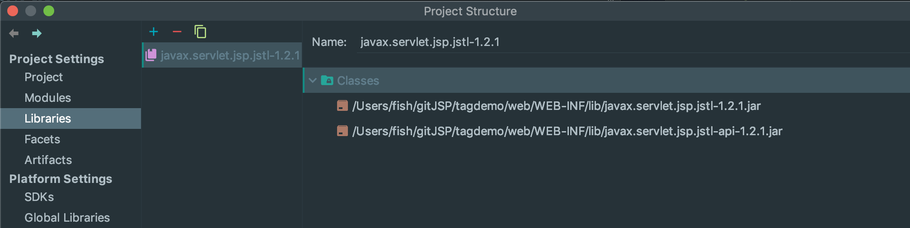
---
- click `+`

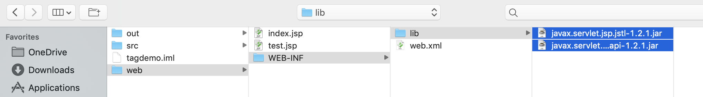

- import this two library
---

- create a `test.jsp` in web folder

```java
<%@ taglib uri="http://java.sun.com/jsp/jstl/core" prefix="c" %>
<html>
<head>
    <title>Title</title>
</head>
<body>
<c:set var="stuff" value="<%= new java.util.Date() %>" />

Time on the server is ${stuff}

</body>
</html>
```
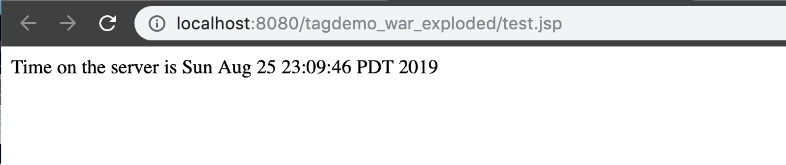


### `JSTL Core Tags - Looping with forEach - Overview`


- JSTL


- Core Tags
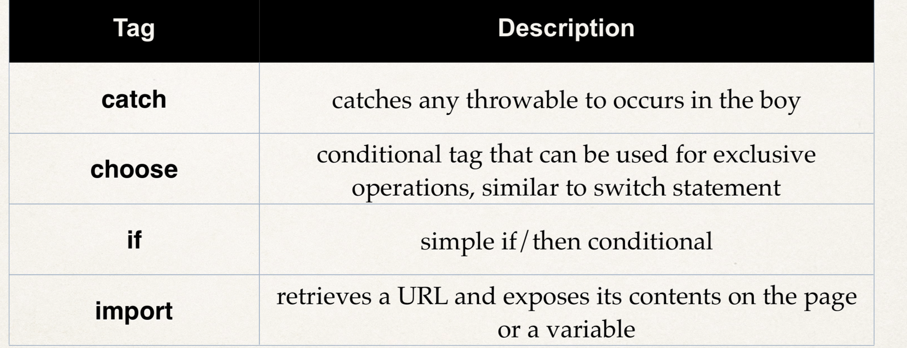
---
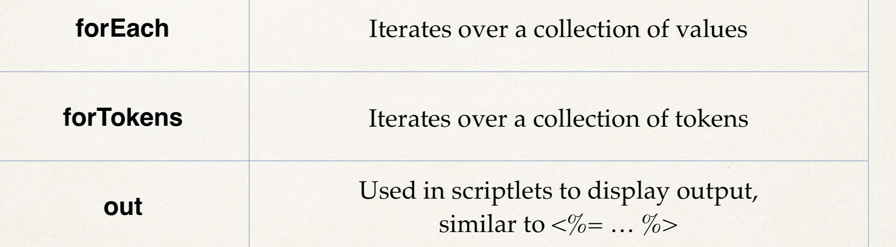
---
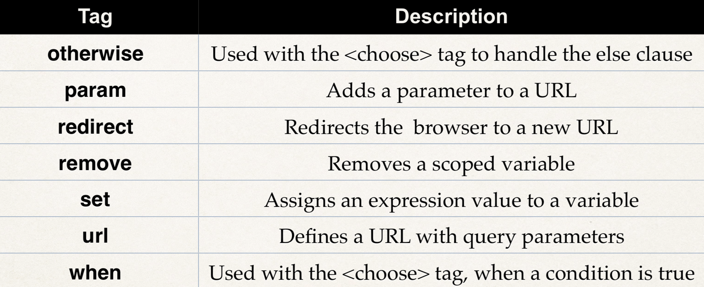


:star: JSP Core Taglib Reference
- Every page that makes use of the Core tags, must include this reference

 `<%@ taglib uri="http://java.sun.com/jsp/jstl/core" prefix="c" %>`

- one thing is a bit misleading: there's no real connection to the internet to make use of this tag library. `It's simply a unique identifier`. They'll actually make use of this unique identifier when they scan your local jar file. That's part of your project. 

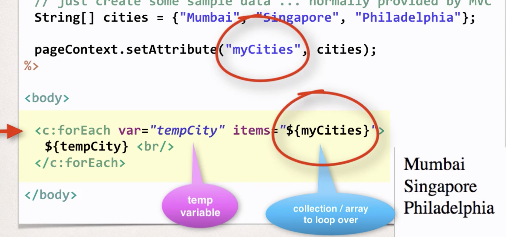

- create a `foreach-simple-test.jsp`
```java
<%@ taglib uri="http://java.sun.com/jsp/jstl/core" prefix="c" %>
<html>
<%
    //just create some sample data ... normally provide by MVC
    String[] cities = {"Mumbai", "Singapore", "Philadelphia"};
    pageContext.setAttribute("myCityes", cities);
%>
<body>
<c:forEach var="tempCity" items="${myCityes}">
    
    ${tempCity} <br>
</c:forEach>

</body>
</html>
```
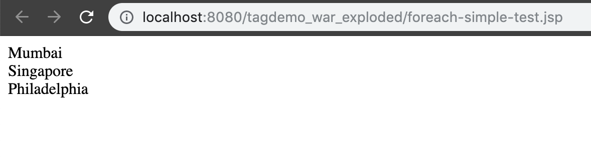

- create a new package `com.luv2code.jsp.tagdemo` in `src` folder
- create a class named `Student` in package

```java
package com.luv2code.jsp.tagdemo;
public class Student {
    private String firstName;
    private String lastName;
    private boolean goldCustomer;

    public Student(String firstName, String lastName, boolean goldCustomer) {
        this.firstName = firstName;
        this.lastName = lastName;
        this.goldCustomer = goldCustomer;
    }

    public String getFirstName() {
        return firstName;
    }

    public void setFirstName(String firstName) {
        this.firstName = firstName;
    }

    public String getLastName() {
        return lastName;
    }

    public void setLastName(String lastName) {
        this.lastName = lastName;
    }

    public boolean isGoldCustomer() {
        return goldCustomer;
    }

    public void setGoldCustomer(boolean goldCustomer) {
        this.goldCustomer = goldCustomer;
    }
}
```

---
- create a `foreach-student-test.jsp` in web

```java
<%@ taglib uri="http://java.sun.com/jsp/jstl/core" prefix="c" %>

<%@ page import="java.util.*, com.luv2code.jsp.tagdemo.Student " %>

<%
    //just create some sample data ... normally provided by MVC
    List<Student> data = new ArrayList<>();

    data.add(new Student("John", "Doe", false));
    data.add(new Student("Maxwell", "Johnson", false));
    data.add(new Student("Mary", "Public", false));

    pageContext.setAttribute("myStudents", data);
%>
<html>
<body>
    <c:forEach var="tempStudent" items="${myStudents}">
        ${tempStudent.firstName} ${tempStudent.lastName} ${tempStudent.goldCustomer}
        <br>
    </c:forEach>
</body>
</html>
```
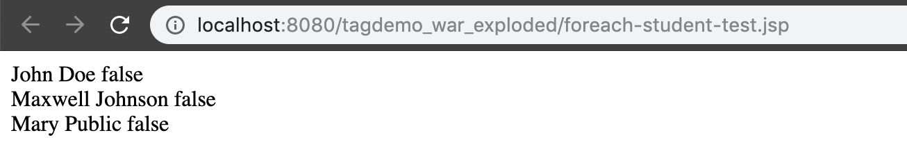
---

:star: Altering our `foreach-student-test.jsp`
```java

<%@ taglib uri="http://java.sun.com/jsp/jstl/core" prefix="c" %>
<%@ page import="java.util.*, com.luv2code.jsp.tagdemo.Student " %>
<%
    //just create some sample data ... normally provided by MVC
    List<Student> data = new ArrayList<>();

    data.add(new Student("John", "Doe", false));
    data.add(new Student("Maxwell", "Johnson", false));
    data.add(new Student("Mary", "Public", false));

    pageContext.setAttribute("myStudents", data);
%>
<html>
<body>
    <table border="1">
        <tr>
            <th>First Name</th>
            <th>Last Name</th>
            <th>Gold Customer</th>
        </tr>
        <c:forEach var="tempStudent" items="${myStudents}">
            <tr>
                <td>${tempStudent.firstName}</td>
                <td>${tempStudent.lastName}</td>
                <td>${tempStudent.goldCustomer}</td>
            </tr>
        </c:forEach>
    </table>
</body>
</html>
```
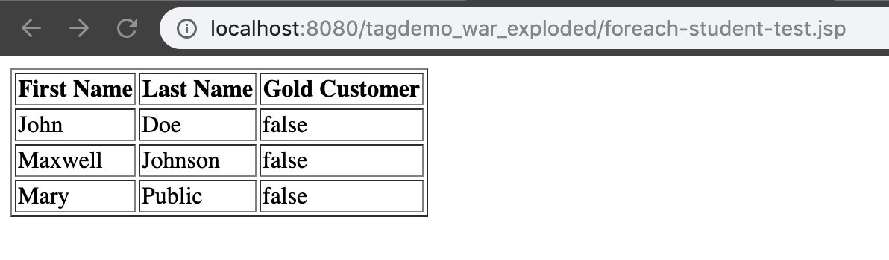

---
### `JSTL Core Tags - Testing Conditionals with the IF tag`

- Conditional Tests
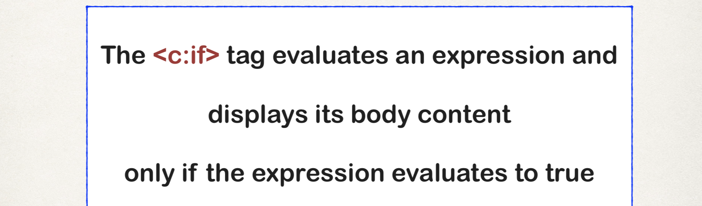

- Display `Special Discount` if student is a gold customer
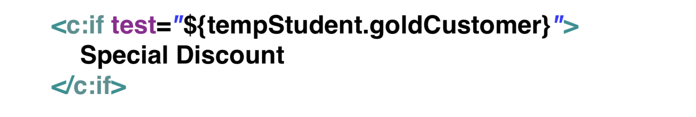
---

- create a `if-student-test.jsp`
```java
<%@ taglib uri="http://java.sun.com/jsp/jstl/core" prefix="c" %>
<%@ page import="java.util.*, com.luv2code.jsp.tagdemo.Student " %>
<%
    //just create some sample data ... normally provided by MVC
    List<Student> data = new ArrayList<>();

    data.add(new Student("John", "Doe", false));
    data.add(new Student("Maxwell", "Johnson", false));
    data.add(new Student("Mary", "Public", true));

    pageContext.setAttribute("myStudents", data);
%>
<html>
<body>
    <table border="1">
        <tr>
            <th>First Name</th>
            <th>Last Name</th>
            <th>Gold Customer</th>
        </tr>
        <c:forEach var="tempStudent" items="${myStudents}">
            <tr>
                <td>${tempStudent.firstName}</td>
                <td>${tempStudent.lastName}</td>
                <td>
                    <c:if test="${tempStudent.goldCustomer}">
                        Special Discount
                    </c:if>
                </td>
            </tr>
        </c:forEach>
    </table>
</body>
</html>
```
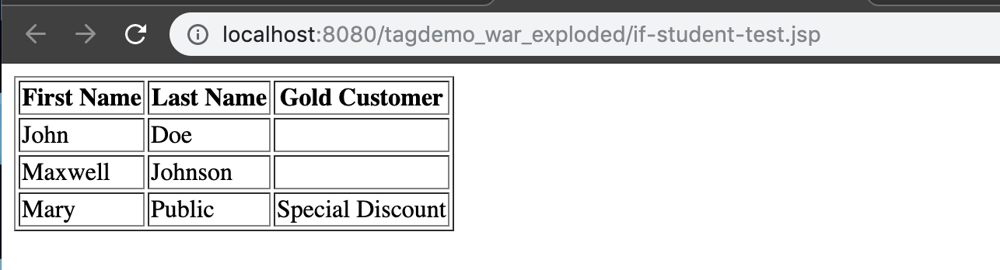


- updating `if-student-test.jsp`
```java
        <c:forEach var="tempStudent" items="${myStudents}">
            <tr>
                <td>${tempStudent.firstName}</td>
                <td>${tempStudent.lastName}</td>
                <td>
                    <c:if test="${tempStudent.goldCustomer}">
                        Special Discount
                    </c:if>
                     <c:if test="${not tempStudent.goldCustomer}">
                                ---
                    </c:if>
                </td>
            </tr>
        </c:forEach>
```
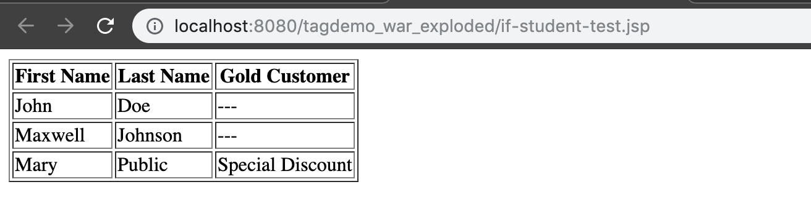


### `JSTL Core Tag - <choose>`


---
- code example
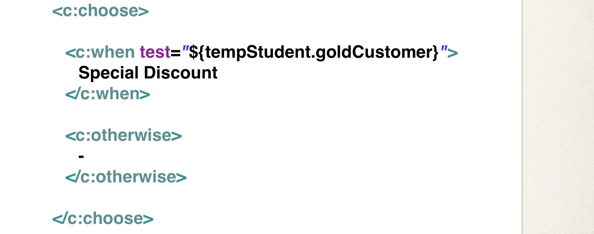
---

- create `choose-student-test.jsp`

```java
<%@ taglib uri="http://java.sun.com/jsp/jstl/core" prefix="c" %>
<%@ page import="java.util.*, com.luv2code.jsp.tagdemo.Student " %>
<%
    //just create some sample data ... normally provided by MVC
    List<Student> data = new ArrayList<>();

    data.add(new Student("John", "Doe", false));
    data.add(new Student("Maxwell", "Johnson", false));
    data.add(new Student("Mary", "Public", true));

    pageContext.setAttribute("myStudents", data);
%>
<html>
<body>
    <table border="1">
        <tr>
            <th>First Name</th>
            <th>Last Name</th>
            <th>Gold Customer</th>
        </tr>
        <c:forEach var="tempStudent" items="${myStudents}">
            <tr>
                <td>${tempStudent.firstName}</td>
                <td>${tempStudent.lastName}</td>
                <td>
                    <c:choose>
                        <c:when test="${tempStudent.goldCustomer}">
                            Special Discount
                        </c:when>
                        <c:otherwise>
                            no soup for you!
                        </c:otherwise>                        
                    </c:choose>
                </td>
            </tr>
        </c:forEach>
    </table>
</body>
</html>
```
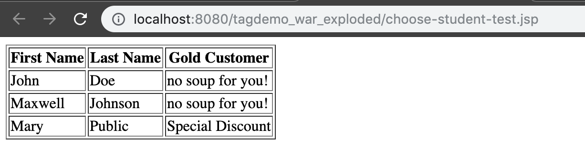


