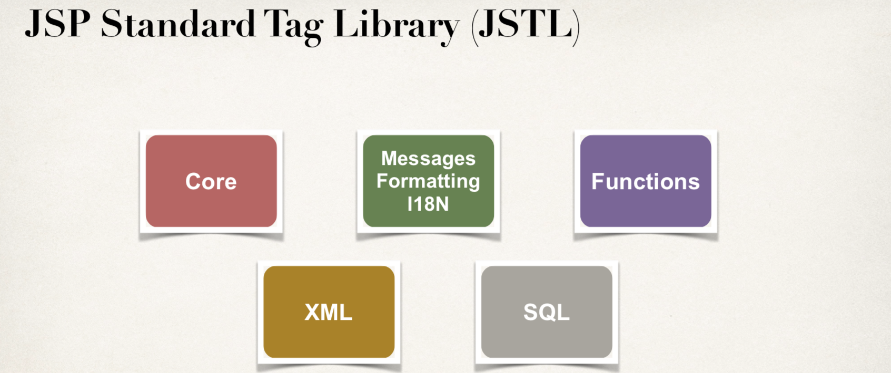
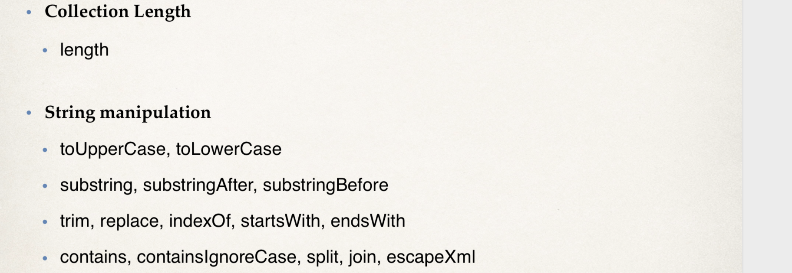
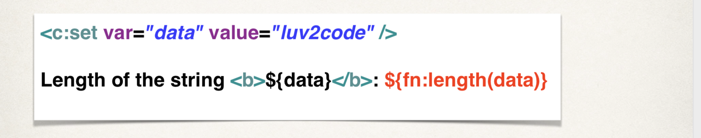
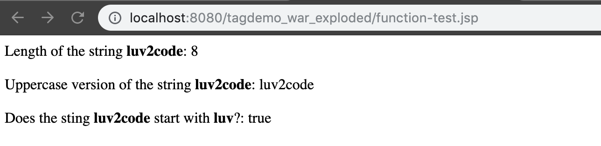
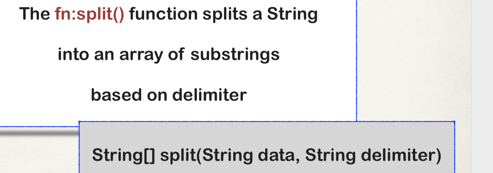
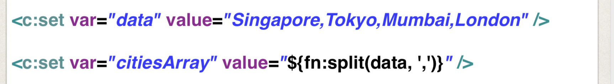
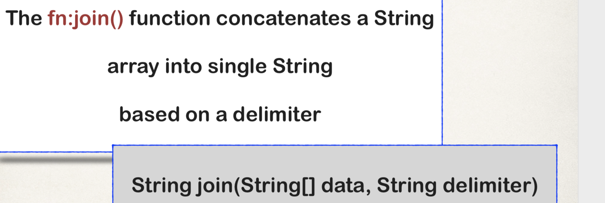
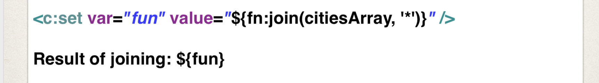
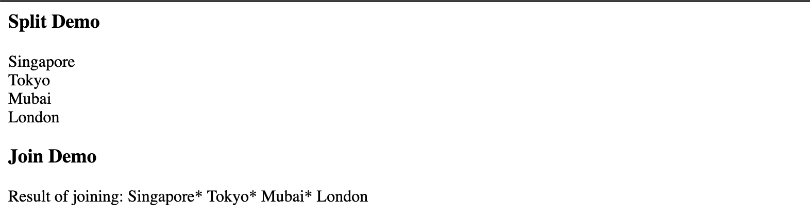

### `JSP Standard Tag Library (JSTL) - Function Tags`


---

-  JSTL Functions - Prefix “fn”

---

-  JSTL Functions Reference
:star: Every page that uses the Function tags must include this reference

` <%@ taglib uri="http://java.sun.com/jsp/jstl/functions" prefix="fn" %>`

- Code example:

---

- create `function-test.jsp`
```java
<%@ taglib uri="http://java.sun.com/jsp/jstl/core" prefix="c" %>

<%@ taglib uri="http://java.sun.com/jsp/jstl/functions" prefix="fn" %>
<html>
<body>
<c:set var="data" value="luv2code" />
Length of the string <b>${data}</b>: ${fn:length(data)}

<br><br>
Uppercase version of the string <b>${data}</b>: ${fn:toLowerCase(data)}

<br><br>
Does the sting <b>${data}</b> start with <b>luv</b>?: ${fn:startsWith(data, "luv")}
</body>
</html>

```



### `JSTL Function Tags - Split and Join`

- Split function

---

- code example

---

- Join function

---

- code example

---

- create `split-join-test.jsp`
```java
<%@ taglib uri="http://java.sun.com/jsp/jstl/core" prefix="c" %>

<%@ taglib uri="http://java.sun.com/jsp/jstl/functions" prefix="fn" %>
<html>
<body>

<c:set var="data" value="Singapore, Tokyo, Mubai, London"/>
<h3>Split Demo</h3>

<c:set var="citiesArray" value="${fn:split(data, ',')}"/>

<c:forEach var="tempCity" items="${citiesArray}"> 
    ${tempCity} <br>
</c:forEach>

<h3>Join Demo</h3>
<c:set var="fun" value="${fn:join(citiesArray,'*')}"/> 
Result of joining: ${fun}
</body>
</html>
```



