### `What are Servlets?`

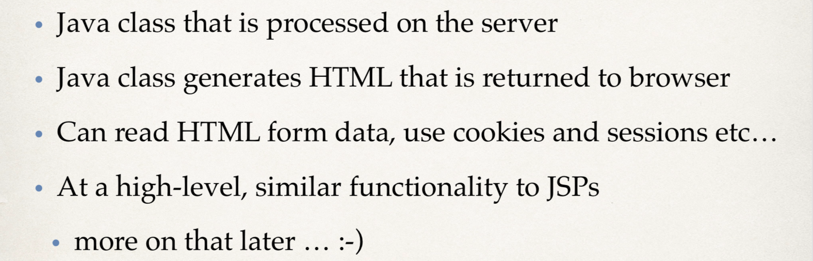
---

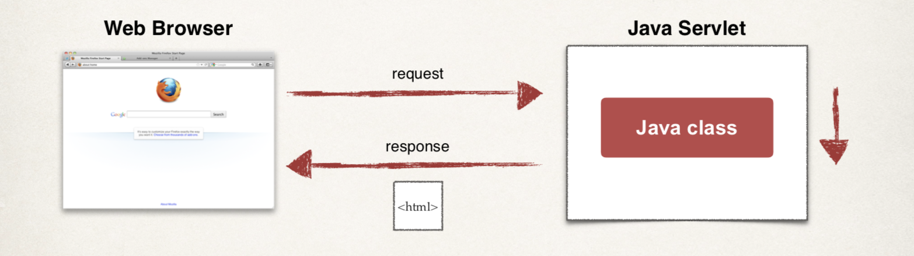
---
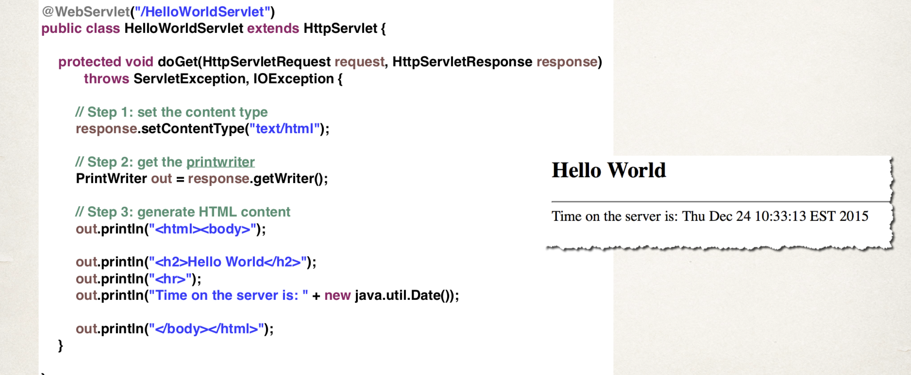
---
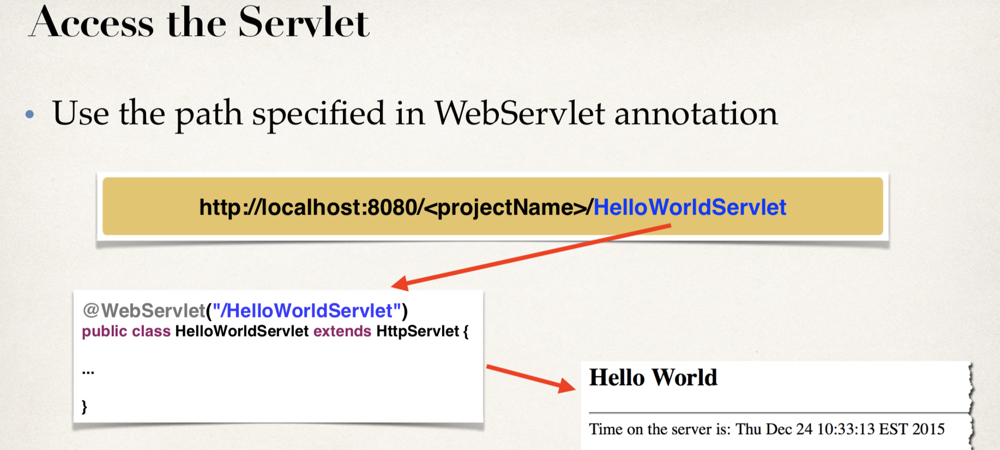
---


- create a new Web project `servletdemo`

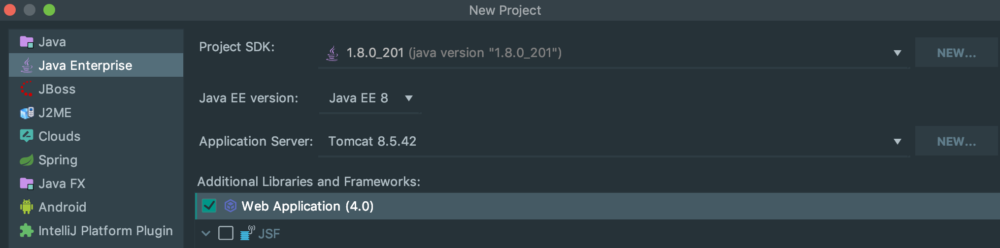
---

- `src` -> `New` -> `create new servlet`
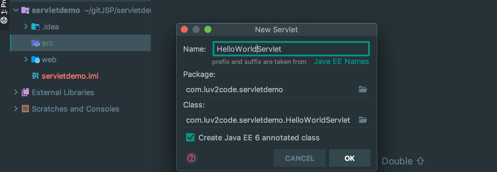
---

- Servlet Configuration on `web.xml`
```xml
<?xml version="1.0" encoding="UTF-8"?>
<web-app xmlns="http://xmlns.jcp.org/xml/ns/javaee"
         xmlns:xsi="http://www.w3.org/2001/XMLSchema-instance"
         xsi:schemaLocation="http://xmlns.jcp.org/xml/ns/javaee http://xmlns.jcp.org/xml/ns/javaee/web-app_4_0.xsd"
         version="4.0">
    
    <servlet>
        <servlet-name>HelloWorldServlet</servlet-name>
        <servlet-class>com.luv2code.servletdemo.HelloWorldServlet</servlet-class>
    </servlet>
    
    <servlet-mapping>
        <servlet-name>HelloWorldServlet</servlet-name>
        <url-pattern>/HelloWorldServlet</url-pattern>
    </servlet-mapping>
</web-app>
```
- run the server
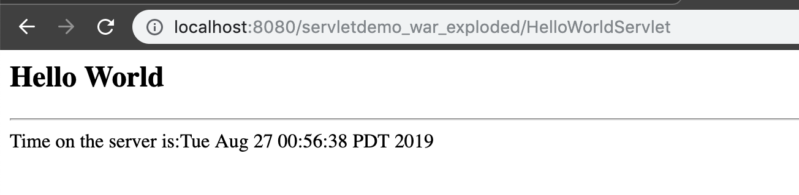
---

- The 2nd way for Servlet Configuration in `HelloWorldServlet.java`
```java
@WebServlet(name = "HelloWorldServlet", urlPatterns = {"/hello"})
public class HelloWorldServlet extends HttpServlet {
```
- input `http://localhost:8080/servletdemo_war_exploded/hello`
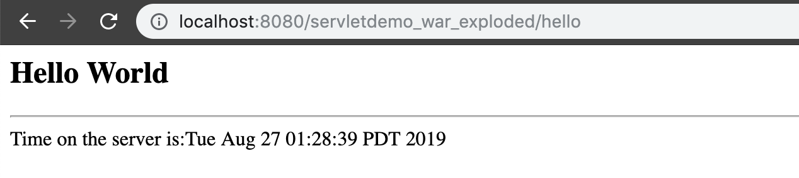
- we also get the same result
---


### `Comparing Servlets and JSP - What's the difference`

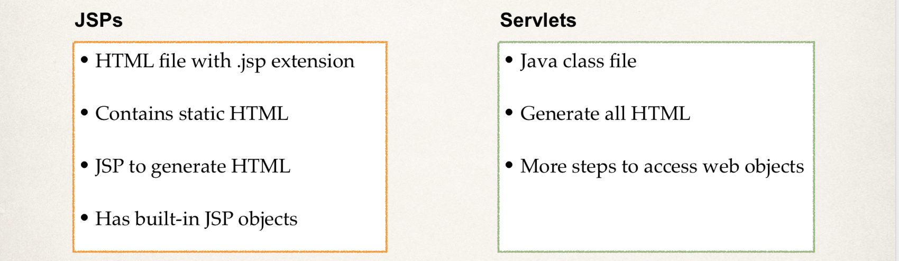
---

- Which One?
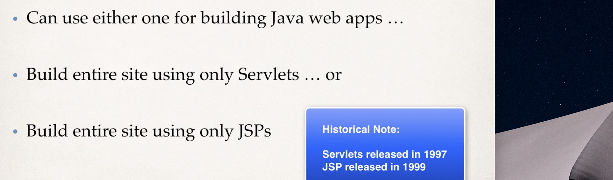
---
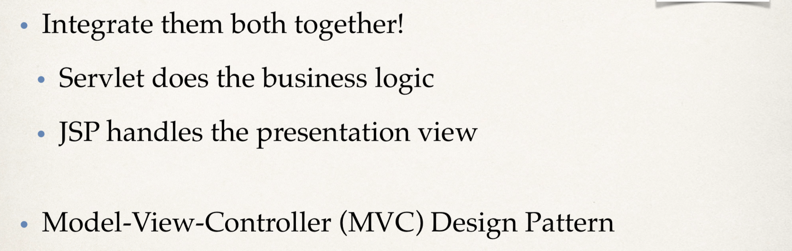
---

### `Reading HTML Form Data with Servlets`

- HTTP Request/ Response
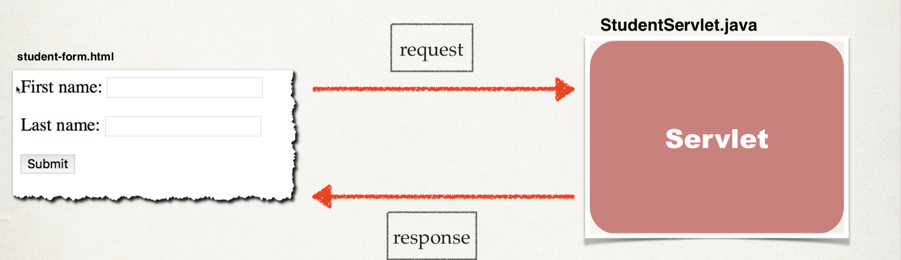
---

:star: Step1: Building HTML Form
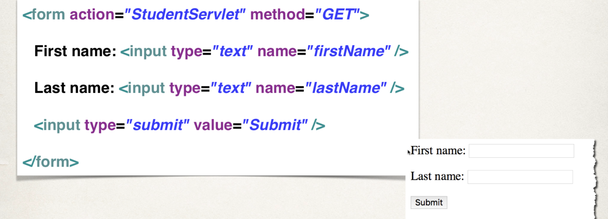
---

- Form `GET` method calls Servlet `doGet()` method
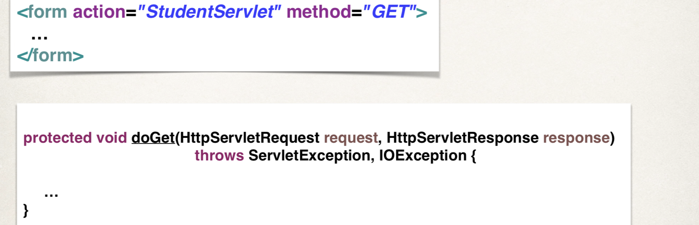
---

:star: Step2: Reading Form Data with Servlet

---
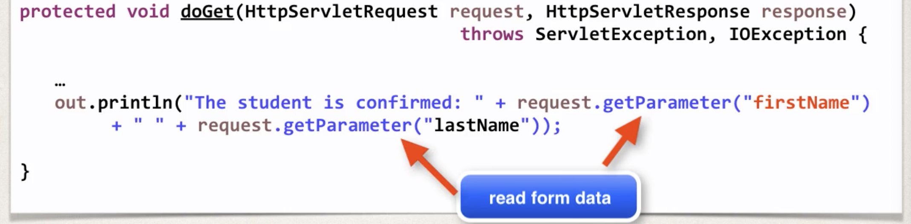
---

### `Reading HTML Form Data with Servlets` code example:

- create `student.form.html` in web
```html
<!DOCTYPE html>
<html lang="en">
<body>
<form action="StudentServlet" method="GET">
    First name: <input type="text" name="firstName"/>
    <br><br>
    Last name: <input type="text" name="lastName"/>
    <br><br>
    <input type="submit" value="Submit"/>
</form>
</body>
</html>
```
- create `StudentServlet` in package `com.luv2code.servletdemo`
```java

@WebServlet(name = "StudentServlet")
public class StudentServlet extends HttpServlet {
    protected void doPost(HttpServletRequest request, HttpServletResponse response) throws ServletException, IOException {

    }

    protected void doGet(HttpServletRequest request, HttpServletResponse response) throws ServletException, IOException {
        //step1: set content type
        response.setContentType("text/html");
        
        //step2: get the printWriter
        PrintWriter out = response.getWriter();
        
        //step3: generate the HTML content
        out.println("<html><body>");
        out.println("The student is confirmed: "
                + request.getParameter("firstName") + " "
                + request.getParameter("lastName"));
        out.println("</body></html>");
    }
}
```
:star: Note: we still need configure the environment
- altering the `web.xml`
```xml
<?xml version="1.0" encoding="UTF-8"?>
<web-app xmlns="http://xmlns.jcp.org/xml/ns/javaee"
         xmlns:xsi="http://www.w3.org/2001/XMLSchema-instance"
         xsi:schemaLocation="http://xmlns.jcp.org/xml/ns/javaee http://xmlns.jcp.org/xml/ns/javaee/web-app_4_0.xsd"
         version="4.0"> 
<!--    <servlet>-->
<!--        <servlet-name>HelloWorldServlet</servlet-name>-->
<!--        <servlet-class>com.luv2code.servletdemo.HelloWorldServlet</servlet-class>-->
<!--    </servlet>-->
<!--    -->
<!--    <servlet-mapping>-->
<!--        <servlet-name>HelloWorldServlet</servlet-name>-->
<!--        <url-pattern>/HelloWorldServlet</url-pattern>-->
<!--    </servlet-mapping>-->
        <servlet>
            <servlet-name>StudentServlet</servlet-name>
            <servlet-class>com.luv2code.servletdemo.StudentServlet</servlet-class>
        </servlet>
        <servlet-mapping>
            <servlet-name>StudentServlet</servlet-name>
            <url-pattern>/StudentServlet</url-pattern>
        </servlet-mapping>
</web-app>
```

- run the .html on the Tomcat server
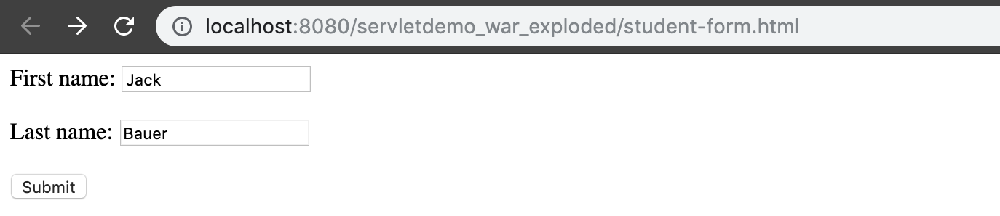
---
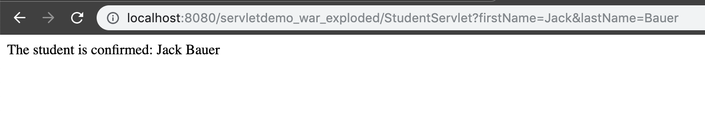


### `HTML Forms - Difference between GET and POST`

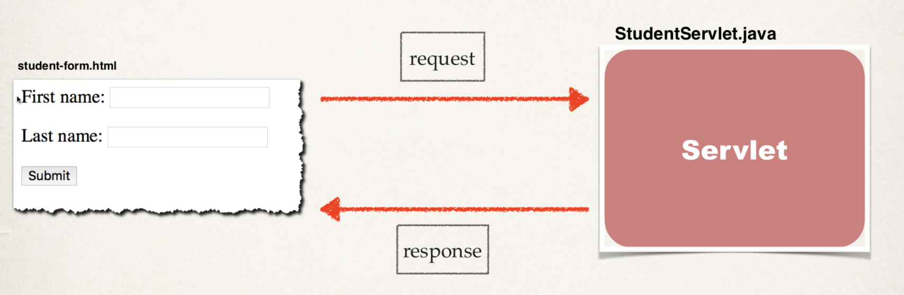
---

- Form GET method calls Servlet doGet() method
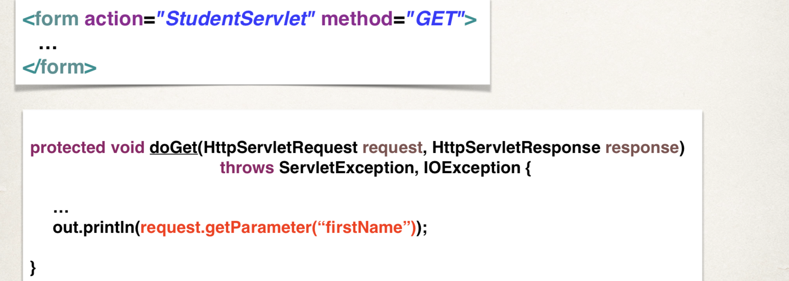
---
- Form POST method calls Servlet doPost() method
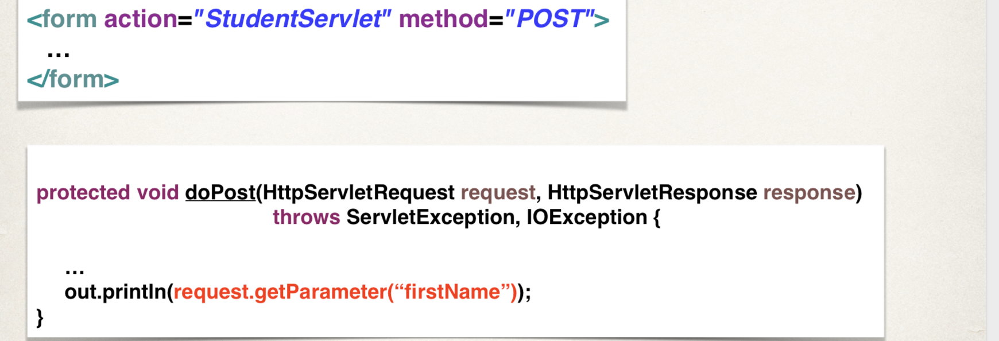
---
- Sending Data with GET method
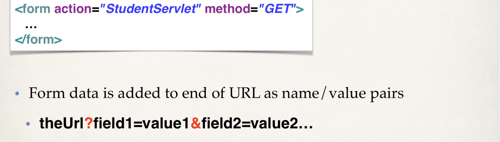
---
-  Sending Data with POST method
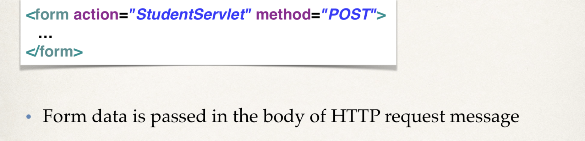
---

- which one?

---
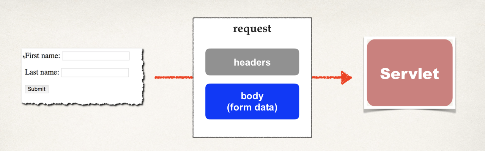

---

### `Reading Servlet Parameters`

- Servlet Configuration Parameters
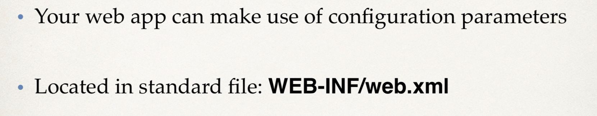
---

-  Deployment Descriptor: web.xml
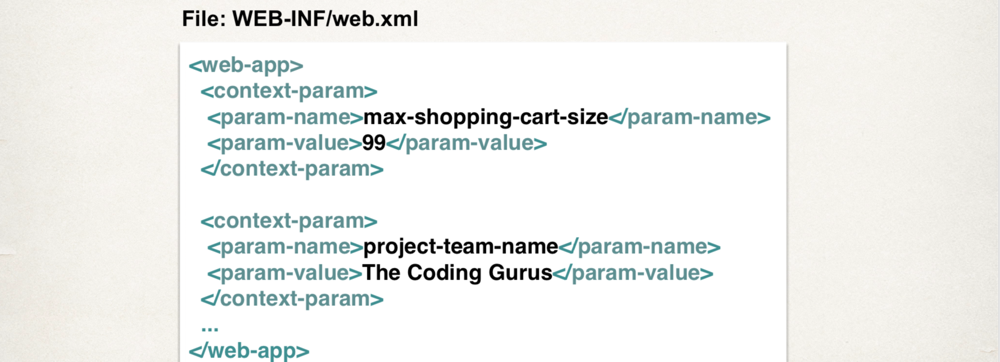
---

-  Reading Configuration Parameters
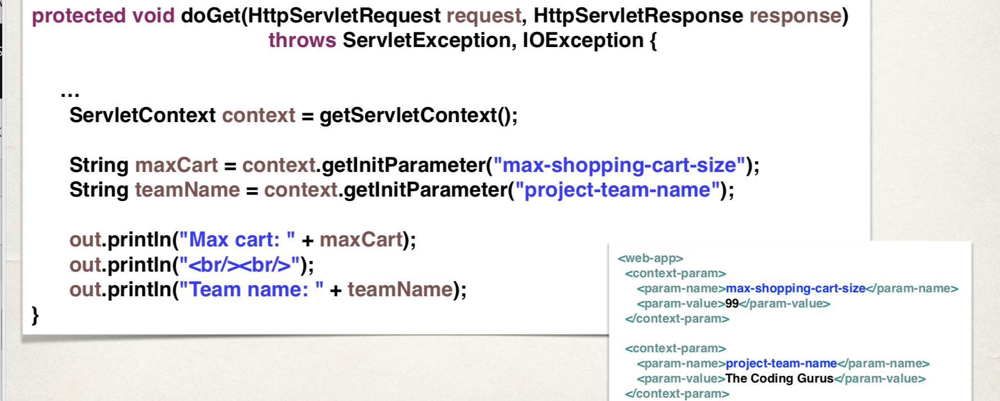
---

- code example
- first, configure our `web.xml`
```xml
<?xml version="1.0" encoding="UTF-8"?>
<web-app xmlns="http://xmlns.jcp.org/xml/ns/javaee"
         xmlns:xsi="http://www.w3.org/2001/XMLSchema-instance"
         xsi:schemaLocation="http://xmlns.jcp.org/xml/ns/javaee http://xmlns.jcp.org/xml/ns/javaee/web-app_4_0.xsd"
         version="4.0"> 
    <context-param>
        <param-name>max-shopping-cart-size</param-name>
        <param-value>99</param-value>
    </context-param>
    
     <context-param>
        <param-name>project-team-name</param-name>
        <param-value>The Coding Gurus</param-value>
    </context-param>  
</web-app>
```
---
- create `TestParamServlet` in package `com.luv2code.servletdemo`
```java
package com.luv2code.servletdemo;

@WebServlet(name = "TestParamServlet", urlPatterns = {"/testParam"})
public class TestParamServlet extends HttpServlet {
    protected void doPost(HttpServletRequest request, HttpServletResponse response) throws ServletException, IOException {

    }

    protected void doGet(HttpServletRequest request, HttpServletResponse response) throws ServletException, IOException {
        //step 1: set content type
        response.setContentType("text/html");
        
        //step 2: get printWriter
        PrintWriter out = response.getWriter();
        
        //step 3: read configuration params
        ServletContext context = getServletContext();
        String maxCartSize = context.getInitParameter("max-shopping-cart-size");
        String teamName = context.getInitParameter("project-team-name");
        
        //step 4: generate HTML content
        out.println("<html><body>");
        
        out.println("Max cart: " + maxCartSize);
        out.println("<br><br>");
        out.println("Team name: " + teamName);

        out.println("</body></html>");
    }
}
```
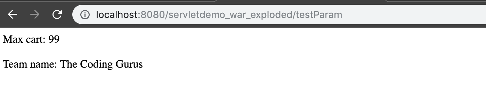
---
