### `MVC with Servlets and JSP`

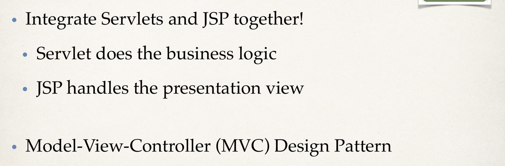
---

-  Model-View-Controller (MVC)
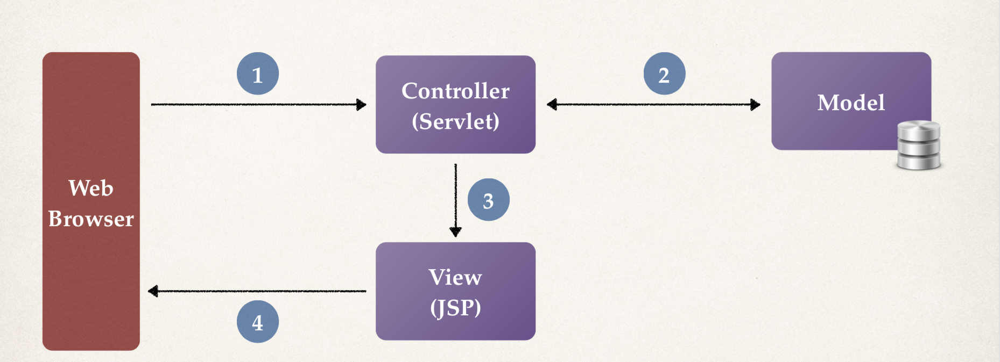
---

-  Benefits of MVC
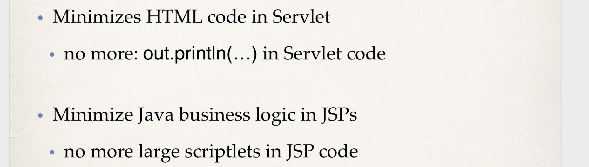
---

-  Servlet Can Call a JSP
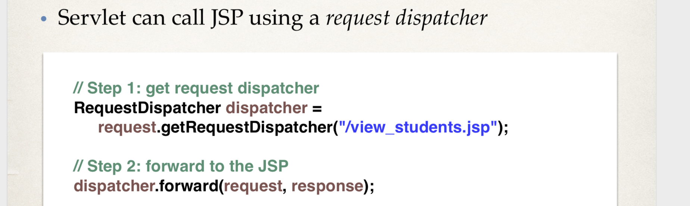
---

- Sending Data to JSP
- Servlet can add data to request object
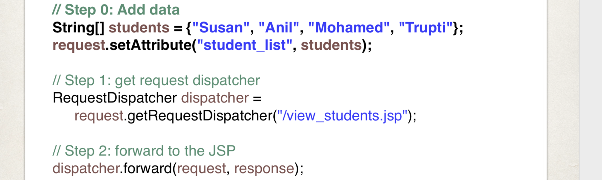
---

-  JSP page to view data
- JSP use JSTL to access data
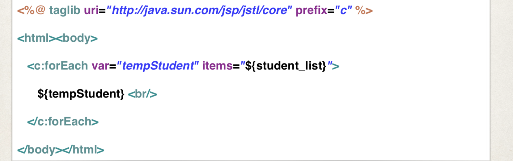
---

- code example:

:star: `command + ;`
- `project structure` -> `Libraries` -> `+` 
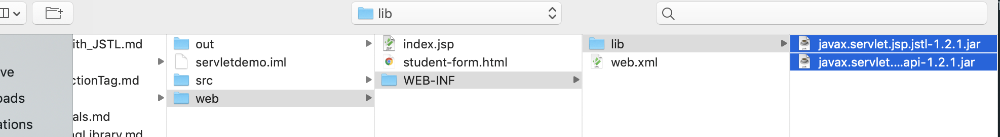
---
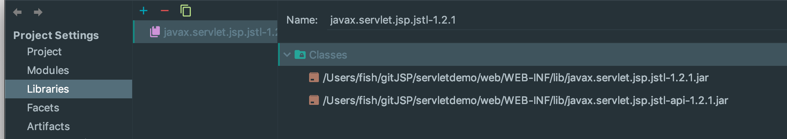
---

- step 1: Create `Controller Servlet`
- create `MvcDemoServlet` in package `com.luv2code.servletdemo`


```java
package com.luv2code.servletdemo;

@WebServlet(name = "MvcDemoServlet")
public class MvcDemoServlet extends HttpServlet {
    protected void doPost(HttpServletRequest request, HttpServletResponse response) throws ServletException, IOException {

    }

    protected void doGet(HttpServletRequest request, HttpServletResponse response) throws ServletException, IOException {

        //step 0: Add data
        String[] students = {"Susan", "Anil", "Mohamed", "Trupti"};
        request.setAttribute("student_list", students);
        
        //step 1: get request dispatcher
        RequestDispatcher dispatcher = request.getRequestDispatcher("/view_students.jsp");
        
        //step 2: forward the request to JSP
        dispatcher.forward(request, response);
    }
}
```

---

- step2: Create View JSP `view_student.jsp` in web


```java
<%@ taglib uri="http://java.sun.com/jsp/jstl/core" prefix="c" %>
<html>
<body>
<c:forEach var="tempStudent" items="${student_list}">
    ${tempStudent}<br>
</c:forEach>
</body>
</html>
```


:star: configure the web.xml


```xml
    <servlet>
        <servlet-name>MvcDemoServlet</servlet-name>
        <servlet-class>com.luv2code.servletdemo.MvcDemoServlet</servlet-class>
    </servlet>
    <servlet-mapping>
        <servlet-name>MvcDemoServlet</servlet-name>
        <url-pattern>/MvcDemoServlet</url-pattern>
    </servlet-mapping>
</web-app>
```


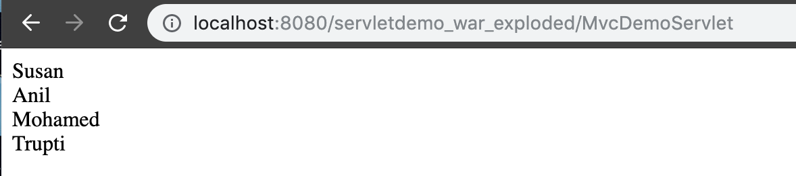

### `More detail in MVC with Servlet and JSP`
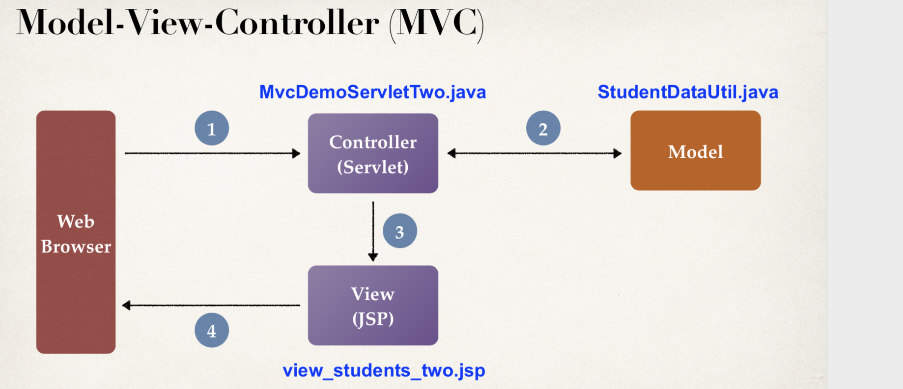
---

- HTML Table
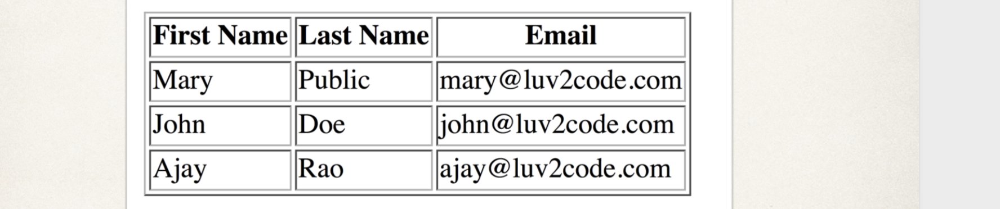
---

- To Do List
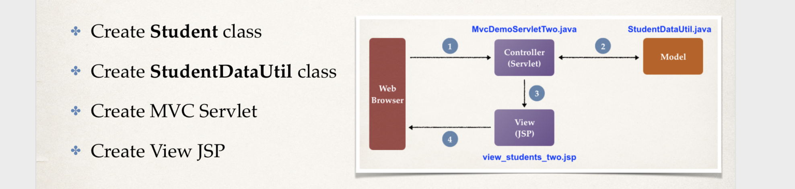
---

### `create Student class`
- create a new package `com.luv2code.servletdemo.mvctwo` in src folder
- create a class `Student`


```java
package com.luv2code.servletdemo.mvctwo;

public class Student {
    
    private String firstName;
    private String lastName;
    private String email;

    public Student(String firstName, String lastName, String email) {
        this.firstName = firstName;
        this.lastName = lastName;
        this.email = email;
    }

    public String getFirstName() {
        return firstName;
    }

    public void setFirstName(String firstName) {
        this.firstName = firstName;
    }

    public String getLastName() {
        return lastName;
    }

    public void setLastName(String lastName) {
        this.lastName = lastName;
    }

    public String getEmail() {
        return email;
    }

    public void setEmail(String email) {
        this.email = email;
    }
}
```


### `create StudentDataUtil`


```java
package com.luv2code.servletdemo.mvctwo;

import java.util.ArrayList;
import java.util.List;

public class StudentDataUtil {
    public static List<Student> getStudents(){
        
        //create an empty list
        List<Student> students = new ArrayList<>();
        
        //add sample data
        students.add(new Student("Mary", "Public", "Mary@luv2code.com"));
        students.add(new Student("John", "Doe", "john@luv2code.com"));
        students.add(new Student("Ajay", "Rao", "ajay@luv2code.com"));
        
        //return the list
        return students;
    }
}
```


### `Create MVC Servlet`


```java
package com.luv2code.servletdemo.mvctwo;

@WebServlet(name = "MvcDemoServletTwo")
public class MvcDemoServletTwo extends HttpServlet {
    protected void doPost(HttpServletRequest request, HttpServletResponse response) throws ServletException, IOException {

    }

    protected void doGet(HttpServletRequest request, HttpServletResponse response) throws ServletException, IOException {
        //step 1: get the student data from helper class (model)
        List<Student> students = StudentDataUtil.getStudents();
        
        //step 2: add student to request object
        request.setAttribute("student_list", students);
        
        //step 3: get request dispatcher
        RequestDispatcher dispatcher = request.getRequestDispatcher("/view_students_two.jsp");
        
        //step 4: now forward to JSP
        dispatcher.forward(request, response);
        
    }
}
```

### `Create JSP View with HTML Table`


- create `view_students_two.jsp` in web folder


```java
<%@ taglib uri="http://java.sun.com/jsp/jstl/core" prefix="c" %>
<html>
<body>
<h2>Student Table Demo</h2>
<hr>
<br>
    <table border="1">
        <tr>
            <th>First Name</th>
            <th>Last Name</th>
            <th>Email</th>
        </tr>
        
        <c:forEach var="tempStudent" items="${student_list}">
            <tr>
                <td>${tempStudent.firstName}</td>   
                <td>${tempStudent.lastName}</td>
                <td>${tempStudent.email}</td>
            </tr>
        </c:forEach>        
    </table>
</body>
</html>
```


:star: Don't forget to configure the `web.xml`


```xml
    <servlet>
        <servlet-name>MvcDemoServletTwo</servlet-name>
        <servlet-class>com.luv2code.servletdemo.mvctwo.MvcDemoServletTwo</servlet-class>
    </servlet>
    <servlet-mapping>
        <servlet-name>MvcDemoServletTwo</servlet-name>
        <url-pattern>/MvcDemoServletTwo</url-pattern>
    </servlet-mapping>
    
</web-app>
```


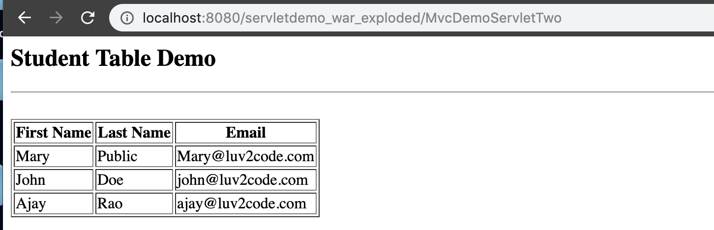
---
- Right now we have runned the Servlet directly, I like to set up a link to the Servlet from an HTML page. 
- I'm going to create a very simple HTML page `index.html`
- I want to do is just have a webpage link to that'll point to my Servlet.


```html
<!DOCTYPE html>
<html lang="en">
<head>
    <meta charset="UTF-8">
    <title>Title</title>
</head>
<body>
<a href="MvcDemoServletTwo">View Students with MVC Two</a>
</body>
</html>
```


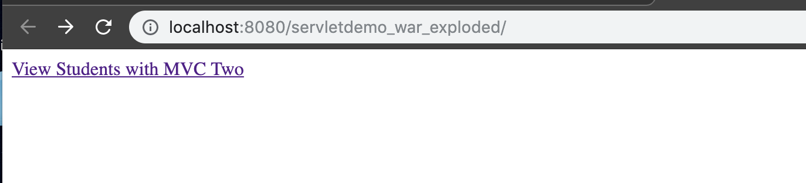
---
- now we click the `Link`, it will jump to our Servlet
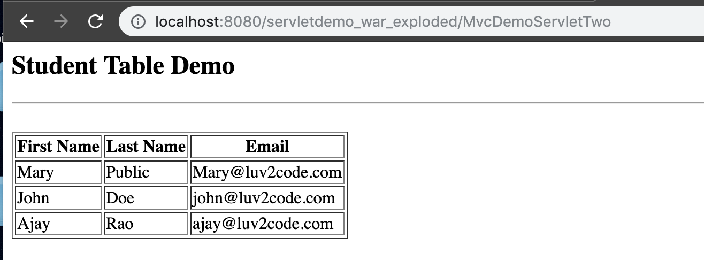
