### `Class Project`

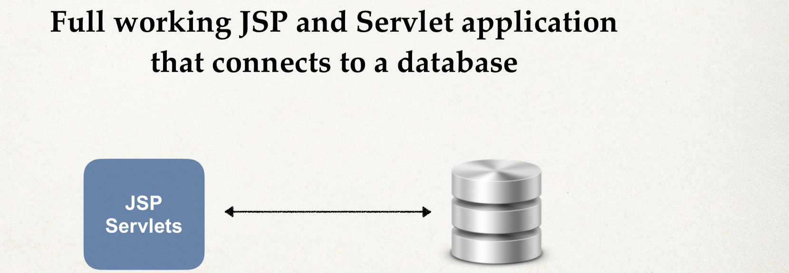
---

- Road Map
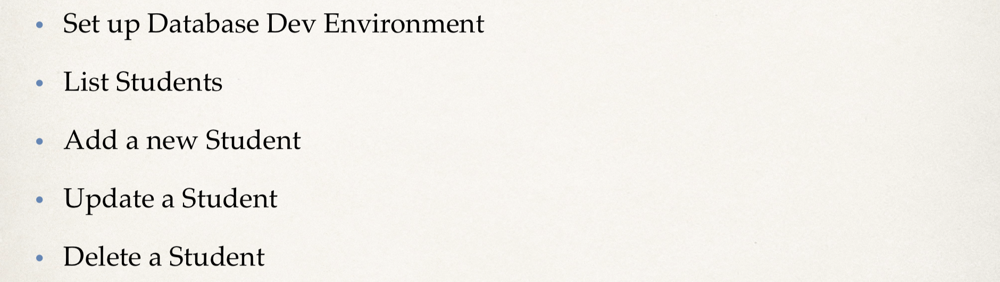
---

### `Installation of MySQL`

---
### `Setup Database Table`

- Two Database Scripts
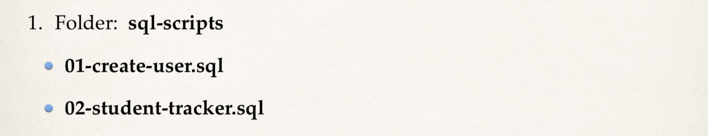
---
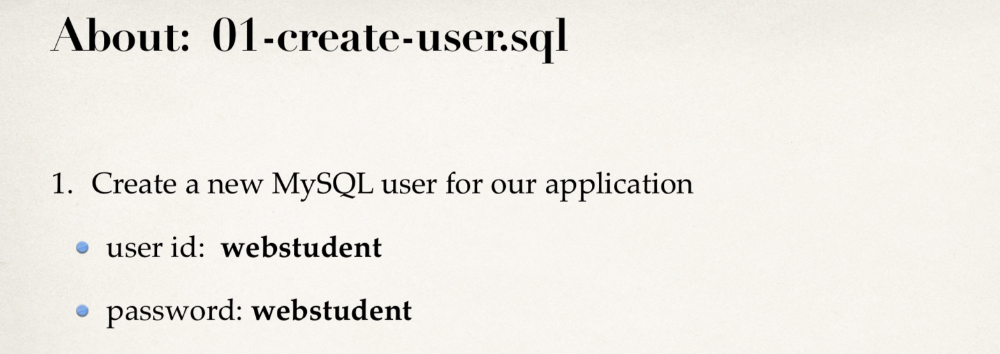
---
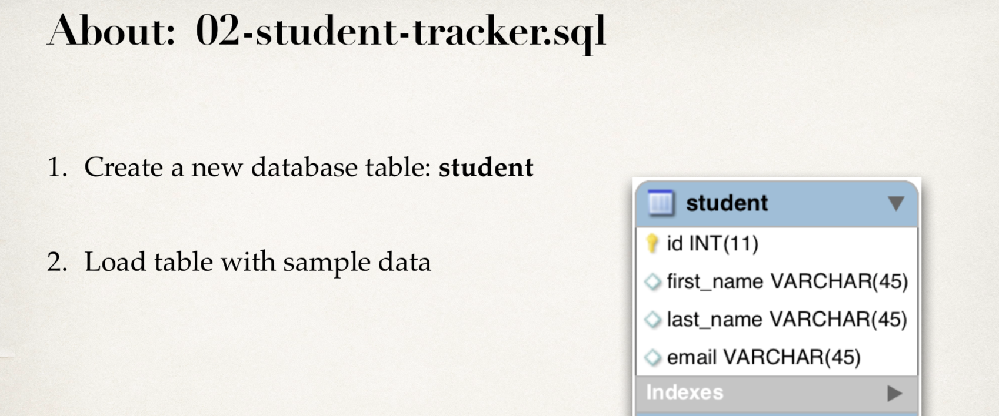
---

- open MySQLworkbench
-> `File` -> `Open SQL script` -> `create-user.sql`
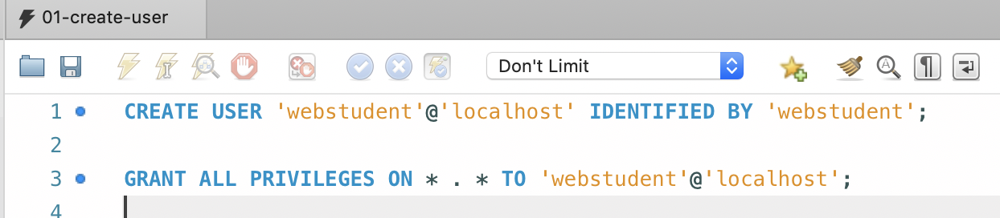
---
- click yellow `Flash` icon
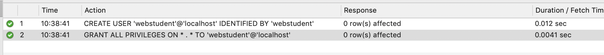
---

- now open another `student-tracker.sql`
- click yellow `Flash` icon
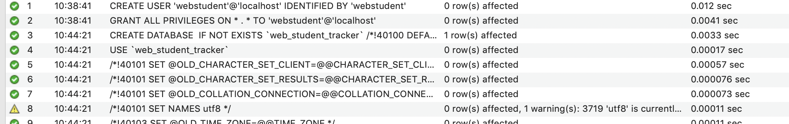
- that means this script executed successfully
---
- `Right-Click` -> `Refresh All`
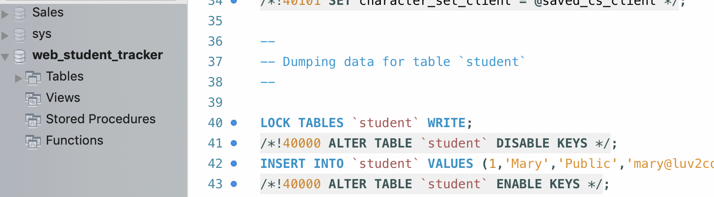
---

- click `Tables` ->`student`->`Columns`
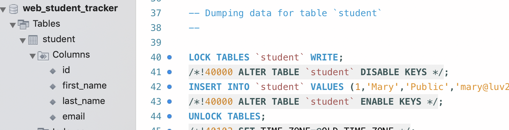
- we can see the four fileds
- select ROW
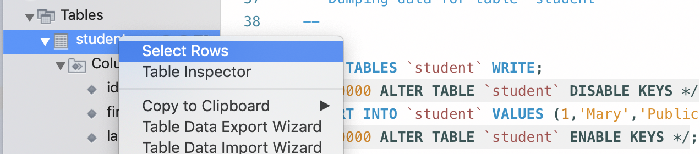
---
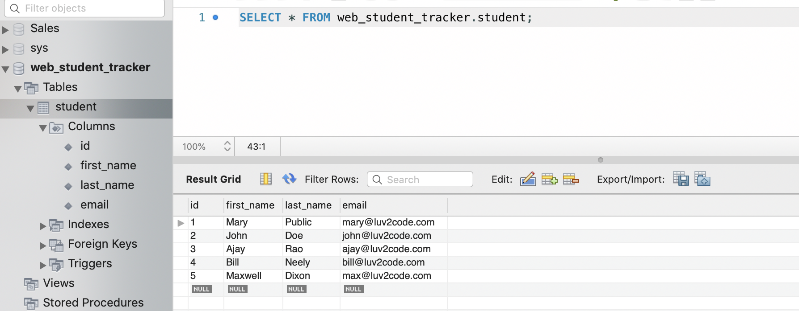
---


### `Setup Tomact Database Connection Pool`
- Database Connections in web apps
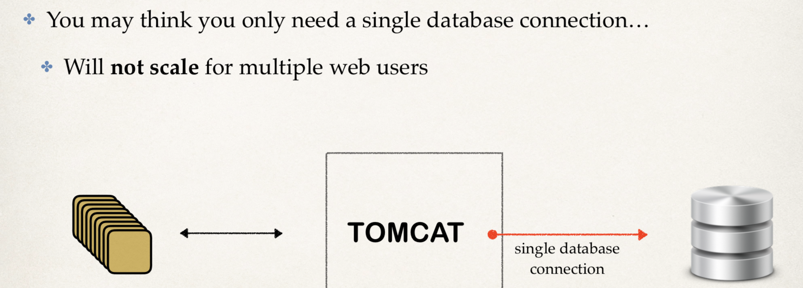
---
- Database Connections Pools
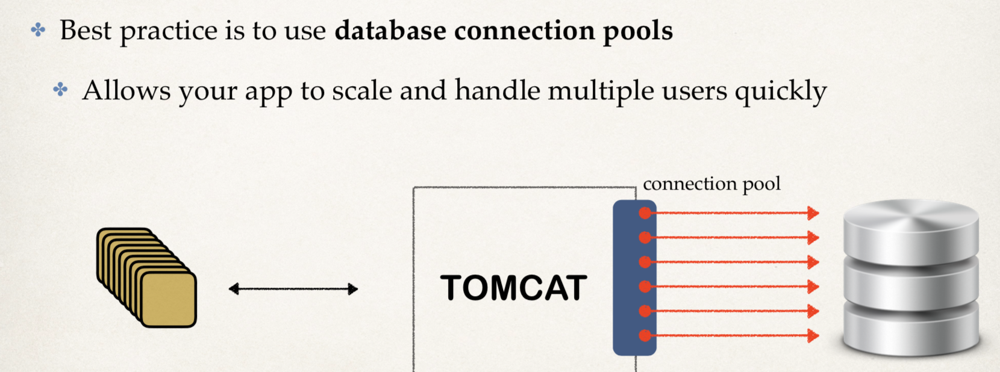
---
- Setting up a Tomcat Database Connection Pool
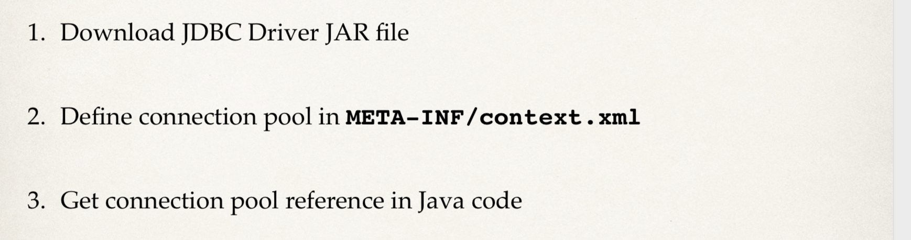
---

1.  Step 1: Download JDBC Driver JAR file
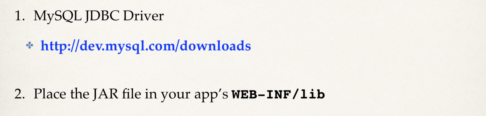
---

2.  Step 2: Define connection pool: context.xml
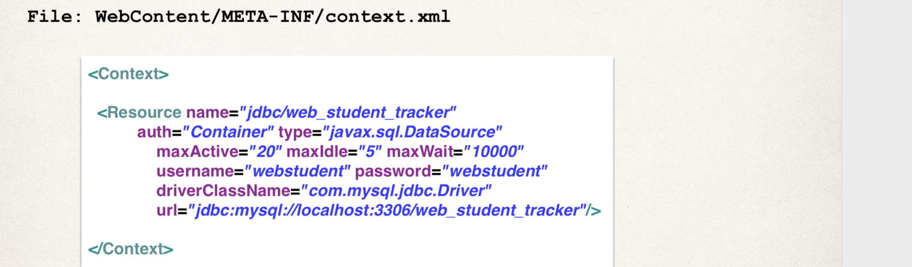
---

3.  Step 3: Get connection pool in Java code
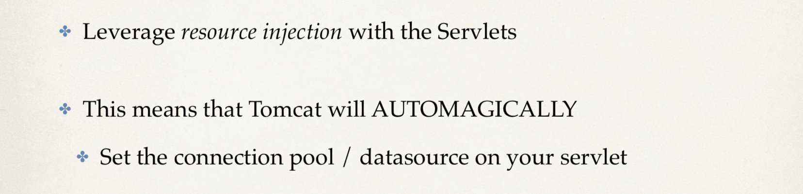
---


### `Test Tomcat Connection Pooling`

- create a new web project
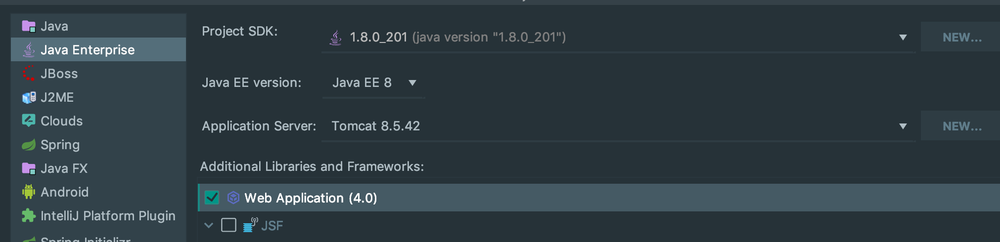
- named `web-student-tracker`
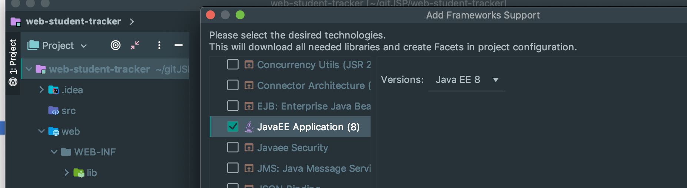
---

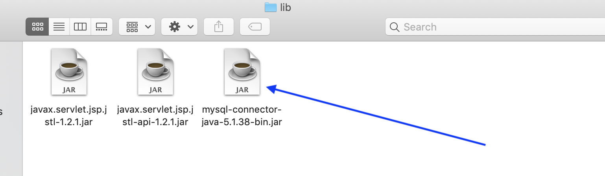
---
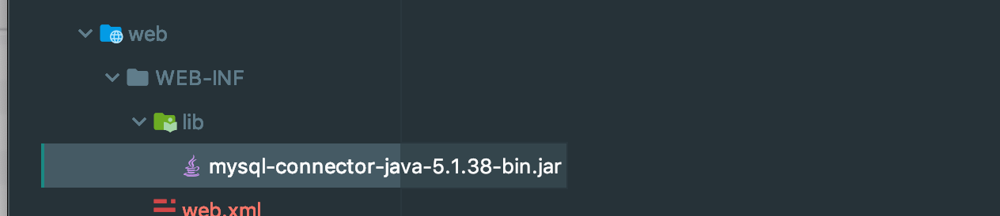
---
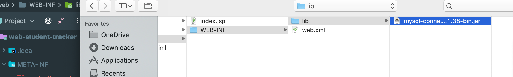
- import mysql-connector-java libray
---
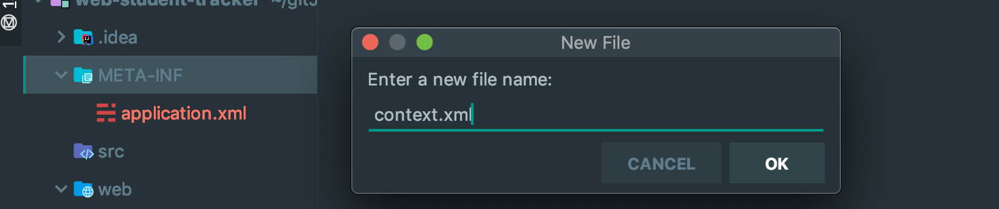
- create `context.xml`
```xml
<Context>
    <Resource name="jdbc/web_student_tracker"
              auth="Container" type="javax.sql.DataSource"
              maxActive="20" maxIdle="5" maxWait="10000"
              username="webstudent" password="webstudent"
              driverClassName="com.mysql.jdbc.Driver"
              url="jdbc:mysql://localhost:3306/web_student_tracker?useSSL=false"/>
</Context>
```
- create a package `com.luv2code.web.jdbc` in src folder
---
- create a Test Servlet with JDBC, named `TestServlet` in package `com.luv2code.web.jdbc`
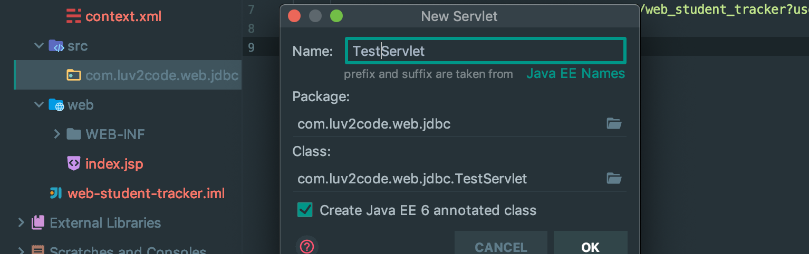
---
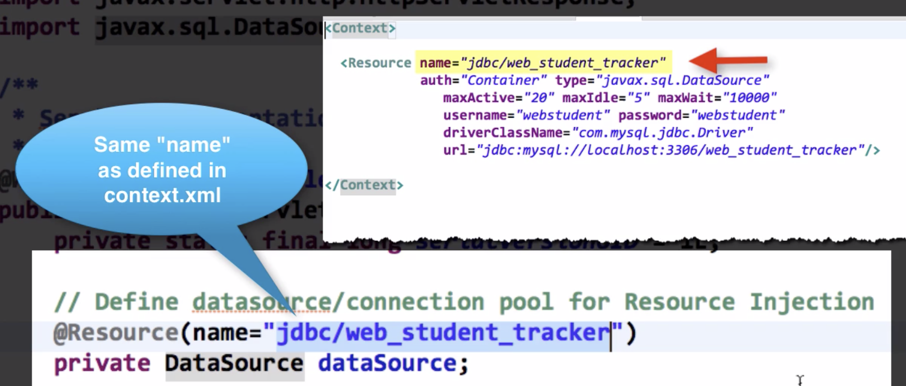
---

:star: Unfortunately, I don't know why this app on intellij can not connect to database, I decide to change to Eclipse

- create a new Java EE web project
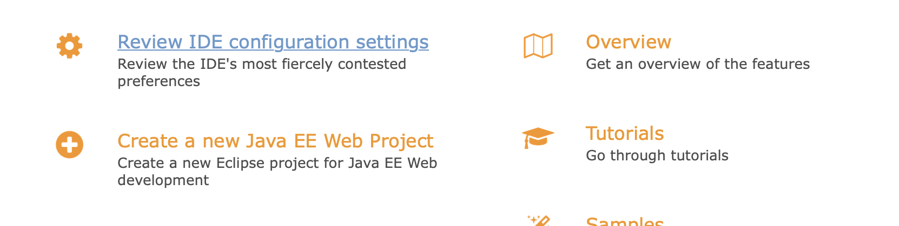
---
- runtime choose Tomcat
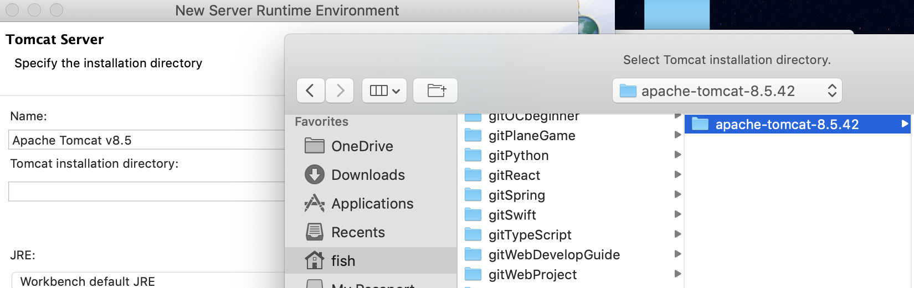
---
- import the required library `mysql-connector-java-8.0.17.jar`
- configure the required `context.xml`
```xml
<Context>
  <Resource name="jdbc/web_student_tracker" 
  			auth="Container" type="javax.sql.DataSource"
               maxActive="20" maxIdle="5" maxWait="10000"
               username="webstudent" password="webstudent" 
               driverClassName="com.mysql.jdbc.Driver"
               url="jdbc:mysql://localhost:3306/web_student_tracker?useSSL=false&amp;serverTimezone=UTC"/>
</Context>
```
---
- `TestServlet.java`
```java
package com.luv2code.web.jdbc;

import java.io.IOException;
import java.io.PrintWriter;
import java.sql.Connection;
import java.sql.ResultSet;
import java.sql.Statement;

import javax.annotation.Resource;
import javax.servlet.ServletException;
import javax.servlet.annotation.WebServlet;
import javax.servlet.http.HttpServlet;
import javax.servlet.http.HttpServletRequest;
import javax.servlet.http.HttpServletResponse;
import javax.sql.DataSource;

/**
 * Servlet implementation class TestServlet
 */
@WebServlet("/TestServlet")
public class TestServlet extends HttpServlet {
	private static final long serialVersionUID = 1L;

	// Define datasource/connection pool for Resource Injection
	@Resource(name="jdbc/web_student_tracker")
	private DataSource dataSource;
	
	
	/**
	 * @see HttpServlet#doGet(HttpServletRequest request, HttpServletResponse response)
	 */
	protected void doGet(HttpServletRequest request, HttpServletResponse response) throws ServletException, IOException {

		// Step 1:  Set up the printwriter
		PrintWriter out = response.getWriter();
		response.setContentType("text/plain");
		
		// Step 2:  Get a connection to the database
		Connection myConn = null;
		Statement myStmt = null;
		ResultSet myRs = null;
		
		try {
			myConn = dataSource.getConnection();
			
			// Step 3:  Create a SQL statements
			String sql = "select * from student";
			myStmt = myConn.createStatement();
			
			// Step 4:  Execute SQL query
			myRs = myStmt.executeQuery(sql);
			
			// Step 5:  Process the result set
			while (myRs.next()) {
				String email = myRs.getString("email");
				out.println(email);
			}
		}
		catch (Exception exc) {
			exc.printStackTrace();
		}
	}

}

```
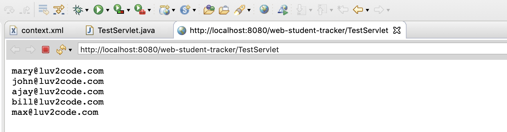
- this result is waht I expect
---

- Sample App Features - Refresher
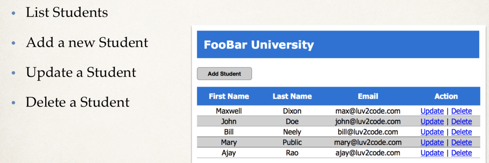
---
- Big Picture - MVC
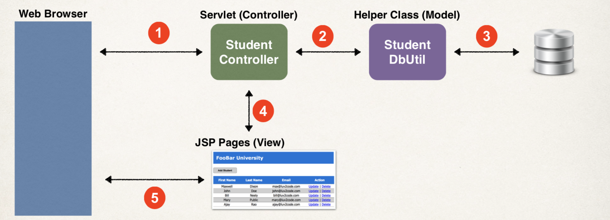
---

-  Student DB Utility
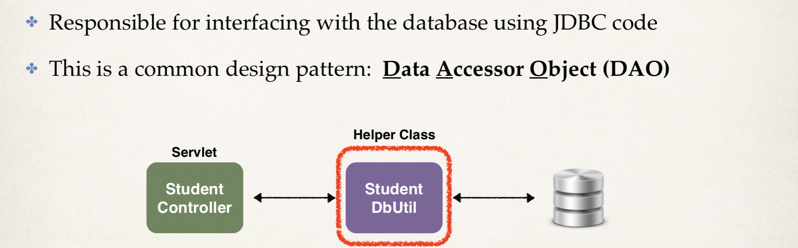
---


### `Build A complete Database Web App with JDBC Part 2`

- List Students
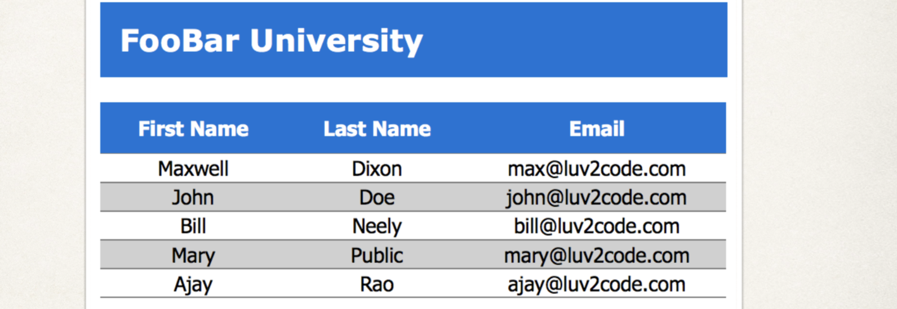
---
- To Do List
1. Create Student.java
- in package `com.luv2code.web.jdbc`, create a Student.java
```java
package com.luv2code.web.jdbc;
public class Student {
	private int id;
	private String firstName;
	private String lastName;
	private String email;

	public Student(String firstName, String lastName, String email) {
		super();
		this.firstName = firstName;
		this.lastName = lastName;
		this.email = email;
	}

	public Student(int id, String firstName, String lastName, String email) {
		super();
		this.id = id;
		this.firstName = firstName;
		this.lastName = lastName;
		this.email = email;
	}

	public int getId() {
		return id;
	}

	public void setId(int id) {
		this.id = id;
	}

	public String getFirstName() {
		return firstName;
	}

	public void setFirstName(String firstName) {
		this.firstName = firstName;
	}

	public String getLastName() {
		return lastName;
	}

	public void setLastName(String lastName) {
		this.lastName = lastName;
	}

	public String getEmail() {
		return email;
	}

	public void setEmail(String email) {
		this.email = email;
	}

	@Override
	public String toString() {
		return "Student [id=" + id + ", firstName=" + firstName + ", lastName=" + lastName + ", email=" + email + "]";
	}
}
```
---
2. Create StudentDBUtil.java
```java
package com.luv2code.web.jdbc;

import java.sql.Connection;
import java.sql.ResultSet;
import java.sql.Statement;
import java.util.ArrayList;
import java.util.List;

import javax.sql.DataSource;

public class StudentDbUtil {
	private DataSource dataSource;

	public StudentDbUtil(DataSource dataSource) {
		this.dataSource = dataSource;
	}

	public List<Student> getStudents() throws Exception {
		List<Student> students = new ArrayList<>();

		Connection myConn = null;
		Statement myStmt = null;
		ResultSet myRs = null;

		try {
			// get a connection
			myConn = dataSource.getConnection();

			// create sql statement
			String sql = "select * from student order by last_name";

			// execute query
			myStmt = myConn.createStatement();

			// process result set
			while (myRs.next()) {
				// retrieve data from result set row
				int id = myRs.getInt("id");
				String fistName = myRs.getString("fist_name");
				String lastName = myRs.getString("last_name");
				String email = myRs.getString("email");

				// create new student object
				Student tempStudent = new Student(id, fistName, lastName, email);

				// add it to the list of students
				students.add(tempStudent);
			}
			// close JDBC objects

			return students;
			
		} finally {
			close(myConn, myStmt, myRs);
		}

	}

	private void close(Connection myConn, Statement myStmt, ResultSet myRs) {
		try {
			if (myRs != null) {
				myRs.close();
			}
			if (myStmt != null) {
				myStmt.close();
			}
			if (myConn != null) {
				myConn.close();
			}

		} catch (Exception e) {
			e.printStackTrace();
		}
	}
}
```
---
3. Create a new Servlet `StudentControllerServlet.java`
```java
package com.luv2code.web.jdbc;

import java.io.IOException;
import java.util.List;

import javax.annotation.Resource;
import javax.servlet.RequestDispatcher;
import javax.servlet.ServletException;
import javax.servlet.annotation.WebServlet;
import javax.servlet.http.HttpServlet;
import javax.servlet.http.HttpServletRequest;
import javax.servlet.http.HttpServletResponse;
import javax.sql.DataSource;

/**
 * Servlet implementation class StudentControllerServlet
 */
@WebServlet("/StudentControllerServlet")
public class StudentControllerServlet extends HttpServlet {
	private static final long serialVersionUID = 1L;

	private StudentDbUtil studentDbUtil;

	@Resource(name = "jdbc/web_student_tracker")
	private DataSource dataSource;

	@Override
	public void init() throws ServletException {
		super.init();

		// create our student db util ... and pass in the conn pool / datasource
		try {
			studentDbUtil = new StudentDbUtil(dataSource);
		} catch (Exception e) {
			throw new ServletException(e);
		}
	}

	/**
	 * @see HttpServlet#doGet(HttpServletRequest request, HttpServletResponse
	 *      response)
	 */
	protected void doGet(HttpServletRequest request, HttpServletResponse response)
			throws ServletException, IOException {

		try {
			// list the students ... in MVC fashion
			listStudents(request, response);
		} catch (Exception e) {
			throw new ServletException(e);
		}
	}

	private void listStudents(HttpServletRequest request, HttpServletResponse response) throws Exception {

		// get students from db util
		List<Student> students = studentDbUtil.getStudents();

		// add students to the request
		request.setAttribute("STUDENT_LIST", students);

		// send to JSP page (view)
		RequestDispatcher dispatcher = request.getRequestDispatcher("/list-students.jsp");
		dispatcher.forward(request, response);
	}
}
```
---

4. Create JSP page: `list-students.jsp` in `WebContent` folder
```jsp
<%@ page import="java.util.*, com.luv2code.web.jdbc.*"%>
<!DOCTYPE html>
<html>
<head>
<meta charset="UTF-8">
<title>Student Tracker App</title>
</head>

<%
	//get the students from the request object (sent by servlet)
	List<Student> theStudents = (List<Student>) request.getAttribute("STUDENT_LIST");
%>

<body>

	<%=theStudents%>
</body>
</html>
```
- Run `StudentControllerServlet` on Server
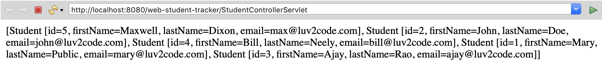
---
- updating `list-students.jsp`
```jsp
<%@ page import="java.util.*, com.luv2code.web.jdbc.*"%>
<!DOCTYPE html>
<html>
<head>
<meta charset="UTF-8">
	<title>Student Tracker App</title>
	<link type="text" href="css/style.css">
</head>

<%
	//get the students from the request object (sent by servlet)
	List<Student> theStudents = (List<Student>) request.getAttribute("STUDENT_LIST");
%>

<body>
	<div id="wrapper">
		<div id="header">
			<h2>SJSU University</h2>
		</div>
	</div>
	
	<div id="container">
		<div id="content">
			<table>
				<tr>
					<th>First Name</th>
					<th>Last Name</th>
					<th>Email</th>
				</tr>
				
				<% for(Student tempStudent : theStudents){ %>
					<tr>
						<td> <%= tempStudent.getFirstName() %></td>
						<td> <%= tempStudent.getLastName() %></td>
						<td> <%= tempStudent.getEmail() %></td>
					</tr>
				<% } %>
			</table>
		</div>
	</div>
</body>
</html>
```
- refresh the page
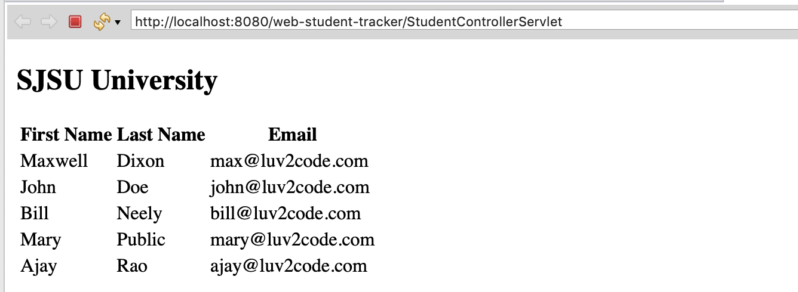
---

### `List Student - Making it Pretty with Cascading Style Sheets(css)`

- create a folder `css` in `WebContent`
```css
html, body{
	margin-left:15px; margin-right:15px; 
	padding:0px; 
	font-family:Verdana, Arial, Helvetica, sans-serif;
}

table {   
	border-collapse:collapse;
	border-bottom:1px solid gray;
	font-family: Tahoma,Verdana,Segoe,sans-serif;
	width:72%;
}
 
th {
	border-bottom:1px solid gray;
	background:none repeat scroll 0 0 #0775d3;
	padding:10px;
	color: #FFFFFF;
}
tr {
	border-top:1px solid gray;
	text-align:center;	
}
tr:nth-child(even) {background: #FFFFFF}
tr:nth-child(odd) {background: #BBBBBB}	
 
#wrapper {width: 100%; margin-top: 0px; }
#header {width: 72%; background: #0775d3; margin-top: 0px; padding:15px 0px 15px 0px;}
#header h2 {width: 100%; margin:auto; color: #FFFFFF;}
#container {width: 100%; margin:auto}
#container h3 {color: #000;}
#container #content {margin-top: 20px;}

.add-student-button {
	border: 1px solid #666; 
	border-radius: 5px; 
	padding: 4px; 
	font-size: 12px;
	font-weight: bold;
	width: 120px; 
	padding: 5px 10px; 
	margin-bottom: 15px;
	background: #cccccc;
}
h2{
	text-align:center;	
}
```
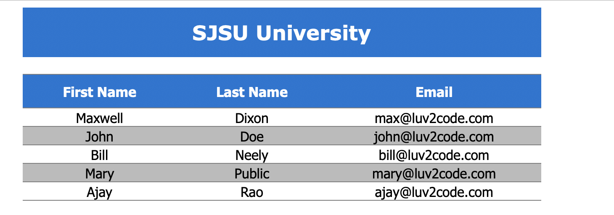
---

### `Adding JSTL Functionality`
- Replace JSP scriptlet Code with JSTL Tags
	1. Add JSTL JAR files to project
	2. Update JSP page to use JSTL tag: <c:forEach>
- add JSTL jar file

- paste jstl jar file into `WebContent`->`WEB-INF`->`lib`

- Now updating JSP to use JSTL tags
- in `list-students.jsp`
- we delete `<%@ page import="java.util.*, com.luv2code.web.jdbc.*"%>`
- paste this statement: `<%@ taglib uri="http://java.sun.com/jsp/jstl/core" prefix="c" %>`

- updating `list-students.jsp`
```jsp
<%-- <%@ page import="java.util.*, com.luv2code.web.jdbc.*"%> --%>
<%@ taglib uri="http://java.sun.com/jsp/jstl/core" prefix="c" %>
<!DOCTYPE html>
<html>
<head>
<meta charset="UTF-8">
	<title>Student Tracker App</title>
	<link type="text/css" rel="stylesheet"  href="css/style.css">
</head>
<body>
	<div id="wrapper">
		<div id="header">
			<h2>SJSU University</h2>
		</div>
	</div>
	
	<div id="container">
		<div id="content">
			<table>
				<tr>
					<th>First Name</th>
					<th>Last Name</th>
					<th>Email</th>
				</tr>

				<c:forEach var="tempStudent" items="${STUDENT_LIST}">
					<tr>
						<td> ${tempStudent.firstName} </td>
						<td> ${tempStudent.lastName} </td>
						<td> ${tempStudent.email}</td>
					</tr>				
				</c:forEach>
			</table>
		</div>
	</div>
</body>
</html>
```
---


### `List Students - Adding a Welcome File`
-  Application URL
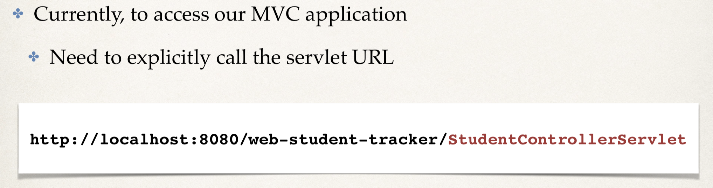
---
:star: If we would like to Just access our app ... without explicitly calling servlet URL
`http://localhost:8080/web-student-tracker`

-  Web App Welcome Files
:star: Java Servlet spec defines a deployment descriptor file
	- `WEB-INF/web.xml`
- Various configs for application deployment
- Defines a list of “welcome files”

:star: If a file is not referenced ... then look for a matching “welcome file”

---
- create a `web.xml` in `WEB-INF` folder
```xml
<?xml version="1.0" encoding="UTF-8"?>
<web-app xmlns:xsi="http://www.w3.org/2001/XMLSchema-instance" xmlns="http://xmlns.jcp.org/xml/ns/javaee" xsi:schemaLocation="http://xmlns.jcp.org/xml/ns/javaee http://xmlns.jcp.org/xml/ns/javaee/web-app_3_1.xsd" id="WebApp_ID" version="3.1">
  <display-name>web-student-tracker</display-name>
	<welcome-file-list>
		<welcome-file>index.jsp</welcome-file>
	  	<welcome-file>index.html</welcome-file>
	</welcome-file-list>
</web-app>
```

- create a `index.html` in `WebContent`
```html
<!DOCTYPE html>
<html>
<body>
	<h1>Hello Brave New Wolrd!</h1>
</body>
</html>
```
- now Add servlet as welcome file
```xml
	<welcome-file-list>
		<welcome-file>StudentControllerServlet</welcome-file>
		<welcome-file>index.jsp</welcome-file>
	  	<welcome-file>index.html</welcome-file>
	</welcome-file-list>
```
- typing: `http://localhost:8080/web-student-tracker/`
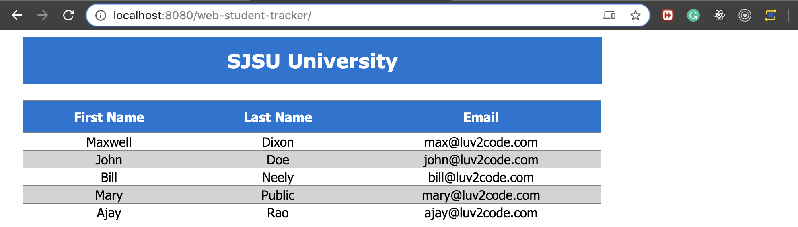
---


### `Add Student`

- Update Student
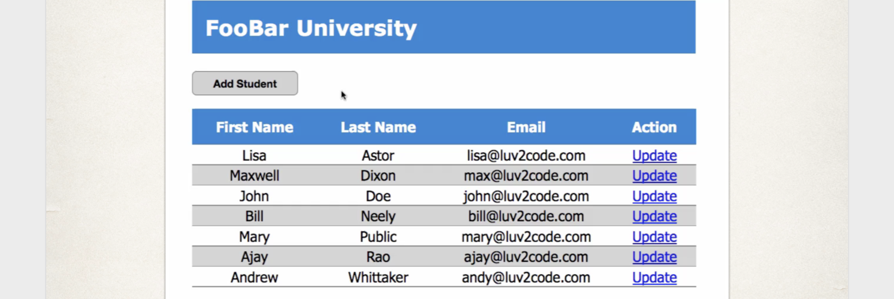
---
- Big Picture
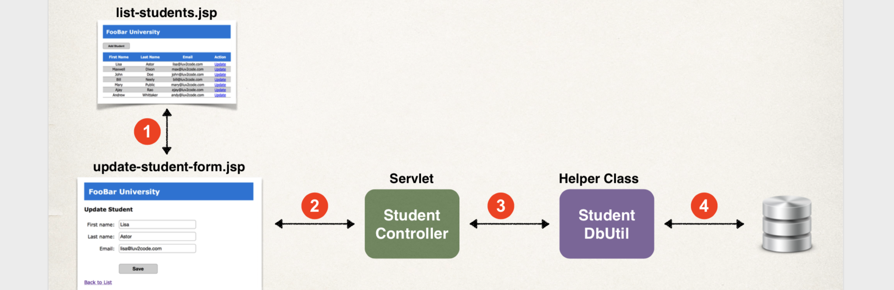
---
- Sequence Diagram
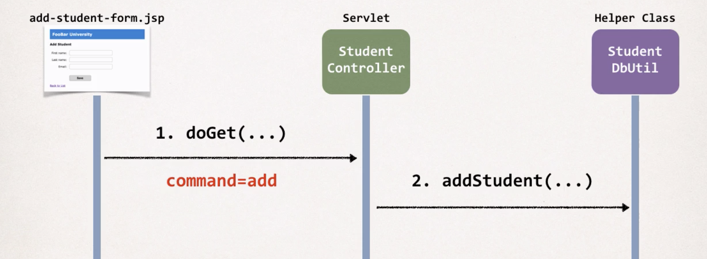
---
- To Do List
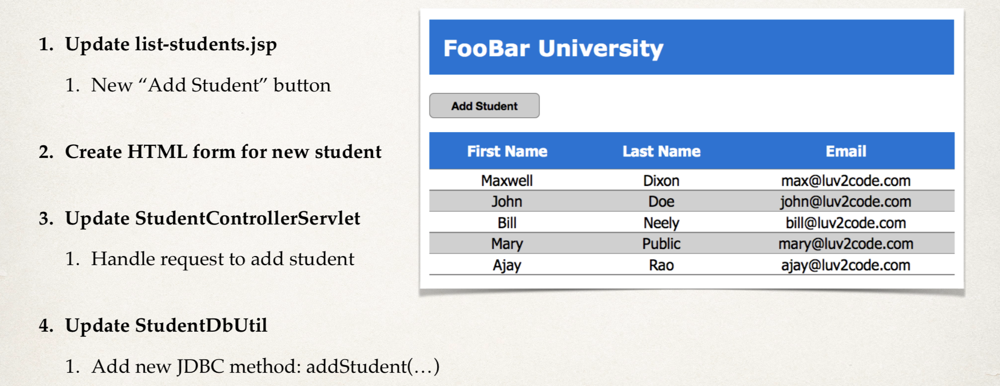
---


### `Setting up the Button`

- `add student` Botton into `list-students.jsp`
```jsp
<body>
	<div id="wrapper">
		<div id="header">
			<h2>SJSU University</h2>
		</div>
	</div>
	
	<div id="container">
		<div id="content">
		
			<!-- put new button: Add Student -->
			<input type="button" value="Add Student"  
				onclick="window.location.href='add-student-form.jsp'; return false;"
				class="add-student-button"		
			/>
```
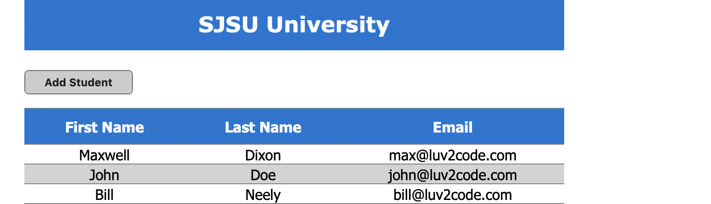
---
- create `add-student-form.jsp` in WebContent folder
```html
<html>
<body>
hello ... form placeholder
</body>
</html>
```
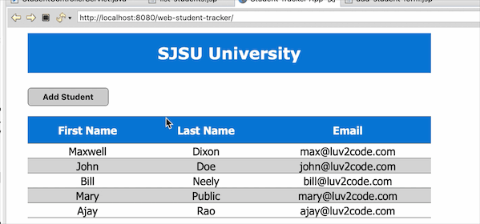
---

### `Create HTML form for new student`
- create `add-student-style.css` in css folder
```css
form {
	margin-top: 10px;
}

label {
	font-size: 16px; 
	width: 100px; 
	display: block; 
	text-align: right;
	margin-right: 10px;
	margin-top: 8px;
	margin-bottom: 8px;
}

input {
	width: 250px;
	border: 1px solid #666; 
	border-radius: 5px; 
	padding: 4px; 
	font-size: 16px;
}
.save {
	font-weight: bold;
	width: 130px; 
	padding: 5px 10px; 
	margin-top: 30px;
	background: #cccccc;
}
table {   
	border-style:none;
	width:50%;
}
tr:nth-child(even) {background: #FFFFFF}
tr:nth-child(odd) {background: #FFFFFF}
tr {
	border-style:none;
	text-align:left;	
}
```
---
- update `add-student-form.jsp`
```jsp
<%@ page language="java" contentType="text/html; charset=UTF-8"
    pageEncoding="UTF-8"%>
<!DOCTYPE html>
<html>
<head>
<meta charset="UTF-8">
	<title>Add Student</title>
	<link type="text/css" rel="stylesheet" href="css/style.css">	
	<link type="text/css" rel="stylesheet" href="css/add-student-style.css">
		
</head>
<body>
	<div id="wrapper">
		<div id="header">
			<h2>SJSU University</h2>	
		</div>
	</div>
	<div id="container">
		<h3>Add Student</h3>
		<form action="StudentControllerServlet" method="GET">
			<input type="hidden" name="command" value="ADD" />
			
			<table>
				<tbody>
					<tr>
						<td><label>First Name:</label></td>
						<td><input type="text" name="firstname" /></td>
					</tr>
					<tr>
						<td><label>Last Name:</label></td>
						<td><input type="text" name="lastname" /></td>
					</tr>
					<tr>
						<td><label>Email:</label></td>
						<td><input type="text" name="email" /></td>
					</tr>
					<tr>
						<td><label></label></td>
						<td><input type="submit" value="Save" class="save"/></td>
					</tr>
					
					
				</tbody>
			</table>
		</form>
		
		<div style="clear: both;"></div>
		
		<p>
			<a href="StudentControllerServlet">Back to List</a>
		</p>
		
	</div>
</body>
</html>
```


### `Add Student-Developing the Servlet`
- Update `StudentControllerServlet` 
```java
	protected void doGet(HttpServletRequest request, HttpServletResponse response)
			throws ServletException, IOException {

		try {
			// read the "command" parameter
			String theCommand = request.getParameter("command");

			// if the command is missing, then default to listing students
			if (theCommand == null) {
				theCommand = "LIST";
			}

			// route to the appropriate method
			switch (theCommand) {
			case "LIST":
				listStudents(request, response);
				break;
			case "ADD":
				addStudent(request, response);
				break;
			default:
				listStudents(request, response);
			}

			// list the students ... in MVC fashion
			
		} catch (Exception e) {
			throw new ServletException(e);
		}
	}

	private void addStudent(HttpServletRequest request, HttpServletResponse response) throws Exception {
		// read student info from form data
		String firstName = request.getParameter("firstName");
		String lastName = request.getParameter("lastName");
		String email = request.getParameter("eamil");

		// create a new student object
		Student theStudent = new Student(firstName, lastName, email);

		// add the student to the database
		studentDbUtil.addStudent(theStudent);
		
		// send back to main page(the student list)
		listStudents(request, response);

	}
```


### `Add Student- Creating the JDBC Code`
- updating `StudentDbUtil`'s addStudent() method
```java
	public void addStudent(Student theStudent) throws Exception  {
		Connection myConn = null;
		PreparedStatement myStmt = null;

		try {
			// get db connection
			myConn=dataSource.getConnection();
			
			// create sql for insert
			String sql="insert into student"
					+"(first_name, last_name, email)"
					+"values(?,?,?)";
			
			myStmt=myConn.prepareStatement(sql);
			
			// set the param values for student
			myStmt.setString(1, theStudent.getFirstName());
			myStmt.setString(2, theStudent.getLastName());
			myStmt.setString(3, theStudent.getEmail());
			
			// execute sql insert
			myStmt.execute();
		} finally {
			// clean up JDBC objects
			close(myConn, myStmt, null);
		}
	}
```

---

### `Update Student - Creating the Update Link`
- update Student
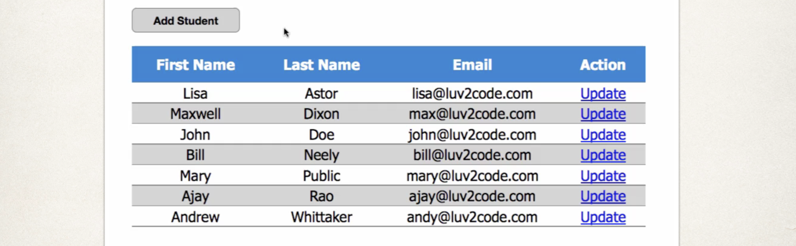
---
- step1: Update `list-students.jsp`
```jsp
			<table>
				<tr>
					<th>First Name</th>
					<th>Last Name</th>
					<th>Email</th>
					<th>Action</th>
				</tr>

				<c:forEach var="tempStudent" items="${STUDENT_LIST}">
					<!-- set up a link for each student -->
					<c:url var="tempLink" value="StudentControllerServlet">
						<c:param name="command" value="LOAD" />
						<c:param name="studentId" value="${tempStudent.id}" />
					</c:url>
					<tr>
						<td>${tempStudent.firstName}</td>
						<td>${tempStudent.lastName}</td>
						<td>${tempStudent.email}</td>
						<td><a href="${tempLink }">Update</a></td>
					</tr>
				</c:forEach>

			</table>
```
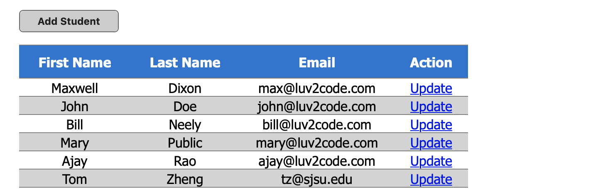
---
- we can copy the link of `Update`
```html
http://localhost:8080/web-student-tracker/StudentControllServlet?command=LOAD&studentId=5
```


### `Update StudentControllServlet`
- read the new LOAD command
- read the student id
- get student from db
- show the form
---
- in `StudentControllerServlet`.java
- updating the method `doGet`
```java
case "LOAD":
				loadStudent(request,response);
				break;
```
- update `loadStudent()` in `StudentControllerServlet`.java
```java
	private void loadStudent(HttpServletRequest request, HttpServletResponse response) throws Exception {
		//read student id from form data
		String theStudentId = request.getParameter("studentId");
		
		//get student from database (db util)
		Student theStudent = studentDbUtil.getStudent(theStudentId);
		
		//palce student in the request attribute
		request.setAttribute("THE_STUDENT", theStudent);
		
		//send to jsp page: update-student-form.jsp
		RequestDispatcher dispatcher = request.getRequestDispatcher("/update-student-form.jsp");
		dispatcher.forward(request, response);
	}
```
- updating `getStudent()` in StudentDbUtil
```java
public Student getStudent(String theStudentId) throws Exception {
		
		Student theStudent = null;
		
		Connection myConn = null;
		PreparedStatement myStmt = null;
		ResultSet myRs = null;
		int studentId;
		
		try {
			//convert student id to int
			studentId = Integer.parseInt(theStudentId);
			
			//get connection to database
			myConn=dataSource.getConnection();
			
			//create sql to get selected student
			String sql = "select * from student where id=?";
			
			//create prepared statement
			myStmt=myConn.prepareStatement(sql);
			
			//set params
			myStmt.setInt(1, studentId);
			
			//execute statement
			myRs = myStmt.executeQuery();
			
			//retrieve data from result set row
			if(myRs.next()) {
				String firstName=myRs.getString("first_name");
				String lastName=myRs.getString("last_name");
				String email=myRs.getString("email");
				
				//use the studentId during construction
				theStudent = new Student(studentId, firstName, lastName,email);
			}else {
				throw new Exception("Could not find sutdent id: "+studentId);
			}
			
			return theStudent;	
		}
		finally {
			//clean up JDBC object
			close(myConn, myStmt, myRs);
		}
		
	}
```
---
### `update` form and pre-populate
- create `update-student-form.jsp`
```jsp
<%@ page language="java" contentType="text/html; charset=UTF-8"
	pageEncoding="UTF-8"%>
<!DOCTYPE html>
<html>
<head>
<meta charset="UTF-8">
<title>Add Student</title>
<link type="text/css" rel="stylesheet" href="css/style.css">
<link type="text/css" rel="stylesheet" href="css/add-student-style.css">
</head>
<body>
	<div id="wrapper">
		<div id="header">
			<h2>SJSU University</h2>
		</div>
	</div>
	<div id="container">
		<h3>Add Student</h3>
		<form action="StudentControllerServlet" method="GET">

			<input type="hidden" name="command" value="UPDATE" /> 
			<input type="hidden" name="studentId" value="${THE_STUDENT.id} " />

			<table>
				<tbody>
					<tr>
						<td><label>First Name:</label></td>
						<td><input type="text" name="firstName"
							value="${THE_STUDENT.firstName }" /></td>
					</tr>
					<tr>
						<td><label>Last Name:</label></td>
						<td><input type="text" name="lastName"
							value="${THE_STUDENT.lastName }" /></td>
					</tr>
					<tr>
						<td><label>Email:</label></td>
						<td><input type="text" name="email"
							value="${THE_STUDENT.email }" /></td>
					</tr>
					<tr>
						<td><label></label></td>
						<td><input type="submit" value="Save" class="save" /></td>
					</tr>
				</tbody>
			</table>
		</form>
		<div style="clear: both;"></div>
		<p>
			<a href="StudentControllerServlet">Back to List</a>
		</p>
	</div>
</body>
</html>
```
---
- add `updateStudent()` into `StudentDbUtil.java`
```java
public void updateStudent(Student theStudent) throws Exception {
		Connection myConn = null;
		PreparedStatement myStmt = null;

		try {
			// get db connection
			myConn = dataSource.getConnection();

			// create SQL update statement
			String sql = "update student " + "set first_name=?, last_name=?, email=? " + "where id=?";

			// prepare statement
			myStmt = myConn.prepareStatement(sql);

			// set params
			myStmt.setString(1, theStudent.getFirstName());
			myStmt.setString(2, theStudent.getLastName());
			myStmt.setString(3, theStudent.getEmail());
			myStmt.setInt(4, theStudent.getId());

			// execute SQL statement
			myStmt.execute();
		} finally {
			close(myConn, myStmt, null);
		}
	}
```
---
- update doGet in `StudentControllerServlet`
```java
protected void doGet(HttpServletRequest request, HttpServletResponse response)
			throws ServletException, IOException {

		try {
			// read the "command" parameter
			String theCommand = request.getParameter("command");

			// if the command is missing, then default to listing students
			if (theCommand == null) {
				theCommand = "LIST";
			}

			// route to the appropriate method
			switch (theCommand) {
			case "LIST":
				listStudents(request, response);
				break;
			case "ADD":
				addStudent(request, response);
				break;
			case "LOAD":
				loadStudent(request,response);
				break;
			case "UPDATE":
				updateStudent(request,response);
				break;
			default:
				listStudents(request, response);
			}

			// list the students ... in MVC fashion
			
		} catch (Exception e) {
			throw new ServletException(e);
		}
	}
```
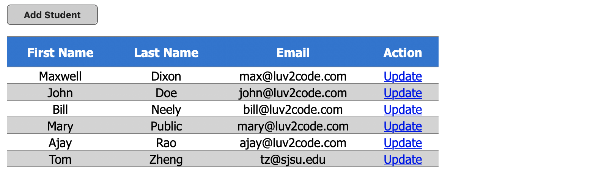
- click Update
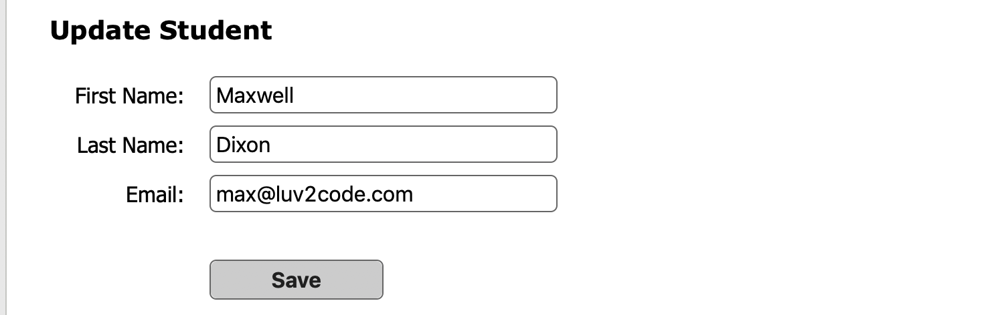
- change the last name to be `Apple`
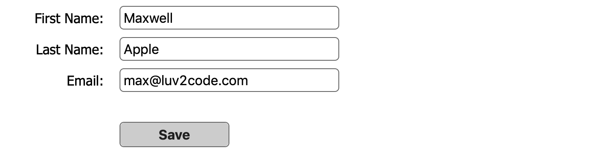
- click Save
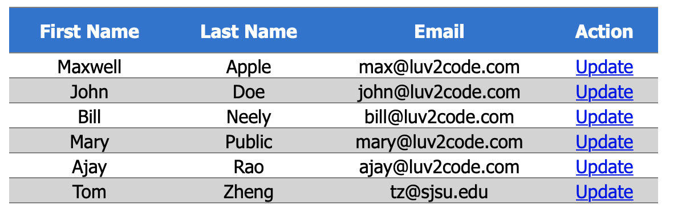
- now this result is what we expect
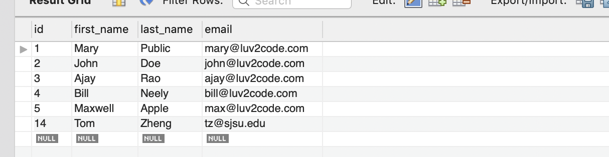
---

### `Delete Student - Creating the Delete Link`
- Add `Delete` link to JSP

- update `list-student.jsp`
```jsp
				<c:forEach var="tempStudent" items="${STUDENT_LIST}">
					<!-- set up a link for each student -->
					<c:url var="tempLink" value="StudentControllerServlet">
						<c:param name="command" value="LOAD" />
						<c:param name="studentId" value="${tempStudent.id}" />
					</c:url>
					
					<!-- set up a link to delete a student -->
					<c:url var="deleteLink" value="StudentControllerServlet">
						<c:param name="command" value="DELETE" />
						<c:param name="studentId" value="${tempStudent.id}" />
					</c:url>
							
					<tr>
						<td>${tempStudent.firstName}</td>
						<td>${tempStudent.lastName}</td>
						<td>${tempStudent.email}</td>
						<td>
							<a href="${tempLink}">Update</a>
								|
							<a href="${deleteLink}">Delete</a>		
						</td>
					</tr>
				</c:forEach>          
```
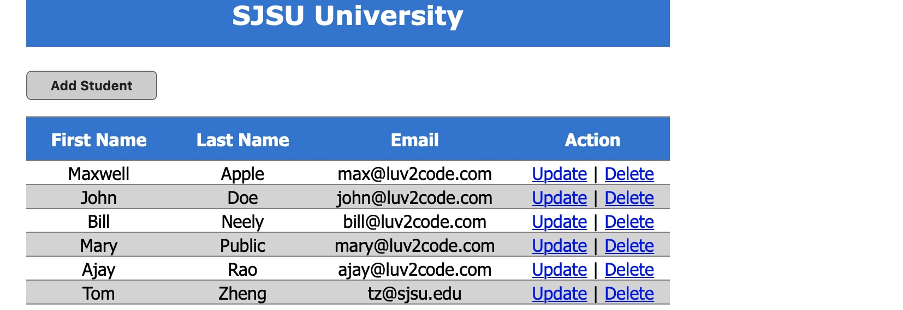
---
- Prompt user before deleting - JavaScript
```jsp
					<tr>
						<td>${tempStudent.firstName}</td>
						<td>${tempStudent.lastName}</td>
						<td>${tempStudent.email}</td>
						<td>
							<a href="${tempLink}">Update</a>
								|
							<a href="${deleteLink}"
							onclick="if(!(confirm('Are you sure you want to delete this student?'))) return false">
							Delete</a>		
						</td>
					</tr>
```
- if you click delete
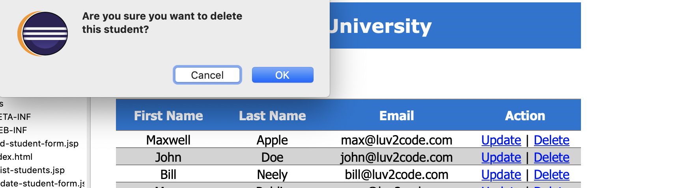
---


- Add code for "Delete" to StudentControllerServlet:
- updating `doGet()` from `StudentControllerServlet`
```java
protected void doGet(HttpServletRequest request, HttpServletResponse response)
			throws ServletException, IOException {

		try {
			// read the "command" parameter
			String theCommand = request.getParameter("command");

			// if the command is missing, then default to listing students
			if (theCommand == null) {
				theCommand = "LIST";
			}
			// route to the appropriate method
			switch (theCommand) {
			case "LIST":
				listStudents(request, response);
				break;
			case "ADD":
				addStudent(request, response);
				break;
			case "LOAD":
				loadStudent(request,response);
				break;
			case "UPDATE":
				updateStudent(request,response);
				break;
			case "DELETE":
				deleteStudent(request, response);
				break;
			default:
				listStudents(request, response);
			}
		} catch (Exception e) {
			throw new ServletException(e);
		}
	}

	private void deleteStudent(HttpServletRequest request, HttpServletResponse response) throws Exception {
		//read student id from form data
		String theStudentId = request.getParameter("studentId");
		
		//delete student from database
		studentDbUtil.deleteStudent(theStudentId);
		
		//send them back to "list student" page
		listStudents(request,response);
		
	}
```
---
- updating `StudentDbUtil.java`
```java
	public void deleteStudent(String theStudentId) throws Exception {
		Connection myConn = null;
		PreparedStatement myStmt = null;
		try {
			//covert student id to int
			int studentId = Integer.parseInt(theStudentId);
			
			//get connection to database
			myConn=dataSource.getConnection();
			
			//create sql to delete student
			String sql = "delete from student where id=?";
			
			//prepare statement
			myStmt = myConn.prepareStatement(sql);
			
			//set params
			myStmt.setInt(1, studentId);
			
			//execute sql statement
			myStmt.execute();
			
		}finally {
			//clean up JDBC code
			close(myConn, myStmt, null);
		}
	}
```
---


