# JSP_Servlets

### `Note: before run the servlet, connect to the database firstly`

:star: installing Tomact on Mac
- see my github SpringBoot folder's `environmentConfiguration.md`

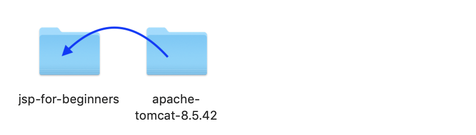
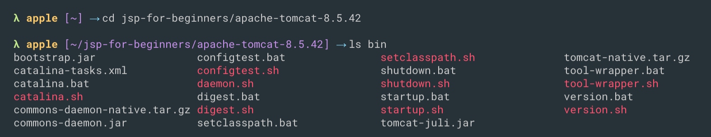
- we see `startup.sh`
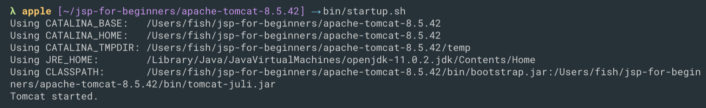
- we see `Tomcat started`

### Now, in my browser I can simply type `localhost:8080`
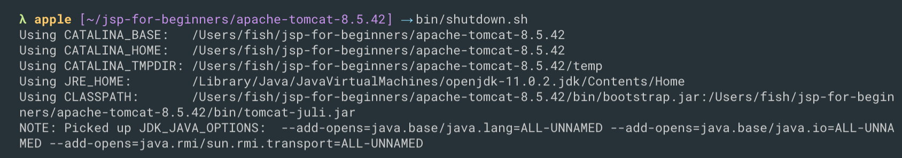

- shutdown Tomact Server

:star: What is a JSP file?
- An HTML page with some Java code sprinkled in ...
- Include dynamic content from Java code

:star: Where is the JSP processed?
- JSP is processed on the server
- Results of Java code included in HTML returned to browser
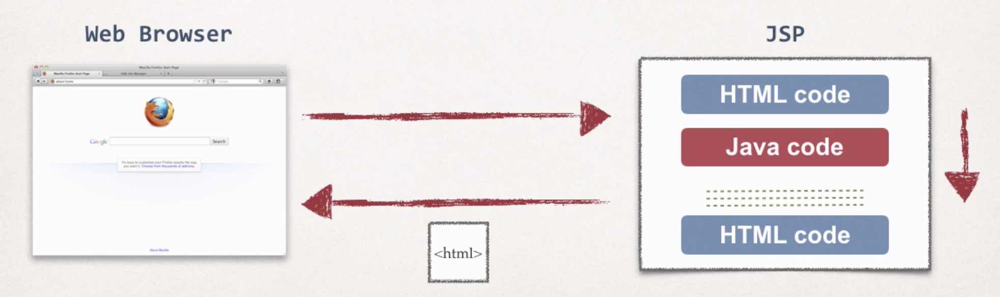

:star: Where to place JSP file?
- The JSP file goes in your WebContent folder
- Must have `.jsp` extension

:star: Connecting Eclipse(or Intellij Idea) and Tomact

- create a new `Java Enterprise` with `Java EE` -> Application Server: `Tomcat 8.5.42` -> `Web Application(4.0)`
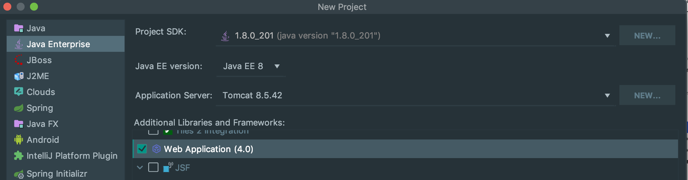

- named this project `jspdemo`
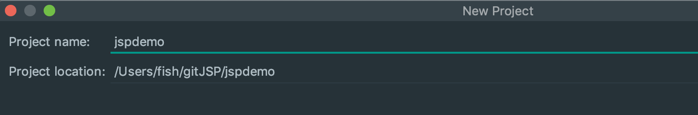

- `Run` -> `Edit Configuration`

- `Templates` -> `Tomact Server` -> `+`
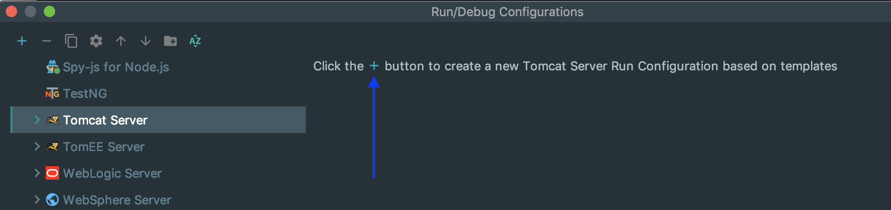

- create a File name: `hellowrld.jsp`
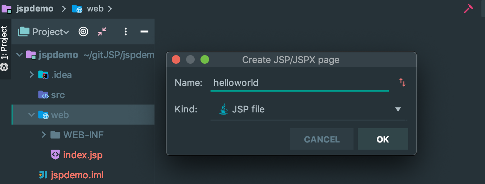
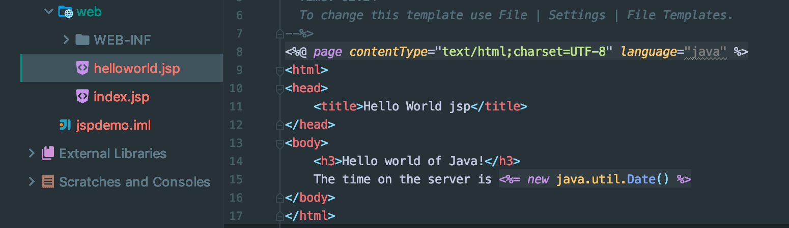

- run 
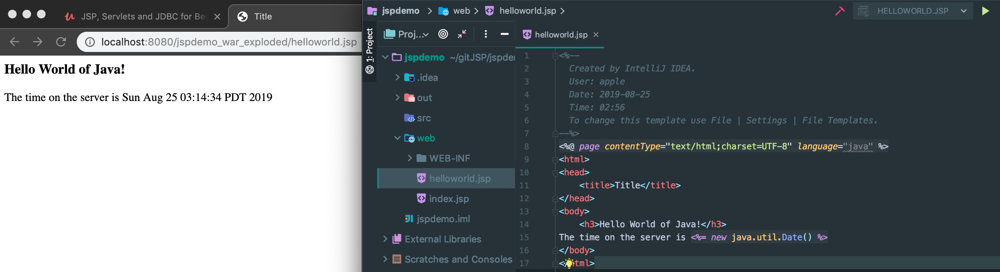
- this the result we expected

