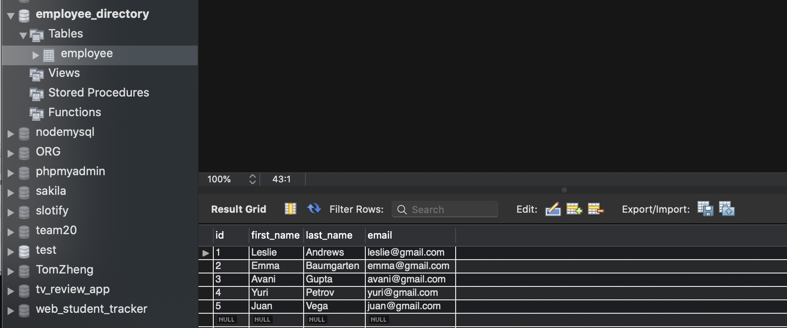
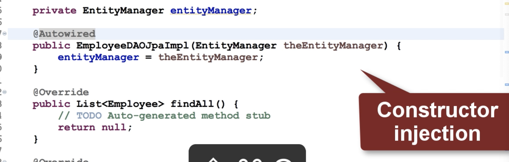
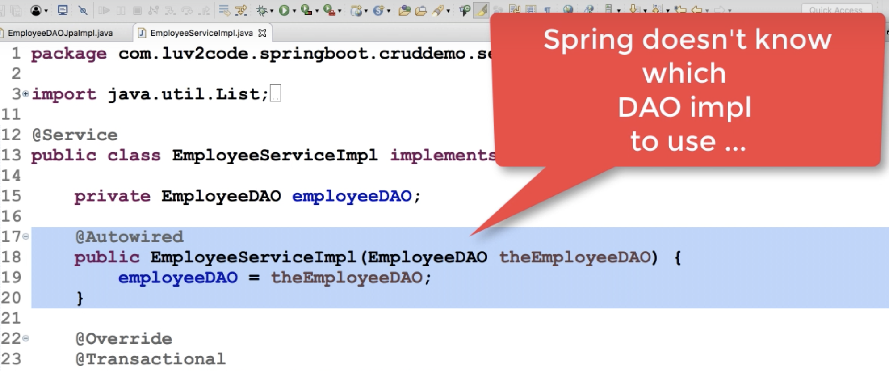
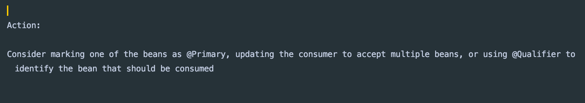
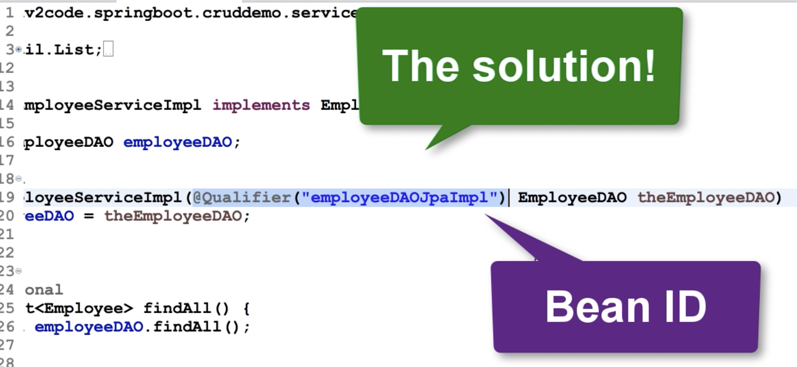
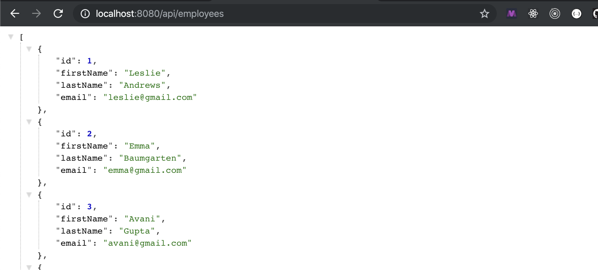

# 2. Create JPA DAO

- run `employee.sql` again on workbench



- copy older project `cruddemo` to `22-jpa-cruddemo`

- create a new class `EmployeeDAOjpaImpl` implements `EmployeeDAO`




```java
@Repository
public class EmployeeDAOjpaImpl implements EmployeeDAO{
    private EntityManager entityManager;

    @Autowired
    public EmployeeDAOjpaImpl(EntityManager entityManager) {
        this.entityManager = entityManager;
    }

    @Override
    public List<Employee> findAll() {
        //create a query
        Query theQuery = entityManager.createQuery("from Employee");

        //execute query
        List<Employee> employees = theQuery.getResultList();

        //return the results
        return employees;
    }

    @Override
    public Employee findById(int theId) {
        return null;
    }

    @Override
    public void save(Employee theEmployee) {

    }

    @Override
    public void deleteById(int theId) {

    }
}

```

- run app, but there is an error, since sprigboot doesn't know 
  which DAO implementation to use...




- so, we need to set a implementation to be qualifier or primary




- run again



- cool!

- test on postman


