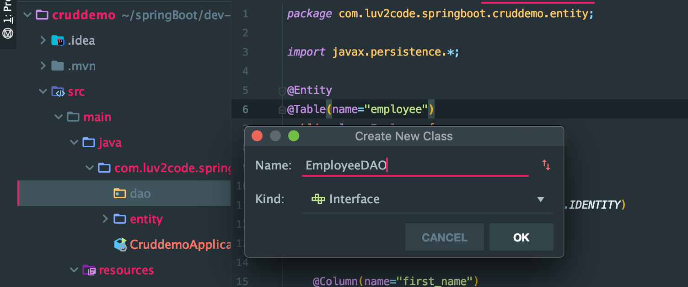
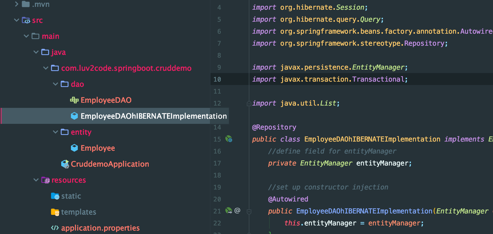

# 5. DAO Interface and imp

- create a new package and new interface



```java
package com.luv2code.springboot.cruddemo.dao;
import com.luv2code.springboot.cruddemo.entity.Employee;
import java.util.List;

public interface EmployeeDAO {
    public List<Employee> findAll();
}
```

- write a class implement EmployeeDAO



```java
package com.luv2code.springboot.cruddemo.dao;
import com.luv2code.springboot.cruddemo.entity.Employee;
import org.hibernate.Session;
import org.hibernate.query.Query;
import org.springframework.beans.factory.annotation.Autowired;
import org.springframework.stereotype.Repository;

import javax.persistence.EntityManager;
import javax.transaction.Transactional;

import java.util.List;

@Repository
public class EmployeeDAOhIBERNATEImplementation implements EmployeeDAO{
    //define field for entityManager
    private EntityManager entityManager;

    //set up constructor injection
    @Autowired
    public EmployeeDAOhIBERNATEImplementation(EntityManager entityManager){
        this.entityManager = entityManager;
    }

    @Override
    @Transactional
    public List<Employee> findAll() {
        //get the current hibernate session
        Session currentSession = entityManager.unwrap(Session.class);

        //create a query
        Query<Employee> theQuery =
                currentSession.createQuery("from Employee", Employee.class);

        //execute query and get result list
        List<Employee> employees = theQuery.getResultList();

        //return the results
        return employees;
    }
}
```


