# 10. REST Controller Update and Delete

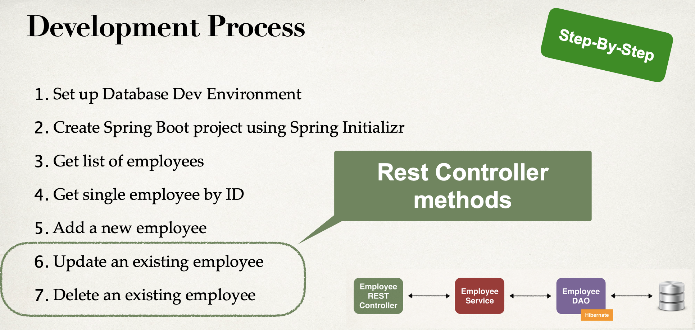

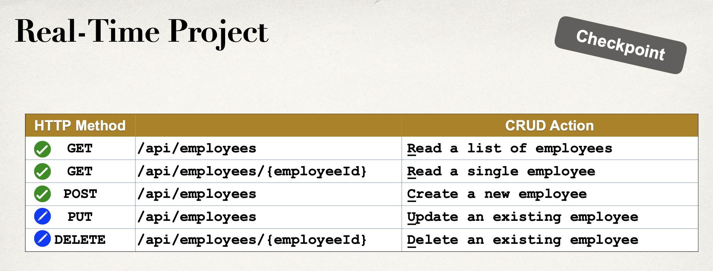

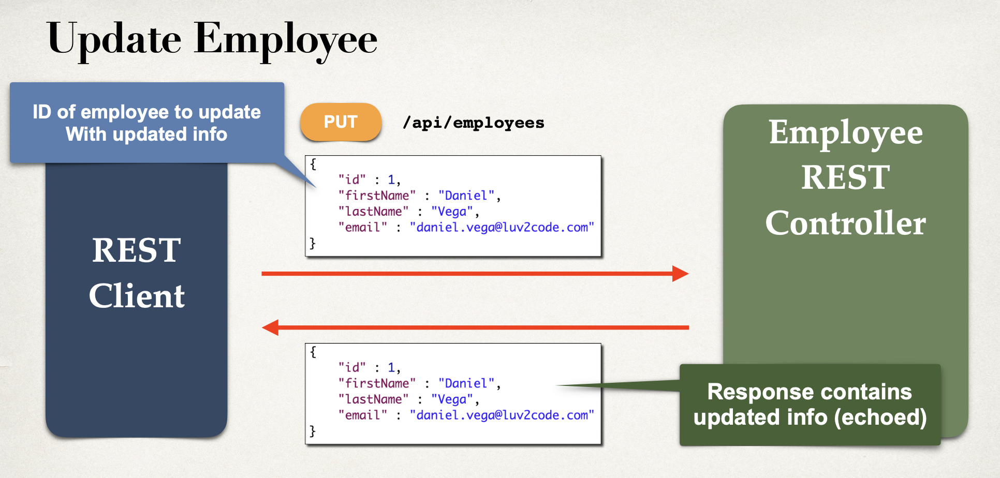

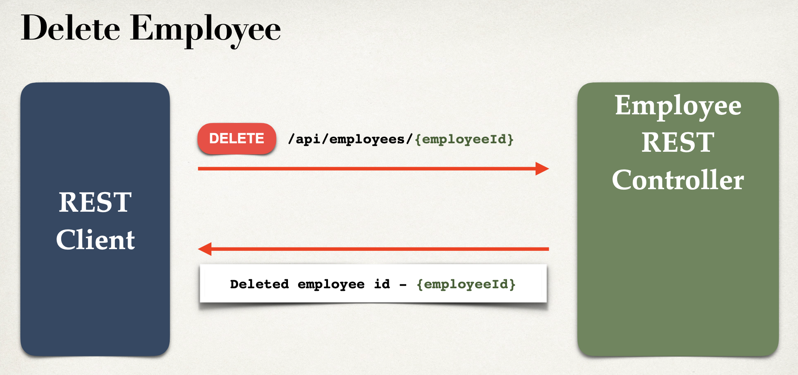

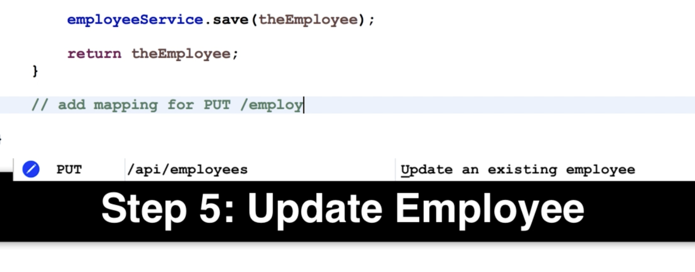

- update EmployeeRestController

```java
    //add mapping for PUT / employees - update existing employee
    @PutMapping("/employees")
    public Employee updateEmployee(@RequestBody Employee theEmployee){
        employeeService.save(theEmployee);
        return theEmployee;
    }
```

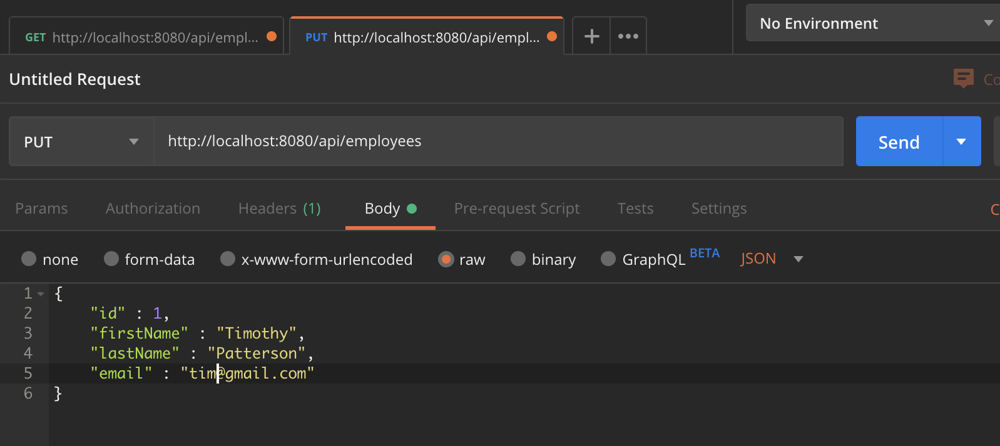

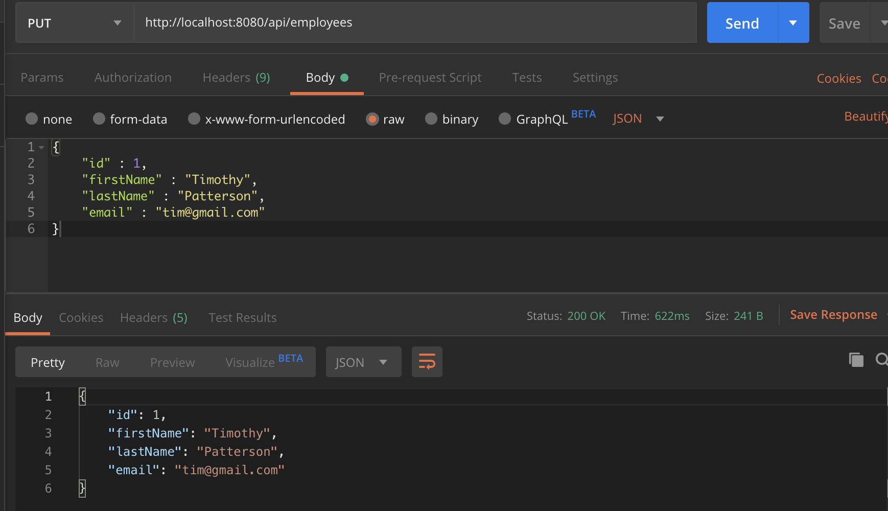

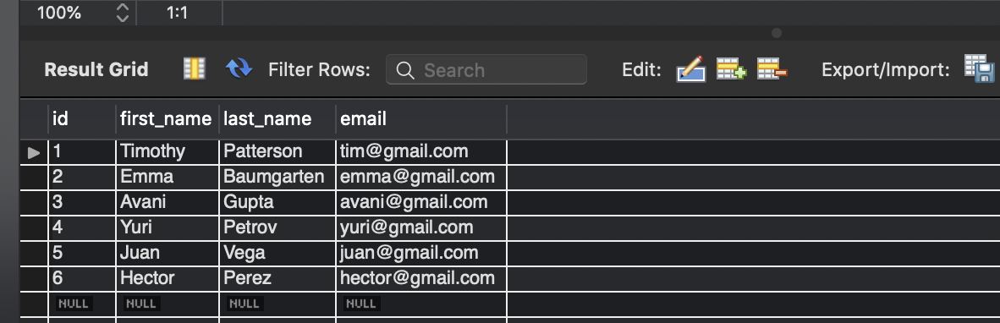

---

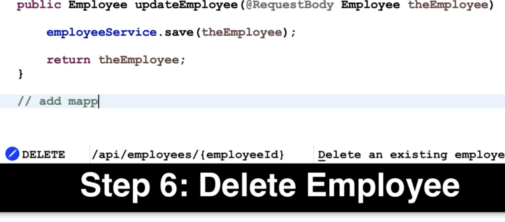

- update EmployeeRestController

```java
    //add mapping for DELETE /employees/{employeeId} - delete employee
    @DeleteMapping("/employees/{employeeId}")
    public String deleteEmployee(@PathVariable int employeeId){
        Employee tempEmployee = employeeService.findById(employeeId);

        //throw exception if null
        if(tempEmployee == null){
            throw new RuntimeException("Employee id not found - " + employeeId);
        }
        employeeService.deleteById(employeeId);
        return "Delete employee id - " + employeeId;
    }
```

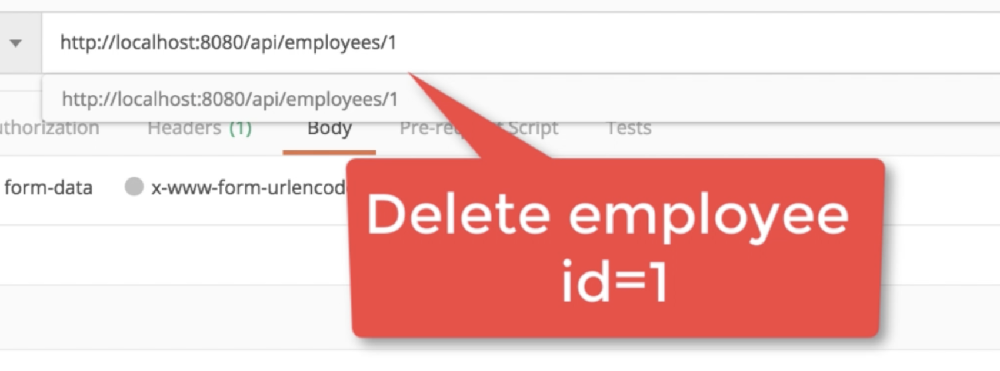

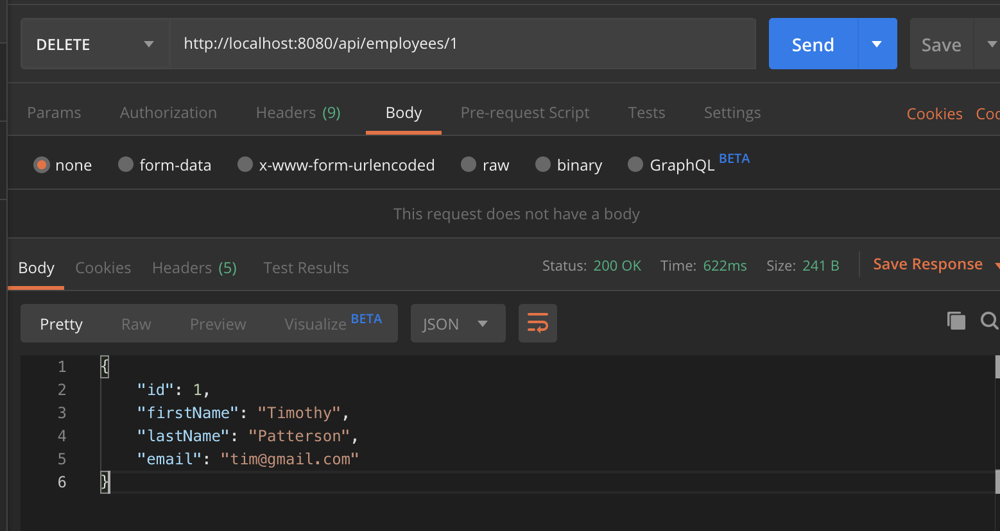

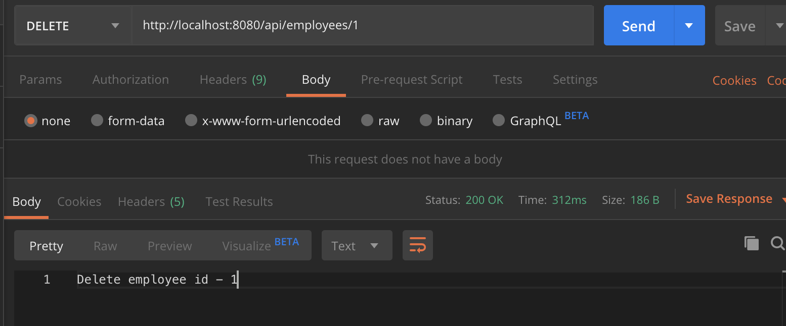

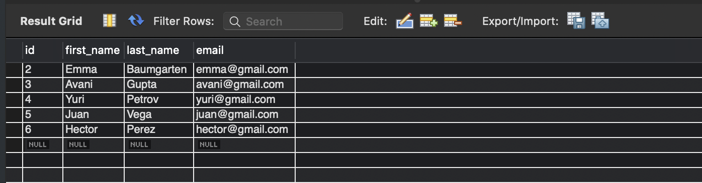

- let's delete id=5

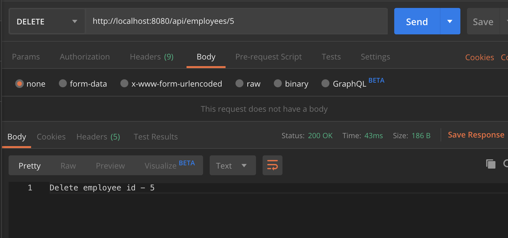

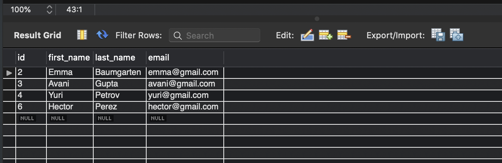

