# 3. Apply CSS style

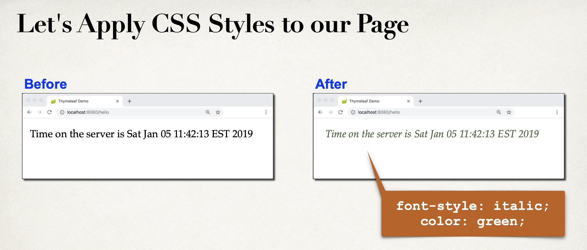

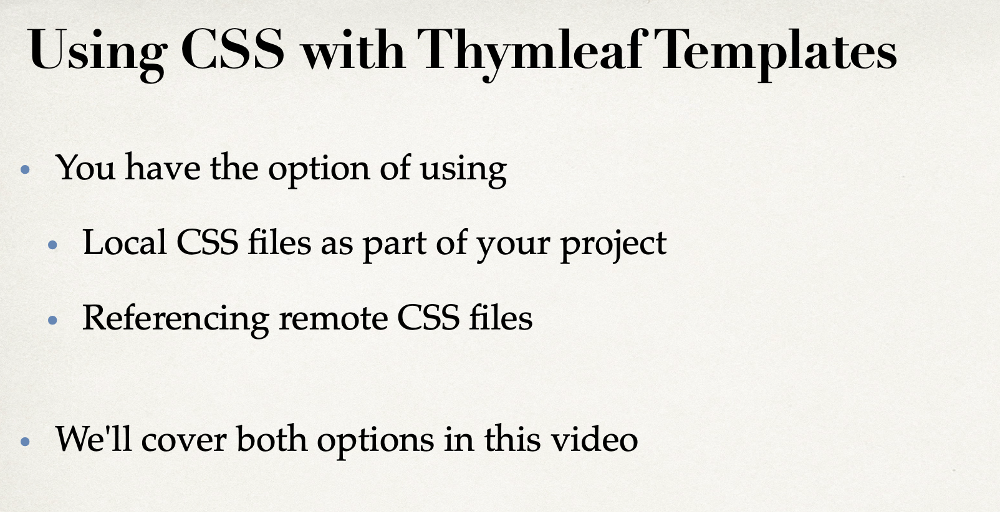

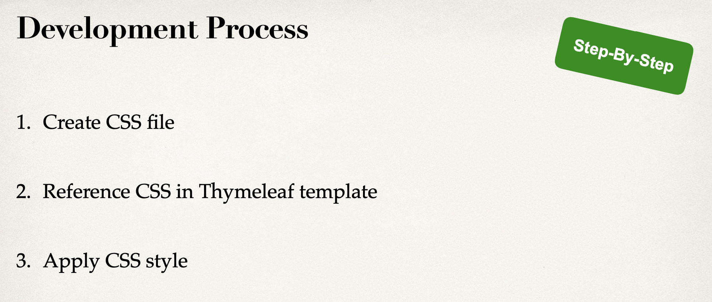

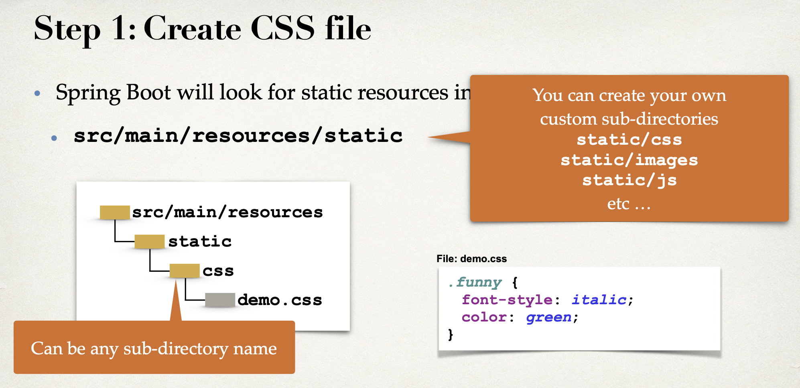

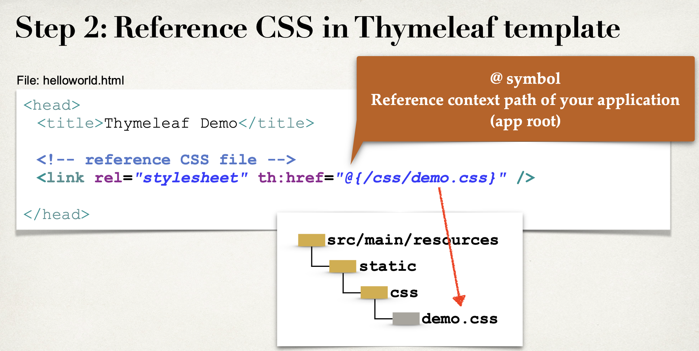

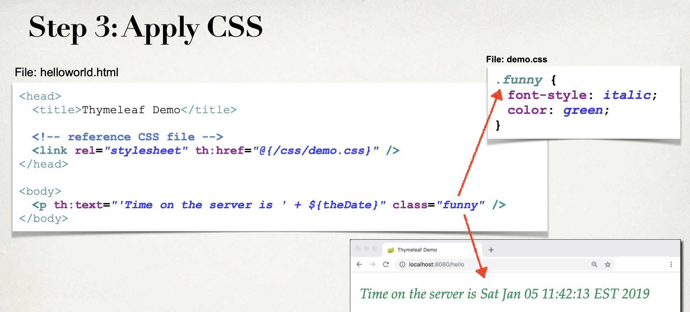

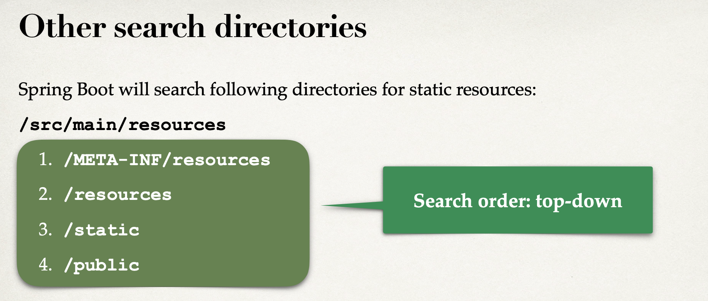

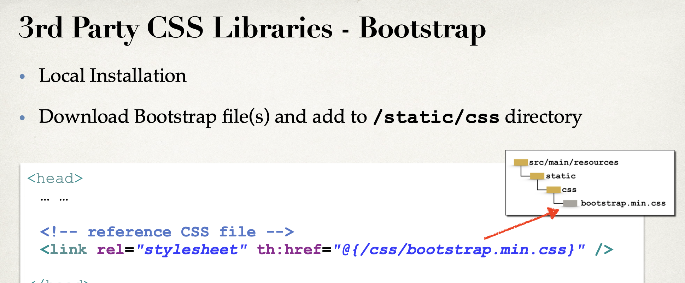

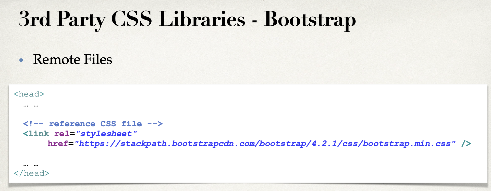

- copy project 30, paste on 31

- create a new folder `css`

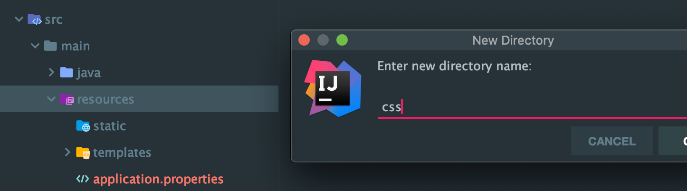

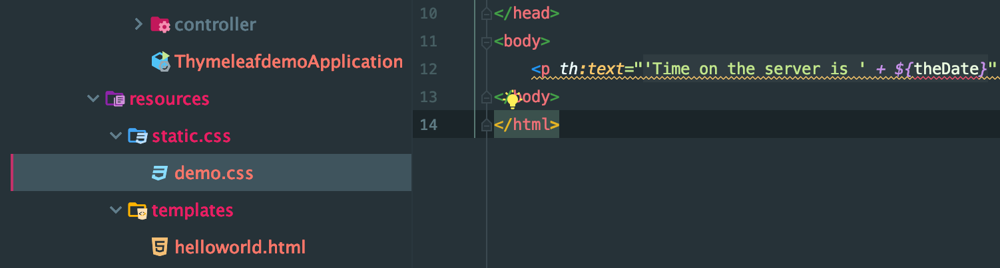

```css
.funny{
    font-style: italic;
    color: green;
}
```

- Reference CSS in Thymeleaf templates

```html
<!DOCTYPE html>
<html lang="en" xmlns:th="http://www.thymeleaf.org">
<head>
    <meta charset="UTF-8">
    <title>Thymeleaf Demo</title>

    <!-- reference CSS file   -->
    <link rel="stylesheet"
          th:href="@{/css/demo.css}" />
</head>
<body>
    <p th:text="'Time on the server is ' + ${theDate}" class="funny"/>
</body>
</html>
```

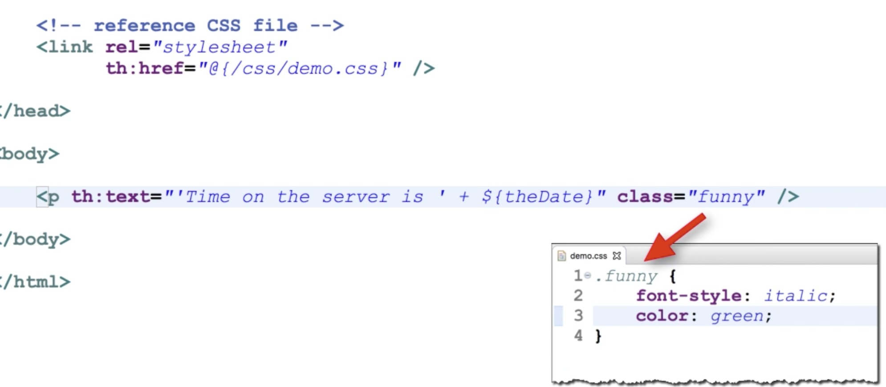

- run again

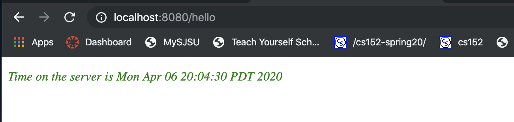


