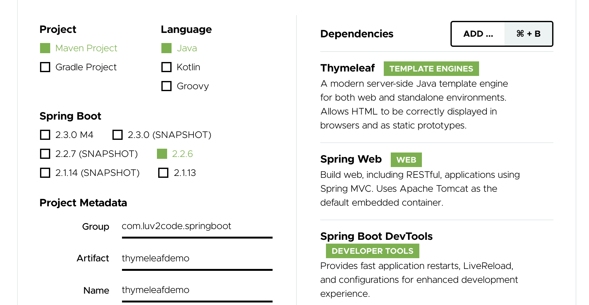
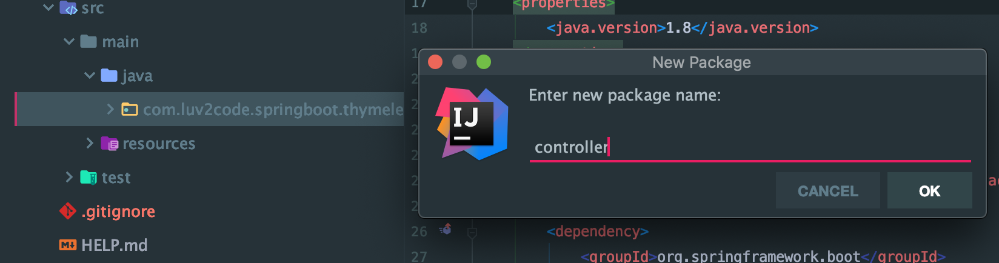
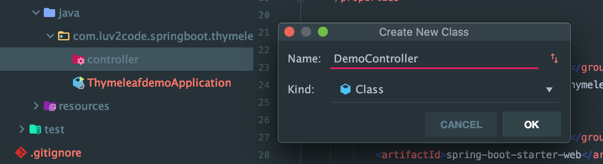
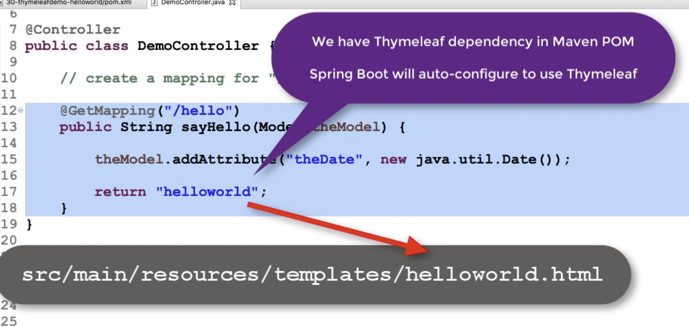
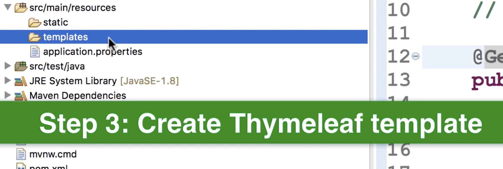
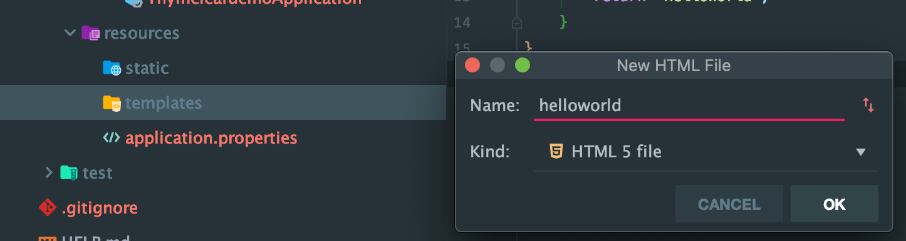
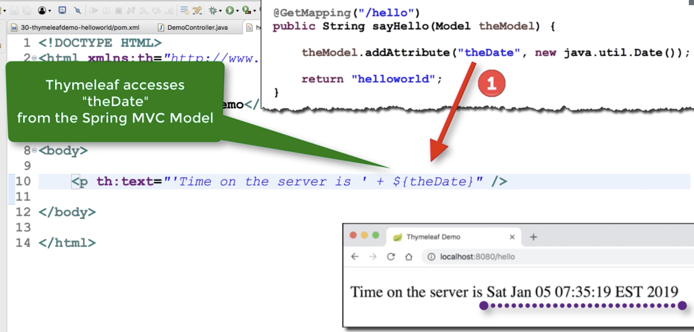
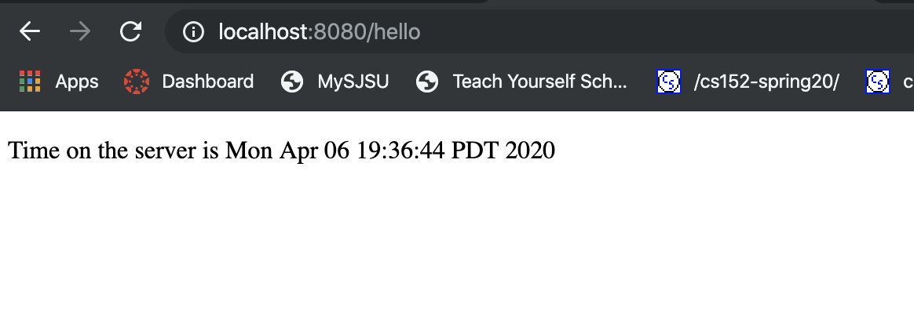
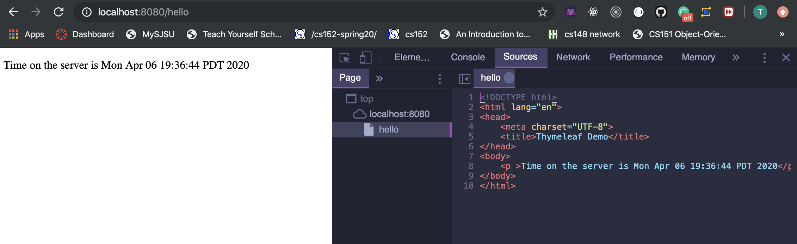

# 2. Create Thymeleaf App

- https://start.spring.io/



- generate this project

- unzip thymeleafdemo

- paste `thymeleafdemo` in `dev-spring-boot`

- import this project

- change name to `30-thymeleafdemo-helloworld`

- add a new package `controller`



- add a new class



```java
package com.luv2code.springboot.thymeleafdemo.controller;

import org.springframework.stereotype.Controller;
import org.springframework.ui.Model;
import org.springframework.web.bind.annotation.GetMapping;

@Controller
public class DemoController {
    //create a mapping for "/hello"
    @GetMapping("/hello")
    public String sayHello(Model theModel) {
        theModel.addAttribute("theDate", new java.util.Date());
        return "HelloWorld";
    }
}

```





- add a new html in templates



- helloworld.html

```html
<!DOCTYPE html>
<html lang="en" xmlns:th="http://www.thymeleaf.org">
<head>
    <meta charset="UTF-8">
    <title>Thymeleaf Demo</title>
</head>
<body>
    <p th:text="'Time on the server is ' + ${theDate}" />
</body>
</html>
```








