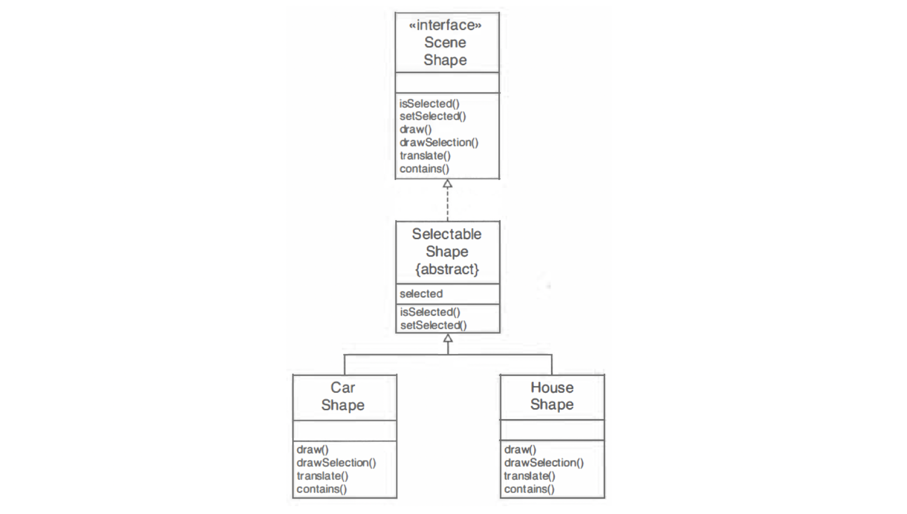

# 2. Abstract Class

- assume the interface type:


---
- We'll then define classes CarShape and HouseShape that implement this interface type

- Because every shape needs to keep a selection flag, 
  the naive approach would be to supply the selection flag separately in each class:


---

- Clearly, it is a better idea to design a class that expresses this commonality
  
- We will call this class SelectableShape


---

---

- However, there is a problem with the `SelectableShape` class. 
  It does not define all of the methods of the `SceneShape` interface type. 

- Four methods are left undefined in this class
  
```java
void draw(Graphics2D g2)
void drawSelection(Graphics2D g2)
void translate(double dx , double dy)
boolean contains(Point2D aPoint)
```
- We say that these methods are undefined or abstract in the `SelectableShape` class
  
- It is the job of further subclasses to define them
  
- For that reason, the `SelectableShape` class must be tagged as `abstract`:
  
```java
public abstract class SelectableShape implements SceneShape {

}
```

- The `HouseShape` and `CarShape` classes are `concrete subclasses` that define the remaining methods
  
- `Abstract classes` are convenient placeholders for **factoring out common behavior**
  
- They behave exactly the same as any other classes, 
  with a single exception: **You cannot instantiate an abstract class**


- However, having variables whose type is an abstract class is legal
  
- Naturally, they **must contain a reference to an object of a concrete subclass (or null)**:
  
```java
SelectableShape shape = new HouseShape(); // OK
```

- An `abstract class` is somewhere between an `interface type` and a `concrete class`
  
- `Abstract classes` can have instance fields and methods:
  
    1. You always want to move as much `common functionality` as possible into the superclass, whether or not it is abstract. 
    2. For example, the `SelectableShape` class is an abstract class. But that doesn't mean it can't have fields or methods.
---

- Abstract classes have an advantage over interface types: **they can define common behavior**
  
- But they also have a severe disadvantage: **A class can only extend one abstract class**, 
  but it can implement several different interface types
  
        - For that reason, we have both a `SceneShape` interface type and a `SelectableShape` class
  
- The `SelectableShape` is a service for classes that wish to implement the `SceneShape` interface type

- The Java library has a number of "interface type/abstract class" pairs, such as:
    
    - **Collection/AbstractCollection** 
    
    - **ListModel/AbstractListModel**

- It would be a good idea to follow that `naming convention` and rename the `SelectableShape` class into `AbstractShape`
