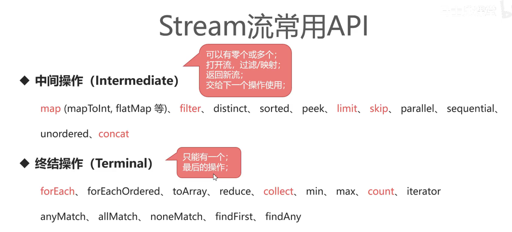
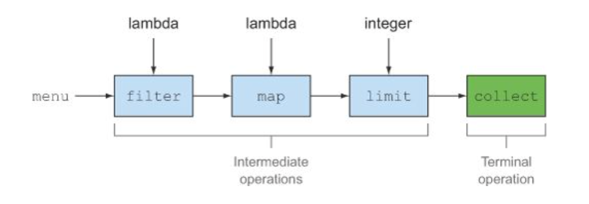
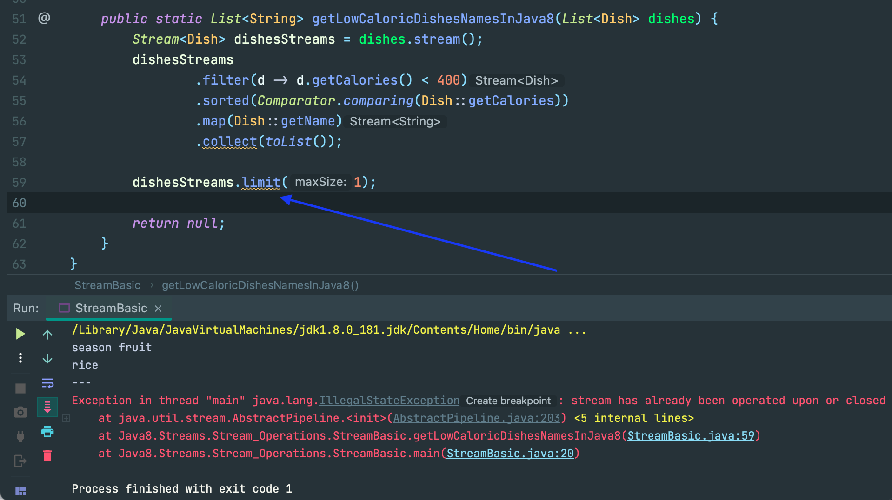

## Stream Commonly Used

---

- Intermediate operations such as `filter` or `sorted` return another `stream` as the return type. This allows the operations 
  to be connected to form a query. What’s important is that **intermediate operations** don’t perform any processing until a 
  **terminal operation** is invoked on the stream pipeline—they’re lazy. This is because intermediate operations can usually 
  be merged and processed into a single pass by the terminal operation.

- **Intermediate operations** such as `filter` and `map` return a **stream** and can be **chained** together. They’re
  used to set up a pipeline of operations but **don’t produce any result**.
- **Terminal operations** such as `forEach` and `count` return a **nonstream** value and process a stream
  pipeline to return a result.  
---

- Note: for **line57**, `dishesStream` is non-stream, it is a `List<String>`, because at this moment, `collect` is a 
  **Terminal operations**
- when we invoking `line59` : `dishesStreams.limit(1)`, which is a **Intermediate operations**, except dishesStreams is 
  still a `stream`

  