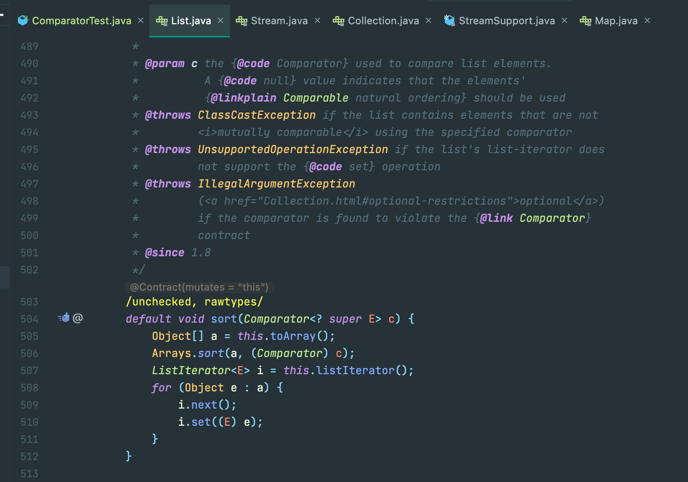
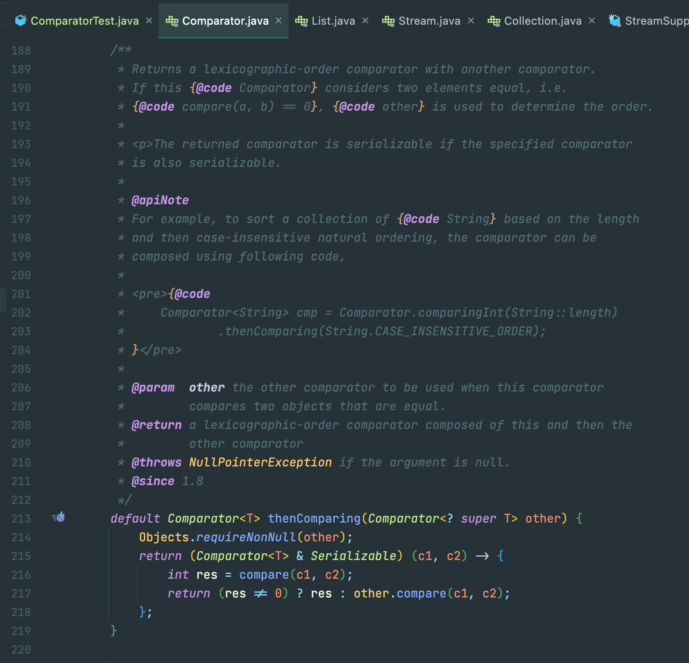
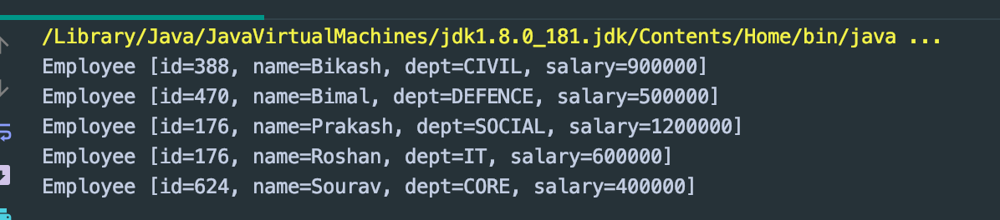
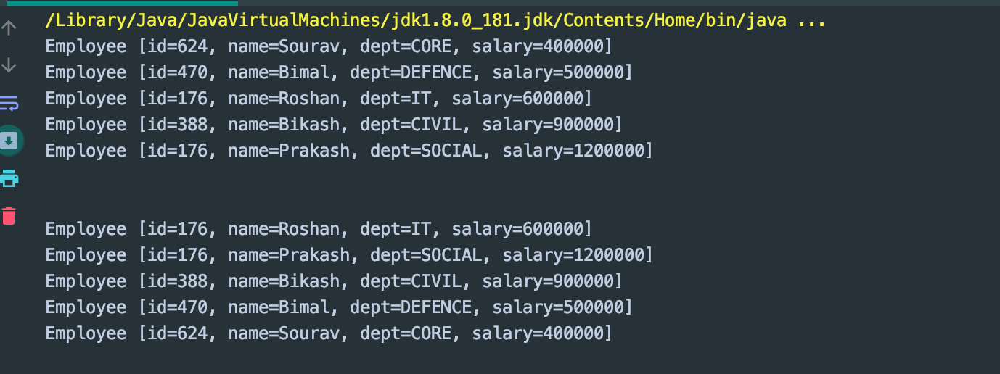
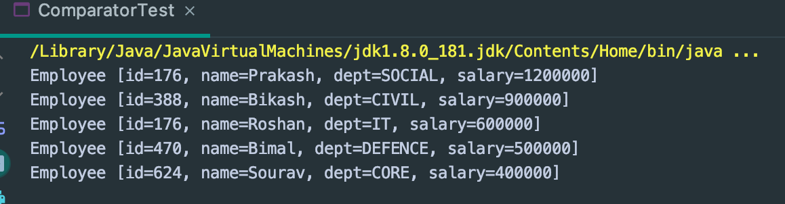
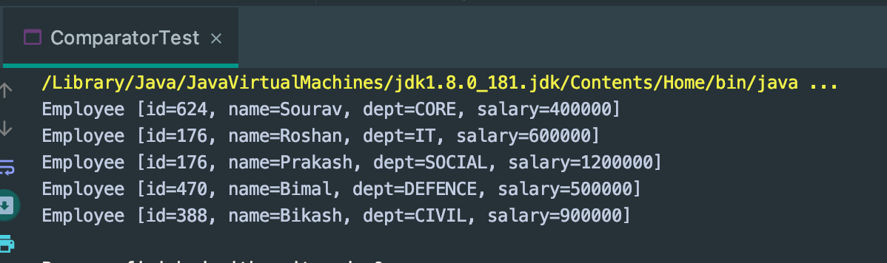
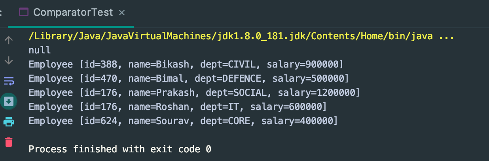
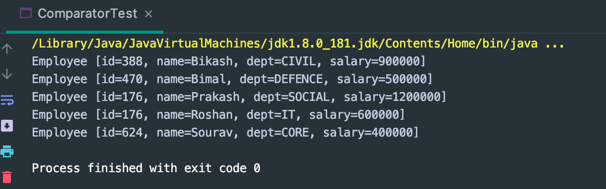

## Comparator.comparing



- srot method:

```java
default void sort(Comparator<? super E> c) {
    Object[] a = this.toArray();
    Arrays.sort(a, (Comparator) c);
    ListIterator<E> i = this.listIterator();
    for (Object e : a) {
        i.next();
        i.set((E) e);
    }
}
```
---


- 查看 Comparator 类内部实现，还有一个 comparing 方法，实现如下，

```java
public static <T, U extends Comparable<? super U>> Comparator<T> comparing(
        Function<? super T, ? extends U> keyExtractor)
{
    Objects.requireNonNull(keyExtractor);
    return (Comparator<T> & Serializable)
        (c1, c2) -> keyExtractor.apply(c1).compareTo(keyExtractor.apply(c2));
}
```
---

- 其返回值是 `(c1, c2) -> keyExtractor.apply(c1).compareTo(keyExtractor.apply(c2))`
  一个lambda表达式，也就是一个Compator 。所以上面那个例子也可以改造成 如下，


```java
public class ComparatorTest {
    public static void main(String[] args) {
        List<Employee> employees = DataBase.getEmployees();

        employees.sort((o1, o2) -> o1.getName().compareTo(o2.getName()));
        employees.forEach(obj -> System.out.println(obj));
    }
}

///////////////

public class ComparatorTest {
    public static void main(String[] args) {
        List<Employee> employees = DataBase.getEmployees();

        Collections.sort(employees, (o1, o2) -> o1.getName().compareTo(o2.getName()));
        employees.stream().forEach(System.out::println);
    }
}

/////////////

```


---

```java
public class ComparatorTest {

    public static void main(String[] args) {

        List<Employee> employees = DataBase.getEmployees();

        /*
         * Comparator.comparing 方法的使用
         *
         * comparing 方法接收一个 Function 函数式接口 ，通过一个 lambda 表达式传入
         */
        employees.sort(Comparator.comparing(e -> e.getSalary()));

        /*
         * 该方法引用 Employee::getName 可以代替 lambda表达式
         */
        employees.stream().forEach(System.out::println);
        System.out.println();
        System.out.println();

        employees.sort(Comparator.comparing(Employee::getId));
        employees.stream().forEach(System.out::println);
    }
}
```


---

### comparing 方法二

- 先看源码:
  
```java
  public static <T, U> Comparator<T> comparing(
            Function<? super T, ? extends U> keyExtractor,
            Comparator<? super U> keyComparator)
    {
        Objects.requireNonNull(keyExtractor);
        Objects.requireNonNull(keyComparator);
        return (Comparator<T> & Serializable)
            (c1, c2) -> keyComparator.compare(keyExtractor.apply(c1),
                                              keyExtractor.apply(c2));
    }
```

- 和`comparing`方法一不同的是 该方法多了一个参数`keyComparator`，keyComparator 是创建一个自定义的比较器。

```java
public class ComparatorTest {

    public static void main(String[] args) {

        List<Employee> employees = DataBase.getEmployees();

        Collections.sort(employees, Comparator.comparing(
                Employee::getSalary, (e1, e2) -> {
                    return e2.compareTo(e1);
                }
        ));
        employees.stream().forEach(System.out::println);
    }
}
```


---

### 使用 Comparator.reversed 进行排序, 返回相反的排序规则

```java
public class ComparatorTest {

    public static void main(String[] args) {

        List<Employee> employees = DataBase.getEmployees();

        Collections.sort(employees, Comparator.comparing(Employee::getName).reversed());
        employees.stream().forEach(System.out::println);
    }
}
```


---

### 使用 Comparator.nullsFirst进行排序

- 当集合中存在null元素时，可以使用针对null友好的比较器，null元素排在集合的最前面

```java
public class ComparatorTest {

    public static void main(String[] args) {

        List<Employee> employees = DataBase.getEmployees();
        employees.add(null);

        Collections.sort(employees, 
                        Comparator.nullsFirst(Comparator.comparing(Employee::getName)));
        employees.stream().forEach(System.out::println);
    }
}
```


---

### 使用 Comparator.thenComparing 排序

- 首先使用 name 排序，紧接着在使用salary 排序，来看下使用效果

```java
public class ComparatorTest {

    public static void main(String[] args) {

        List<Employee> employees = DataBase.getEmployees();
        Collections.sort(employees, Comparator.comparing(Employee::getName)
                                    .thenComparing(Employee::getSalary));

        employees.stream().forEach(System.out::println);
    }
}
```

