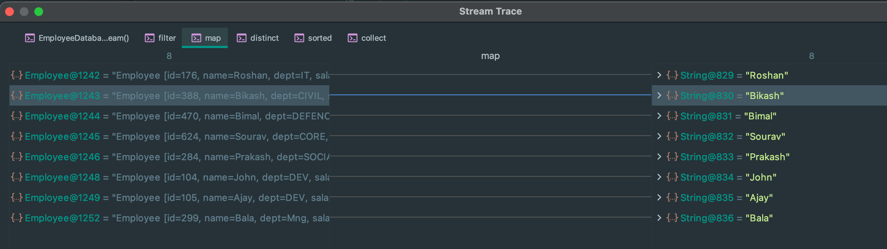

## Debug Java8 Stream Pipeline With Intellij

- install `Java Stream Debugger` plugin from `Intellij`


- `add as library`


---

### EmployeeDatabase class

```java
public class EmployeeDatabase {
    public static List<Employee> getEmployees() {
        return Stream.of(
                new Employee(176, "Roshan", "IT", 600000),
                new Employee(388, "Bikash", "CIVIL", 900000),
                new Employee(470, "Bimal", "DEFENCE", 500000),
                new Employee(624, "Sourav", "CORE", 400000),
                new Employee(284, "Prakash", "SOCIAL", 1200000),
                new Employee(103, "Sam", "QA", 40000),
                new Employee(104, "John", "DEV", 80000),
                new Employee(105, "Ajay", "DEV", 90000),
                new Employee(103, "Sam", "QA", 40000),
                new Employee(236, "Ram", "UI", 30000),
                new Employee(299, "Bala", "Mng", 200000)
        ).collect(Collectors.toList());
    }
}
```


---




---

```java
public class StreamDebuggingSession {
    public static void main(String[] args) {

        List<String> names = EmployeeDatabase.getEmployees()
                .stream()
                .filter(employee -> employee.getSalary() > 40000)
                .map(Employee::getName)
                .distinct()
                .sorted()
                .skip(0)
                .limit(3)
                .collect(Collectors.toList());

        System.out.println(names);
    }
}
```