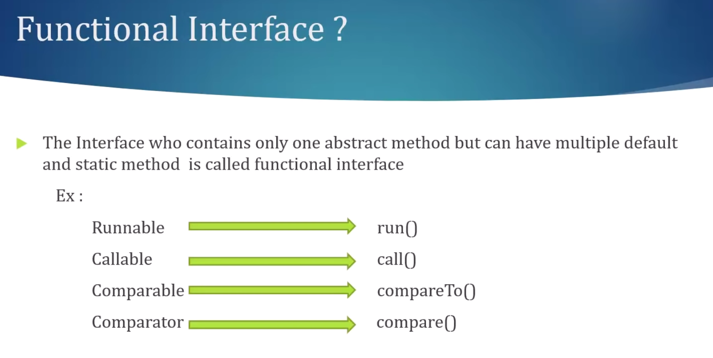

## Lambda Expression


---

---

---

```java
interface Calculator {
    void switchOn();
}

public class CalculatorImpl{
    //  ()     ->      {body}

    public static void main(String[] args) {
        Calculator calculator = () -> {
            System.out.println();
        };
        calculator.switchOn();
    }
}

// "Switch On"
```

---

```java
interface Calculator {
    void sum(int input);
}


public class CalculatorImpl{
    //  ()     ->      {body}

    public static void main(String[] args) {
        Calculator calculator = (input) -> System.out.println("sum : " + input);
        calculator.sum(188);
    }
}

// "sum : 188"
```

---

```java
interface Calculator {
    int substract(int e1, int e2);
}


public class CalculatorImpl{
    //  ()     ->      {body}

    public static void main(String[] args) {

        Calculator calculator = (i1, i2) -> i2 - i1;
        System.out.println(calculator.substract(8, 20));
    }
}

// "12"
```

---

```java

```java
interface Calculator {
    int substract(int e1, int e2);
}


public class CalculatorImpl{
    //  ()     ->      {body}

        Calculator calculator = (e1, e2) -> {
            if (e2 < e1) {
                throw new RuntimeException("message");
            } else {
                return e2 - e1;
            }
        };
        System.out.println(calculator.substract(8, 20));
}

// "12"
```

---

```java
public class BookService {

	public List<Book> getBooksInSort() {
		List<Book> books = new BookDAO().getBooks();
		Collections.sort(books, new MyComparator());
		return books;
	}

	public static void main(String[] args) {
		System.out.println(new BookService().getBooksInSort());
	}
}


 class MyComparator implements Comparator<Book> {
	 @Override
	 public int compare(Book o1, Book o2) {
		 return o1.getName().compareTo(o2.getName());
	 }
 }

/*
[
    Book [id=101, name=Core Java, pages=400], 
    Book [id=363, name=Hibernate, pages=180], 
    Book [id=275, name=Spring, pages=200], 
    Book [id=893, name=WebService, pages=300]
]
*/
```

---

```java
public class BookService {

	public List<Book> getBooksInSort() {
		List<Book> books = new BookDAO().getBooks();

		Collections.sort(books, new Comparator<Book>() {
			@Override
			public int compare(Book o1, Book o2) {
				return o2.getName().compareTo(o1.getName());
			}
		});
		return books;
	}

	public static void main(String[] args) {
		System.out.println(new BookService().getBooksInSort());
	}
}

/*  descending order
[
    Book [id=893, name=WebService, pages=300], 
    Book [id=275, name=Spring, pages=200], 
    Book [id=363, name=Hibernate, pages=180], 
    Book [id=101, name=Core Java, pages=400]]
*/
```

---

- lambda expression

```java
public class BookService {

	public List<Book> getBooksInSort() {
		List<Book> books = new BookDAO().getBooks();
		Collections.sort(books, (o1, o2) -> o1.getName().compareTo(o2.getName()));
		return books;
	}

	public static void main(String[] args) {
		System.out.println(new BookService().getBooksInSort());
	}
}

/* ascending order
[
    Book [id=101, name=Core Java, pages=400], 
    Book [id=363, name=Hibernate, pages=180], 
    Book [id=275, name=Spring, pages=200], 
    Book [id=893, name=WebService, pages=300]
]
*/
```