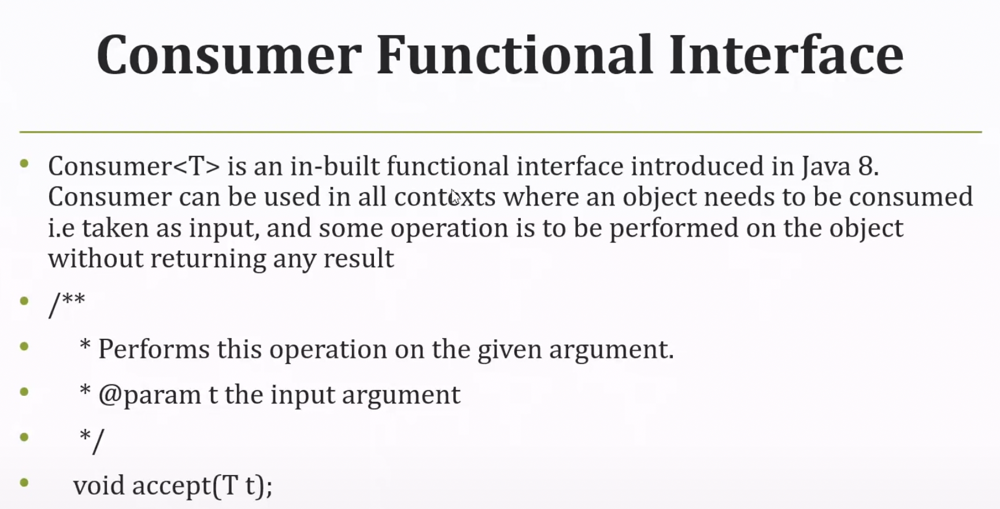
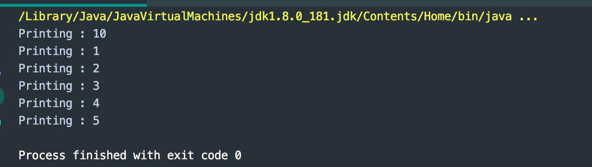
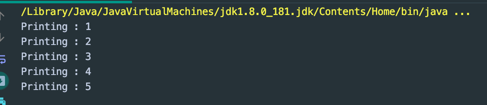
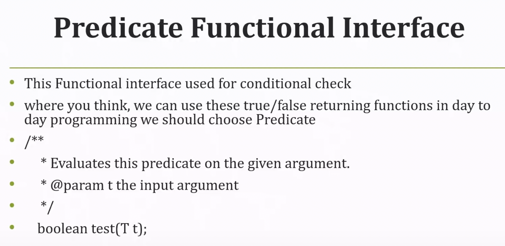
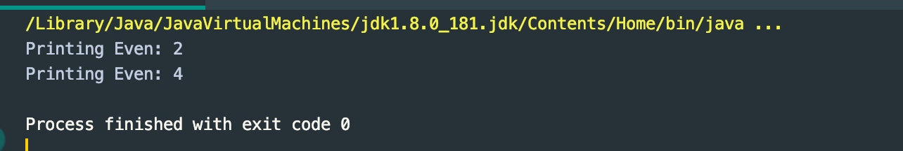
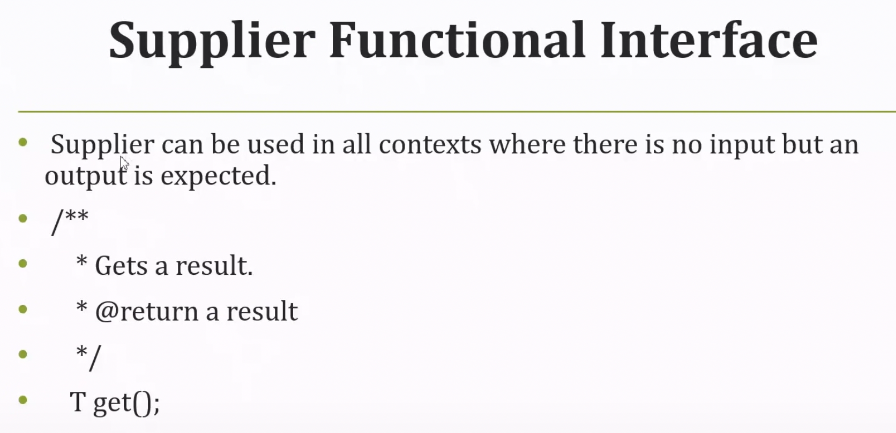
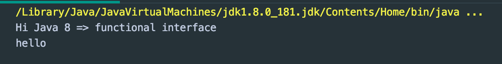
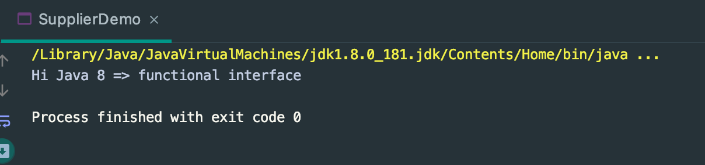

## Consumer, Predicate, Supplier Example


---

```java
// class ConsumerDemo implements Consumer<Integer>
public class ConsumerDemo {

    public static void main(String[] args) {
        Consumer<Integer> consumer = (t) -> System.out.println("Printing : " + t);
        consumer.accept(10);

        List<Integer> list1 = Arrays.asList(1, 2, 3, 4, 5);
        list1.stream().forEach(consumer);
    }
}
```



---

- use lambda

```java
    public static void main(String[] args) {
        List<Integer> list1 = Arrays.asList(1, 2, 3, 4, 5);
        list1.stream().forEach(e -> System.out.println("Printing : " + e));
    }
```

---
---




```java
public class PredicateDemo implements Predicate<Integer> {
    @Override
    public boolean test(Integer integer) {
        if (integer % 2 == 0) {
            return true;
        } else {
            return false;
        }
    }

    public static void main(String[] args) {
        Predicate<Integer> predicate = new PredicateDemo();
        System.out.println(predicate.test(7));
    }
}

// false
```

- use lambda expression

```java
public class PredicateDemo{

    public static void main(String[] args) {
        Predicate<Integer> predicate = (t) -> {
            return t % 2 == 0;
        };

        System.out.println(predicate.test(8));
    }
}

// true
```

```java
public class PredicateDemo{

    public static void main(String[] args) {
        Predicate<Integer> predicate = (t) -> {
            return t % 2 == 0;
        };

        List<Integer> list2 = Arrays.asList(1, 2, 3, 4, 5);
        list2.stream().filter(predicate).forEach(e -> System.out.println("Printing Even: " + e));
    }
}
```


- 还可以简化：

```java
public class PredicateDemo{

    public static void main(String[] args) {

        List<Integer> list2 = Arrays.asList(1, 2, 3, 4, 5);
        list2.stream().filter((t) -> t % 2 == 0).forEach(
                e -> System.out.println("Printing Even: " + e)
        );
    }
}

/*
Printing Even: 2
Printing Even: 4
*/
```

---

### Supplier Functional Interface



```java
public class SupplierDemo implements Supplier<String> {
    @Override
    public String get() {
        return "Hi Java 8 => functional interface";
    }

    public static void main(String[] args) {
        Supplier<String> supplier = new SupplierDemo();
        System.out.println(supplier.get());
    }
}

// Hi Java 8 => functional interface
```

---

```java
public class SupplierDemo {

    public static void main(String[] args) {
        Supplier<String> supplier = () -> {
            return "Hi Java 8 => functional interface";
        };
        System.out.println(supplier.get());
    }
}

// Hi Java 8 => functional interface
```

---

```java
public class SupplierDemo {
    public static void main(String[] args) {
        Supplier<String> supplier = () -> "Hi Java 8 => functional interface";
        System.out.println(supplier.get());
        List<String> list3 = Arrays.asList("hello", "world");
        System.out.println(list3.stream().findAny().orElseGet(supplier));
    }
}
```



```java
public class SupplierDemo {
    public static void main(String[] args) {
        Supplier<String> supplier = () -> "Hi Java 8 => functional interface";
        List<String> list3 = Arrays.asList();
        System.out.println(list3.stream().findAny().orElseGet(supplier));
    }
}
```



- 注意以上代码为什么会invoke supplier的值？学会看源代码:

```java
    /**
     * Return the value if present, otherwise invoke {@code other} and return
     * the result of that invocation.
     *
     * @param other a {@code Supplier} whose result is returned if no value
     * is present
     * @return the value if present otherwise the result of {@code other.get()}
     * @throws NullPointerException if value is not present and {@code other} is
     * null
     */
    public T orElseGet(Supplier<? extends T> other) {
        return value != null ? value : other.get();
    }
```