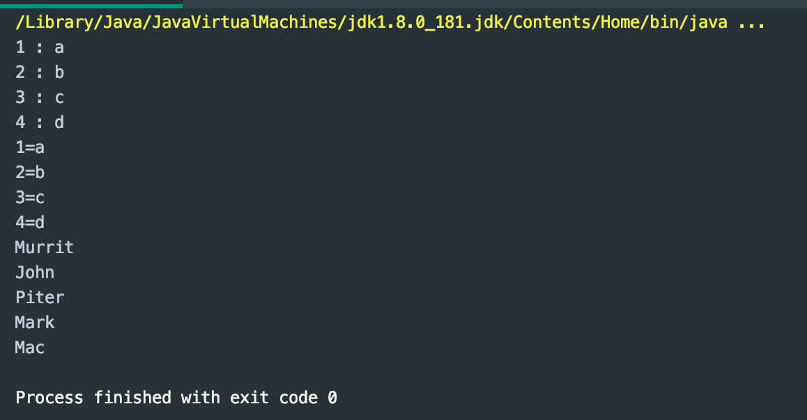
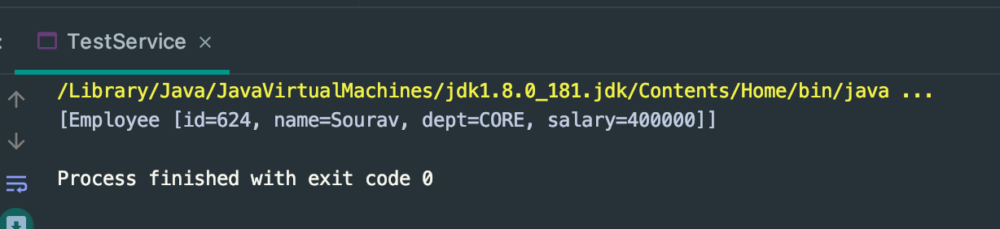

## Stream API | forEach, filter example


---


---


---

```java
public class ForEachDemo {

    public static void main(String[] args) {
        List<String> list = new ArrayList<>();
        list.add("Murrit");
        list.add("John");
        list.add("Piter");
        list.add("Mark");
        list.add("Mac");

        for (String s : list) {
            System.out.println(s);
        }

        list.stream().forEach(t -> System.out.println(t));
    }
}
```


---

```java
public class ForEachDemo {

    public static void main(String[] args) {

        Map<Integer, String> map = new HashMap<>();
        map.put(1, "a");
        map.put(2, "b");
        map.put(3, "c");
        map.put(4, "d");

        map.forEach((key, value) -> System.out.println(key + " : " + value));
    }
}
```


---

```java
public static void main(String[] args) {

    Map<Integer, String> map = new HashMap<>();
    map.put(1, "a");
    map.put(2, "b");
    map.put(3, "c");
    map.put(4, "d");

    map.forEach((key, value) -> System.out.println(key + " : " + value));
    map.entrySet().stream().forEach(obj -> System.out.println(obj));
}
```


---

```java
public class ForEachDemo {
    public static void main(String[] args) {

        Map<Integer, String> map = new HashMap<>();
        map.put(1, "a");
        map.put(2, "b");
        map.put(3, "c");
        map.put(4, "d");

        map.forEach((key, value) -> System.out.println(key + " : " + value));
        map.entrySet().stream().forEach(obj -> System.out.println(obj));

        Consumer<String> consumer = (t) -> System.out.println(t);
        consumer.accept("Java 8 consumer");
    }
}
```


---

```java
public class ForEachDemo {

    public static void main(String[] args) {
        List<String> list = new ArrayList<>();
        list.add("Murrit");
        list.add("John");
        list.add("Piter");
        list.add("Mark");
        list.add("Mac");


        Map<Integer, String> map = new HashMap<>();
        map.put(1, "a");
        map.put(2, "b");
        map.put(3, "c");
        map.put(4, "d");

        map.forEach((key, value) -> System.out.println(key + " : " + value));
        map.entrySet().stream().forEach(obj -> System.out.println(obj));

        Consumer<String> consumer = (t) -> System.out.println(t);
        for (String s : list) {
            consumer.accept(s);
        }
    }
}
```


---

### filter => conditional check

```java
public class ForEachDemo {

    public static void main(String[] args) {
        List<String> list = new ArrayList<>();
        list.add("Murrit");
        list.add("John");
        list.add("piter");
        list.add("mark");
        list.add("mac");

        for (String s : list) {
            if (s.startsWith("m")) {
                System.out.println(s);
            }
        }
    }
}
```


---

```java
public class ForEachDemo {

    public static void main(String[] args) {
        List<String> list = new ArrayList<>();
        list.add("Murrit");
        list.add("John");
        list.add("piter");
        list.add("mark");
        list.add("mac");

        list.stream().filter((t) -> t.startsWith("m")).forEach(
                t -> System.out.println(t)
        );
    }
}
```


---

```java
public class ForEachDemo {

    public static void main(String[] args) {
        List<String> list = new ArrayList<>();
        list.add("Murrit");
        list.add("John");
        list.add("piter");
        list.add("mark");
        list.add("mac");

        Map<Integer, String> map = new HashMap<>();
        map.put(1, "a");
        map.put(2, "b");
        map.put(3, "c");
        map.put(4, "d");

        map.entrySet().stream().filter(entry -> entry.getKey() % 2 == 0).forEach(obj -> System.out.println(obj));
    }
}
```


---

```java
public class DataBase {

	public static List<Employee> getEmployees() {
		List<Employee> list = new ArrayList<>();
		list.add(new Employee(176, "Roshan", "IT", 600000));
		list.add(new Employee(388, "Bikash", "CIVIL", 900000));
		list.add(new Employee(470, "Bimal", "DEFENCE", 500000));
		list.add(new Employee(624, "Sourav", "CORE", 400000));
		list.add(new Employee(176, "Prakash", "SOCIAL", 1200000));
		return list;
	}
}

public class TestService {

    public static List<Employee> evaluateTaxUsers() {
        return DataBase.getEmployees().stream().filter(emp -> emp.getSalary() > 500000)
                .collect(Collectors.toList());
    }

    public static void main(String[] args) {
        System.out.println(evaluateTaxUsers());
    }
}

/*
[
    Employee [id=176, name=Roshan, dept=IT, salary=600000], 
    Employee [id=388, name=Bikash, dept=CIVIL, salary=900000], 
    Employee [id=176, name=Prakash, dept=SOCIAL, salary=1200000]
]
*/
```

---

```java
public class TestService {

    public static List<Employee> evaluateTaxUsers(String input) {
        if (input.equalsIgnoreCase("tax")) {
            return DataBase.getEmployees().stream().filter(emp -> emp.getSalary() > 500000)
                    .collect(Collectors.toList());
        } else {
            return DataBase.getEmployees().stream().filter(emp -> emp.getSalary() < 500000)
                    .collect(Collectors.toList());
        }
    }

    public static void main(String[] args) {
        System.out.println(evaluateTaxUsers("non tax"));
    }
}
```


---
