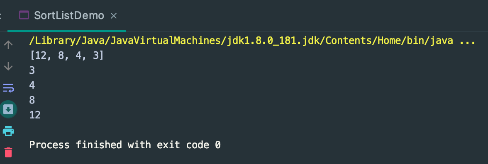
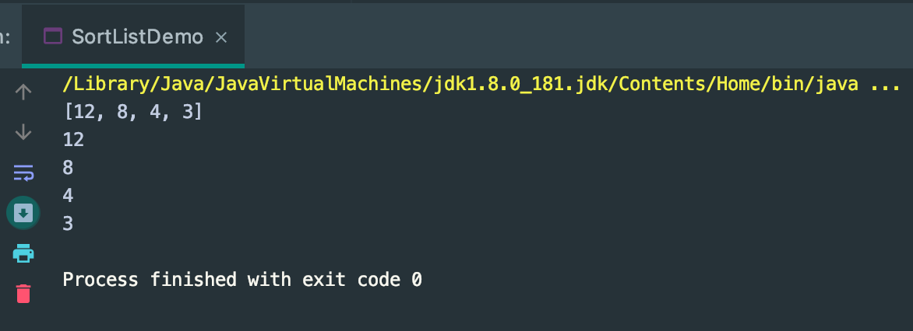
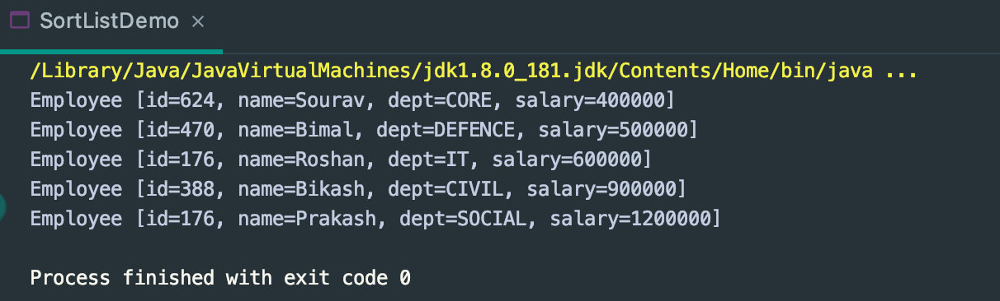
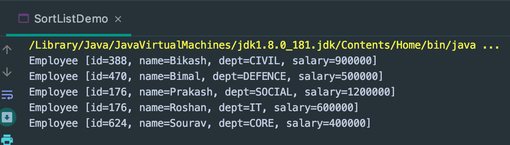

## Sort a List by Lambda

```java
public class SortListDemo {
	public static void main(String[] args) {
		List<Integer> list = new ArrayList<>();
		list.add(8);
		list.add(3);
		list.add(12);
		list.add(4);

		Collections.sort(list);//ascending
		Collections.reverse(list);//descending
		System.out.println(list);

		list.stream().sorted().forEach(e -> System.out.println(e));//ascending
	}
}
```


---

```java
public class SortListDemo {
	public static void main(String[] args) {
		List<Integer> list = new ArrayList<>();
		list.add(8);
		list.add(3);
		list.add(12);
		list.add(4);

		Collections.sort(list);//ascending
		Collections.reverse(list);//descending
		System.out.println(list);

		list.stream().sorted(Comparator.reverseOrder()).forEach(e -> System.out.println(e));//descending
	}
}
```


---

```java
public class SortListDemo {
	public static void main(String[] args) {
		List<Integer> list = new ArrayList<>();
		list.add(8);
		list.add(3);
		list.add(12);
		list.add(4);

		List<Employee> employees = DataBase.getEmployees();
		Collections.sort(employees, new MyComparator());
		System.out.println(employees);
	}
}

class MyComparator implements Comparator<Employee> {
	@Override
	public int compare(Employee o1, Employee o2) {
		return (int) (o1.getSalary() - o2.getSalary());//ascending
	}
}
/*
[
    Employee [id=624, name=Sourav, dept=CORE, salary=400000], 
    Employee [id=470, name=Bimal, dept=DEFENCE, salary=500000], 
    Employee [id=176, name=Roshan, dept=IT, salary=600000], 
    Employee [id=388, name=Bikash, dept=CIVIL, salary=900000], 
    Employee [id=176, name=Prakash, dept=SOCIAL, salary=1200000]
]
*/
```

---

```java
public class SortListDemo {
	public static void main(String[] args) {
		List<Integer> list = new ArrayList<>();
		list.add(8);
		list.add(3);
		list.add(12);
		list.add(4);

		List<Employee> employees = DataBase.getEmployees();
		Collections.sort(employees, new Comparator<Employee>() {
			@Override
			public int compare(Employee o1, Employee o2) {
				return (int) (o1.getSalary() - o2.getSalary());
			}
		});
		System.out.println(employees);
	}
}
/*
[
    Employee [id=624, name=Sourav, dept=CORE, salary=400000], 
    Employee [id=470, name=Bimal, dept=DEFENCE, salary=500000], 
    Employee [id=176, name=Roshan, dept=IT, salary=600000], 
    Employee [id=388, name=Bikash, dept=CIVIL, salary=900000], 
    Employee [id=176, name=Prakash, dept=SOCIAL, salary=1200000]
]
*/
```

---

```java
public class DataBase {

	public static List<Employee> getEmployees() {
		List<Employee> list = new ArrayList<>();
		list.add(new Employee(176, "Roshan", "IT", 600000));
		list.add(new Employee(388, "Bikash", "CIVIL", 900000));
		list.add(new Employee(470, "Bimal", "DEFENCE", 500000));
		list.add(new Employee(624, "Sourav", "CORE", 400000));
		list.add(new Employee(176, "Prakash", "SOCIAL", 1200000));
		return list;
	}
}

public class SortListDemo {
	public static void main(String[] args) {
		List<Integer> list = new ArrayList<>();
		list.add(8);
		list.add(3);
		list.add(12);
		list.add(4);

		List<Employee> employees = DataBase.getEmployees();

		Collections.sort(employees, (e1, e2) -> (int) (e1.getSalary() - e2.getSalary()));

		System.out.println(employees);
	}
}
/*
[
    Employee [id=624, name=Sourav, dept=CORE, salary=400000], 
    Employee [id=470, name=Bimal, dept=DEFENCE, salary=500000], 
    Employee [id=176, name=Roshan, dept=IT, salary=600000], 
    Employee [id=388, name=Bikash, dept=CIVIL, salary=900000], 
    Employee [id=176, name=Prakash, dept=SOCIAL, salary=1200000]
]
*/
```
---

```java
public class SortListDemo {
	public static void main(String[] args) {
		List<Integer> list = new ArrayList<>();
		list.add(8);
		list.add(3);
		list.add(12);
		list.add(4);

		List<Employee> employees = DataBase.getEmployees();

		Collections.sort(employees, (e1, e2) -> (int) (e1.getSalary() - e2.getSalary()));

//		System.out.println(employees);

		employees.stream().sorted((e1, e2) -> (int) (e1.getSalary() - e2.getSalary()))
				.forEach(System.out::println);
	}
}
```


---

```java
public class SortListDemo {
	public static void main(String[] args) {
		List<Integer> list = new ArrayList<>();
		list.add(8);
		list.add(3);
		list.add(12);
		list.add(4);

		List<Employee> employees = DataBase.getEmployees();

		employees.stream().sorted(Comparator.comparing(emp -> emp.getSalary()))
				.forEach(System.out::println);
	}
}
```


---

### reference method

```java
public class SortListDemo {
	public static void main(String[] args) {
		List<Integer> list = new ArrayList<>();
		list.add(8);
		list.add(3);
		list.add(12);
		list.add(4);

		List<Employee> employees = DataBase.getEmployees();

		Collections.sort(employees, (e1, e2) -> (int) (e1.getSalary() - e2.getSalary()));

		employees.stream().sorted(Comparator.comparing(Employee::getName))
				.forEach(System.out::println);
	}
}
```


---