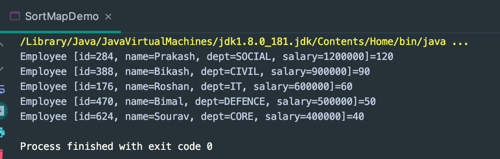

## How to Sort a Map using Lambda | Example

```java
public class SortMapDemo {
    public static void main(String[] args) {
        Map<String, Integer> map = new HashMap<>();
        map.put("eight", 8);
        map.put("four", 4);
        map.put("ten", 10);
        map.put("two", 2);

        List<Map.Entry<String, Integer>> entries = new ArrayList<>(map.entrySet());
        Collections.sort(entries, new Comparator<Map.Entry<String, Integer>>() {
            @Override
            public int compare(Map.Entry<String, Integer> o1, Map.Entry<String, Integer> o2) {
                return o1.getKey().compareTo(o2.getKey());
            }
        });

        for (Map.Entry<String, Integer> entry : entries) {
            System.out.println(entry.getKey() + " : " + entry.getValue());
        }
    }
}
```

---

```java
public class SortMapDemo {
    public static void main(String[] args) {
        Map<String, Integer> map = new HashMap<>();
        map.put("eight", 8);
        map.put("four", 4);
        map.put("ten", 10);
        map.put("two", 2);

        List<Map.Entry<String, Integer>> entries = new ArrayList<>(map.entrySet());
        Collections.sort(entries, (o1, o2) -> o1.getKey().compareTo(o2.getKey()));

        for (Map.Entry<String, Integer> entry : entries) {
            System.out.println(entry.getKey() + " : " + entry.getValue());
        }
    }
}
```

---

```java
public class SortMapDemo {
    public static void main(String[] args) {
        Map<String, Integer> map = new HashMap<>();
        map.put("eight", 8);
        map.put("four", 4);
        map.put("ten", 10);
        map.put("two", 2);

        map.entrySet().stream().sorted(Map.Entry.comparingByKey()).forEach(System.out::println);
        System.out.println("*********************************************");
        map.entrySet().stream().sorted(Map.Entry.comparingByValue()).forEach(System.out::println);
    }
}
```


---

```java
public class SortMapDemo {
    public static void main(String[] args) {

        Map<Employee, Integer> employeeMap = new TreeMap<>(new Comparator<Employee>() {
            @Override
            public int compare(Employee o1, Employee o2) {
                return (int) (o1.getSalary() - o2.getSalary());
            }
        });

        employeeMap.put(new Employee(176, "Roshan", "IT", 600000), 60);
        employeeMap.put(new Employee(388, "Bikash", "CIVIL", 900000), 90);
        employeeMap.put(new Employee(470, "Bimal", "DEFENCE", 500000), 50);
        employeeMap.put(new Employee(624, "Sourav", "CORE", 400000), 40);
        employeeMap.put(new Employee(284, "Prakash", "SOCIAL", 1200000), 120);
        System.out.println(employeeMap);
    }
}


///////////////////////////////


public class SortMapDemo {
    public static void main(String[] args) {

        Map<Employee, Integer> employeeMap = new TreeMap<>((o1, o2) ->
                (int) (o1.getSalary() - o2.getSalary())
        );

        employeeMap.put(new Employee(176, "Roshan", "IT", 600000), 60);
        employeeMap.put(new Employee(388, "Bikash", "CIVIL", 900000), 90);
        employeeMap.put(new Employee(470, "Bimal", "DEFENCE", 500000), 50);
        employeeMap.put(new Employee(624, "Sourav", "CORE", 400000), 40);
        employeeMap.put(new Employee(284, "Prakash", "SOCIAL", 1200000), 120);
        System.out.println(employeeMap);
    }
}


/*
{
    Employee [id=624, name=Sourav, dept=CORE, salary=400000]=40, 
    Employee [id=470, name=Bimal, dept=DEFENCE, salary=500000]=50, 
    Employee [id=176, name=Roshan, dept=IT, salary=600000]=60, 
    Employee [id=388, name=Bikash, dept=CIVIL, salary=900000]=90, 
    Employee [id=284, name=Prakash, dept=SOCIAL, salary=1200000]=120}
*/
```

---

```java
public class SortMapDemo {
    public static void main(String[] args) {

        Map<Employee, Integer> employeeMap = new TreeMap<>((o1, o2) ->
                (int) (o1.getSalary() - o2.getSalary())
        );

        employeeMap.put(new Employee(176, "Roshan", "IT", 600000), 60);
        employeeMap.put(new Employee(388, "Bikash", "CIVIL", 900000), 90);
        employeeMap.put(new Employee(470, "Bimal", "DEFENCE", 500000), 50);
        employeeMap.put(new Employee(624, "Sourav", "CORE", 400000), 40);
        employeeMap.put(new Employee(284, "Prakash", "SOCIAL", 1200000), 120);

        employeeMap.entrySet().stream().sorted(
                Map.Entry.comparingByKey(Comparator.comparing(Employee::getSalary))
        ).forEach(System.out::println);
    }
}
```

---

- print by descending:

```java
public class SortMapDemo {
    public static void main(String[] args) {

        Map<Employee, Integer> employeeMap = new TreeMap<>((o1, o2) ->
                (int) (o1.getSalary() - o2.getSalary())
        );

        employeeMap.put(new Employee(176, "Roshan", "IT", 600000), 60);
        employeeMap.put(new Employee(388, "Bikash", "CIVIL", 900000), 90);
        employeeMap.put(new Employee(470, "Bimal", "DEFENCE", 500000), 50);
        employeeMap.put(new Employee(624, "Sourav", "CORE", 400000), 40);
        employeeMap.put(new Employee(284, "Prakash", "SOCIAL", 1200000), 120);

        employeeMap.entrySet().stream().sorted(
                Map.Entry.comparingByKey(Comparator.comparing(Employee::getSalary).reversed())
        ).forEach(System.out::println);
    }
}
```


---
