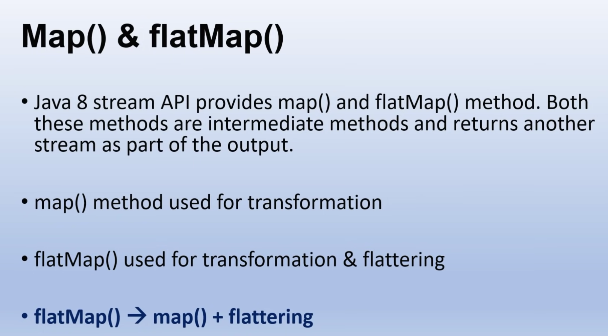
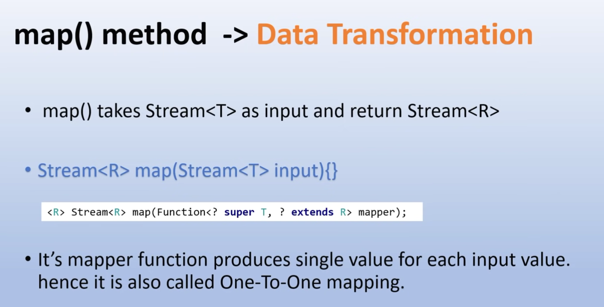
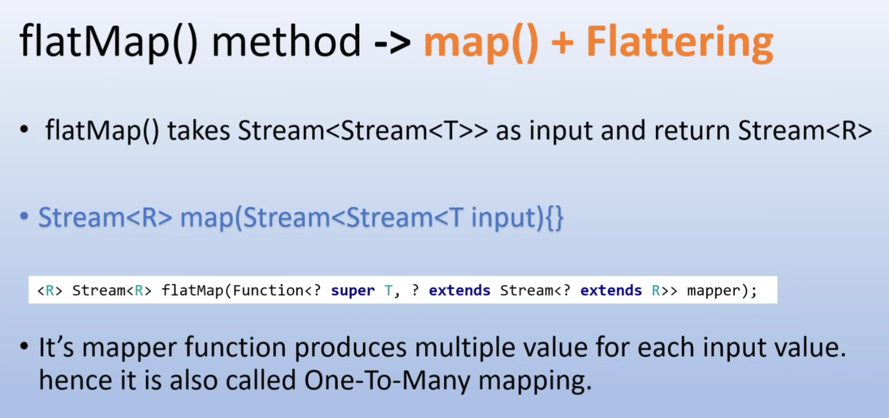
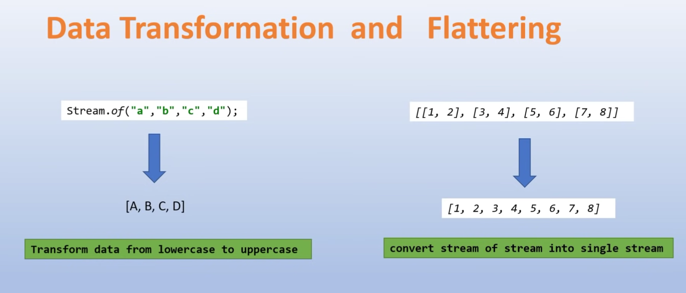
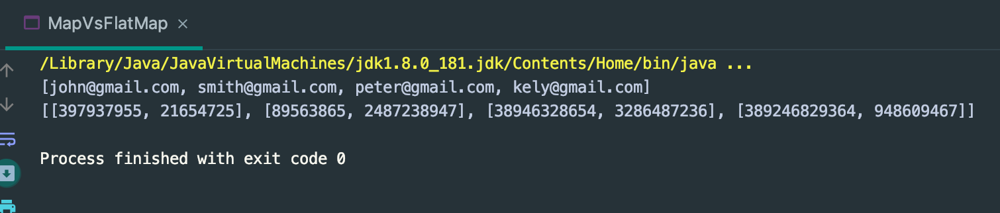
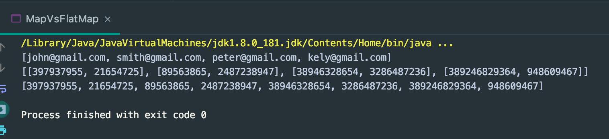

## map() vs. flatMap()

- Differences between Java 8 Map() Vs flatMap() :
---

map() | flatMap() | 
--- | --- |  
It processes stream of values. | It processes stream of stream of values. 
It does only mapping. | It performs mapping as well as flattening.
It’s mapper function produces single value for each input value. | It’s mapper function produces multiple values for each input value. 
It is a One-To-One mapping. | It is a One-To-Many mapping. 
Data Transformation : From Stream<T> to Stream<R> | Data Transformation : From Stream<Stream<T> to Stream<R> 
Use this method when the mapper function is producing a single value for each input value. | Use this method when the mapper function is producing multiple values for each input value. 



---

---


---


---

### Customer Class

```java
public class Customer {

    private int id;
    private String name;
    private String email;
    private List<String> phoneNumbers;

    public Customer() {
    }

    public Customer(int id, String name, String email, List<String> phoneNumbers) {
        this.id = id;
        this.name = name;
        this.email = email;
        this.phoneNumbers = phoneNumbers;
    }

    public int getId() {
        return id;
    }

    public void setId(int id) {
        this.id = id;
    }

    public String getName() {
        return name;
    }

    public void setName(String name) {
        this.name = name;
    }

    public String getEmail() {
        return email;
    }

    public void setEmail(String email) {
        this.email = email;
    }

    public List<String> getPhoneNumbers() {
        return phoneNumbers;
    }

    public void setPhoneNumbers(List<String> phoneNumbers) {
        this.phoneNumbers = phoneNumbers;
    }
}
```
---

### CustomerDataBase

```java
public class CusDataBase {


    public static List<Customer> getAll() {
        return Stream.of(
                new Customer(101, "john", "john@gmail.com", Arrays.asList("397937955", "21654725")),
                new Customer(102, "smith", "smith@gmail.com", Arrays.asList("89563865", "2487238947")),
                new Customer(103, "peter", "peter@gmail.com", Arrays.asList("38946328654", "3286487236")),
                new Customer(104, "ketty", "kely@gmail.com", Arrays.asList("389246829364", "948609467"))
        ).collect(Collectors.toList());
    }
}
```
---

```java
public class MapVsFlatMap {
    public static void main(String[] args) {
        List<Customer> customers = CusDataBase.getAll();

        //List<Customer> convert List<String> -> Data Transformation
        //mapping : customer -> customer.getEmail()
        //customer -> customer.getEmail()  |  one to one mapping
        List<String> emails = customers.stream().map(
                customer -> customer.getEmail()).collect(Collectors.toList());
        System.out.println(emails);

        //customer -> customer.getPhoneNumbers()  ->> one to many mapping
        List<List<String>> phoneNumbers = customers.stream().map(
                customer -> customer.getPhoneNumbers()
        ).collect(Collectors.toList());
        System.out.println(phoneNumbers);
    }
}
```

---

```java
public class MapVsFlatMap {
    public static void main(String[] args) {
        List<Customer> customers = CusDataBase.getAll();

        //List<Customer> convert List<String> -> Data Transformation
        //mapping : customer -> customer.getEmail()
        //customer -> customer.getEmail()  |  one to one mapping
        List<String> emails = customers.stream()
                .map(customer -> customer.getEmail())
                .collect(Collectors.toList());
        System.out.println(emails);

        //customer -> customer.getPhoneNumbers()  ->> one to many mapping
        List<List<String>> phoneNumbers = customers.stream()
                .map(customer -> customer.getPhoneNumbers())
                .collect(Collectors.toList());
        System.out.println(phoneNumbers);


        //List<Customer>  convert List<String> -> Data Transformation
        //mapping : customer -> phone Numbers
        //customer -> customer.getPhoneNumbers()  ->> one to many mapping
        List<String> phones = customers.stream().
                flatMap(customer -> customer.getPhoneNumbers().stream())
                .collect(Collectors.toList());
        System.out.println(phones);
    }
}
```




