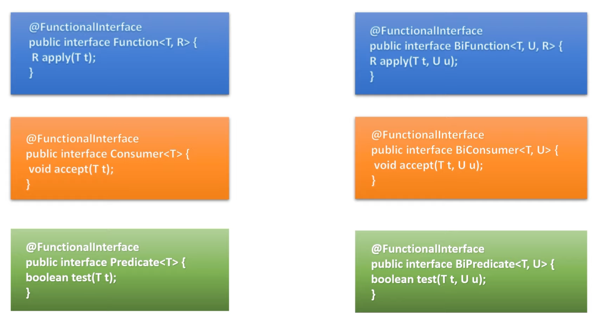
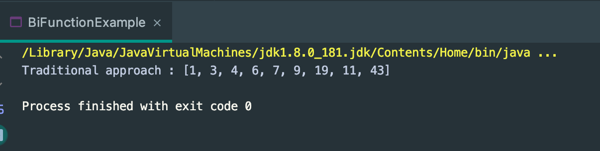
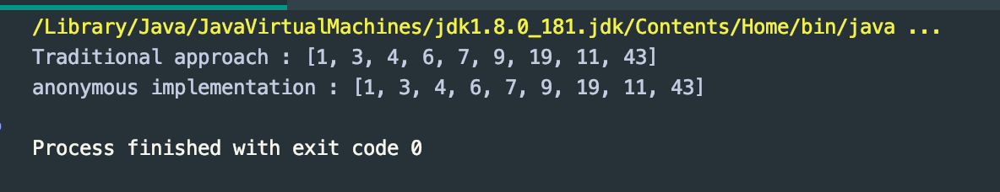
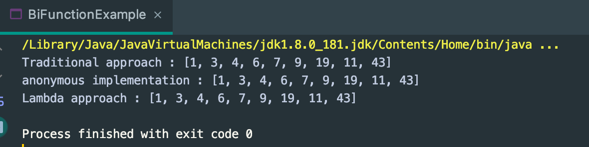
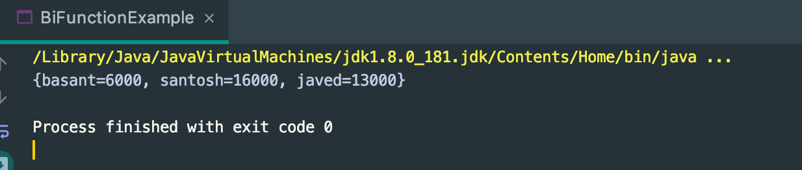

## BiFunction, BiConsumer & BiPredicate Interface


---

```java
public class BiFunctionExample implements BiFunction<List<Integer>, List<Integer>, List<Integer>> {
    @Override
    public List<Integer> apply(List<Integer> list1, List<Integer> list2) {
        return Stream.of(list1, list2)
                .flatMap(List::stream)
                .distinct()
                .collect(Collectors.toList());
    }

    public static void main(String[] args) {
        BiFunction biFunction = new BiFunctionExample();
        List<Integer> list1 = Stream.of(1, 3, 4, 6, 7, 9, 19).collect(Collectors.toList());
        List<Integer> list2 = Stream.of(11, 3, 43, 6, 7, 19).collect(Collectors.toList());
        System.out.println("Traditional approach : " + biFunction.apply(list1, list2));
    }
}
```


- there is no duplicate elements
---

```java
public class BiFunctionExample implements BiFunction<List<Integer>, List<Integer>, List<Integer>> {
    @Override
    public List<Integer> apply(List<Integer> list1, List<Integer> list2) {
        return Stream.of(list1, list2)
                .flatMap(List::stream)
                .distinct()
                .collect(Collectors.toList());
    }

    public static void main(String[] args) {
        BiFunction biFunction = new BiFunctionExample();
        List<Integer> list1 = Stream.of(1, 3, 4, 6, 7, 9, 19).collect(Collectors.toList());
        List<Integer> list2 = Stream.of(11, 3, 43, 6, 7, 19).collect(Collectors.toList());
        System.out.println("Traditional approach : " + biFunction.apply(list1, list2));

        BiFunction<List<Integer>, List<Integer>, List<Integer>> biFunction1 =
                new BiFunction<List<Integer>, List<Integer>, List<Integer>>() {
                    @Override
                    public List<Integer> apply(List<Integer> l1, List<Integer> l2) {
                        return Stream.of(l1, l2)
                                .flatMap(List::stream)
                                .distinct()
                                .collect(Collectors.toList());
                    }
                };

        System.out.println("anonymous implementation : " + biFunction1.apply(list1, list2));
    }
}
```


---

```java
public class BiFunctionExample implements BiFunction<List<Integer>, List<Integer>, List<Integer>> {
    @Override
    public List<Integer> apply(List<Integer> list1, List<Integer> list2) {
        return Stream.of(list1, list2)
                .flatMap(List::stream)
                .distinct()
                .collect(Collectors.toList());
    }

    public static void main(String[] args) {
        BiFunction biFunction = new BiFunctionExample();
        List<Integer> list1 = Stream.of(1, 3, 4, 6, 7, 9, 19).collect(Collectors.toList());
        List<Integer> list2 = Stream.of(11, 3, 43, 6, 7, 19).collect(Collectors.toList());
        System.out.println("Traditional approach : " + biFunction.apply(list1, list2));

        BiFunction<List<Integer>, List<Integer>, List<Integer>> biFunction1 =
                new BiFunction<List<Integer>, List<Integer>, List<Integer>>() {
                    @Override
                    public List<Integer> apply(List<Integer> l1, List<Integer> l2) {
                        return Stream.of(l1, l2)
                                .flatMap(List::stream)
                                .distinct()
                                .collect(Collectors.toList());
                    }
                };

        System.out.println("anonymous implementation : " + biFunction1.apply(list1, list2));


        BiFunction<List<Integer>, List<Integer>, List<Integer>> biFunction2 = (l1, l2) -> {
            return Stream.of(l1, l2)
                    .flatMap(List::stream)
                    .distinct()
                    .collect(Collectors.toList());
        };

        System.out.println("Lambda approach : " + biFunction2.apply(list1, list2));
    }
}
```


---

### Map 

- 先看看源代码:

```java
default void replaceAll(BiFunction<? super K, ? super V, ? extends V> function) {
    Objects.requireNonNull(function);
    for (Map.Entry<K, V> entry : entrySet()) {
        K k;
        V v;
        try {
            k = entry.getKey();
            v = entry.getValue();
        } catch(IllegalStateException ise) {
            // this usually means the entry is no longer in the map.
            throw new ConcurrentModificationException(ise);
        }

        // ise thrown from function is not a cme.
        v = function.apply(k, v);

        try {
            entry.setValue(v);
        } catch(IllegalStateException ise) {
            // this usually means the entry is no longer in the map.
            throw new ConcurrentModificationException(ise);
        }
    }
}
```

```java
public class BiFunctionExample implements BiFunction<List<Integer>, List<Integer>, List<Integer>> {
    @Override
    public List<Integer> apply(List<Integer> list1, List<Integer> list2) {
        return Stream.of(list1, list2)
                .flatMap(List::stream)
                .distinct()
                .collect(Collectors.toList());
    }

    public static void main(String[] args) {

        Map<String, Integer> map=new HashMap<>();
        map.put("basant",5000);
        map.put("santosh",15000);
        map.put("javed",12000);

        BiFunction<String, Integer, Integer> increaseSalaryBiFunction = new BiFunction<String, Integer, Integer>() {
            @Override
            public Integer apply(String key, Integer value) {
                return value + 1000;
            }
        };

        map.replaceAll(increaseSalaryBiFunction);
        System.out.println(map);
    }
}
```


---

- use lambda:

```java
public class BiFunctionExample implements BiFunction<List<Integer>, List<Integer>, List<Integer>> {
    @Override
    public List<Integer> apply(List<Integer> list1, List<Integer> list2) {
        return Stream.of(list1, list2)
                .flatMap(List::stream)
                .distinct()
                .collect(Collectors.toList());
    }

    public static void main(String[] args) {

        Map<String, Integer> map=new HashMap<>();
        map.put("basant",5000);
        map.put("santosh",15000);
        map.put("javed",12000);

        BiFunction<String, Integer, Integer> increaseSalaryBiFunction = (key, value) -> {
            return value + 2000;
        };

        map.replaceAll(increaseSalaryBiFunction);
        System.out.println(map);
    }
}

// {basant=7000, santosh=17000, javed=14000}
```
---


