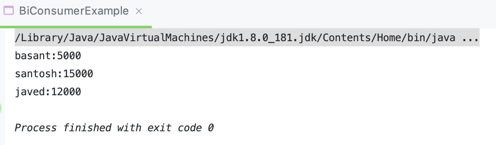

## BiFunction, BiConsumer & BiPredicate Interface


---

```java
public class BiFunctionExample implements BiFunction<List<Integer>, List<Integer>, List<Integer>> {
    @Override
    public List<Integer> apply(List<Integer> list1, List<Integer> list2) {
        return Stream.of(list1, list2)
                .flatMap(List::stream)
                .distinct()
                .collect(Collectors.toList());
    }

    public static void main(String[] args) {
        BiFunction biFunction = new BiFunctionExample();
        List<Integer> list1 = Stream.of(1, 3, 4, 6, 7, 9, 19).collect(Collectors.toList());
        List<Integer> list2 = Stream.of(11, 3, 43, 6, 7, 19).collect(Collectors.toList());
        System.out.println("Traditional approach : " + biFunction.apply(list1, list2));
    }
}
```


- there is no duplicate elements
---

```java
public class BiFunctionExample implements BiFunction<List<Integer>, List<Integer>, List<Integer>> {
    @Override
    public List<Integer> apply(List<Integer> list1, List<Integer> list2) {
        return Stream.of(list1, list2)
                .flatMap(List::stream)
                .distinct()
                .collect(Collectors.toList());
    }

    public static void main(String[] args) {
        BiFunction biFunction = new BiFunctionExample();
        List<Integer> list1 = Stream.of(1, 3, 4, 6, 7, 9, 19).collect(Collectors.toList());
        List<Integer> list2 = Stream.of(11, 3, 43, 6, 7, 19).collect(Collectors.toList());
        System.out.println("Traditional approach : " + biFunction.apply(list1, list2));

        BiFunction<List<Integer>, List<Integer>, List<Integer>> biFunction1 =
                new BiFunction<List<Integer>, List<Integer>, List<Integer>>() {
                    @Override
                    public List<Integer> apply(List<Integer> l1, List<Integer> l2) {
                        return Stream.of(l1, l2)
                                .flatMap(List::stream)
                                .distinct()
                                .collect(Collectors.toList());
                    }
                };

        System.out.println("anonymous implementation : " + biFunction1.apply(list1, list2));
    }
}
```


---

```java
public class BiFunctionExample implements BiFunction<List<Integer>, List<Integer>, List<Integer>> {
    @Override
    public List<Integer> apply(List<Integer> list1, List<Integer> list2) {
        return Stream.of(list1, list2)
                .flatMap(List::stream)
                .distinct()
                .collect(Collectors.toList());
    }

    public static void main(String[] args) {
        BiFunction biFunction = new BiFunctionExample();
        List<Integer> list1 = Stream.of(1, 3, 4, 6, 7, 9, 19).collect(Collectors.toList());
        List<Integer> list2 = Stream.of(11, 3, 43, 6, 7, 19).collect(Collectors.toList());
        System.out.println("Traditional approach : " + biFunction.apply(list1, list2));

        BiFunction<List<Integer>, List<Integer>, List<Integer>> biFunction1 =
                new BiFunction<List<Integer>, List<Integer>, List<Integer>>() {
                    @Override
                    public List<Integer> apply(List<Integer> l1, List<Integer> l2) {
                        return Stream.of(l1, l2)
                                .flatMap(List::stream)
                                .distinct()
                                .collect(Collectors.toList());
                    }
                };

        System.out.println("anonymous implementation : " + biFunction1.apply(list1, list2));


        BiFunction<List<Integer>, List<Integer>, List<Integer>> biFunction2 = (l1, l2) -> {
            return Stream.of(l1, l2)
                    .flatMap(List::stream)
                    .distinct()
                    .collect(Collectors.toList());
        };

        System.out.println("Lambda approach : " + biFunction2.apply(list1, list2));
    }
}
```


---

### Map 

- 先看看源代码:

```java
default void replaceAll(BiFunction<? super K, ? super V, ? extends V> function) {
    Objects.requireNonNull(function);
    for (Map.Entry<K, V> entry : entrySet()) {
        K k;
        V v;
        try {
            k = entry.getKey();
            v = entry.getValue();
        } catch(IllegalStateException ise) {
            // this usually means the entry is no longer in the map.
            throw new ConcurrentModificationException(ise);
        }

        // ise thrown from function is not a cme.
        v = function.apply(k, v);

        try {
            entry.setValue(v);
        } catch(IllegalStateException ise) {
            // this usually means the entry is no longer in the map.
            throw new ConcurrentModificationException(ise);
        }
    }
}
```

```java
public class BiFunctionExample implements BiFunction<List<Integer>, List<Integer>, List<Integer>> {
    @Override
    public List<Integer> apply(List<Integer> list1, List<Integer> list2) {
        return Stream.of(list1, list2)
                .flatMap(List::stream)
                .distinct()
                .collect(Collectors.toList());
    }

    public static void main(String[] args) {

        Map<String, Integer> map=new HashMap<>();
        map.put("basant",5000);
        map.put("santosh",15000);
        map.put("javed",12000);

        BiFunction<String, Integer, Integer> increaseSalaryBiFunction = new BiFunction<String, Integer, Integer>() {
            @Override
            public Integer apply(String key, Integer value) {
                return value + 1000;
            }
        };

        map.replaceAll(increaseSalaryBiFunction);
        System.out.println(map);
    }
}
```


---

- use lambda:

```java
public class BiFunctionExample implements BiFunction<List<Integer>, List<Integer>, List<Integer>> {
    @Override
    public List<Integer> apply(List<Integer> list1, List<Integer> list2) {
        return Stream.of(list1, list2)
                .flatMap(List::stream)
                .distinct()
                .collect(Collectors.toList());
    }

    public static void main(String[] args) {

        Map<String, Integer> map=new HashMap<>();
        map.put("basant",5000);
        map.put("santosh",15000);
        map.put("javed",12000);

        BiFunction<String, Integer, Integer> increaseSalaryBiFunction = (key, value) -> {
            return value + 2000;
        };

        map.replaceAll(increaseSalaryBiFunction);
        System.out.println(map);
    }
}

// {basant=7000, santosh=17000, javed=14000}
```
---

### addThen()

```java
public class BiFunctionExample implements BiFunction<List<Integer>, List<Integer>, List<Integer>> {
    @Override
    public List<Integer> apply(List<Integer> list1, List<Integer> list2) {
        return Stream.of(list1, list2)
                .flatMap(List::stream)
                .distinct()
                .collect(Collectors.toList());
    }

    public static void main(String[] args) {
        List<Integer> list1 = Stream.of(1, 3, 4, 6, 7, 9, 19).collect(Collectors.toList());
        List<Integer> list2 = Stream.of(11, 3, 43, 6, 7, 19).collect(Collectors.toList());

        BiFunction<List<Integer>, List<Integer>, List<Integer>> biFunction2 = (l1, l2) -> {
            return Stream.of(l1, l2)
                    .flatMap(List::stream)
                    .distinct()
                    .collect(Collectors.toList());
        };

        System.out.println("BiFunction Lambda approach : " + biFunction2.apply(list1, list2));

        Function<List<Integer>, List<Integer>> sortedFunction = (lists) -> lists
                .stream()
                .sorted()
                .collect(Collectors.toList());

        System.out.println("Function Lambda approach : " + biFunction2.andThen(sortedFunction).apply(list1, list2));
    }
}
```


---

## BiComsumer

- 先看源码:

```java
@FunctionalInterface
public interface BiConsumer<T, U> {

    /**
     * Performs this operation on the given arguments.
     *
     * @param t the first input argument
     * @param u the second input argument
     */
    void accept(T t, U u);

    /**
     * Returns a composed {@code BiConsumer} that performs, in sequence, this
     * operation followed by the {@code after} operation. If performing either
     * operation throws an exception, it is relayed to the caller of the
     * composed operation.  If performing this operation throws an exception,
     * the {@code after} operation will not be performed.
     *
     * @param after the operation to perform after this operation
     * @return a composed {@code BiConsumer} that performs in sequence this
     * operation followed by the {@code after} operation
     * @throws NullPointerException if {@code after} is null
     */
    default BiConsumer<T, U> andThen(BiConsumer<? super T, ? super U> after) {
        Objects.requireNonNull(after);

        return (l, r) -> {
            accept(l, r);
            after.accept(l, r);
        };
    }
}
```
---

```java
public class BiConsumerExample implements BiConsumer<String, Integer> {
    @Override
    public void accept(String s1, Integer i2) {
        System.out.println("input 1" + s1 + ": input 2 " + i2);
    }

    public static void main(String[] args) {
        BiConsumer<String, Integer> biConsumer = new BiConsumerExample();
        biConsumer.accept("java8", 53000);
    }
}

// input 1 java8: input 2 53000
```
---

```java
public class BiConsumerExample implements BiConsumer<String, Integer> {
    @Override
    public void accept(String s1, Integer i2) {
        System.out.println("input 1 " + s1 + ": input 2 " + i2);
    }

    public static void main(String[] args) {
        BiConsumer<String, Integer> biConsumer = new BiConsumerExample();
        biConsumer.accept("java8", 53000);

        BiConsumer<String, Integer> biConsumer1 = new BiConsumer<String, Integer>() {
            @Override
            public void accept(String s1, Integer i2) {
                System.out.println(s1 + ":" + i2);
            }
        };

        biConsumer1.accept("accept", 143);
    }
}

// input 1 java8: input 2 53000
// accept:143
```
---

- using lambda:

```java
public class BiConsumerExample implements BiConsumer<String, Integer> {
    @Override
    public void accept(String s1, Integer i2) {
        System.out.println("input 1 " + s1 + ": input 2 " + i2);
    }

    public static void main(String[] args) {
        BiConsumer<String, Integer> biConsumer = new BiConsumerExample();
        biConsumer.accept("java8", 53000);

        BiConsumer<String, Integer> biConsumer1 = new BiConsumer<String, Integer>() {
            @Override
            public void accept(String s1, Integer i2) {
                System.out.println(s1 + ":" + i2);
            }
        };

        biConsumer1.accept("accept", 143);

        BiConsumer<String, Integer> biConsumer2 = (o1, o2) -> System.out.println(o1 + ":" + o2);
        biConsumer2.accept("YouTube", 786);
    }
}
```

---

- forEach 源码：

```java
default void forEach(BiConsumer<? super K, ? super V> action) {
    Objects.requireNonNull(action);
    for (Map.Entry<K, V> entry : entrySet()) {
        K k;
        V v;
        try {
            k = entry.getKey();
            v = entry.getValue();
        } catch(IllegalStateException ise) {
            // this usually means the entry is no longer in the map.
            throw new ConcurrentModificationException(ise);
        }
        action.accept(k, v);
    }
}
```

```java
public class BiConsumerExample implements BiConsumer<String, Integer> {
    @Override
    public void accept(String s1, Integer i2) {
        System.out.println("input 1 " + s1 + ": input 2 " + i2);
    }

    public static void main(String[] args) {
        BiConsumer<String, Integer> biConsumer2 = (o1, o2) -> System.out.println(o1 + ":" + o2);

        Map<String, Integer> map=new HashMap<>();
        map.put("basant",5000);
        map.put("santosh",15000);
        map.put("javed",12000);

        map.forEach(biConsumer2);
    }
}
```


```java
public class BiConsumerExample implements BiConsumer<String, Integer> {
    @Override
    public void accept(String s1, Integer i2) {
        System.out.println("input 1 " + s1 + ": input 2 " + i2);
    }

    public static void main(String[] args) {

        Map<String, Integer> map=new HashMap<>();
        map.put("basant",5000);
        map.put("santosh",15000);
        map.put("javed",12000);

        map.forEach((k, v) -> System.out.println(k + ":" + v));
    }
}
```


---

## BiPredicate


```java
public class BiPredicateExample {
    public static void main(String[] args) {
        BiPredicate<String, String> biPredicate = new BiPredicate<String, String>() {
            @Override
            public boolean test(String s1, String s2) {
                return s1.equals(s2);
            }
        };
        System.out.println(biPredicate.test("BiPredicate","BiPredicate"));
    }
}
// true
```
---

- using lambda:

```java
public class BiPredicateExample {
    public static void main(String[] args) {
        BiPredicate<String, String> biPredicate = (o1, o2) -> o1.equals(o2);
        System.out.println(biPredicate.test("BiPredicate","BiPredicate"));
    }
}
// true
```
---


```java
public class BiPredicateExample {
    public static void main(String[] args) {
        BiPredicate<String, String> lengthPredicate = (s1, s2) -> s1.length() == s2.length();
        System.out.println(lengthPredicate.test("BiPredicate","BiPredicate"));
    }
}
// true
```
---

- and() 源码：

```java
default BiPredicate<T, U> and(BiPredicate<? super T, ? super U> other) {
    Objects.requireNonNull(other);
    return (T t, U u) -> test(t, u) && other.test(t, u);
}
```

```java
public class BiPredicateExample {
    public static void main(String[] args) {
        BiPredicate<String, String> equalsPredicate = (o1, o2) -> o1.equals(o2);
        BiPredicate<String, String> lengthPredicate = (s1, s2) -> s1.length() == s2.length();

        boolean output = lengthPredicate.and(equalsPredicate).test("hello", "hello");
        System.out.println("output :" + output);
    }
}
```


---

### or() 

- 源码：

```java
default BiPredicate<T, U> or(BiPredicate<? super T, ? super U> other) {
    Objects.requireNonNull(other);
    return (T t, U u) -> test(t, u) || other.test(t, u);
}
```

```java
public class BiPredicateExample {
    public static void main(String[] args) {
        BiPredicate<String, String> equalsPredicate = (o1, o2) -> o1.equals(o2);
        BiPredicate<String, String> lengthPredicate = (s1, s2) -> s1.length() == s2.length();

        boolean orOutput = lengthPredicate.or(equalsPredicate).test("hello", "hello");
        System.out.println("orOutput :" + orOutput);
    }
}
```

