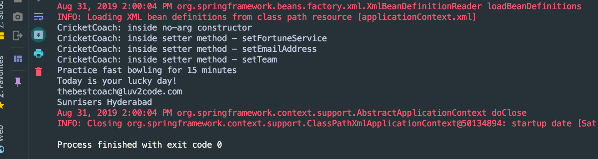

# 3. Spring Dependency Injection

- The dependency inversion principle.
        
        - The client delegates to calls to another object the responsibility of providing its dependencies.


---


---

-  Spring Container


---

- Demo Example:


---

:star: Injection Types 

- There are many types of injection with Spring


- We will cover the two most common
    
    - Constructor Injection
    
    - Setter Injection


### ` Development Process - Constructor Injection`

1. Define the dependency interface and class


- create `FortuneService`.java

```java
package com.luv2code.springdemo;
public interface FortuneService {
    
    public String getFortune();
}
```
---

2. Create a constructor in your class for injections


- create `HappyFortuneService`.java

```java
package com.luv2code.springdemo;
public class HappyFortuneService implements FortuneService{
    @Override
    public String getFortune(){
        return "Today is your lucky day!";
    }
}
```

- add a new method `` into `Coach` interface 

```java
public interface Coach {
    public String getDailyWorkout();   
    public String getDailyFortune();
}
```

---

```java
package com.luv2code.springdemo;
public class BaseballCoach implements Coach{
    //define a private field for the dependency
    private FortuneService fortuneService;

    public BaseballCoach(){}

    //define a constructor for dependency injection
    public BaseballCoach(FortuneService theFortuneService) {
        fortuneService = theFortuneService;
    }

    @Override
    public String getDailyWorkout(){
        return "Spend 1 hour on shooting basketball";
    }

    @Override
    public String getDailyFortune() {
        //use my fortuneService to get a fortune
        return fortuneService.getFortune();
    }
}
```

---

3. Configure the dependency injection in Spring config file


- right clicke `HappyFortuneService`, `copy reference`

- paste `com.luv2code.springdemo.BaseballCoach`

- applicationContext.xml

```xml
    <bean id="myFortune"
          class="com.luv2code.springdemo.HappyFortuneService">
    </bean>
    
    <bean id="myCoach"
          class="com.luv2code.springdemo.BaseballCoach">
        
            <!-- set up constructor injection -->
            <constructor-arg ref="myFortune" />
    </bean>
</beans>
```


---

- updating `HelloSpringApp`

```java
import org.springframework.context.support.ClassPathXmlApplicationContext;

public class HelloSpringApp {
    public static void main(String[] args) {
        //load the spring configuration file
        ClassPathXmlApplicationContext context = 
                new ClassPathXmlApplicationContext("applicationContext.xml");
        
        //retrieve bean from spring container
        Coach theCoach = context.getBean("myCoach", Coach.class);
        
        //call methods on the bean
        System.out.println(theCoach.getDailyWorkout());
        
        //let's call our new method for fortunes
        System.out.println(theCoach.getDailyFortune());
        
        //close the context
        context.close();
    }
}
```

- run the main method:


---


- updating applicationContext.xml

```xml
    <bean id="myFortune"
          class="com.luv2code.springdemo.HappyFortuneService">
    </bean>
    <bean id="myCoach"
          class="com.luv2code.springdemo.TrackCoach">
            <!-- set up constructor injection -->
            <constructor-arg ref="myFortune" />
    </bean>
</beans>
```


---


### `Setter Injection`

:star:  Spring Injection Types

- Constructor Injection

- Setter Injection

:star:  Inject dependencies by calling setter method(s) on your class

-  Development Process - Setter Injection

1. Create setter method(s) in your class for injections


---

2. Configure the dependency injection in Spring config file


---

- Call setter method on Java class


---

- in general, any property name you have, Spring will attempt to make a call to the setter method

- How Spring Processes your Config File


### `Code demo`

1. Create setter method(s) in your class for injections

- create a class `CricketCoach`

```java
package com.luv2code.springdemo;
public class CricketCoach implements Coach{
    
    private FortuneService fortuneService;
    
    //create a no-arg constructor
    public CricketCoach() {
        System.out.println("CricketCoach: inside no-arg constructor");
    }

    //our setter method
    public void setFortuneService(FortuneService fortuneService) {
        System.out.println("CricketCoach: inside setter method - setEmailAddress");
        this.fortuneService = fortuneService;
    }

    @Override
    public String getDailyWorkout() {
        return "Practice fast bowling for 15 minutes";
    }

    @Override
    public String getDailyFortune() {
        return fortuneService.getFortune();
    }
}
```
---

2. Configure the dependency injection in Spring config file

- updating `applicationContext.xml`

```xml
    <!-- define the dependency   -->
    <bean id="myFortuneService"
          class="com.luv2code.springdemo.HappyFortuneService">
    </bean>
    
    <bean id="myCoach"
          class="com.luv2code.springdemo.TrackCoach">
        <!-- set up constructor injection -->
        <constructor-arg ref="myFortuneService" />
    </bean>
    
    <bean id="myCricketCoach"
        class="com.luv2code.springdemo.CricketCoach">
<!--        set up setter injection -->
        <property name="fortuneService" ref="myFortuneService" />
    </bean>
</beans>
```
---

- create a new class `SetterDemoApp`

```java
package com.luv2code.springdemo;

import org.springframework.context.support.ClassPathXmlApplicationContext;

public class SetterDemoApp {
    public static void main(String[] args) {
        //load the spring configuration file
        ClassPathXmlApplicationContext context =
                new ClassPathXmlApplicationContext("applicationContext.xml");
        
        //retrieve bean from spring container
        CricketCoach theCoach = context.getBean("myCricketCoach", CricketCoach.class);
        
        //call methods on the bean
        //...let's come back to this ...
        System.out.println(theCoach.getDailyWorkout());
        System.out.println(theCoach.getDailyFortune());
        //close the context
        context.close();
    }
}
```


---

### `Injecting Literal Values`


---

-  Development Process

1. Create setter method(s) in your class for injections


---

- updating CricketCoach

```java
package com.luv2code.springdemo;
public class CricketCoach implements Coach{
    
    private FortuneService fortuneService;
    
    //add new fields for emailAddress and team
    private String emailAddress;
    private String team;

    public String getEmailAddress() {
        return emailAddress;
    }

    public void setEmailAddress(String emailAddress) {
        System.out.println("CricketCoach: inside setter method - setEmailAddress");
        this.emailAddress = emailAddress;
    }

    public String getTeam() {
        return team;
    }

    public void setTeam(String team) {
        System.out.println("CricketCoach: inside setter method - setTeam");
        this.team = team;
    }

    //create a no-arg constructor
    public CricketCoach() {
        System.out.println("CricketCoach: inside no-arg constructor");
    }

    //our setter method
    public void setFortuneService(FortuneService fortuneService) {
        System.out.println("CricketCoach: inside setter method - setFortuneService");
        this.fortuneService = fortuneService;
    }

    @Override
    public String getDailyWorkout() {
        return "Practice fast bowling for 15 minutes";
    }

    @Override
    public String getDailyFortune() {
        return fortuneService.getFortune();
    }
}
```
---

1. Configure the injection in Spring config file


---

- updating `applicationContext.xml`

```xml
    <!-- define the dependency   -->
    <bean id="myFortuneService"
          class="com.luv2code.springdemo.HappyFortuneService">
    </bean>

    <bean id="myCoach"
          class="com.luv2code.springdemo.TrackCoach">
        <!-- set up constructor injection -->
        <constructor-arg ref="myFortuneService" />
    </bean>

    <bean id="myCricketCoach"
          class="com.luv2code.springdemo.CricketCoach">
        <!--        set up setter injection -->
        <property name="fortuneService" ref="myFortuneService" />
        
<!--       inject literal values -->
        <property name="emailAddress" value="thebestcoach@luv2code.com"/>
        <property name="team" value="Sunrisers Hyderabad"/>
    </bean>
</beans>
```
- updating `SetterDemoApp`
```java
package com.luv2code.springdemo;
import org.springframework.context.support.ClassPathXmlApplicationContext;

public class SetterDemoApp {
    public static void main(String[] args) {
        //load the spring configuration file
        ClassPathXmlApplicationContext context =
                new ClassPathXmlApplicationContext("applicationContext.xml");
        
        //retrieve bean from spring container
        CricketCoach theCoach = context.getBean("myCricketCoach", CricketCoach.class);
        
        //call methods on the bean
        //...let's come back to this ...
        System.out.println(theCoach.getDailyWorkout());
        System.out.println(theCoach.getDailyFortune());
        
        //call our new methods to get the literal values
        System.out.println(theCoach.getEmailAddress());
        System.out.println(theCoach.getTeam());
        
        //close the context
        context.close();
    }
}
```


---


### `Injecting Valuse from a Properties File`

-  Development Process

1. Create Properties File


---

- create a `sport.properties` file in `src` folder

```properties
foo.email=myeasycoach@luv2code.com
foo.team=Royal Challengers Bangalore
```


2. Load Properties File in Spring config file


---

3. Reference values from Properties File


---

- updating `applicationContext.xml`

```xml
<!--   load the properties file: sport.properties -->
    <context:property-placeholder location="classpath:sport.properties"/>
    <!-- define the dependency   -->
    <bean id="myFortuneService"
          class="com.luv2code.springdemo.HappyFortuneService">
    </bean>

    <bean id="myCoach"
          class="com.luv2code.springdemo.TrackCoach">
        <!-- set up constructor injection -->
        <constructor-arg ref="myFortuneService" />
    </bean>

    <bean id="myCricketCoach"
          class="com.luv2code.springdemo.CricketCoach">
        <!--        set up setter injection -->
        <property name="fortuneService" ref="myFortuneService" />

        <!--       inject literal values -->
        <property name="emailAddress" value="${foo.email}"/>
        <property name="team" value="${foo.team}"/>
    </bean>
</beans>
```

- Run `SetterDemoApp.java`


---


