# 1. Environment Configuration

## download tomcat

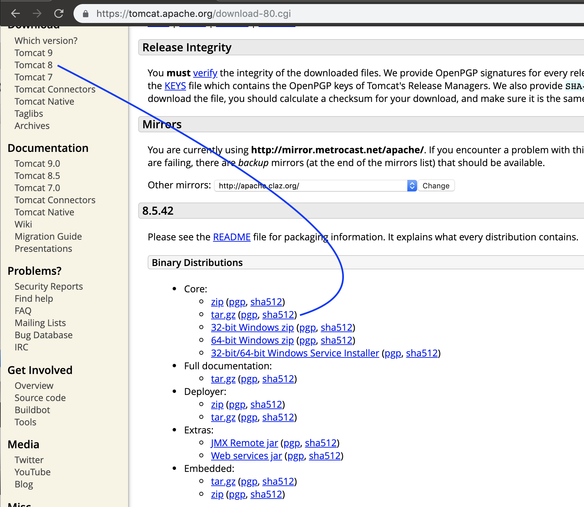

- unzip the apache-tomcat-8.5.42.tar.gz

- drag apache-tomcat-8.5.42 into jsf-for-beginners

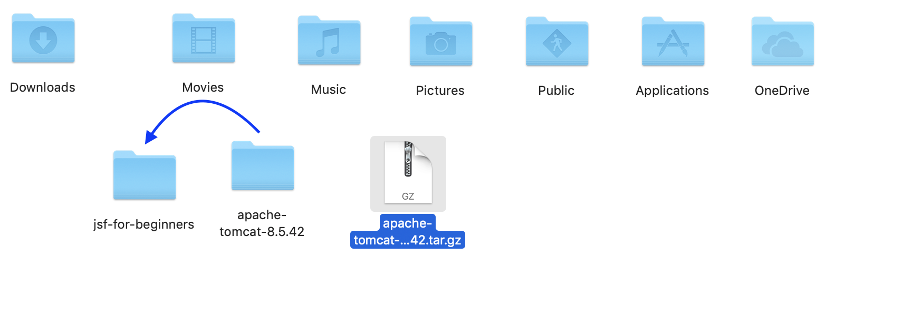

---

- cd to the folder

- `startup.sh`  is what I'll use to actually start the Tomcat server.

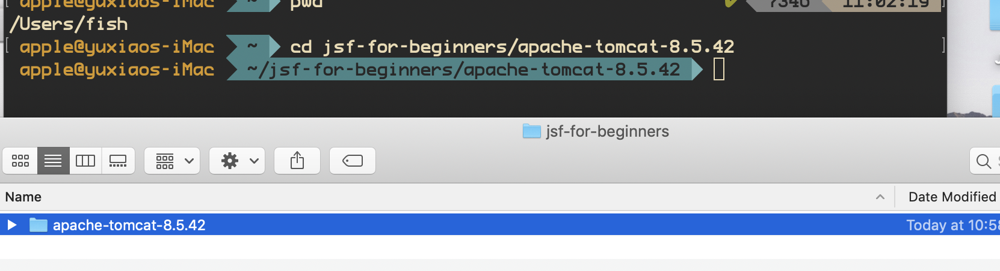

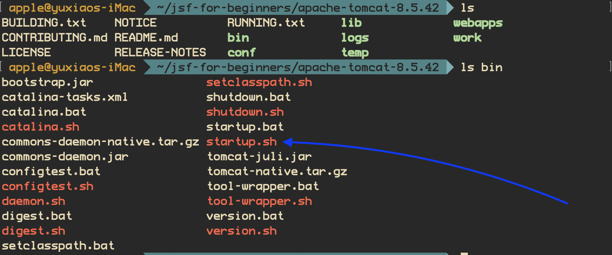

---

- enter `bin/startup.sh` ,then our server's installed and we also started the server.

- Tomcat started.

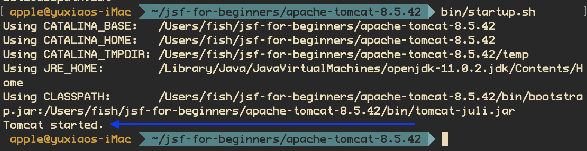

- typing http://localhost:8080/

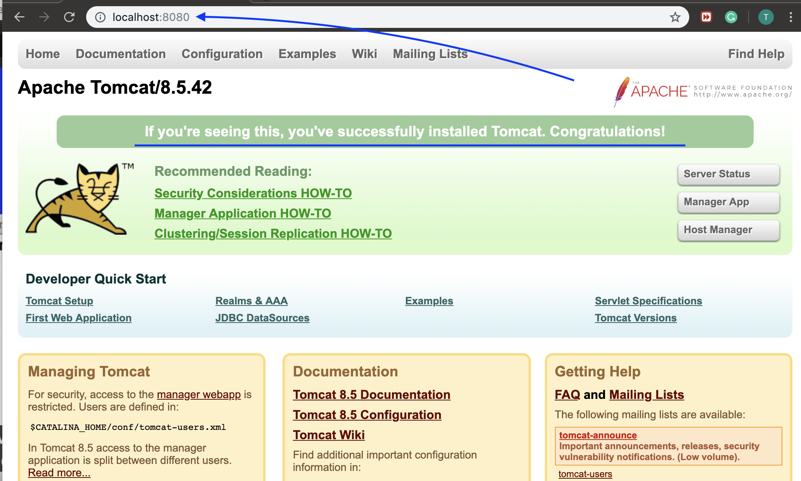

---

- Now it's time to learn shut down

- `ls bin`

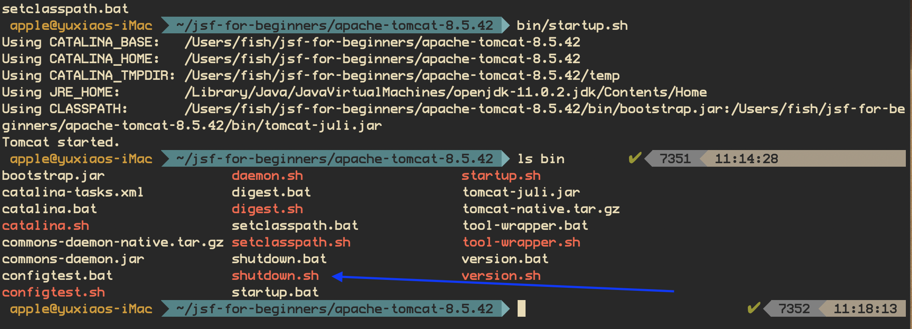

- we found the `shutdown.sh`

- on terminal print `bin/shutdown.sh`; then stop server.

- we also can run the tomcat server from intellij 

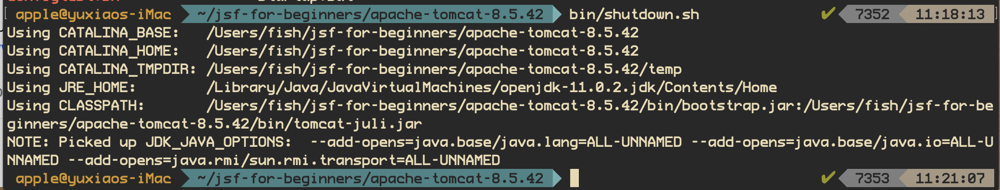

---

# IntelliJ IDEA – Run / debug web application on Tomcat

- Plugins -> search 

- Make sure Tomcat and TomEE Integration is checked.

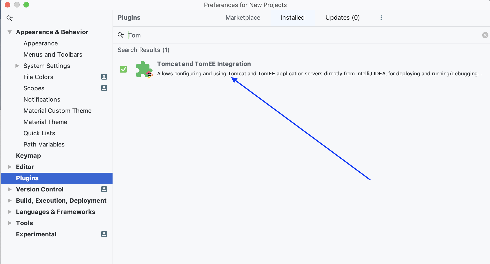

- create a new java Enterprise 'spring-demo-one'

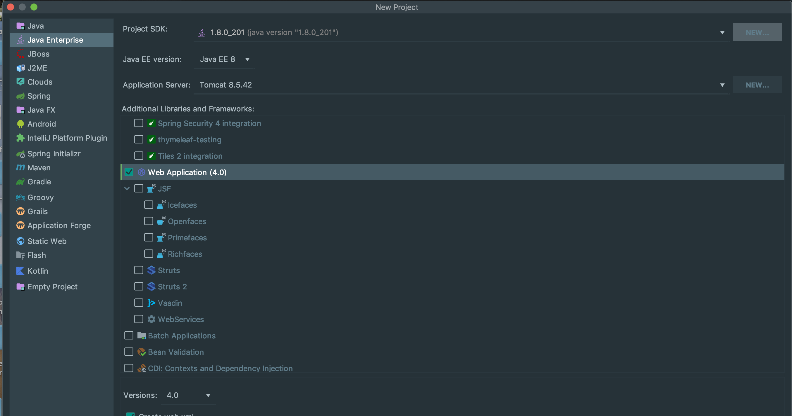

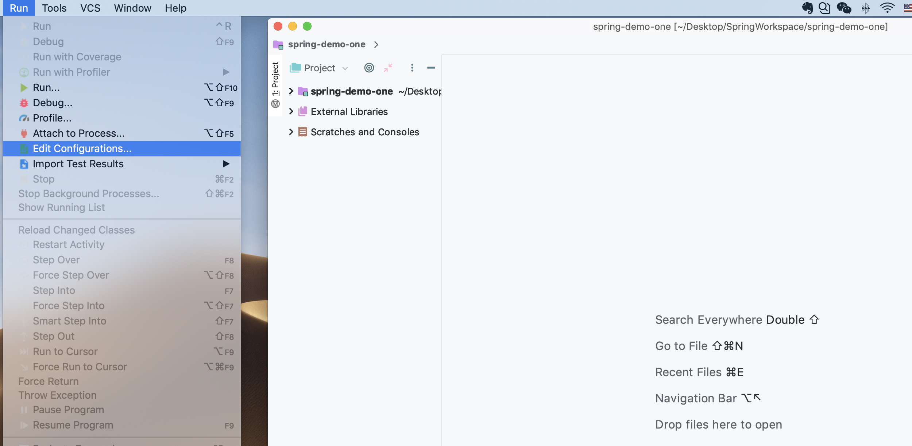

- the project should import the downloaded libraries:

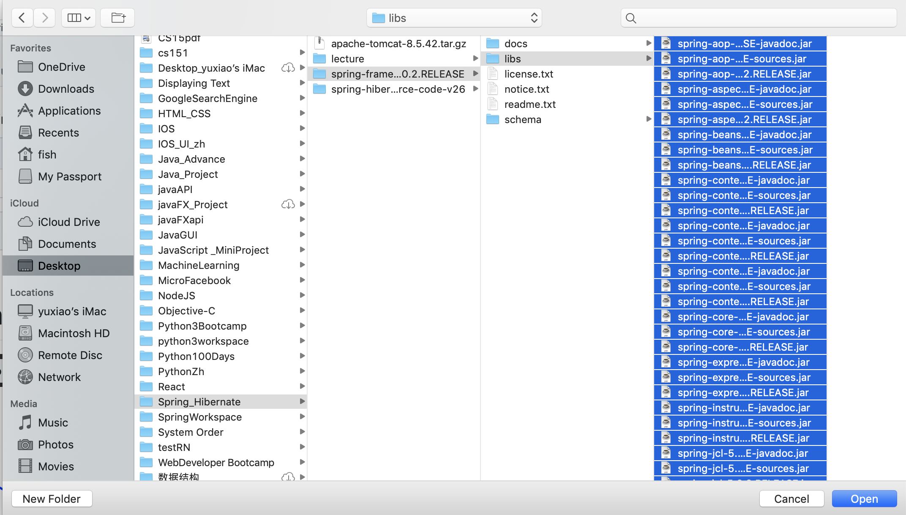
