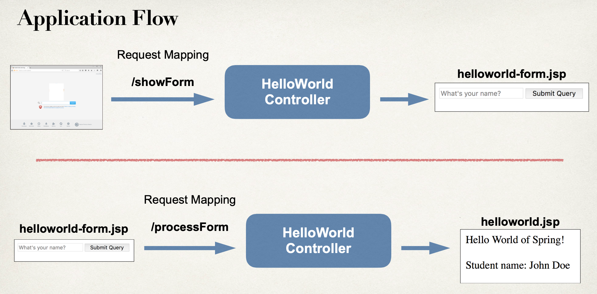
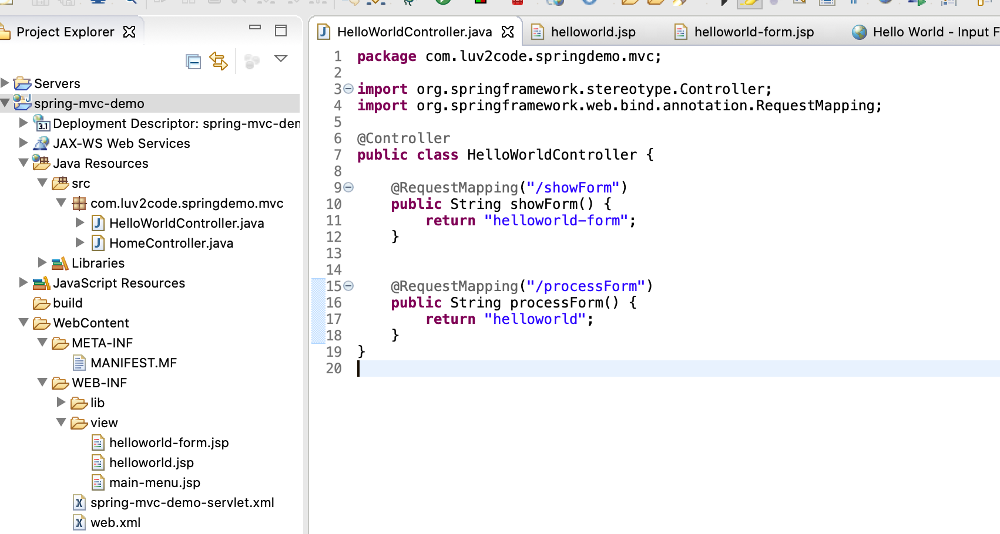
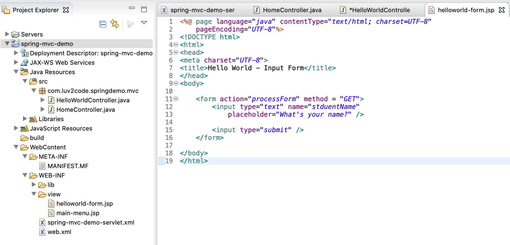
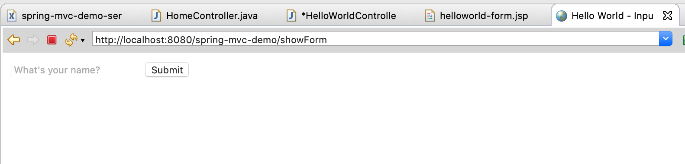
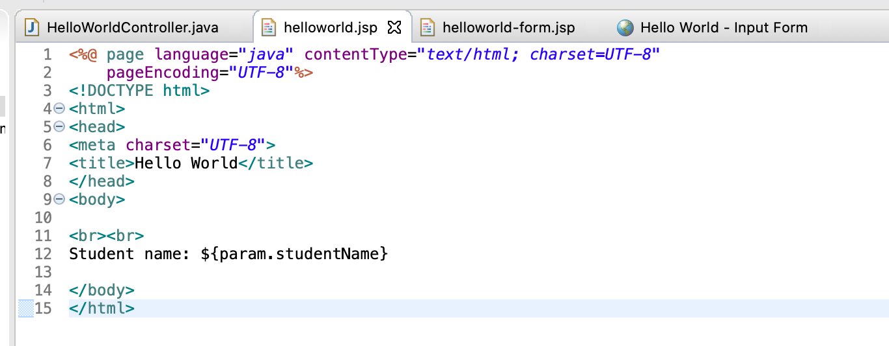
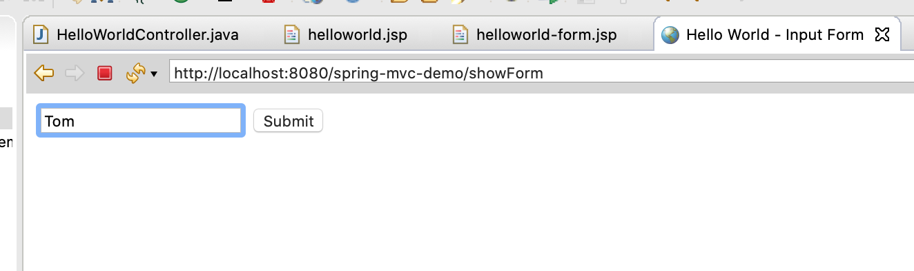
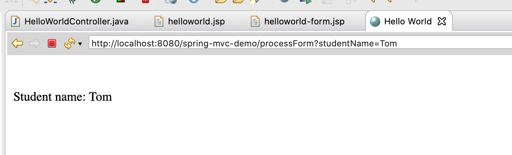
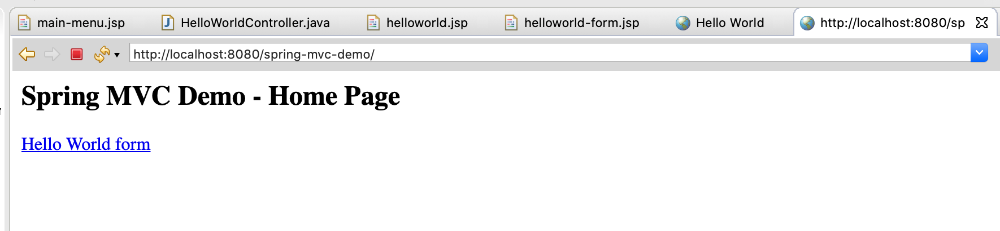

## Reading HTML Form Data









-----

- create helloworld.jsp







---

## Would be nice to add a link for main page jumping to `showForm`


```js
<!DOCTYPE>
<html>

<body>

<h2>Spring MVC Demo - Home Page</h2>

<a href="showForm"> Hello World form</a>

</body>

</html>
```




