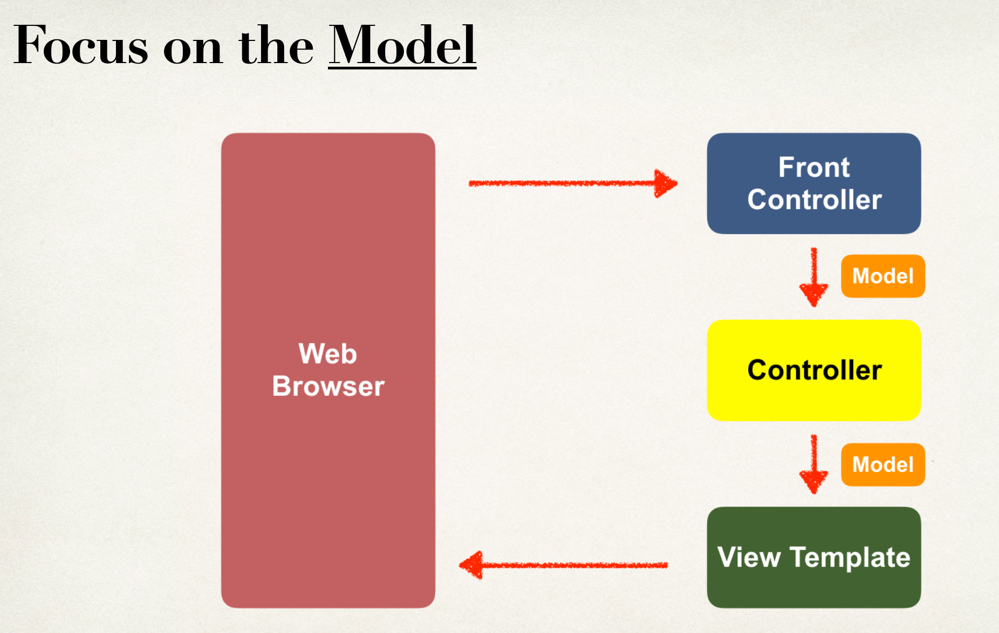
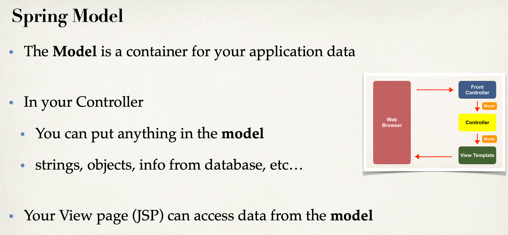
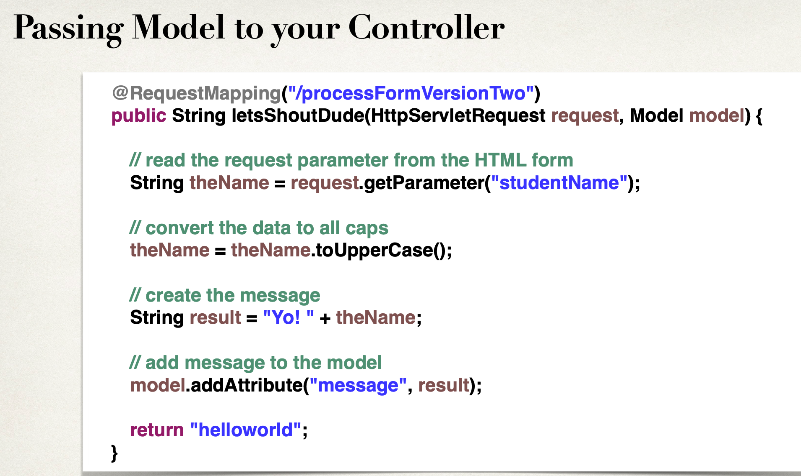
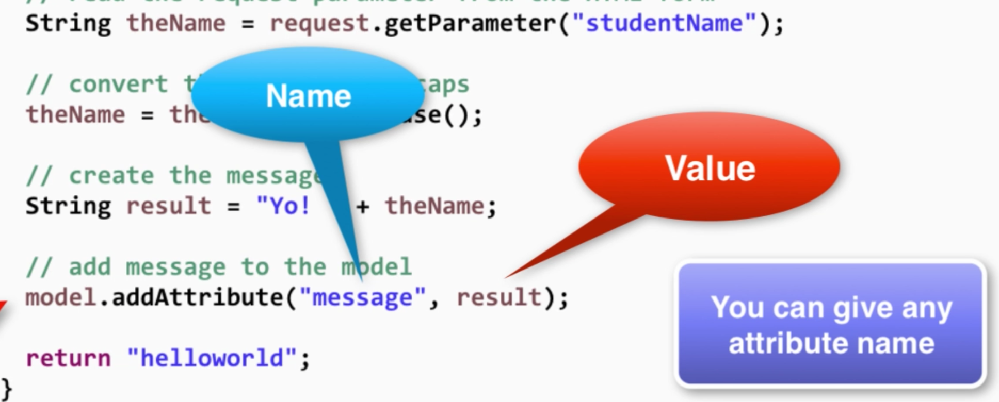
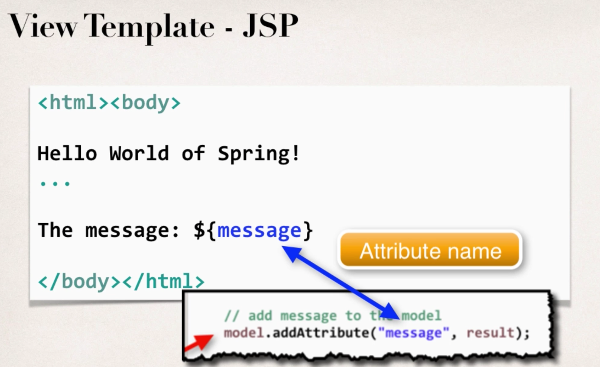
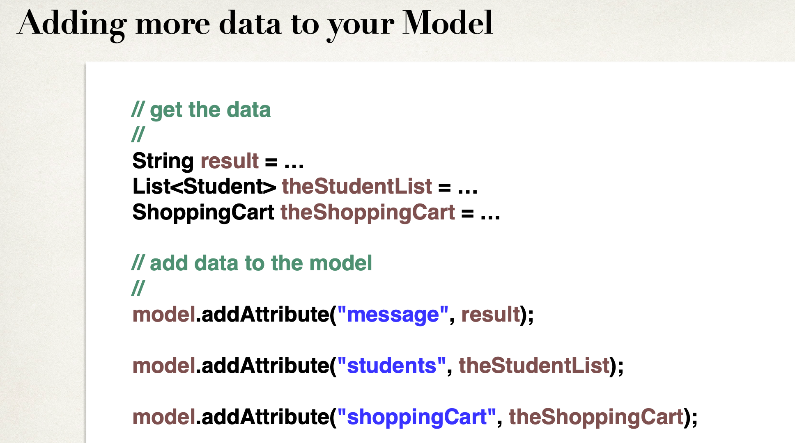
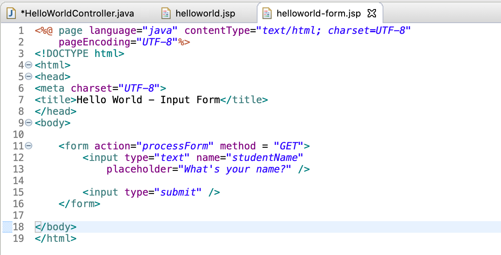
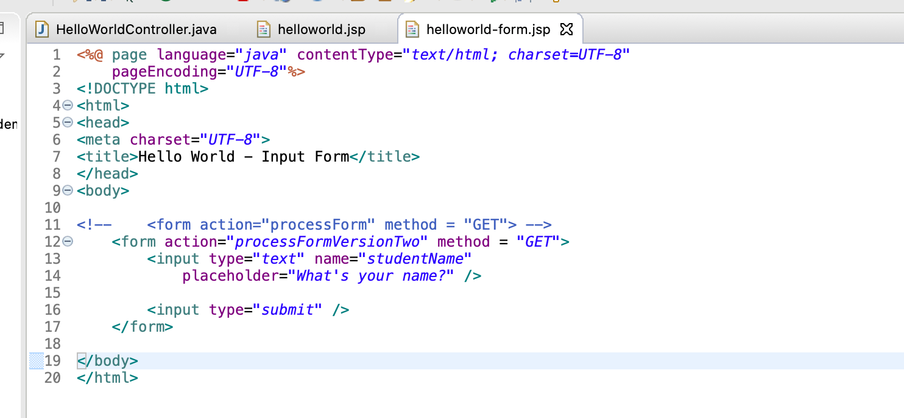
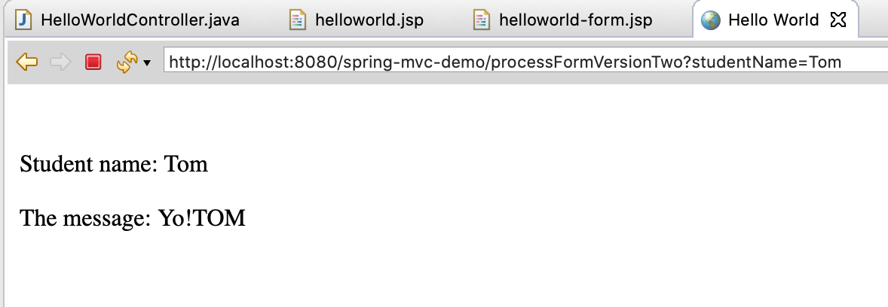

## adding Data to Spring Model





#### Code Example

- We want to create a new method to process form data
- Read the form data: student’s name
- Convert the name to upper case
- Add the uppercase version to the model











---



- for `helloworld-form.jsp`, the param is `studentName`


- for controller, we have:

```java
	//new a controller method to read form data and
	//add data to the model
	@RequestMapping("/processFormVersionTwo")
	public String letsShoutDude(HttpServletRequest request, Model model) {
		
		//read the request parameter from the HTML form
		String theName = request.getParameter("studentName");
		
		//convert the data to all caps
		theName = theName.toUpperCase();
		
		//create the message
		String result = "Yo!" + theName;
		
		//add message to the model
		model.addAttribute("message", result);
		
		return "helloworld";
	}
}
```







