## Spring MVC - Building Spring Web Apps

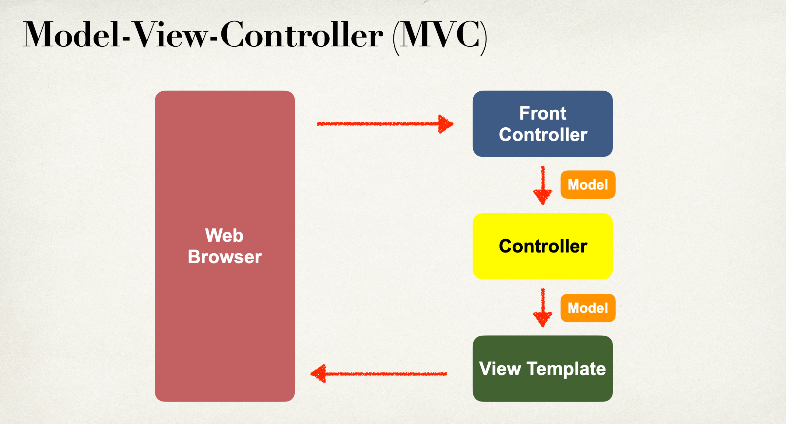

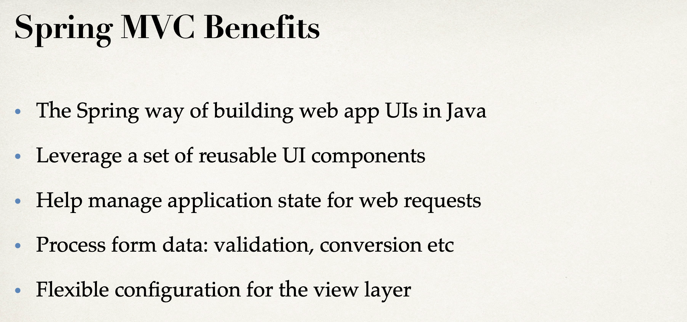

---

## Behind the Scenes

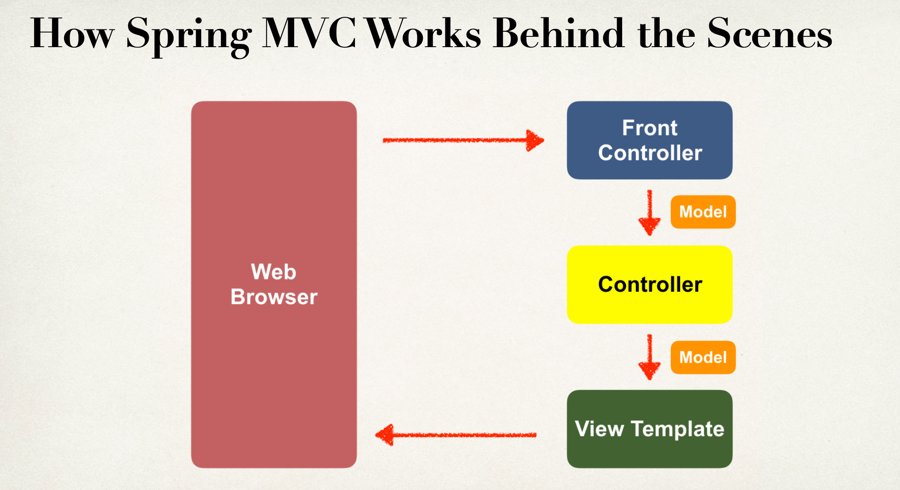

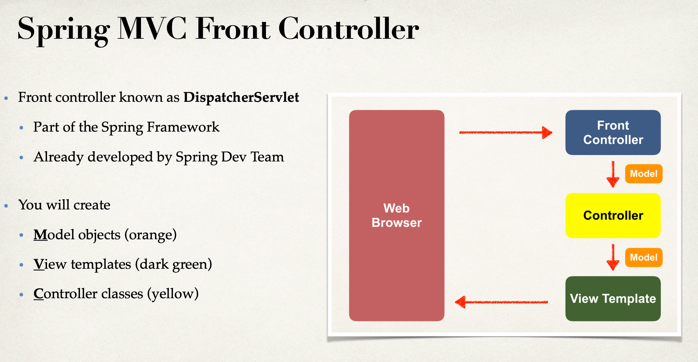

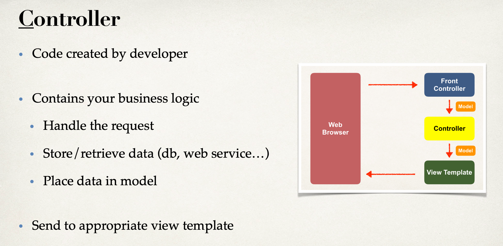

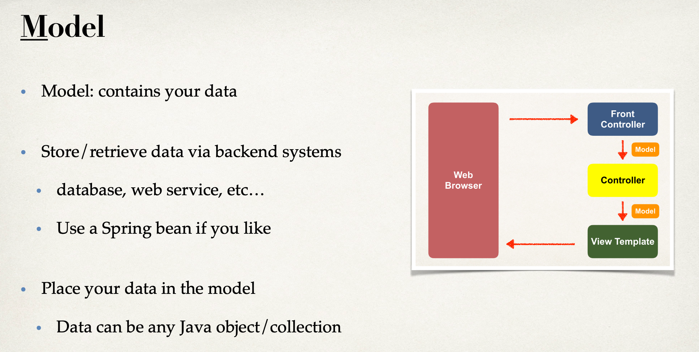

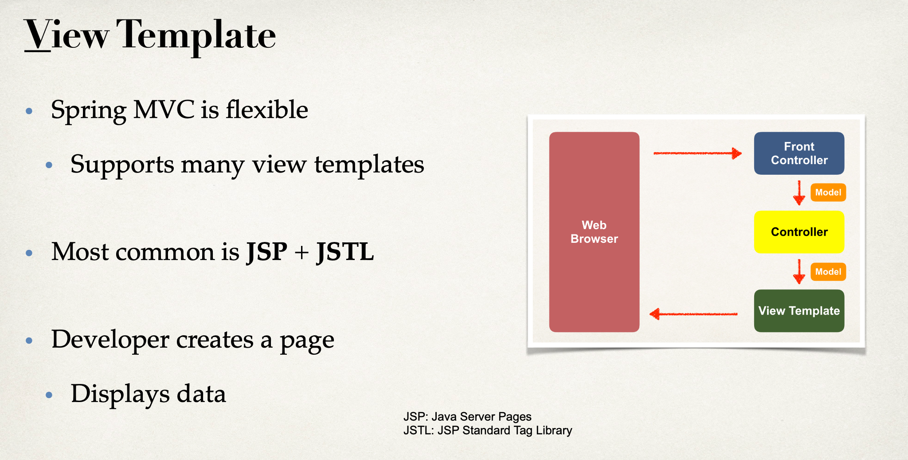

---

## Development Environment Checkpoint

- Apache Tomact
- Eclipse (Java EE version)
- Connected Eclipse to Tomcat

---

## Spring MVC Configuaration

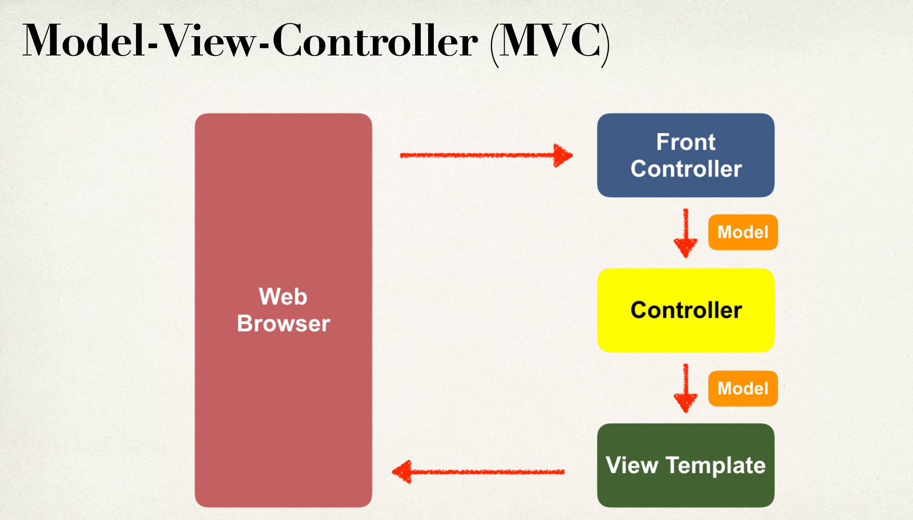

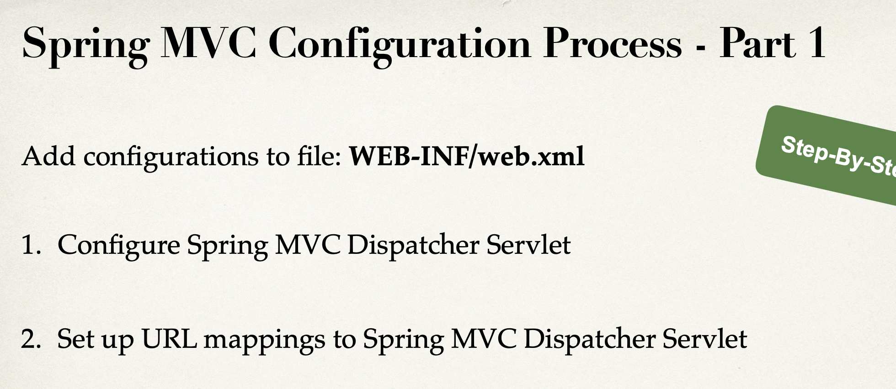

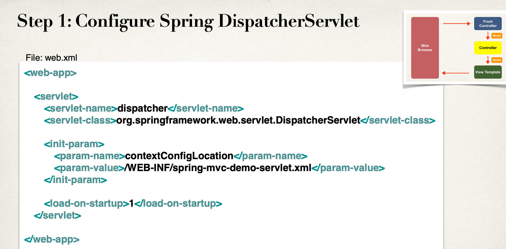

---

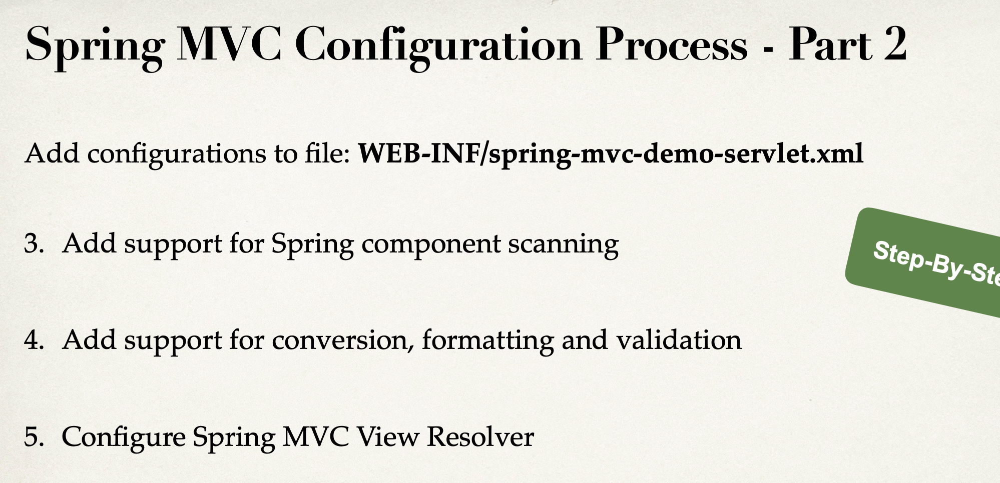

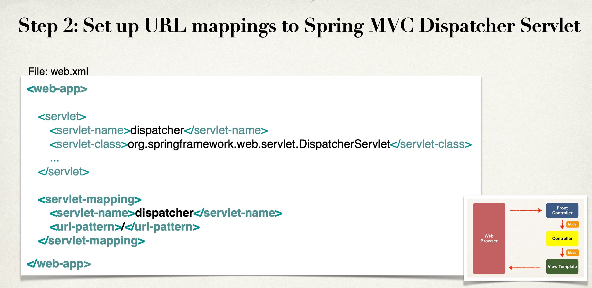

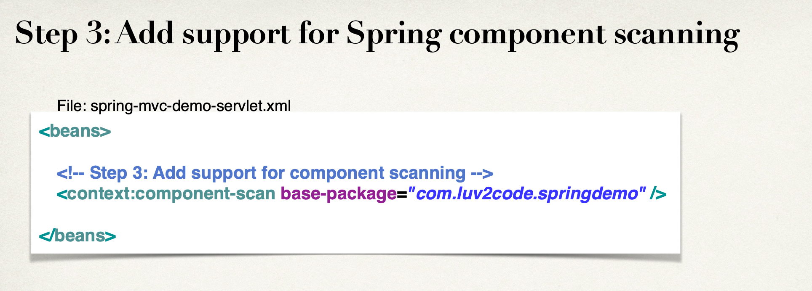

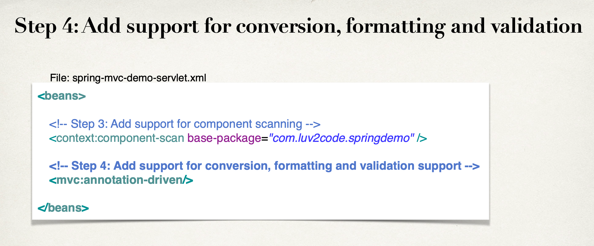

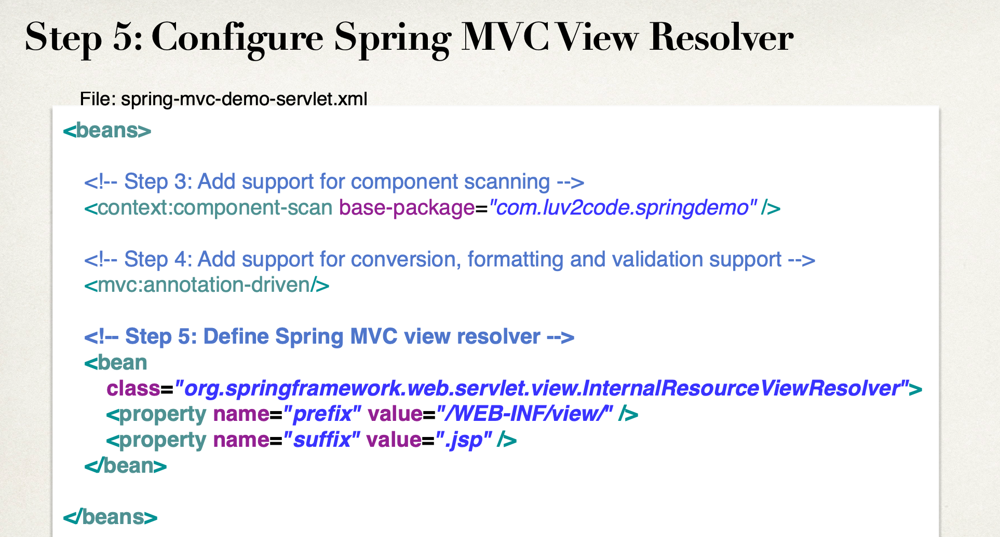

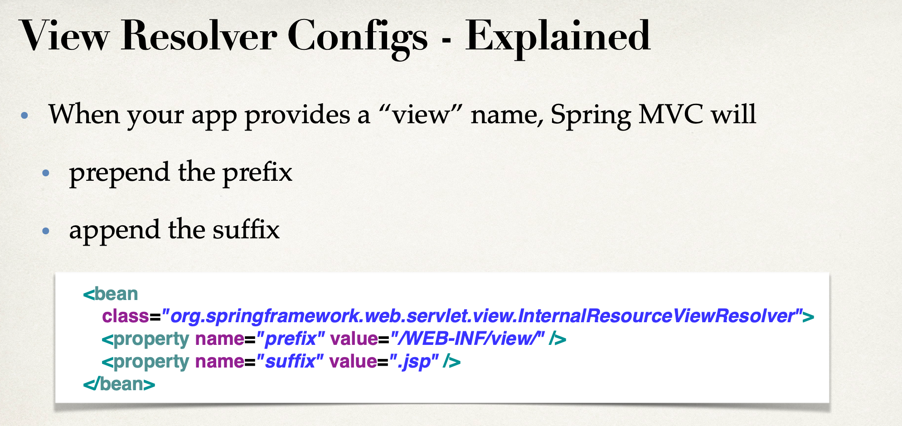

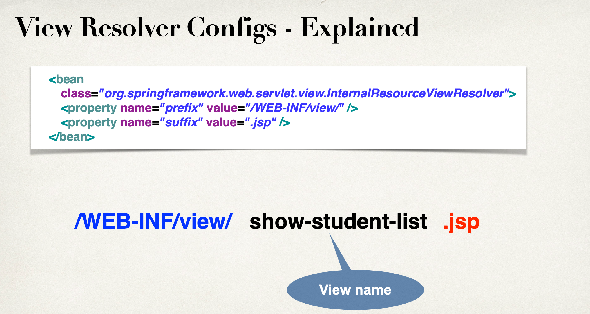

