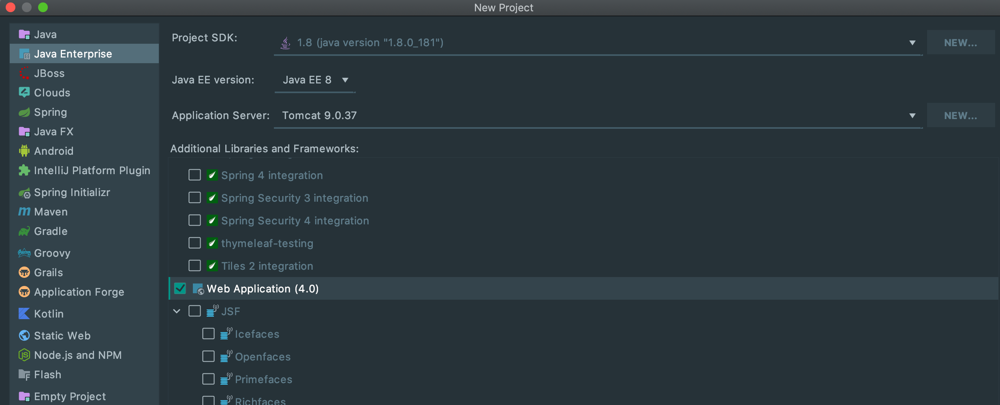
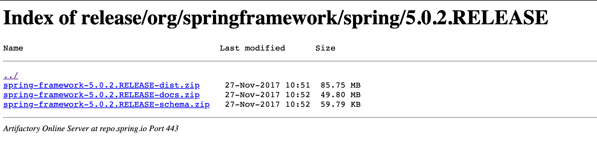
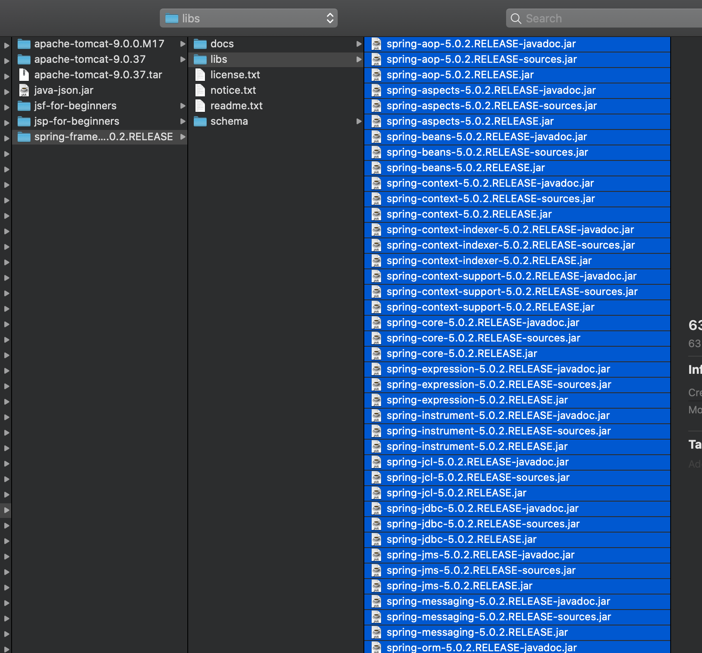
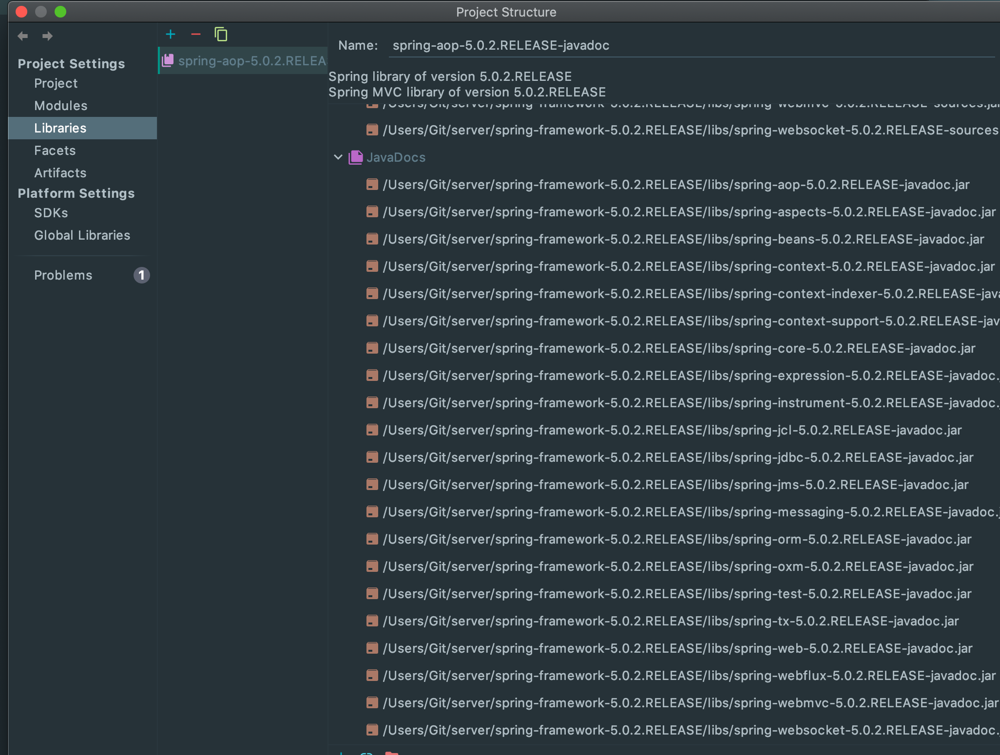
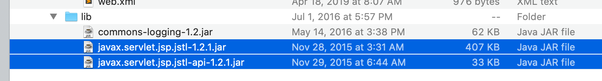
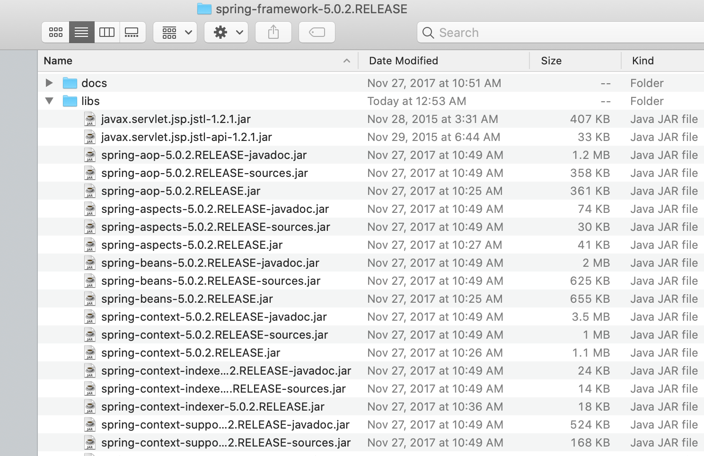
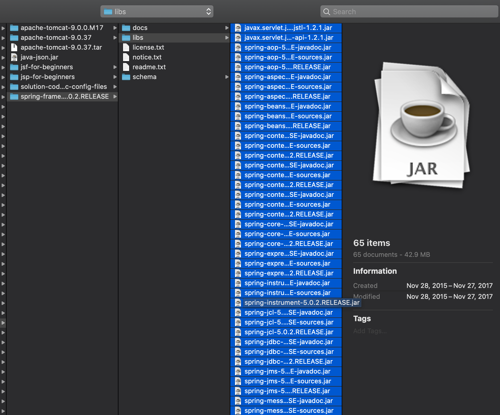
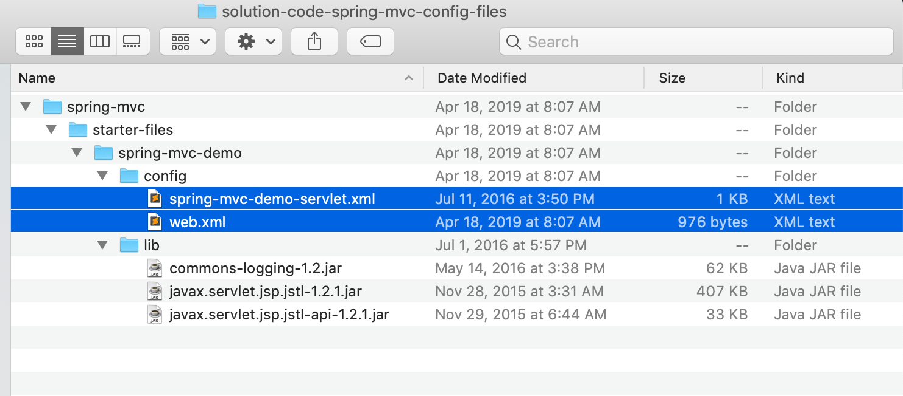
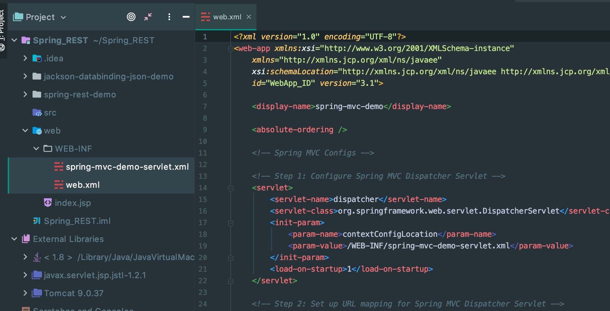

## Spring MVC Configuration - JAR FILES]

- Create a Dynamic Web Application in Intellij

- project named `spring-mvc-demo`

- import JAR files from Udemy

- [download Spring framework](www.luv2code.com/downloadspring)

- pick the first address, download all jar files

- File -> Project Structure, import all jar files

- copy this two .jar files into library

- File -> Project Structure, import all jar files

---

## Copy Starter Config Files

- copy two files, paste into `WEB-INF`

