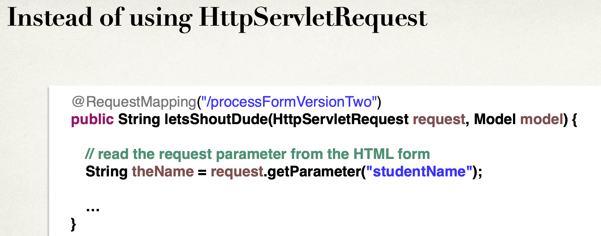
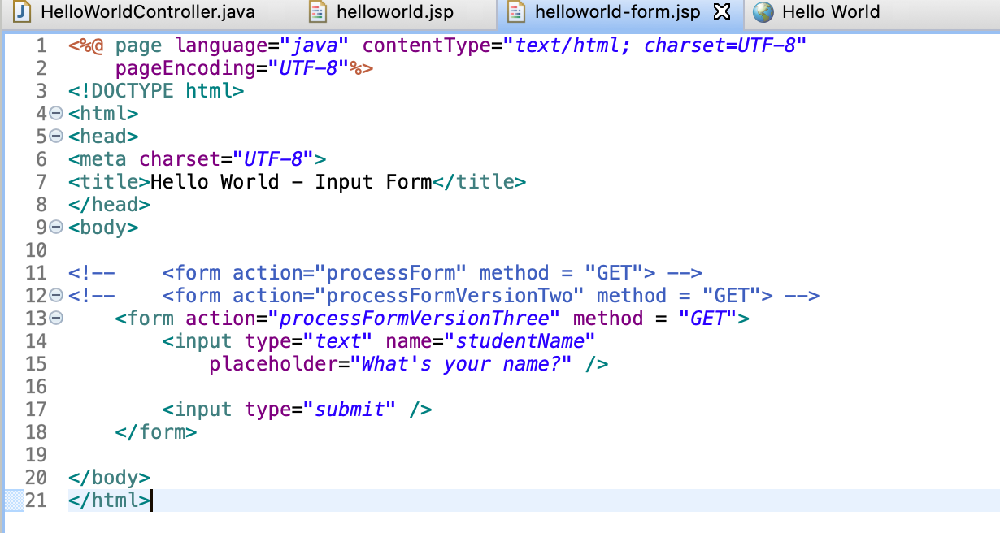
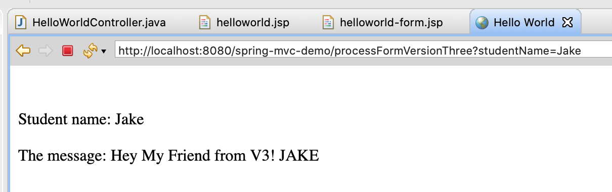

## Read HTML Form Data with @RequestParam Annotation




-----

- add a new method to `HelloWorldController`

```java
	@RequestMapping("/processFormVersionThree")
	public String processFormVersionThree(
			@RequestParam("studentName") String theName, 
			Model model) {
		
		//convert the data to all caps
		theName = theName.toUpperCase();
		
		//create the message
		String result = "Hey My Friend from V3! " + theName;
		
		//add message to the model
		model.addAttribute("message", result);
		
		return "helloworld";
	}
```





