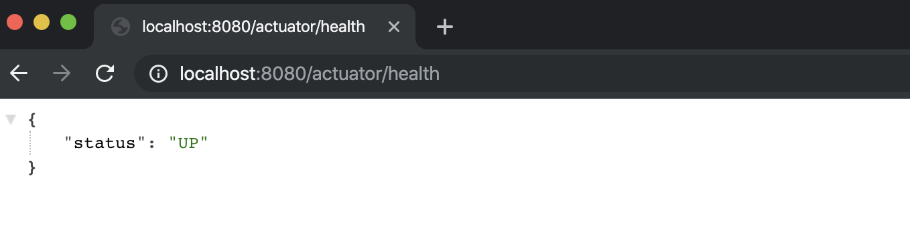
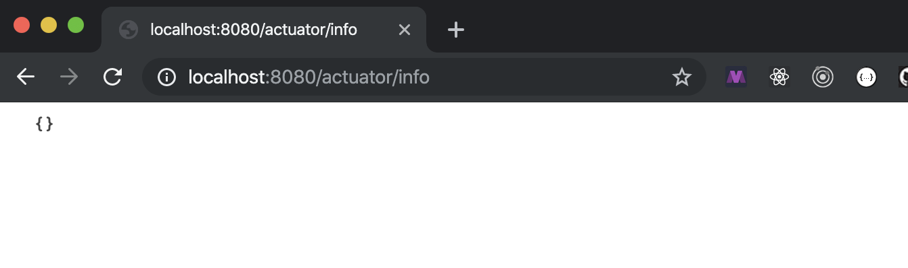
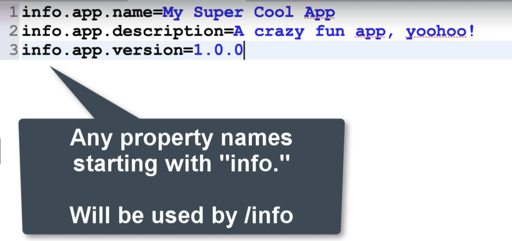
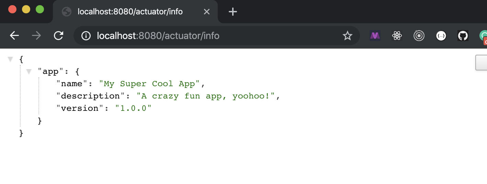
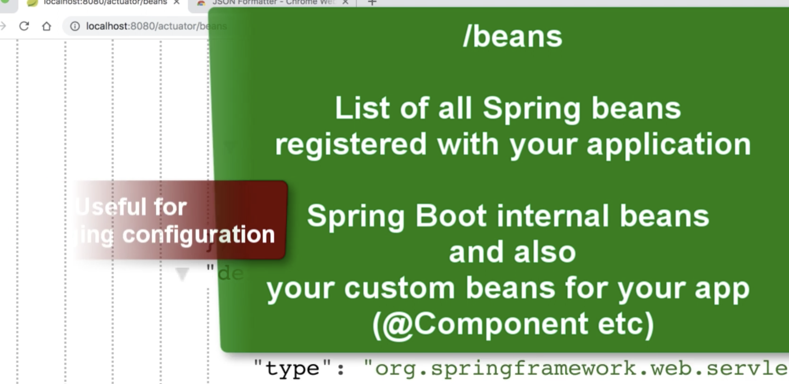
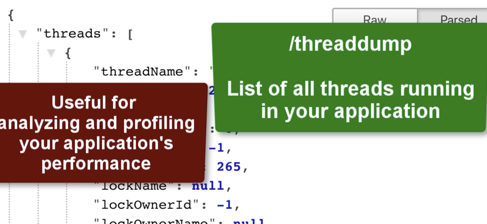
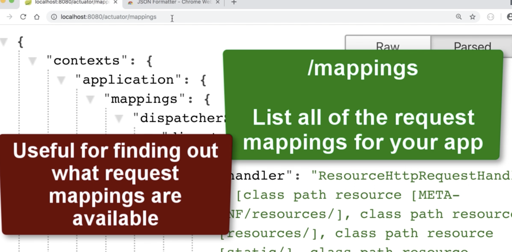

# 8. Accessing Actuator endpoints

- copy 02-dev-tools-demo , and paste change name to 03-actuator-demo

- import 03-actuator-demo for intellij

- deploy actuator endpoints

- pom.xml

```xml
		<!-- ADD SUPPORT FOR AUTOMATIC RELOADING -->
		<dependency>
			<groupId>org.springframework.boot</groupId>
			<artifactId>spring-boot-devtools</artifactId>
		</dependency>

		<!-- ADD SUPPORT FOR SPRING BOOT ACTUATOR -->
		<dependency>
			<groupId>org.springframework.boot</groupId>
			<artifactId>spring-boot-starter-actuator</artifactId>
		</dependency>
	</dependencies>

```




---

- test info endpoints



- we can add some info into `resources/application.properties`

```json
info.app.name = My Super Cool App
info.app.description = A crazy fun app, yoohoo!
info.app.version = 1.0.0
```






---

## I have installed json formatter for google chrome...

- update `resources/application.properties`

```json
info.app.name = My Super Cool App
info.app.description = A crazy fun app, yoohoo!
info.app.version = 1.0.0

# Use wildcard "*" to expose all endpoints
# Can also expose individual endpoints with a comma-delimited list
#
management.endpoints.web.exposure.include=*
```

- http://localhost:8080/actuator/beans



- http://localhost:8080/actuator/threaddump



- http://localhost:8080/actuator/mappings



---


