# 12. Configuring the Spring Boot Server

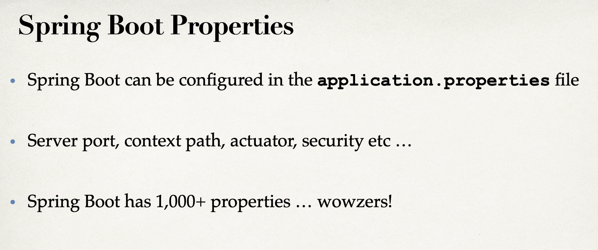

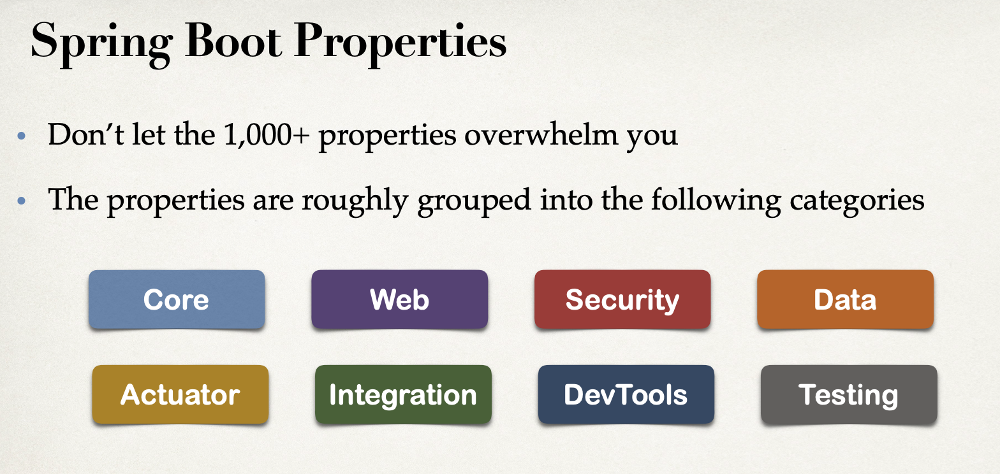

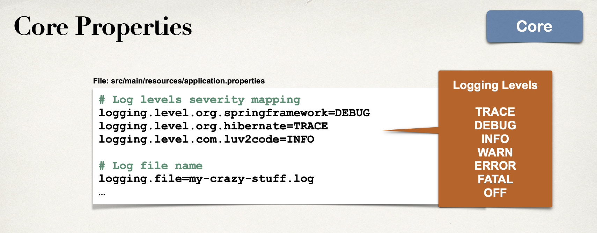

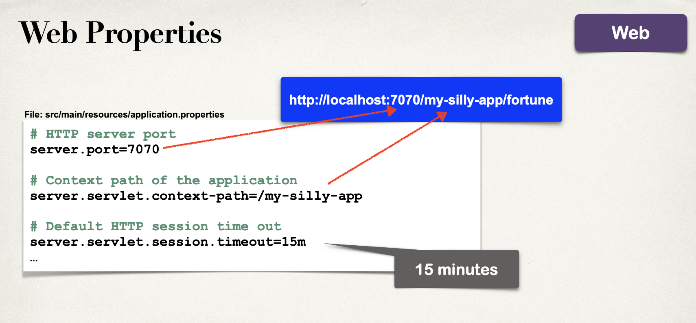

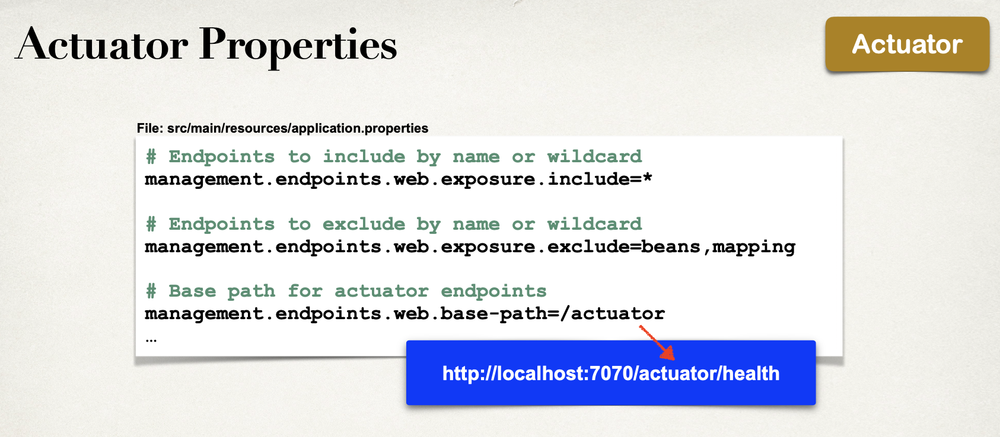

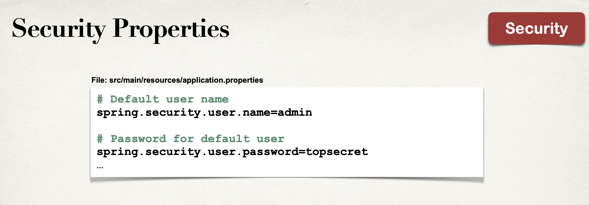

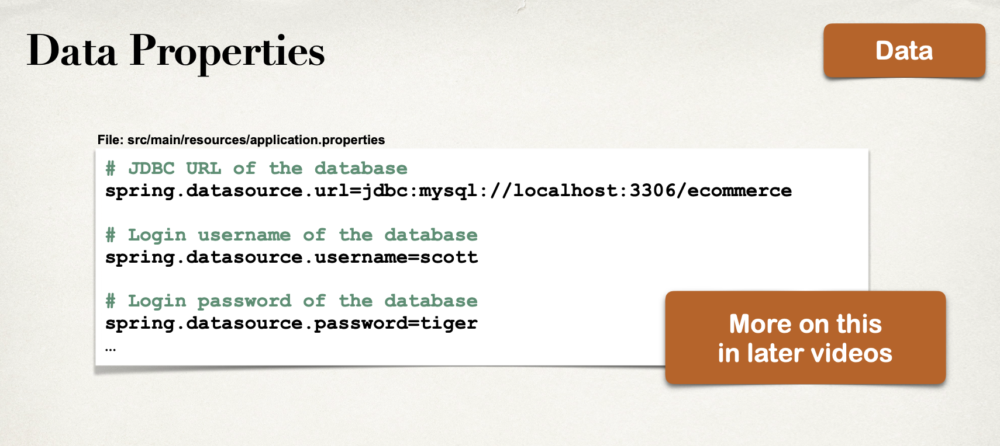

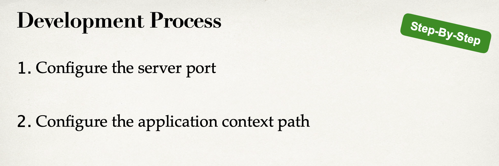
---

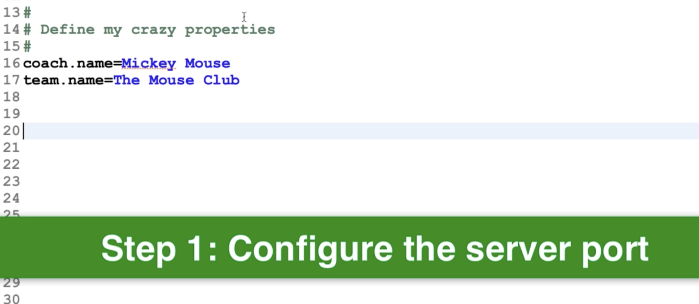

- update `resources/application.properties`

```json
#
# Define my crazy properties
#
coach.name = Mickey mouse
team.name = The Mouse Club


#
# Change Spring Boot embedded server port
#
server.port = 7070


#
# Set the context path of the application
#
# All requests should be prefixed with /mycoolapp
#
server.servlet.context-path=/mycoolapp
```

- enter http://localhost:7070/mycoolapp/workout

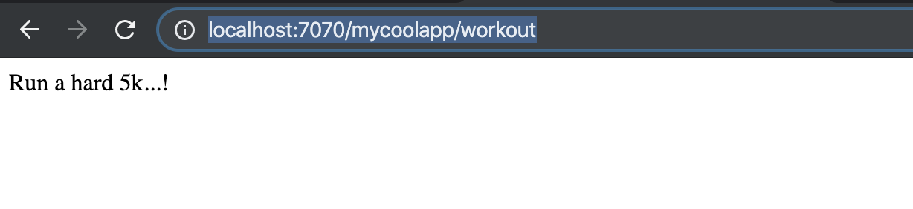

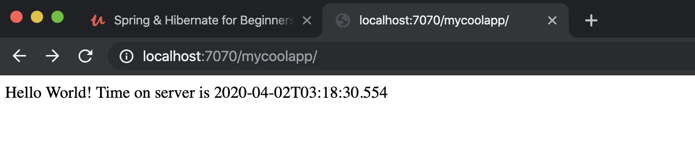


