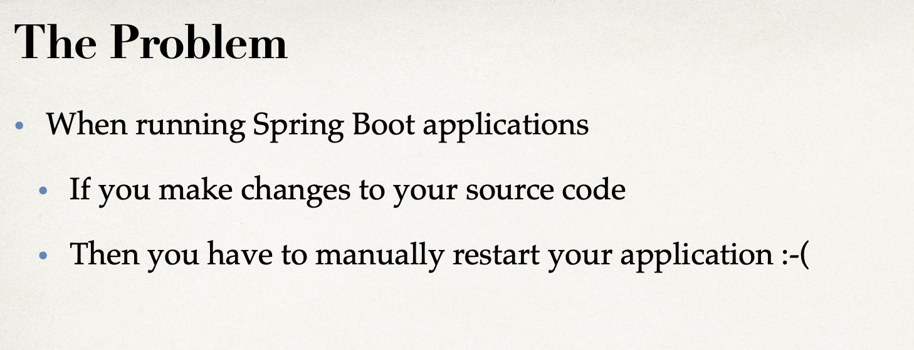
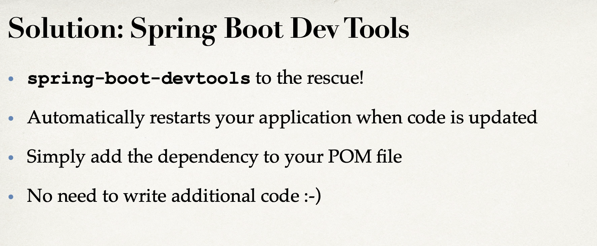
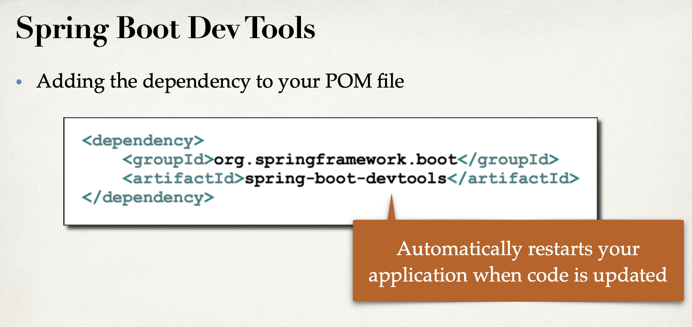
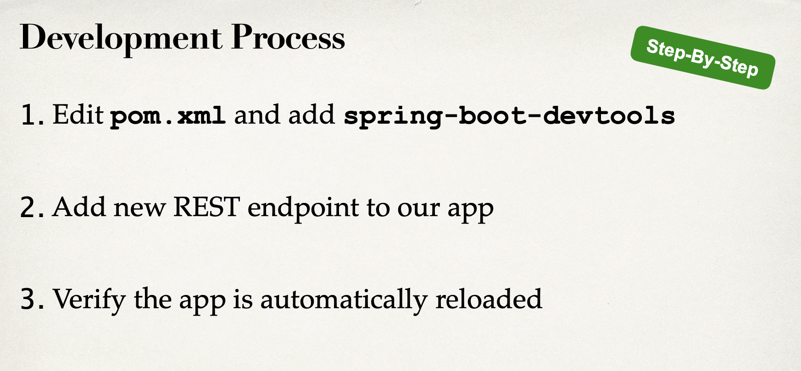
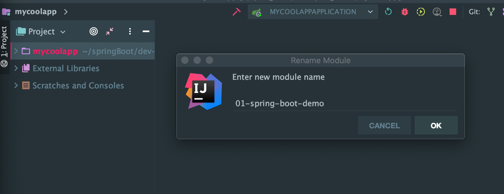
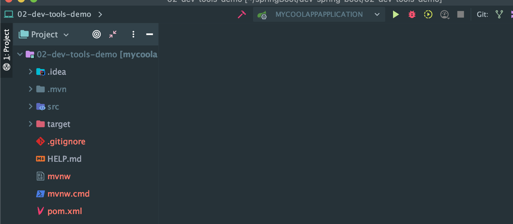
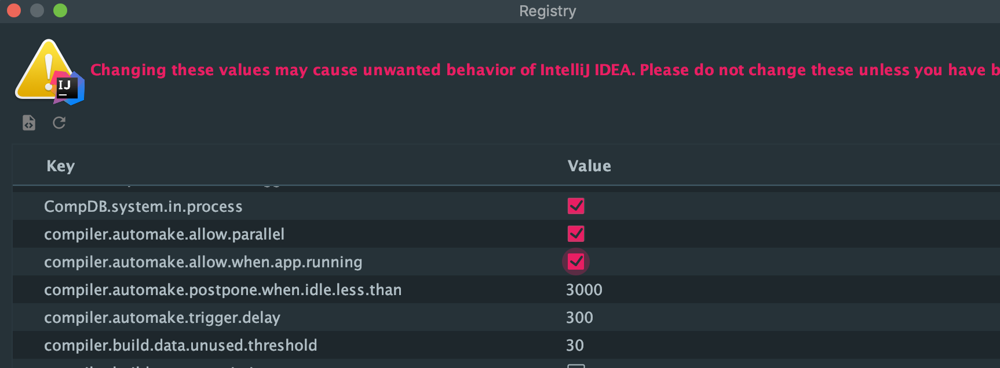
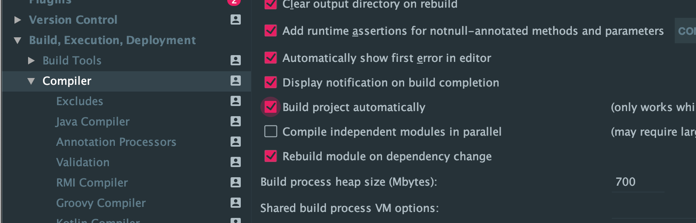
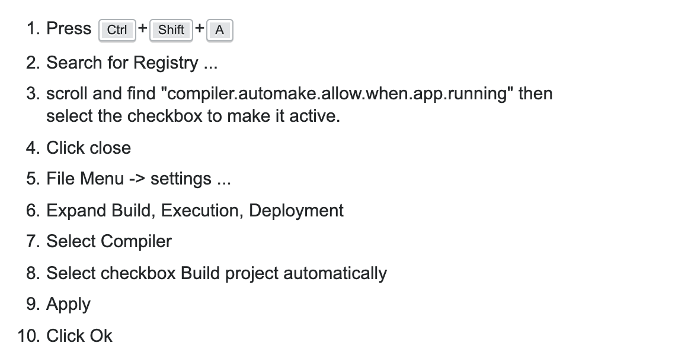
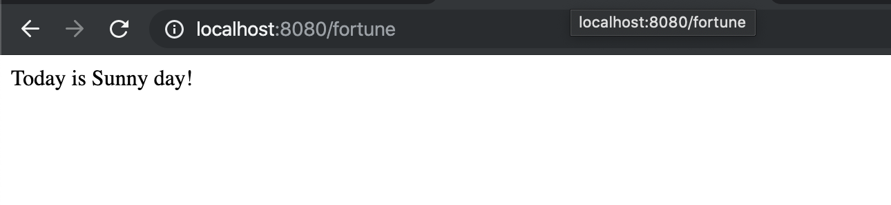

# 6. Springboot Dev Tools








---

- let's clean up - File > Close ALL

- rename our project



- copy older project, change name, and import new project



---

## under 02-dev-tools-demo/pom.xml

```xml
		<!-- ADD SUPPORT FOR AUTOMATIC RELOADING -->
		<dependency>
			<groupId>org.springframework.boot</groupId>
			<artifactId>spring-boot-devtools</artifactId>
			<version>2.1.1.RELEASE</version>
		</dependency>
	</dependencies>
```

- note: intellij automatically add `2.1.1.RELEASE`

---

## Note: for intellij, we need more working:

- on intellij, Ctrl + Shift + A

- Search for `Registry`







- update FunRestController

```java
package com.luv2code.springboot.demo.mycoolapp.rest;
import org.springframework.web.bind.annotation.GetMapping;
import org.springframework.web.bind.annotation.RestController;

import java.time.LocalDateTime;

@RestController
public class FunRestController {

    // expose "/" that return "Hello World"
    @GetMapping("/")
    public String sayHello(){
        return "Hello World! Time on server is " + LocalDateTime.now(); //Current time stamp
    }

    //expose a new endpoint for "workout"
    @GetMapping("/workout")
    public String getDailyWorkout(){
        return "Run a hard 5k...!";
    }

    //expose a new endpoint for "fortune"
    @GetMapping("/fortune")
    public String getDailyFortune(){
        return "Today is Sunny day!";
    }
}

```



