## REST HTTP Basics

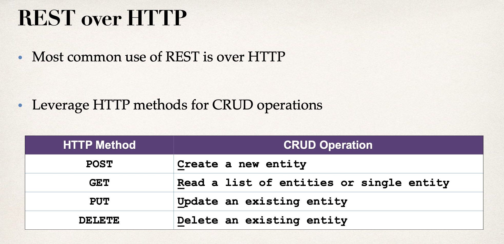

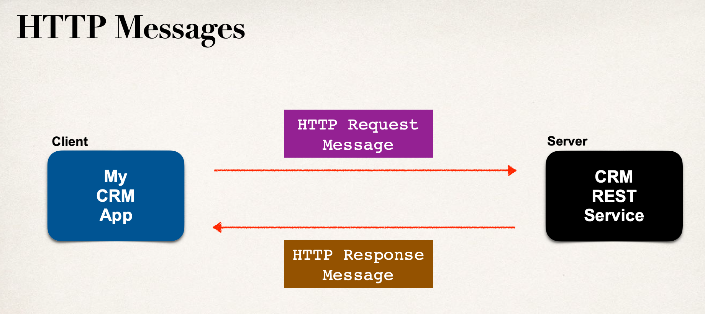

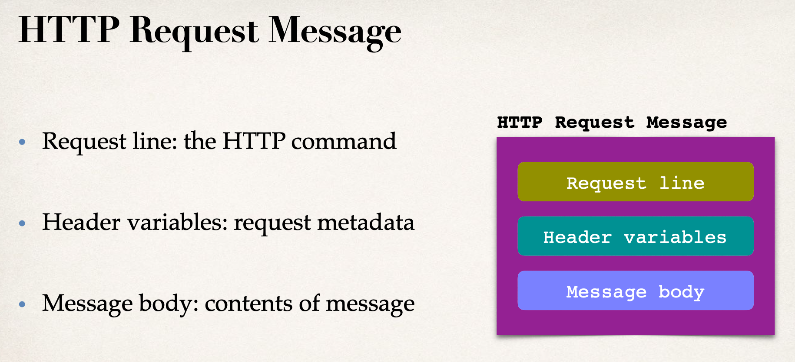

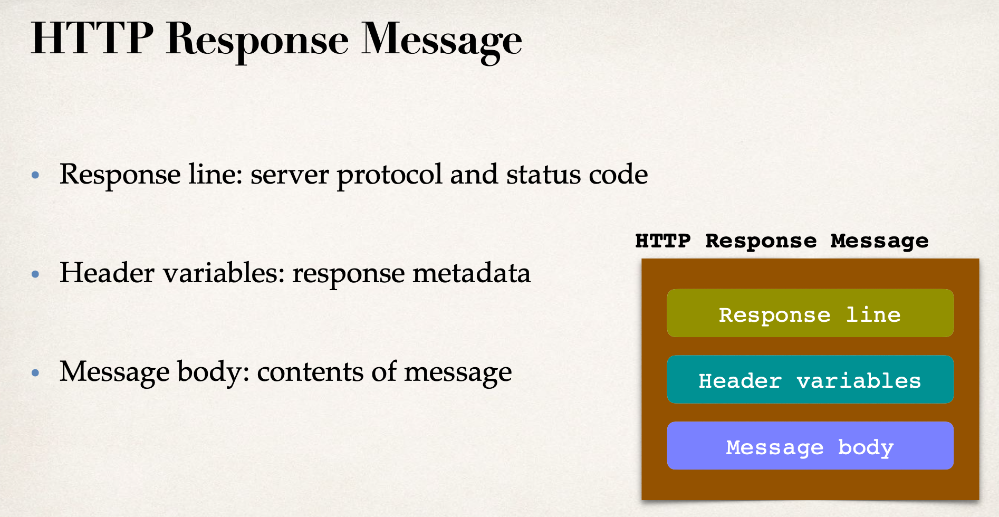

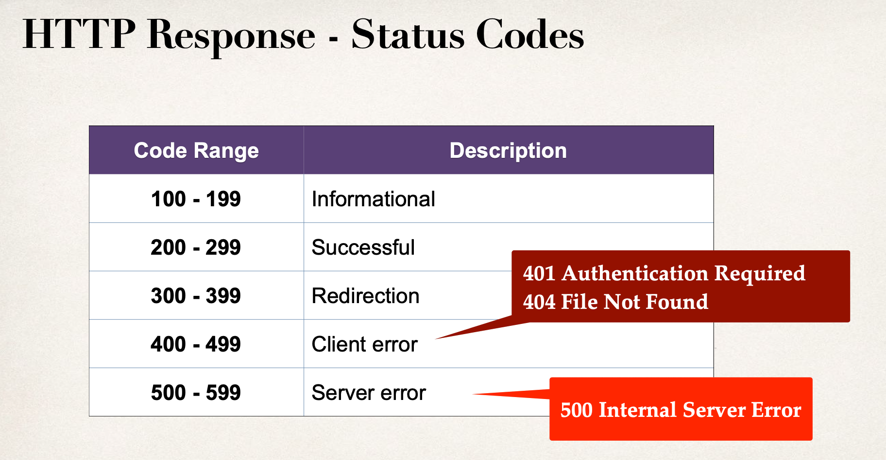

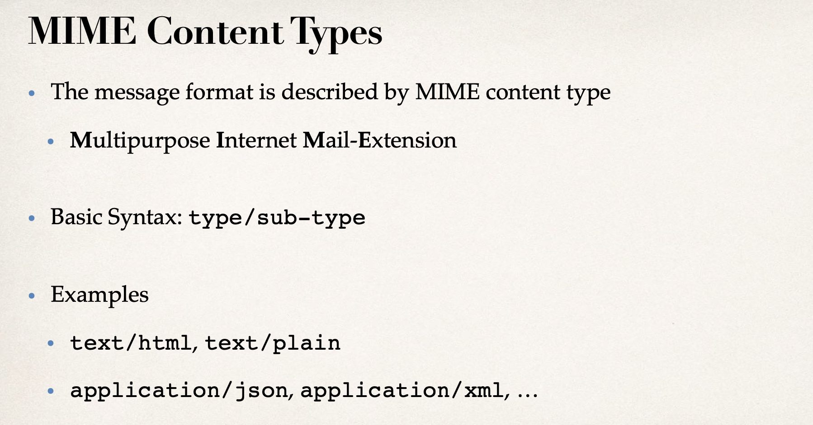

### Now we install Postman Now

- I have installed Postman, and used it many times, for here, I don't introduce this tool.

---

## Create a Spring REST Controller Overview 1

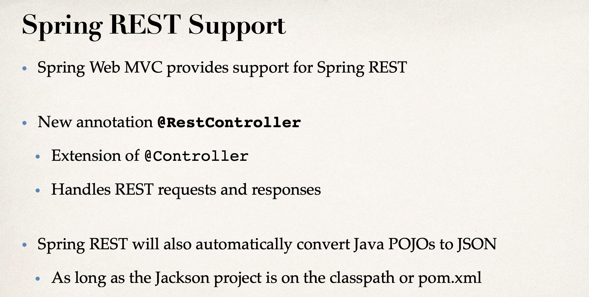

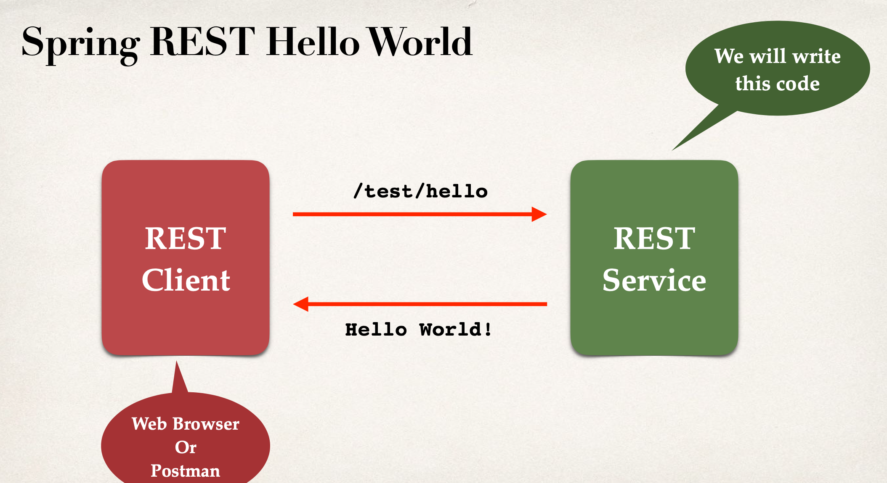

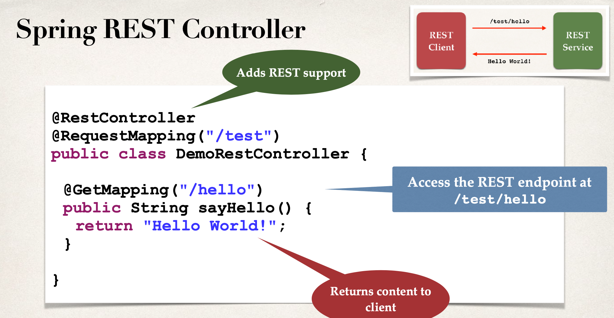

- Step1: Testing with REST Client - Postman 
- Step2: Testing with REST Client - Web Browser

---

## Create a Spring REST Controller Overview 2

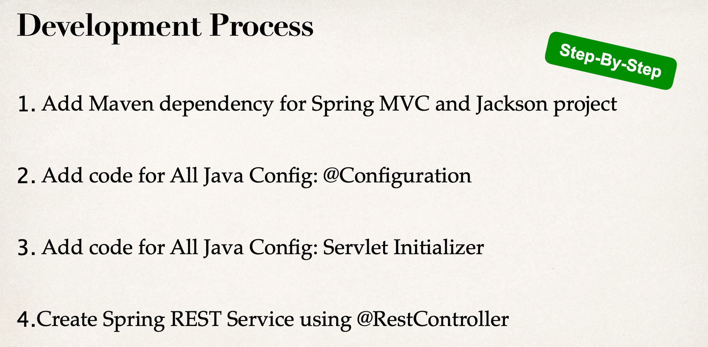

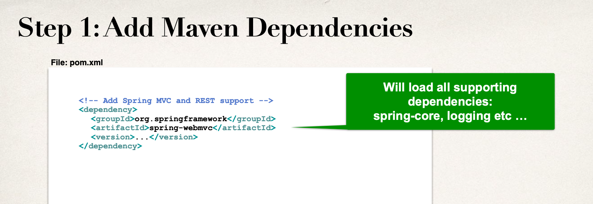

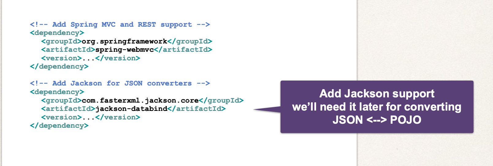

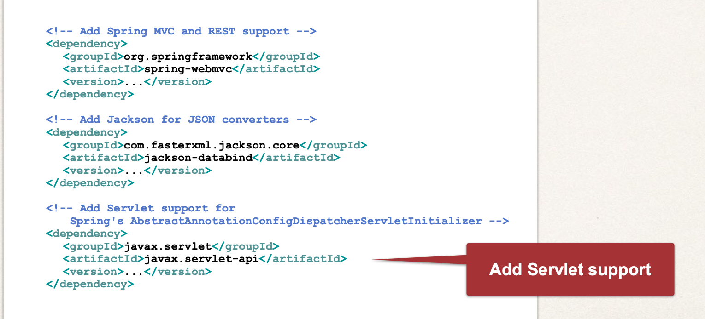

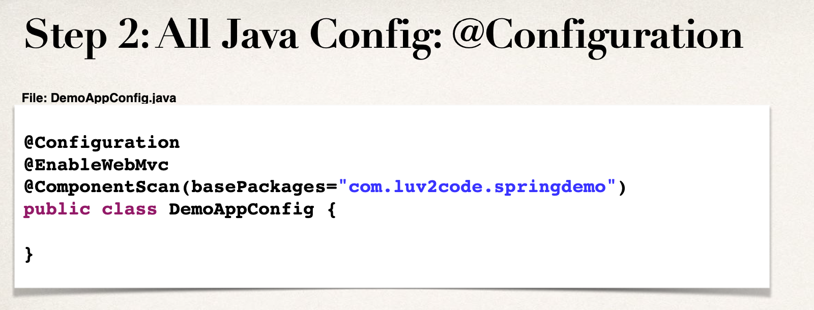

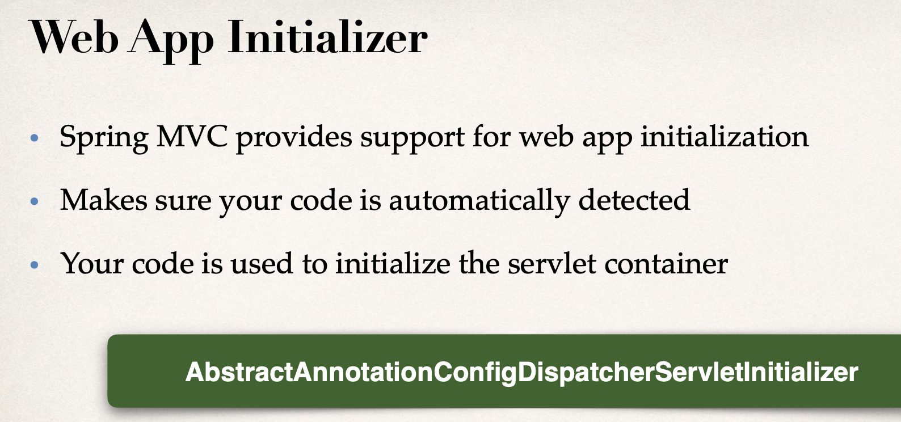

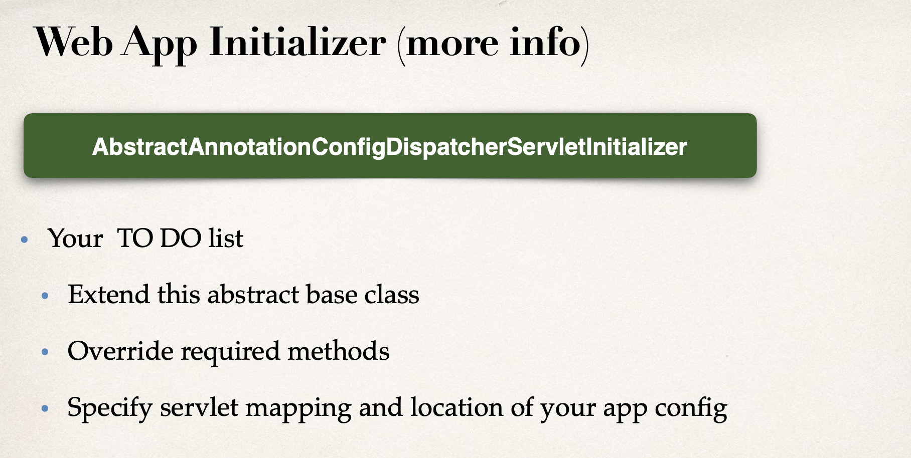

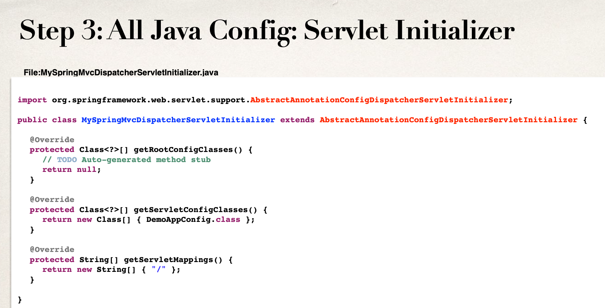

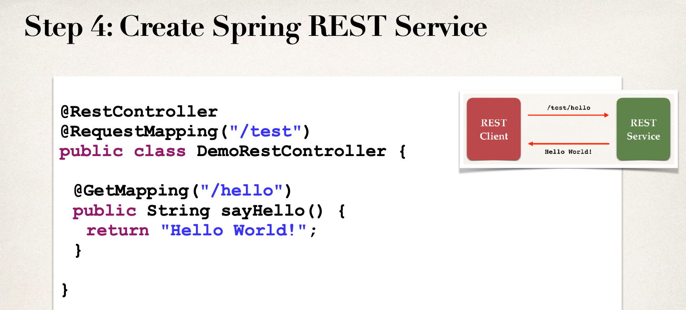

