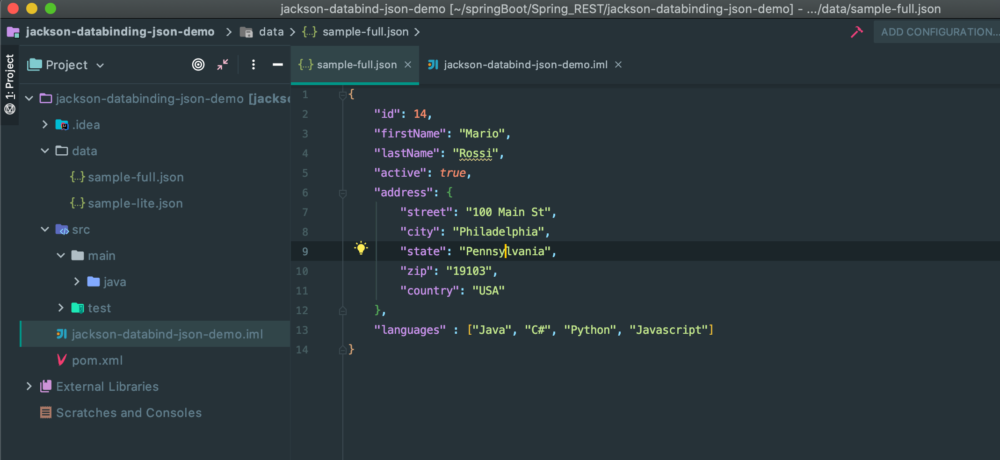
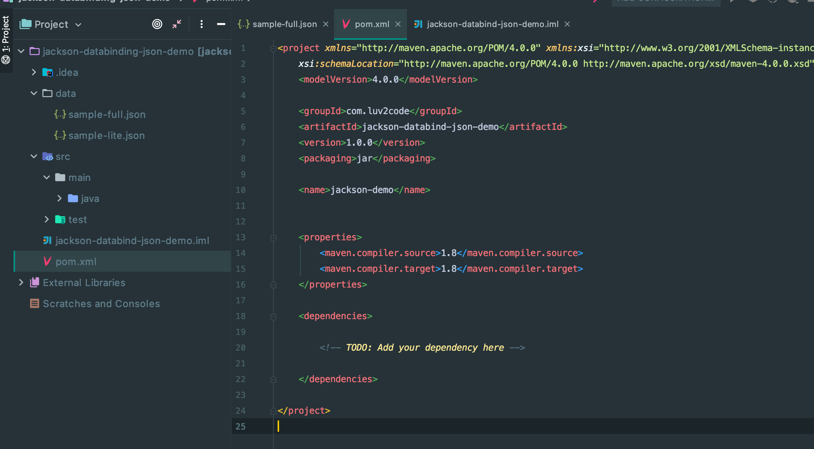
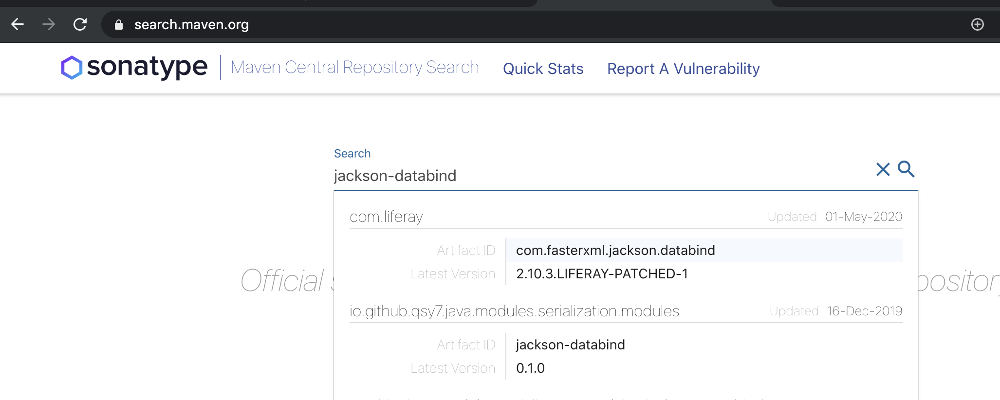
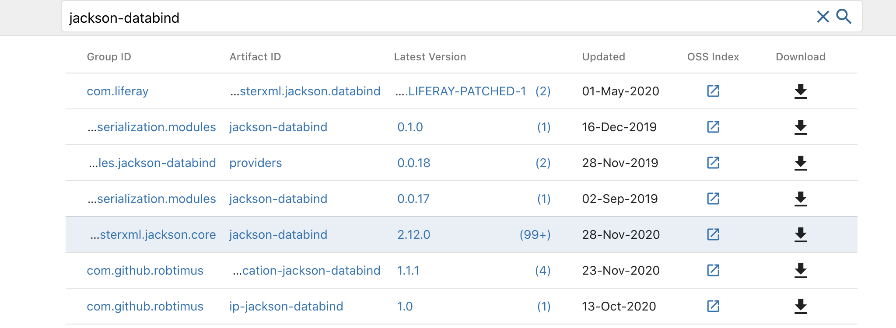
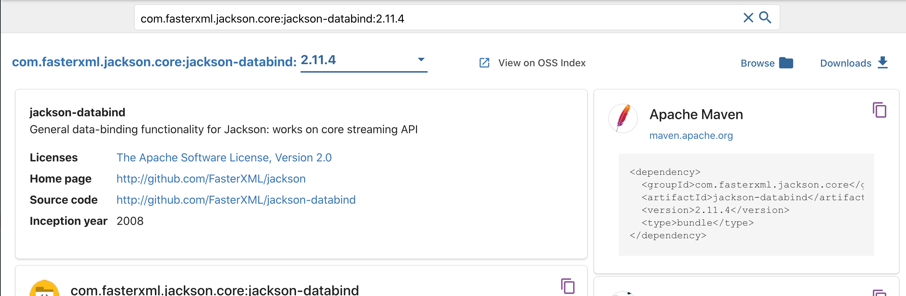
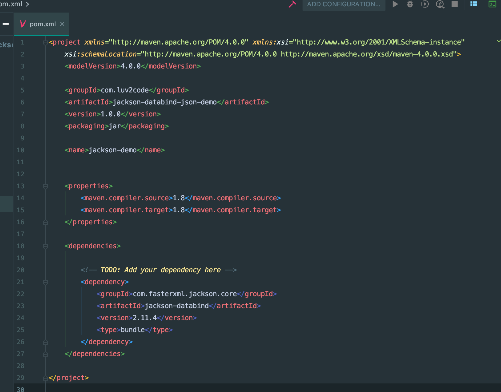
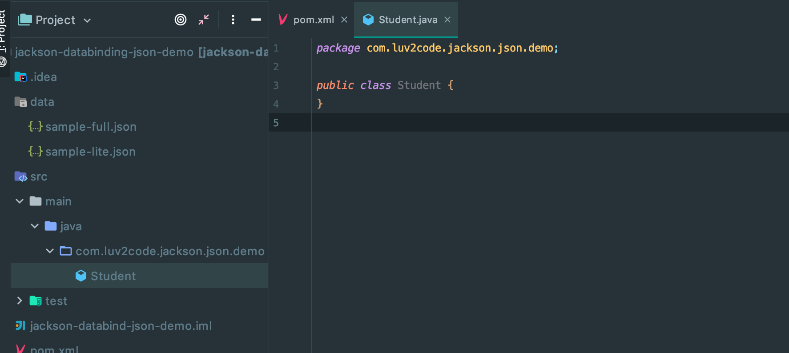
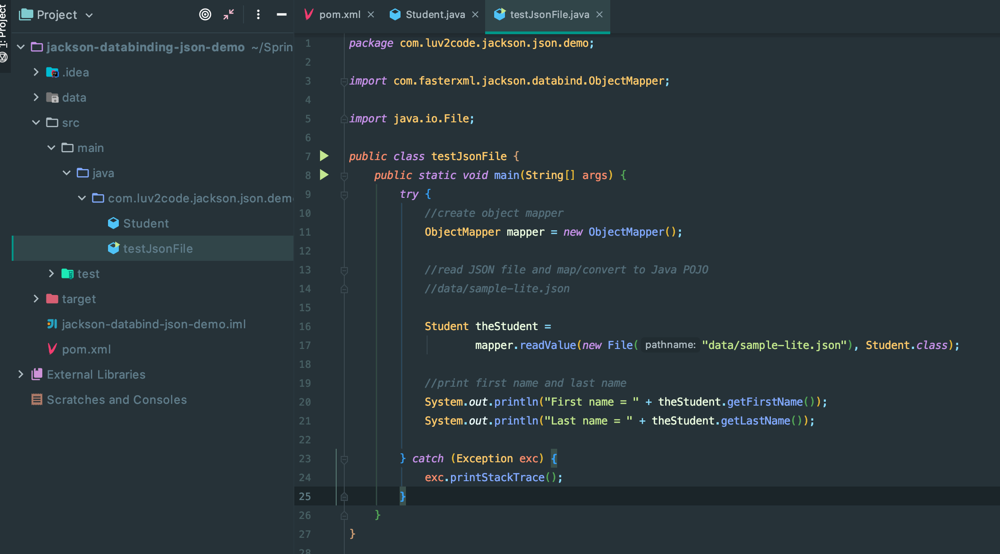
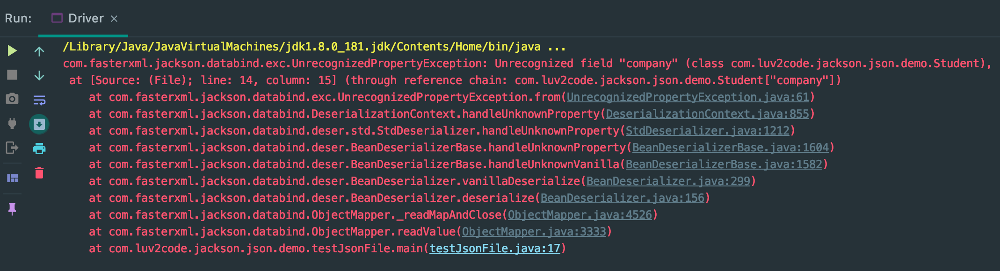
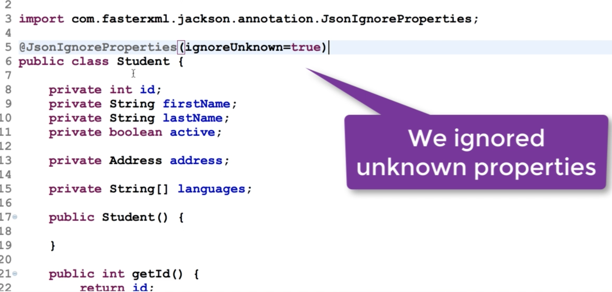

## Convert JSON to Java POJO

- Download Demo
  - [download, click here](www.luv2code.com/jackson-databinding-json-demo)

- Importing this project





- now Add `dependency` for `Jackson`

- [search.maven.org](search.maven.org)





- download, click all `(99+)`



- copy maven dependency into `pom.xml`



---

## Processing JSON

- create new package `com.luv2code.jackson.json.demo`

- create new class `Student`



- create main Driver app

- Note: `dependency`

```xml
		<!-- TODO: Add your dependency here -->
		<dependency>
			<groupId>com.fasterxml.jackson.core</groupId>
			<artifactId>jackson-databind</artifactId>
			<version>2.11.4</version>
		</dependency>
```

---

- Note reName project, and change class name



---

## JSON Jackson Demo - Nested Objects and Arrays

- create a new class `Address`

- update json file name


```java
public class Student {
    private int id;
    private String firstName;
    private String lastName;
    private boolean active;

    private Address address;
    private String[] languages;

    public int getId() {
        return id;
    }

    public void setId(int id) {
        this.id = id;
    }

    public String getFirstName() {
        return firstName;
    }

    public void setFirstName(String firstName) {
        this.firstName = firstName;
    }

    public String getLastName() {
        return lastName;
    }

    public void setLastName(String lastName) {
        this.lastName = lastName;
    }

    public boolean isActive() {
        return active;
    }

    public void setActive(boolean active) {
        this.active = active;
    }

    public Address getAddress() {
        return address;
    }

    public void setAddress(Address address) {
        this.address = address;
    }

    public String[] getLanguages() {
        return languages;
    }

    public void setLanguages(String[] languages) {
        this.languages = languages;
    }
}
```


- Address

```java
public class Address {
    private String street;
    private String city;
    private String state;
    private String zip;
    private String country;

    public String getStreet() {
        return street;
    }

    public void setStreet(String street) {
        this.street = street;
    }

    public String getCity() {
        return city;
    }

    public void setCity(String city) {
        this.city = city;
    }

    public String getState() {
        return state;
    }

    public void setState(String state) {
        this.state = state;
    }

    public String getZip() {
        return zip;
    }

    public void setZip(String zip) {
        this.zip = zip;
    }

    public String getCountry() {
        return country;
    }

    public void setCountry(String country) {
        this.country = country;
    }
}
```

- Test Json File

```java
public class testJsonFile {
    public static void main(String[] args) {
        try {
            //create object mapper
            ObjectMapper mapper = new ObjectMapper();

            //read JSON file and map/convert to Java POJO
            //data/sample-lite.json

            Student theStudent =
                    mapper.readValue(new File("data/sample-full.json"), Student.class);

            //print first name and last name
            System.out.println("First name = " + theStudent.getFirstName());
            System.out.println("Last name = " + theStudent.getLastName());

            //print out address: street and city
            Address tempAddress = theStudent.getAddress();
            System.out.println("Street = " + tempAddress.getStreet());
            System.out.println("City = " + tempAddress.getCity());

            //print out languages
            for (String tempLang : theStudent.getLanguages()) {
                System.out.println(tempLang);
            }

        } catch (Exception exc) {
            exc.printStackTrace();
        }
    }
}
```

---

## JSON Jackson Demo - Ignore Properties

- add some new field `company` into `data/sample-full.json`


```json
{
	"id": 14,
	"firstName": "Mario",
	"lastName": "Rossi",
	"active": true,
	"address": {
		"street": "100 Main St",
		"city": "Philadelphia",
		"state": "Pennsylvania",
		"zip": "19103",
		"country": "USA"
	},
	"languages" : ["Java", "C#", "Python", "Javascript"],
	"company" : "Google INC"
}
```

- Now see what happen? => it will generate a error, an Unrecongnized field `company`



### Add a special annotation to ignore unknown properties



- rerun it, this time, you won't see any error.


